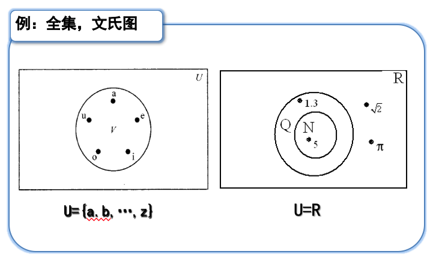
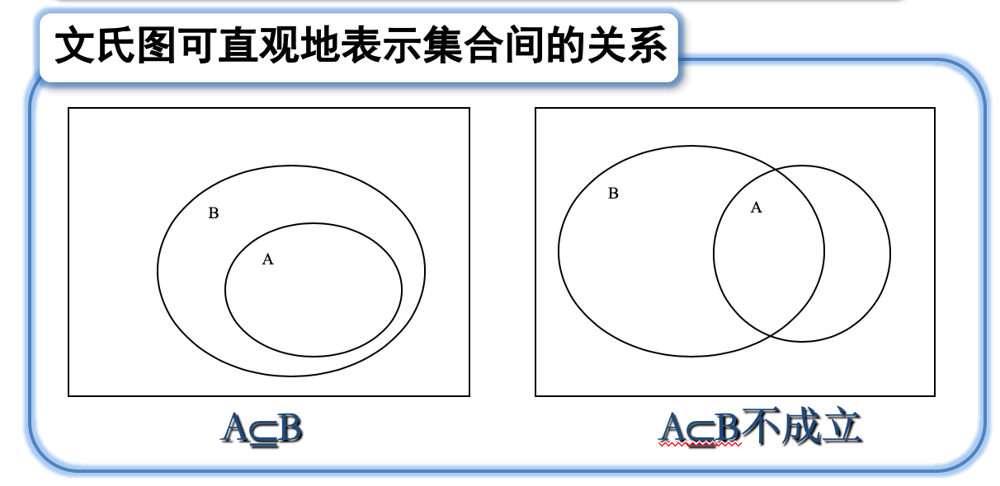
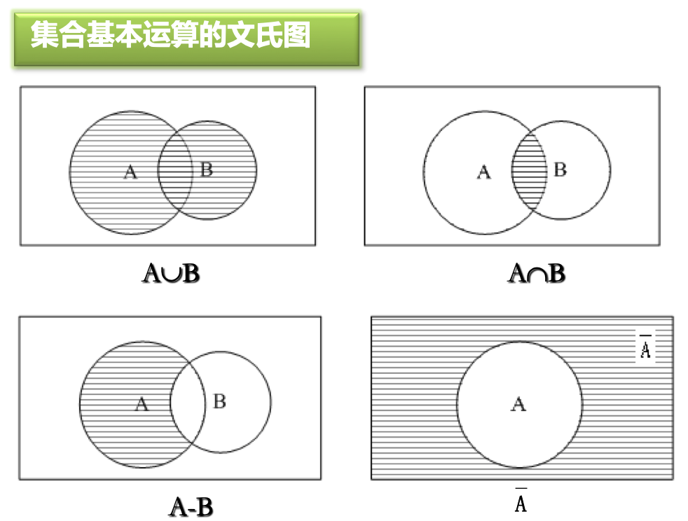
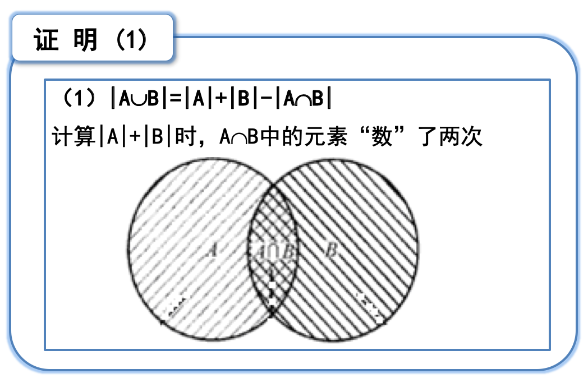

## 集合的基本概念

集合是最基本的数学概念，没有定义 
集合是所有数学的基础

**两种集合论**

1. 朴素集合论：直观描述集合的概念
2. 公理集合论：用一组公理刻画集合的性质

### 集合的描述、表示、术语

集合（集）：一些对象的全体作为一个整体（描述）
集合的元素：构成整体（集合）的个体（成员）

#### 几个常见的集合

集合常表示为大写字母，元素表示为小写字母

- $\mathbb{N}$:自然数的集合（自然集合）
- $\mathbb{Z}$：整数的集合（整数集）
- $\mathbb{Z^+}=N$
- $\mathbb{R}$:实数的集合（实数集）
- $\mathbb{R^+}$:正实数的集合（正实数集）
- $\mathbb{Q}$：有理数的集合（有理数集）
- $\mathbb{Q^+}$:正有理数的集合（正有理数集）

#### 属于和不属于

- 若X是集合A中的元素，那么称X属于A，几位x$\in$A.
- 若X不是集合A中的元素，那么称X不属于A，几位x$\notin$A.

例如：3$\in$N，O$\notin$N，$\sqrt{2}\notin$Q，$\sqrt{2}\in$R

#### 集合的表示

1. 列（枚）举法,{元素列表}，例：$\lbrace 1,2,3 \rbrace,\lbrace 1,2,3,... \rbrace,\lbrace 1,2,...,100 \rbrace$
2. 谓词法（概括法）,例：
   1. $\lbrace x|p(x) \rbrace$:满足性质p的所有元素所构成的集合
   2. $\lbrace x|x\in Z^+,且x^2\leq100 \rbrace = \lbrace1,2,...,10\rbrace$
3. 文氏图:用来表示集合的图形，可直观地表示集合间的关系，矩形表示全集，原型表示其他几何，点表示元素

- 空集（记为$\emptyset$）:不含任何元素的集合，是最基本的集合，例如：{},{$x|x\in Z^+,且X^2\leq0$}
- 全集（常记为U或者E）：所考虑的问题领域中，所关心的所有对象组成的集合微积分：R，班级问题：本班所有学生
- 有限集：只含有限个元素的集合$\lbrace 1,2,3 \rbrace，\lbrace a,b,…,z \rbrace，\lbrace x|x\in Z^+，且x^2\leq100 \rbrace$
- 无限集: 含无限多个元素的集合$\lbrace 1,2,3,…\rbrace，Q，R \lbrace  x|x \in Z^+，且x^2\geq100 \rbrace$

### 集合之间的关系

#### 相等

若集合A和集合B包含相同的元素，则称A和B相等，记为A=B；

**集合中元素的序无关性、重复无关性**

$\lbrace 1,2,3 \rbrace = \lbrace 2,3,1 \rbrace=\lbrace 1,1,3,3,3,2 \rbrace$

#### 子集和包含关系

若集合A中的元素均属于集合B，则称A是B的子集，B包含A，A包含于B，记为 $A \subseteq B或B \supseteq A$。

$若A\subseteq B但A\neq B，则称A是B的真子集，B真包含A，A真包含于B,记为 A\subset B或B \supset A$
 
例：

- N$\subset$Z，N是Z的真子集 
- $\lbrace a,b \rbrace \subseteq\lbrace \lbrace a\rbrace,b\rbrace不成立$

#### 平凡子集

任意集合A都有两个平凡子集：A和$\emptyset$

$\emptyset \subseteq A \subseteq A \subseteq U$

#### 集合包含关系的性质

集合A、B、C有

$\forall$集合A、B、C，有

1. 自反性：A$\subseteq$A
2. 反对称性：$A \subseteq B 且B \subseteq A \implies A = B$
3. 传递性：$A \subseteq B 且B \subseteq C \implies A \subseteq C$

##### 证明

1. 任何A中的元素它必属于自身，自反性显然成立
2. $假设A \neq B，则存在一个元素x，x \in A但x \notin B，或者x \notin A但x \in B。若是前者，则与A \subseteq B矛盾，若为后者，则与B \subseteq A矛盾。所以A=B。$
3. $对于任意的a \in A，因为A \subseteq B，所以a \in B。而B \subseteq C，所以a \in C。于是A \subseteq C。$

**注意：反对称性与集合相等的关系**

### 集合簇(又名集合族)

集合的集合，集合中每个元素都是集合

$\lbrace \lbrace 1 \rbrace , \lbrace 1, 2 \rbrace \rbrace ，\lbrace \emptyset \rbrace，\lbrace \emptyset ,\lbrace b \rbrace\ \rbrace，\lbrace N,R,Q \rbrace$

$\lbrace A1, A2\rbrace，其中A1=\lbrace1, 2\rbrace，A2=\lbrace\lbrace1\rbrace, 2\rbrace$ 

#### 下标集

集合簇中的元素用带下标的字母表示，所有下标组成的集合称为该集合簇的下标集

集合族$\lbrace A1,A2\rbrace的下标集是\lbrace 1,2\rbrace$

例:

1. $An=\lbrace x|0<x<1+\frac1n\rbrace，集合族\lbrace A1, A2, A3,…\rbrace$的下标集是N
2. 集合族$\lbrace A_x|x \in R，Ax=\lbrace x \rbrace\rbrace$的下标集是？

## 集合的运算

### 集合的基本运算

- A和B的并集：A和B的所有元素组成的集合，记为$A\cup B$
- A和B的交集：A和B的公共元素组成的集合，记为$A\cap B$
- A和B差集：属于A单不属于B的元素组成的集合，记为$A-B$
- 补集：不属于A的元素组成的集合，即U-A，记为$\overline{A}$

$A \cup B= \lbrace x|x \in A或x \in B \rbrace$

$A \cap B=\lbrace x|x \in A且x \in B \rbrace$

$A \backslash B=\lbrace x|x \in A且x \notin B\rbrace$ 

$A^\mathrm{C}=U-A= \lbrace x|x \notin A \rbrace$

**集合A和B互不相交**

$A\cup B=\emptyset$

### 幂集

#### 集合A的所有子集所组成的集合称为A的幂集，记为P(A) 

例：

$P(\lbrace1\rbrace)=\lbrace\emptyset,\lbrace1\rbrace\rbrace，P(\lbrace1,2\rbrace)=\lbrace\emptyset,\lbrace1\rbrace,\lbrace2\rbrace,\lbrace1,2\rbrace\rbrace$

$P(\lbrace1,2,3\rbrace)=\lbrace\emptyset,\lbrace1\rbrace,\lbrace2\rbrace,\lbrace3\rbrace,\lbrace1,2\rbrace,\lbrace1,3\rbrace,\lbrace2,3\rbrace,\lbrace1,2,3\rbrace\rbrace$

$P(\emptyset)=\lbrace\emptyset\rbrace，P(P(\emptyset))=P(\lbrace\emptyset\rbrace)=\lbrace\emptyset,\lbrace\emptyset\rbrace\rbrace$

$\lbrace2,4\rbrace \emptyset P(N)，\lbrace1,3,5,7,…,2n-1,…\rbrace \subseteq P(N)$

$\lbrace\lbrace1\rbrace,\lbrace2,4\rbrace,\lbrace1,3,5,7,…\rbrace\rbrace \subseteq P(N)$

#### 集是集合族

$\emptyset \in P(A)，A\in P(A)$
$X\in P(A) \iff X\subseteq A$

## n元组和笛卡尔乘积

### 集合和序列（直观描述）

集合：若干对象组合成的整体，无序组合 
序列：若干对象组合成的整体，有序组合

### n元组

$$n\in N，由n个对象组成的序列(串)a_1a_2…a_n称为n元组,记为(a_1, a_2,…, a_n)$$
$a_i(i=1,2,…,n)称为该n元组的第i个坐标$

二元组也称为有序偶

如果两个n元组对应的坐标均相同，那么称这两个n元组相等
$$即(a_1,a_2,…,a_n)= (b_1,b_2,…,b_n) \iff  a_i=b_i (i=1,2,…,n)$$

1. 笛卡儿直角坐标系下的点表示为两个实数的序列，可用二元组表示：(4,2)，(2,4) ，但不能用集合表示。
2. 英语单词是若干个字母组成的序列，可用n元组表示：(p,i,n)，(n,i,p)，(m,a,t,h)。
3. 点和单词都不能表示为集合，因为个体在构成整体时与序相关。

### 笛卡尔积

$$
n \in N，集合D_1、D_2、…、D_n，\lbrace (d1,d2,…,dn)|1 \leq i \leq n，d_i \in D_i \rbrace\\
称为D_1、D_2、…、D_n的笛卡儿乘积，记为D_1×D_2×…×D_n\\
D×D×…×D记为D_n
$$

例 A={1,2,3}，B={a,b}

A×B={(1,a),(2,a),(3,a),(1,b),(2,b),(3,b)} 
B×A={(a,1),(a,2),(a,3),(b,1),(b,2),(b,3)} 
$A_2$={(1,1),(1,2),(1,3),(2,1),(2,2),(2,3),(3,1),(3,2),(3,3)} 
$B_2$={(a,a),(a,b),(b,a),(b,b)} 

### n元组与含n个元素的集合的区别和联系

都是多个个体构成的整体， n元组还包括构成过程中的次序
        
$a \neq b时，(a,b) \neq (b,a)，而\lbrace a,b \rbrace =\lbrace b,a \rbrace$

例：

1. 笛卡儿直角坐标系下的点表示为两个实数的序列，可用二元组表示：(4,2)，(2,4) ，但不能用集合表示。
2. 英语单词是若干个字母组成的序列，可用n元组表示：(p,i,n)，(n,i,p)，(m,a,t,h)。
3. 点和单词都不能表示为集合，因为个体在构成整体时与序相关。

## 集合运算的性质

### 集合运算的基本恒等式

集合运算满足运算律，可依此作集合公式变换(演算)，类比普通代数运算

#### 集合并、交、差和补集运算的性质（A、B、C是任意集合）

1. 幂等率：$A\cup  A = A A \cap A = A$
2. 同一律：$A \cup \emptyset = A A \cap U = A$
3. 零率：$A \cap \emptyset = \emptyset A \cup U = U$
4. 排中律：$A \cup  \overline{A}=U$
5. 矛盾律：$A \cap \overline{A} = \emptyset$
6. 双重否定：$\overline{(\overline{A})} = A$
7. 交换律:$A \cup B = B \cup A A\cap B = B \cap A$  
8. 结合律：
   1. $A \cup (B \cap C) = (A \cap B) \cap C$
   2. $A \cap (B \cup C) = (A \cup B) \cup C$
9.  分配率：
   1. $A \cup (B \cap C) = (A \cup B) \cap (B \cup C)$
   2. $A \cap (B \cup C) = (A \cap B) \cup (B \cap C)$
10. 吸收率：
    1.  $A \cup (A\cap B) =A$
    2.  $A \cap (A \cup B) =A$
11. 德摩根律：
    1.  $\overline{A\cup B} = \overline{A} \cap \overline{B}$
    2.  $\overline{A\cap B} = \overline{A} \cup \overline{B}$ 
12. 差率：$A-B = A \cap \overline{B}$

##### 例:证明集合并运算的吸收律：$A \cap (A \cap B)=A$

证明：利用集合关系的反对称性。证明等式两端相互包含。

1. $A \cup (A \cap B) \supseteq A 右是显然的$
2. $\forall x，x\in A \cup (A \cap B)$

$$\begin{aligned}
& \Rightarrow x \in A或x \in A \cap B\\
& \Rightarrow x \in A或（x \in A且x \in B）\\
& \Rightarrow  x \in A\\
& \therefore A \cup (A \cap B) \subseteq A
\end{aligned}$$

##### 运用集合关系的反对称性证明集合相等的基本思路

1. 证明两个集合X和Y相等(X=Y)，只需证明$X\subseteq Y和X \supseteq Y$
2. 证明XY，只需证明：对任意x，若$x\in X，则x \in Y$
3. 类似地证明$X \subseteq Y$

### 集合演算

#### 代数演算

利用基本代数恒等式作为代数公式变换

$\frac{x^2-y^2}{x+y}=\frac{(x+y)(x+y)}{x+y}=x-y$

**集合演算**

利用基本集合恒等式做集合公式变换

$$\begin{aligned}
& A \cup ((A\cap B ) \cap (A \cup C))\\
& = (A \cup (A \cap B)) \cap (A \cup (A \cup C))  \quad分配率\\
&= A \cap (A \cup (A \cup C)) \quad 吸收率\\
& = A \quad 吸收率\\
\end{aligned}$$

#### 利用集合演算可比较简洁地证明某些集合恒等式

**例**：$证明A \cup (B -A ) = A \cup B$

$$\begin{aligned}
& \bf证明 A\cup (B-A) = A \cap (B \cap \overline{A}) \quad (差率)\\
& =(A \cup B ) \cap (A \cup \overline{A}) \quad(\cup关于\cap 的分配率) \\
& = (A \cup B ) \cap U \quad (排中律)\\
& = A \cup  B  \quad (同一律)\\ 
\end{aligned}$$

### 对偶原理

$若P是关于集合的命题，其中至多包含并、交和补三种集合运算（不含差运算），P*是将P中的\cup、\cap、\emptyset、U分别替换为\cap、\cup、U、\emptyset而得到的命题，则称P与P*互为对偶命题。若P=P*，则称P为自对偶命题。$
     
对偶原理：$P \Leftrightarrow P*$

#### 对偶定理的证明

1. 一般的对偶原理无法证明，因为命题形式的多样性
2. 若命题的形式限于集合恒等式，则可以证明（数学归纳法）

ps:
1. 因无法证明，所以不叫对偶定理
2. 对偶原理中的条件“不含差运算”是必须的

## 有限集合的计数

### 有限集合的基数（非正式）

有限集合中包含的元素个数，记为$|A|$
$|\lbrace 1,2,3 \rbrace|=3,|\lbrace 1,2,\lbrace 4,5 \rbrace \rbrace |=3$

$|N|=a,|R|=c$

### 有限集基数的集合结论

有限集合A和B

1. $|A \cup B| = |A|+|B| - |A \cap B|(容斥原理)$
2. $|A\times B| = |A| \cdot |B|$
3. $|P(A)| =2^{|A|}$

#### 证明（1）

#### 证明（2）

$|A\times B| = |A| \cdot |B|$
考虑构造A×B中的元素(x,y)的方法，分解为2步**

首先确定x，有|A|种取法 
然后确定y，有|B|种取法

由乘法原理，构造A×B中的二元组共有|A|·|B|种不同的方法，每种不同的构造方法都对应了A×B中的一个不同的元素

#### 证明（3）

$|P(A)| =2^{|A|}$

1. $|A|=0$
   1. $A=\emptyset，P(A)={\emptyset}，|P(A)|=1=2^0$
2. $|A|>0（|A|=n (n \in N)，A=\lbrace a1,a2,…,an \rbrace）$
3. 
考虑构造P(A)中的元素X(A的子集)的方法，分解为n步

- 首先处理a1有两种方法：放入X或丢弃
- 接着处理a2也有两种方法：放入X或丢弃
-  ……
-  最后处理an有两种方法：放入X或丢弃

由乘法原理，构造A的子集X共有2n|种不同的方法，每种不同的构造方法都对应了P(A)中的一个不同的元素

### 例题

**一软件公司，每位工程师至少精通C++和Java中的一种，精通C++的工程师有25位，精通Java的工程师有13位，既精通C++又精通Java的工程师有8位。问这家软件公司共有多少位工程师？**

解：

- 精通C++的工程师的集合：A
- 精通Java的工程师的集合：B
- 既精通C++又精通Java的工程师的集合：$A\cap B$
- 全体工程师的集合：$A\cup B$
- $A\cup B|=|A|+|B|-|A\cap B|=25+13-8= 30$