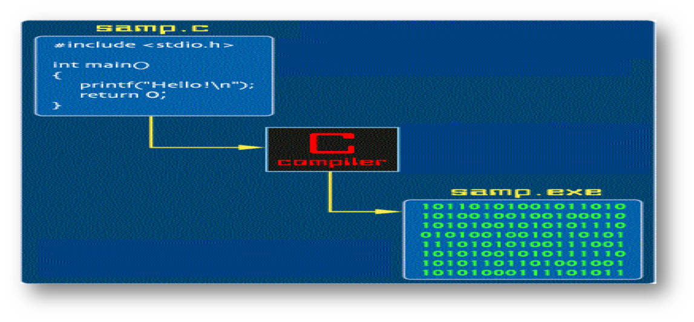

# C语言的基本概念

## 一、计算机与程序、程序设计、C语言的基本概念

### 什么是程序

计算机执行的指令序列，按不同层次分为三类

- 机器指令程序
- 汇编语言
- 高级程序语言

### 高级程序

- 指一类不依赖机器的程序设计语言。
- 用高级语言编写的程序可方便地移植到不同类型的机器上运行。

### 程序编译

高级语言->编译软件->机器语言程序

### 编译软件工具

- 不同软件厂商提供各自的C语言的编译工具。有些是免费的，而有些是收费的。
  - 免费: 如GNU的GCC
  - 收费: 如Microsoft的Visual Studio Visual C++
- 大部分编译系统符合ANSI C99标准。

### C语言标准

- ISO 国际标准组织
- ANSI 美国国家标准局 
- ANSI　C 89
- ANSI　C 99

### 程序设计

- 设计程序的过程。
- 为解决某一问题，采用一定的方法和策略(算法)，使用某种语言表达程序员的意图。

### C语言

- 高级程序设计语言之一。
- 内容：
   - 词汇
   - 语法 
   - 语意

### 算法与程序

程序员实用程序设计语言编写程序->算法->源程序

### 程序运行

输入数据->机器语言程序->输出数据

### 程序的组成

- 数据
- 代码

**在计算机内部，数据和代码都采用二进制表示。**

