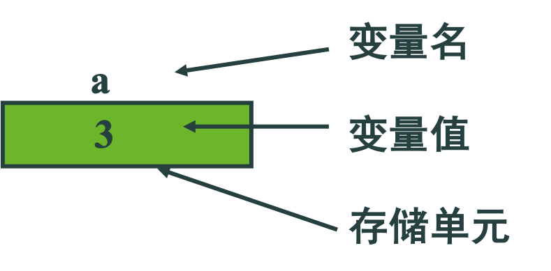
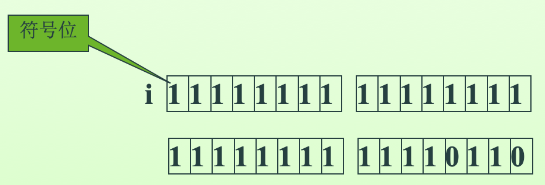
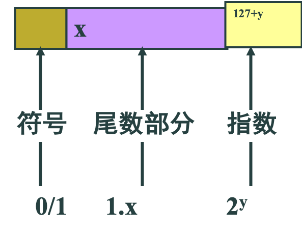
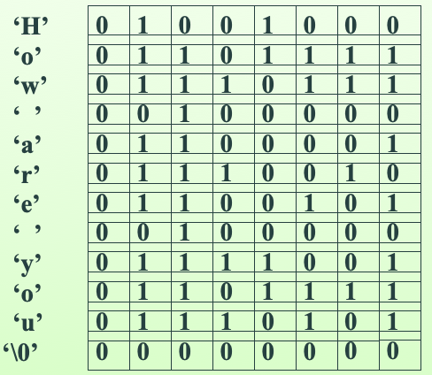
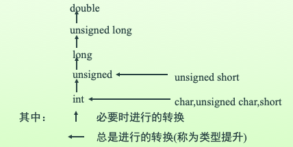

# 一、C语言的数据类型

## 程序实例

华氏温度->摄氏温度

1. 输入
2. 转换 `(f-32)* 5/9->c`
3. 输出

```c
#include <stdio.h>
int main( )
{   double f,c; 
     scanf("%lf",&f);
     c = (f-32)*5/9;   
     printf("f=%f, c=%f\n",f,c);
     return 0;
}
```

## 数据类型

- 基本类型
  - 算数类型
    - 整数类型
      - char
      - int
      - long
      - unsigned char
      - unsigned short
      - unsigned int
      - unsigned long
      - long long
    - 实数类型
      - float
      - double
      - long double
  - 枚举类型
  - 指针类型
- 构造类型
  - 数组类型
  - 结构类型
  - 联合类型
- 无值类型(void)

数据类型决定：

- 存储空间的大小、数据值的表示范围
- 允许的操作种类

**常量、变量、表达式、函数等都有确定的数据类型。一旦确定，就不会改变。**

计算机的数据都存放在存储器中，存储器以字节为最小存储单元，一个字节(byte)由8个二进制位(bit)组成。数据按其所需的存储单元和组织形式不同，分成不同数据类型。

# 二、常量与变量

## C语言的字符集

```
a b c d e f g h I j k l m 
n o p q r s t u v w x y z

A B C D E F G H I J K L M 
N O P Q R S T U V W X Y Z 
     
0 1 2 3 4 5 6 7 8 9

！” # % & ’ ( )* + ，- . / :
; < = > ? [ \ ] ^ _ { | } ~
```
共91个字符   另外,字符串中还允许出现中文字符

## 标识符

用来标识变量名、符号常量名、数组名、函数名、文件名等的字符序列称为标识符。

标识符由字母、数字和下划线组成，且由字母和下划线开头

例如：name、s01、_total、_123等都是合法的标识符，而12acd、R.Rebin、$12.5等都是不合法的。

另外大写字母与小写字母是不同的字符。 _ABC与_abc是两个不同的标识符

### 标识符命名

命名要“见名知意”，通过变量名就知道变量的含义、提高程序的可读性。通常应选择能表示数据含义的英文单词（或缩写）作变量名

例如： name（姓名）、gender（性别）、age（年龄）、salary（工资）

### 标识符分类

1. 用户自定义标识符
2. 系统定义的标识符(称为关键字或保留字)

**用户自定义标识符不能与关键字相同**

### 关键字

在标识符中，C语言定义了一些具有特定意义的单词(字符序列)，这些单词称作关键字(又叫保留字)。对于关键字，用户只能严格按规定使用而不能作为它用。所有关键字都用小写，且必须严格按定义拼写。C语言的关键字较少，只有30多个。

```
auto        break       case        char        const
continue    default     do          double      else
enum        extern      float       for         goto
if          int         long        register    return 
short       signed      sizeof      static      struct
switch      typedef     union       unsigned    void 
volatile    while 等
```

### 常量

指在程序运行过程中值不变的量，包括常数和符号常量

在C语言中，不同类型的常量有不同的表示方法。符号常量在程序中可以直接引用而不必作任何说明，因为编译程序能够根据常量的书写形式辨别其数据类型。

## 符号常量

```c
#define  PRICE  30
         int main(){  printf("total=%d",PRICE*10 ); …}
    // 预编译后程序变成：
         int main(){  printf("total=%d",30*10 ); …}
```

#define是预编译命令，称为宏定义。作用是符号替换。

定义常量的另一种方法,`const int price=30;`

两种方法的区别：PRICE不分配存储单元，price与变量一样分配存储单元，但price的值不允许修改。

### 变量

1. 变量名:用标识符表示
2. 变量值:是数值, 在机器内部用二进制表示
3. 存储单元:由变量的类型和在内存中的位置确定



# 三、整数类型

## 整型常数的表示方法

1. 十进制
   - 与数学中十进制写法相同
   - 如 6、-31、101 等都是合法的。
2. 八进制：  
   - 用0开始的由0∽7构成的数
   - 如 0777、012 等都是合法的。
3. 十六进制：
   - 用0x或0X开始的由0,1,2,…,9,a,…,f (或大写)构成的数
   - 如 0x123、0xffFF 等都是合法的整型常量。

还有一种被称为长整型常数的整型常数，其表示形式是在整型常数的三种表示形式后加上字母l或L。
  
如：

```
6l或6L         012l或012L    
0x12l或0x12L   012LU或0x12ul
123LL          0157LLU等。
```

## 整型变量的存放方式

数据在内存中以二进制形式存放。

例如（32位机器）:int i; i=10;  

```
i = 00000000 00000000
    00000000 00001010
```

## 整型变量的存放方式

一个基本类型数据的几个字节的存放次序

不同CPU可能不同
例如 Intel CPU:

```
00001010
00000000
00000000
00000000
```

称为 little_endian

实际上, 在计算机内部数据是以补码(complement)形式表示的。

例如（32位机器）：int i;   i = -10;  



- 原码：符号位+绝对值转换后的二进制
- 反码：符号位+绝对值转换后的二进制每位的反
- 补码：符号位+（反码+1），一般带符号的整数采用补码表示方法。

## 整数类型（仅以32位机器为例！）

类  型 |含     义 |占存储空间 |   数 值 的 范 围 
---|---|---|---|
char |字符|1个字节| -128∽127
int |整型|4个字节|-2147483648∽2147483647
long |长整型|4个字节|-2147483648∽2147483647 
long long|长长整型|8个字节|$-2^{63}∽2^{63}-1$
short|短整型|2个字节|-32768∽32767

### 数据类型的字节数

在不同机器中，数据类型所占的字节数可能是不同的。如:VC中是4个字节, 而早期的TC中的int是2个字节。

sizeof(类型名）或 sizeof(表达式) :返回该类型在使用机器中的字节数。

如:VC中sizeof(int)是4，TC中sizeof(int)是2。

一般，int类型大小与所使用计算机的CPU字长相同。

### 修饰类型的关键字

```
short      短型    如： short int a；   
long       长型    如： long int a；
signed     有符号  如： signed int a；
unsigned   无符号  如： unsigned int a；
signed char a；       unsigned char a；
signed long int a；   unsigned long int a；
short b;              long l;
unsigned u,v;         long long ll;
unsigned long long ull;
```

### 整型变量的定义和使用

```c
// 例：
#include <stdio.h>
int main()
{   int a,b,c,d;
    unsigned u;
    a=12;b=-24;u=10;
    c=a+u; d=b+u;
    printf("a+u=%d,b+u=%d\n",c,d);
    return 0;
}
// 运行结果为:a+u=22,b+u=-14
```

### 整型变量的溢出

一个int型的变量最大允许值为INT_MAX(定义在limits.h中)，最小为INT_MIN，如果超出范围就会出现所谓溢出的运行时错误（run-time error）。

如在一个32位机器中，一个int型的数据最大值为2147483647，如果再加上1，就会溢出, 值变为-2147483648。

```c
// 例:
#include <stdio.h>
int main()
{   int a,b;
    a=2147483647;
    b=a+1;
    printf("a=%d,b=%d\n",a,b);
    …
}
// 32位系统中的运行结果为:
//  a:  7f ff ff ff   a=2147483647
//  b:  80 00 00 00   b=-2147483648
```

**运行时，系统不会给出溢出提示！<br/>防止溢出的发生是程序员的责任！**

## 四、浮点数类型

### 浮点型常数的表示方法

有两种表示形式：

1. 十进制小数表示法：与数学中实数写法相同,如0.1、123.456等
2. 指数表示法（科学表示法）,如0.5E4、0.1234E-6、0.789e2等都是合法的。它们的含义分别是：
   - $0.5×10^4$
   - $0.1234×10^{-6}$
   - $0.789×10^2$

### 浮点型数据的存放方式

一个浮点float型数据一般在内存中占4个字节（32位）。与整型数据的存储方式不同，浮点型数据是按照指数形式存储的。分成尾数和指数两部分。



### 浮点型变量的分类

分为三类：

- 单精度( float型 )
- 双精度( double型 )
- 长双精度( long double型 )

### 浮点数类型(仅以32位机器为例！long double一般不支持！)

类  型|占存储空间 |有效数位数|  数 值 范 围 
---|---|---|---
float|4个字节|6 ∽ 7|$-3.4×10^{-38} ∽ 3.4×10^{38}$
double|8个字节|15 ∽ 16|$-1.7×10^{-308} ∽ 1.7×10^{308}$
long double|16个字节|18 ∽ 19|$-1.2×10^{-4932} ∽ 1.2×10^{4932}$

### 浮点型数据表示误差

由于浮点型变量存放在有限的几个字节的存储单元中，所以能提供的有效数字总是有限的，因此有效位以外的数字将被舍去，由此会产生误差。
  
**即：浮点数的表示是不精确的!**

```c
//例:       
int main()
{ double a; a=0.1;
  printf("a=%.17f\n",a);
  …
}
//  运行结果为:a=0.100000000000000001
```

由于一个double变量只能保证16位有效 数字，所以后面的数字是无意义的。

类似的还有1.0/3*3 结果并不一定等于1。

```c
//例:  
int main()
{ double a,b; 
  b = 2.0e20 + 1.0; 
  a = b - 2.0e20; 
  printf("%f \n", a);
}
// VC运行结果为:0.000000 （下溢）
```
### 浮点型常量的类型

浮点型常量的类型为double，而不是float。

例如：float f；f=2.45678*4523.65;

系统将2.45678和4523.65按double数据存储和运算，得到一个double的乘积，然后取前7位赋值给float变量f，这样做的目的是为了保证计算结果更精确。但是运算速度降低了。可以在浮点型常量的后面加上字符f或F(如2.45678f、4523.65F)，此时编译系统会按float处理它们

### 浮点型变量的溢出

浮点型变量的溢出(overflow)和下溢 (underflow)

一个double型的变量最大允许值为DBL_MAX(定义在float.h中)（如：1.7976931348623157e+308），最小正值为DBL_MIN（如：2.2250738585072014e-308），如果超出范围就会出现上溢或下溢的错误情况

### 浮点型变量的上溢

```c
double toobig = DBL_MAX * 100.0;   
printf("%e\n", toobig);  
// 32位系统中的运行结果为: 1.#INF00e+000 (不像整数类型不会显示错误)

double toosmall = DBL_MIN / 1E30;   
printf("%e\n", toosmall);  
// 32位系统中的运行结果为:0.000000e+000

```

## 五、字符类型

### 字符型数据

字符型数据在内存中占一个字节。

字符常数：用单引号括起的字符，如’a’、’B’、’8’、‘*’等都是合法的字符常数。字符常数的类型属char类型。附录A(P377)中的ASCII码表,给出了所有的字符以及它们的编码值。

ASCII -- American Standard Code for Information Interchange。

ASCII字符集的大小为7位，MSB为0。

ASCII字符集包含可打印字符和非打印字符（控制字符）两类。

为表示控制字符(如回车、响铃、退格等)，C语言采用在反斜杠(\)字符后加其他字符的方法。这称为转义序列字符。反斜杠后面的字符在编译时需要特殊处理，不能当作常规字符对待。例如，’\n’是在第一个字符反斜杠\后紧跟一个字符n，它表示换行字符。

转义序列 | 含       义|ASCII码 
---|---|---
\n |回车换行，将光标移至下一行首|10
\r |回车，将光标移至本行开头位置 |13
\b |退格，将光标左移一格 |8
\t |水平制表，光标移至本行下一tab位置 |9
\v |垂直制表符 |11
\f |换页，将光标移至下一页开头位置 |12
\a |响铃|7
\0 |空字符，其符号常量名为NULL |0
\’ |单引号字符 |39
\” |双引号字符||34
\\|反斜杠字符|92
\ooo |1到3位八进制数所代表的字符 
\xhh |1到2位十六进制数所代表的字符 

### 字符变量

字符变量用于存放字符，在内存中占一个字节的存储单元。

字符变量的定义形式如下：char c1，c2；

可以把字符常量赋值给字符变量，例如：c1=‘a’；c2=‘b’；

**字符变量数据的存放方式**

将一个字符常量存放到一个字符变量中，其实是存放了该字符的ASCII码(也称字符的内码)。

例如： char c1，c2；c1=‘a’; c2=‘b’; 

c1:01100001

c2:01100010

例:  向字符变量赋整数值

```c   
int main()
{  char c1,c2; c1=97; c2=98;
   printf("%c,%c\n",c1,c2);
   printf("%d,%d\n",c1,c2);…
}
// 运行的结果是：
//   a，b
//   97，98
```

注意：一个字符变量中的值，是被当成整数值使用，还是当成字符使用，完全看程序员的意愿。

- c1:01100001
  - %c -> a
  - %d -> 97

例:  大小写字母的转换
```c       
int main()
{  char c1,c2; c1=‘a’; c2=‘B’;
   c1=c1-32；  c2=c2+32；
   printf("%c,%c\n",c1,c2);…
}
// 运行的结果是：
// A，b
```

注意：在ASCII表（P377）中大写字母排在小写字母的前面，且两者间隔有6个其他
字母。

字符常量和变量可以看成是一个8位的整型数据。所以 c1=‘a’+2；则c1中的值99(即'c'字符)

#### 字符串常数

用双引号括起的一个或多个字符序列，如"How are you" 、 "a" 、 "china"、 ""、 "汉字"等都是合法的字符串常数。

每个字符串常数都用一个0（’\0’或NULL)作为结束符，所以每个字符串长度为其字符个数加1。

如"a"的长度为2个字节;而"How are you"的长度为12个字节；"汉字"的长度为5个字节。

#### 字符串常数的存放方式

字符串常数 "How are you" 在内存中的存放形式：



## 六、变量定义与初始化

C语言允许在定义变量的同时为变量赋初值，这称为变量初始化。

例如：

```c
int a=3,a1；
float f=3.54F;
double d1,d2=3.54;
char c=‘a’; 
```
## 七、各类数据类型间的混合运算

### 数据间的混合运算

字符型、整型、实型数据之间可以进行混合运算。

例如：   10 + ‘a’ + 1.5 - 8765.123 *  ‘0’

### 自动类型转换规则

关于算术运算中常规自动类型转换规则

在算术运算过程中允许参加运算的对象进行自动数据类型转换。



## 八、算术运算符和算术表达式

### 运算符

- 算术运算符 + - * / % 
- 关系运算符 > >= < <=  == !=
- 逻辑运算符 ！ &&   ||
- 位运算符 & | ~ ^ >> <<
- 赋值运算符 = 等

### 表达式

单个操作数或是用运算符将操作数连接起来的式子,也可使用括号。

子表达式：用运算符将操作数连接起来的式子，它又用作另一更大表达式的操作数。

#### 表达式例子

```c
a+b           s 
b-c+d        (a=5)+(b=8)
a<100 a==0    a!=10 &&  b>=1
a=b=c=100     a=(b=6)+(c=4）
a >> 2        a ^ b
```

### 算术运算符

1. \+    加法运算符，如a+b
2. -    减法运算符，如a-b
3. \*    乘法运算符，如a*b
4. /    除法运算符，如a/b  除 或 整除 b不得为0  
5. %    整余运算符，如a%b  a,b必须为整型

\+ - 用作单目运算时表示 +a -a

**算术运算符举例**

1. 1 + 2&nbsp;&nbsp;&nbsp;&nbsp;1.2 + 3
2. 1 - 2 &nbsp;&nbsp;&nbsp;&nbsp;1.2 - 3
3. 1 * 2&nbsp;&nbsp;&nbsp;&nbsp;1.2 * 3 
4. 5 / 2&nbsp;&nbsp;&nbsp;&nbsp;5.0 / 2 
5. 5 % 2&nbsp;&nbsp;&nbsp;&nbsp;-5 % 3 

%也称 求余运算、模运算

- 15 % 4的值是3 
- 3 % 5的值是3

求余运算符两边的操作数必须是整型数据，且结果值也是整型数据。

如：8.6 % 4 是非法的

### 算术表达式

#### 算术表达式和运算符的优先级与结合律
 
使用算术运算符的表达式是算术表达式。

如：a * b / c – 1.5 + 'a' 

#### 每个运算符都具有优先级与结合律

- 表达式运算按结合律先高后低顺序进行。
- 表达式中几个运算符优先级相同时按结合律顺序进行。

#### 算术表达式和运算符的优先级与结合律
 
使用算术运算符的表达式是算术表达式。

如：a * b / c – 1.5 + 'a' 

先 * / , 后 + -
- \* / 优先级相同，结合律为左结合，因此
- 先 * 后 /。同样先 - 后 + 。

#### 算术表达式和运算符的优先级与结合律
 
使用括号可改变结合律。

例子：(a+b)/c

### 自增、自减运算符

单目运算符，用来对字符型、整型、指针型、数组元素等变量进行算术运算，具有前缀和后缀两种形式。

其一般形式是： 
- \++操作数
- 操作数++
- --操作数
- 操作数--

使操作数的值加1或减1。

#### 自增、自减运算符前缀和后缀的区别

- \++操作数表达式的值为操作数加1之后的值
- 操作数++表达式的值为操作数加1之前的值
- --操作数表达式的值为操作数减1之后的值
- 操作数--表达式的值为操作数减1之前的值

例子：  int a=2；++a + 1      

结果为4，变量a的值为3。a-- +1        

结果为3，变量a的值为1。

## 九、赋值运算符和赋值表达式

### 赋值运算符

用来将赋值号右边表达式的值存放到赋值号左边的变量中。赋值运算符是一个双目运算符。其一般形式是：

**变量=表达式**

整个表达式的值为变量赋值之后的值。

```c
int a,b;  b=8； a=(a=7)+b;   
int a,b;  a=b=0;
int a=7,b=8,c;  c=a+b;
```

### 类型转换

变量=表达式 中变量和表达式的类型不一致时，发生类型转换。

例如：
```c
int a; a=3.14;   
float b; b=100;
double d; float c;  c=d;
int e='a';
int i=289; char c='a'; c=i;
int a; long b=8; a=b;
unsigned a=2147483647; int b; b=a;

//例： 带符号数据赋值给无符号变量
       
int main()
{  unsigned a; int b = -1;
   a = b;
   printf("a=%u\n",a);…
}
// 运行的结果是：a=4294967295
```
### 复合赋值运算符

变量$\triangle$=表达式

其中$\triangle$是+、-、*、/、%等运算符中的任何一个。

如:

- +=&nbsp;&nbsp;&nbsp;&nbsp;a+=b等价于a=a+b,a+=b+c等价于a=a+(b+c)
- -=&nbsp;&nbsp;&nbsp;&nbsp;a-=b等价于a=a-b,a-=b+c等价于a=a-(b+c)
- \*=&nbsp;&nbsp;&nbsp;&nbsp;a*=b等价于a=a*b,a*=b+c等价于a=a*(b+c)
- /=&nbsp;&nbsp;&nbsp;&nbsp;a/=b等价于a=a/b,a/=b+c等价于a=a/(b+c)
- %=&nbsp;&nbsp;&nbsp;&nbsp;a%=b等价于a=a%b,a%=b+c等价于a=a%(b+c)

注意：变量=表达式

赋值运算符的左边必须是一个左值（如变量等）,整个表达式也是一个左值。

```c
// 例如： 
int a,b;  b=5+(a=6);   
int a,b,c;  a=(b=10)/(c=2);
int a;  (a=3*5)=4*3;              
int a=12;  a+=a-=a*a;
int a,b; printf("%d",a=b);
```