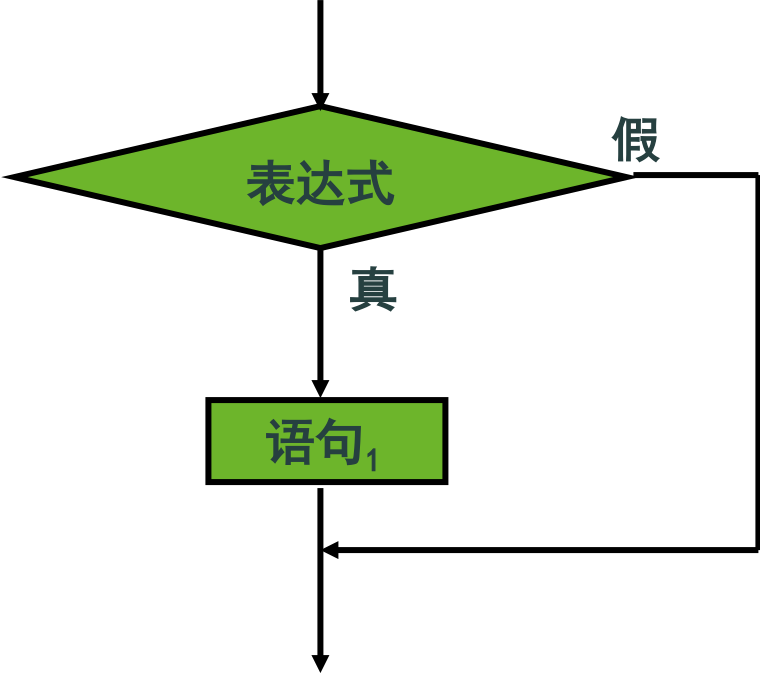
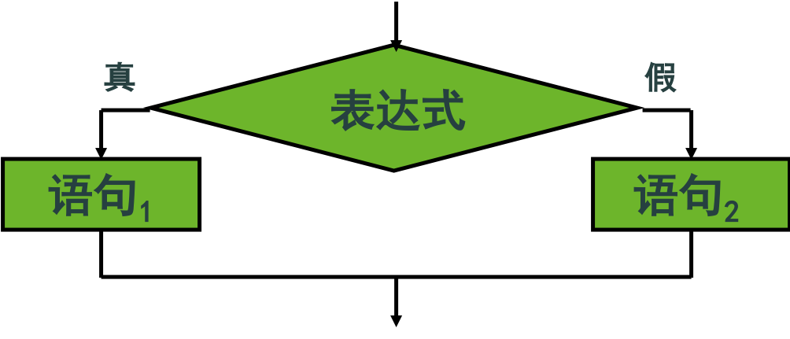
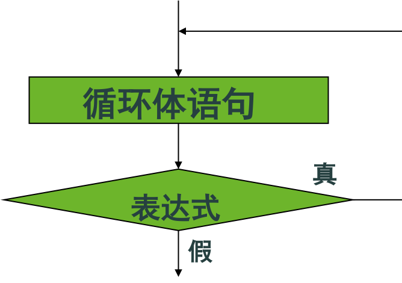
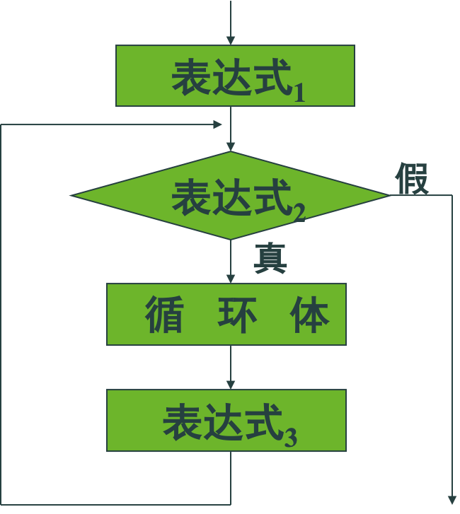

## 一、C语言概述


### C语句分类

```
1. 控制语句(完成一定的控制功能)
if()〜else〜           (条件语句)
for()〜                (循环语句)
while()〜              (循环语句)
do〜while()            (循环语句)
continue              (结束本次循环语句)
break                  (终止语句)
switch(){〜}           (多路分支语句)
return                 (从函数返回语句)

2. 表达式语句          表达式；
3. 空语句               ；
4. 可以用一对大括号{}把一些语句括起来构成一个复合语句，又称分程序、块。    
例如：
     { double t;
       z=x+y;
       t=z/100;
       printf("%f",t);
     }
```

## 二、表达式语句

```c
// 例如：
a=b+c；
if (( a=b )>0)  t=a;
```

## 三、数据输入输出及在C语言中的实现

### 数据输入输出

C语言本身并不提供输入/输出(I/O)语句，其所有的I/O是通过函数来完成的。C语言在其提供的函数库内有一些“标准I/O函数”，它们是以标准I/O设备（一般是指终端和键盘设备）为I/O对象的。

语言已经在头文件stdio.h中对这些函数进行声明。所以，我们在调用这些I/O函数时，必须在源程序前面用预编译命令包含stdio.h文件。例如：`#include <stdio.h>`

- 字符输出：putchar
- 字符输入：getchar
- 格式化输出：printf
- 格式化输入：scanf

## 四、字符数据的输入输出

### putchar函数

putchar函数(字符输出函数)向终端输出一个给定字符。

```c
// 例如：
char c=‘A’；
putchar(c);   // 也可以 putchar(‘A’); 
putchar(‘\n’); 
putchar(‘\'’); 
```

### getchar函数

getchar函数(字符输入函数)从键盘输入一个字符。

```c
// 例如：
char c；
c=getchar(); 
putchar(getchar());    
printf("%c",getchar());
```

### 实例

```c
int main( )
   {     char c1, c2;
           c1 = getchar();
           printf("%c,%d\n",c1,c1);
           c2=c1+32;
           printf("%c,%d\n",c2,c2);…
    }
//运行结果为:A,65 a,97
```

## 五、格式化输入输出

### 格式化输出函数

按“格式串”中格式字符所指定的格式，将参数表列中由参数指出的数据输出到屏幕上显示。同时，按原样输出“格式串”中的非格式字符。

### 格式输出函数

格式输出函数 printf 

```
int printf(格式串，参数表列)

int       返回值表示输出的字符总数；
格式串    是一个用双引号括起来的，由格式说
          明符和非格式说明符(要在屏幕上显
          示的字符)这二类字符构成的字符串；
参数表列  是要输出其所指数据的列表，相互之
          间用逗号分隔。
```
### 格式说明符

由一个 % 为前导符加上一个具有特殊含义的格式字符构成，有时还可以在 % 和 “格式字符” 之间加上修饰符。

**格式字符必须与参数列表中的数据相对应。**

格式字符|含义
---|---
c|输出一个字符
d,i|输出一个十进制整数
f|输出一个浮点数
o|输出一个八进制整数
x,X|输出一个十六进制整数
s|输出一个字符串
e,E|以指数形式输出单、双精度浮点数
g,G|选用e或f格式中输出宽度较短的
% |输出一个百分号

修饰符|说明
---|---
l|加在格式字符d、o、x前表示输出长整数 
m|表示输出数据的最小宽度，默认右对齐输出
.n|用于浮点数，表示输出n位小数；<br/>用于字符串，表示截取n个字符
-|左对齐输出

### 格式说明符

例:格式说明符%s表示输出一个字符串，%d表示输出一个整型数据，%-10.2f表示按左对齐输出一个浮点数，它的输出宽度为10个字符，其中2位是小数。

### 格式输入函数

将用户从键盘键入的数据转换成“格式串”中格式字符所指定的内部形式，赋值给相应的变量。

```
格式输入函数 scanf
    int scanf(格式串，参数表列)

int       返回值表示用户的输入是否正确；
格式串    是一个用双引号括起来的，由格式说明 
          符、空白间隔字符、非空白间隔字符这
          三类字符构成的字符串；
参数表列  指键入的数据要赋值的变量或数组名列
          表，变量或数组名之间用逗号分隔。
          “参数表列”中的变量以“&变量名”的形
          式出现，数组以数组名的形式出现。
```

### 格式输入函数scanf

scanf()函数将从左向右分析格式串，按格式说明符的要求从键盘上读入用户键入的数据赋值给参数表列中对应的变量。
  
**格式字符必须与参数列表中的左值相对应。**

格式字符|含义
---|---
c|读入一个字符
d|读入一个十进制整数
f|读入一个浮点数
o|读入一个八进制整数
x|读入一个十六进制整数
s|读入一个字符串 

修饰符|说明
---|---
l|加在d、o、x三个格式符前表示读入长整数；<br/>加在f前表示读入双精度浮点数
m|表示输入数据的宽度
h|加在d、o、x三个格式符前表示读入短整数；
*|表示本输入项在读入后丢弃

### 格式输入函数实例

格式说明符%s表示读入一个字符串，%d则表示读入一个整型数据，%lf表示读入一个双精度浮点数。

### 实例

```c
// 数据的输入
int main( )
{   int a, b, c;
    scanf("%d%d%d", &a, &b, &c);
    printf("%d,%d,%d\n", a, b, c);             
}
// 运行结果为:3 4 5 3,4,5
```

## 六、关系运算符和关系表达式

### 关系运算

关系运算（比较运算），将两个数据进行比较，判定两个数据是否符合给定的关系。关系表达式的类型是int，其值为1（“逻辑真”）或0（“逻辑假”）。

例如，a > b 中的 > 表示一个大于关系运算。

- 如果a的值是5，b的值是3，则大于关系运算 >的结果为“真”，即条件成立；
- 如果a的值是2，b的值是3，则该关系运算的结果为“假”，即条件不成立。

### 关系运算符及优先级

<   <=   >   >= 

==(等于),  !=(不等于)

关系运算符的优先级，低于算术运算符，但高于赋值运算符。

### 关系运算符实例

c>a+b

a>b==c

a==b<c

a=b>c

## 七、逻辑运算符和逻辑表达式

### 逻辑运算符及优先级

-  ！（逻辑非） 
-  &&（逻辑与） 
-  ||（逻辑或） 

优先级： ！-> 算术运算 -> 关系运算-> && -> || -> =

### 运算符意义

- &&：
  - 当且仅当两个操作数的值都为“真”时，
  - 运算结果为“真”，否则为“假”。
- ||
  - 当且仅当两个操作数的值都为“假”时，
  - 运算结果为“假”，否则为“真”。
- !
  - 当操作数的值为“真”时，运算结果为“假”
  - 当操作数的值为“假”时，运算结果为“真”

例如：假定x=5，则 

- x>=0 && x<10  的值为“真”
- x<-1 || x>5   的值为“假”。

#### 逻辑运算符实例

x>=0 && x<10

比较 

0<=x<10

### 逻辑表达式

用逻辑运算符将若干个表达式连接起来进行逻辑运算的式子。

逻辑表达式的类型是int，其值为1（“真”）或0（“假”）。

逻辑运算符两侧的操作数，可以是0和非0的整数，也可以是其它任何类型的数据，如浮点型、字符型等。

#### 逻辑表达式实例

x>=0 && x<10   表示[0,10)范围内的数

x<1 || x>5     表示[1,5]范围外的数

!(x==0)    -> x!=0 -> x

year%4==0&&year%100!=0||year%400==0

### &&和||的短路运算性质

- && 
  - 如果第一个操作数被判定为“假”，
  - 系统不再判定或求解右边的操作数。
- || 
  - 如果第一个操作数被判定为“真”，
  - 系统不再判定或求解右边的操作数。

#### &&和||的短路运算性质实例

假设n1=1、n2=2、n3=3、n4=4、x=1、y=1，则求解表达式(x=n1>n2)&&(y=n3>n4)

x的值变为0，而y的值不变，仍等于1！

## 八、IF语句

### IF语句的一般格式

```
if (表达式) 
           语句1
      [else
           语句2 ]
```
表达式必须用“(”和“)”括起来。

else子句（可选）是if语句的一部分，必须与if配对使用，不能单独使用。

当语句1 、语句2需要多个语句时，可使用复合语句形式（{……}）。

### If语句不使用else部分

```
if (表达式) 
           语句1
```

语意是：如果表达式为“真”(即非零)，就执行语句1，否则顺序执行下一个语句。这时的if语句是一个单路选择语句。

#### IF语句结构流程图



#### If语句实例

```c
// 将及格成绩输出的语句是：
if (grade>=60) 
printf("成绩是 %f\n",grade);
```

### If语句使用else部分

```
if (表达式) 
           语句1
      [else
           语句2 ]
```

语意是：如果表达式为“真”(即非零)，就执行语句1，然后执行下一个语句；否则执行语句2，然后执行下一个语句。即在语句1和语句2中选取一句。这时的if/else语句是一个双路选择语句

#### IF/ELSE语句结构流程图



#### IF/ELSE语句实例

要将及格和不及格的绩成都打印出来：

```c
if (grade>=60)
    printf("成绩是%f,PASSED!\n",grade);
else 
    printf("成绩是%f,FAILED!\n",grade);
```
### IF语句嵌套

```
if (表达式) 
           语句1
      else
           语句2 
语句1或/和语句2也是一个if语句。

if (表达式1) 
    语句1
else if (表达式2) 
    语句2
else if (表达式3) 
    语句3 
……
```

#### If语句嵌套实例

```c
if(number>500)       cost=(1-0.15)*number;
else if( number>300) cost=(1-0.10)*number;
else if( number>100) cost=(1-0.075)*number;
else if( number>50 ) cost=(1-0.05)*number;
else                 cost=(1-0.0)*number;
```

### 三目条件运算符

```
表达式1 ？表达式2 ：表达式3

相当于
if （表达式1）
    表达式2；
else
    表达式3;
```

#### 三目条件运算符实例

```c
if （a>b）
    Max=a；
else
    Max=b;

// 等同于
Max=a>b ? a : b ；
```

## 九、switch语句

switch语句是特殊的多分支语句,有时要比使用if语句来得方便。

```
switch语句的一般形式是：

switch (表达式)
{ case 常量表达式1：语句1
  case 常量表达式2：语句2
         ……
  case 常量表达式n：语句n
  [default：         语句n+1 ]
}
```

### Switch语句实例

```c
switch (grade)
{   case 'A'：printf("85 – 100")；break;
    case 'B'：printf("70 – 84")； break;
    case 'C': printf("60 – 69")； break;
    case 'D'：printf("<60")；     break;
    default： printf("ERROR")；   break;
}
```

## 十、while语句

while语句实现“当型”循环结构

while (表达式) 循环体语句

其语意是：当表达式的值为“真”时，反复执行循环体语句。

一般情况下，循环体语句是一个复合语句。

循环次数：0次 – 有限的若干次。

**要防止无限循环（“死循环”）。**

### while语句流程图


### while语句实例

```c
// 例  计算1+2+3+…+100
int main()
{   int i=1, sum=0; 
    while (i<=100) sum += i++;          
    printf("%d\n",sum);
    ……    
}
```

## 十一、Do…while语句

do…while语句实现“直到型”循环语句

    do 循环体语句 while (表达式); 

其语意是：反复执行循环体语句,直到表达式的值为“假”。

一般情况下，循环体语句是一个复合语句。

- 循环次数：1次 – 有限的若干次。
- 要防止“死循环”。

### Do…while语句流程图



### Do…while语句实例

```c
// 例  计算1+2+3+…+100
int main()
{   int i=1, sum=0; 
    do
        sum += i++;
    while (i<=100);

    printf("%d\n",sum);  ……  
}
```

## 十二、for语句

for语句实现“当型”循环语句
   
    for (表达式1;表达式2;表达式3) 循环体语句

其语意是：
  
计算表达式1；当表达式2的值为“真”时，执行循环体语句，然后计算表达式3。再判断表达式2的值，直至值为“假”时结束循环。

一般情况下，循环体语句是一个复合语句。

- 循环次数：0次 – 有限的若干次。
- 要防止“死循环”。

### for语句流程图



### for语句应用形式

```
for (循环变量赋初值;循环条件;循环变量增值)
       循环体语句

     表达式1、表达式2、表达式3可选，但是; 不能省略。

for(;;) ……
    循环体语句可以是空语句。
        如：
       for(i=0;(c=getchar())!=‘\n’;i+=c) ;
```

## 十三、循环的嵌套

当while、do…while和for语句中的循环体语句是另一个循环语句时，构成循环的嵌套。

要注意外层和内层循环控制条件之间的相对独立。

```c
// 例如： 
for (i=1;i<=10;i++)
    for (j=1;j<=20;j++)
        ……
```

## 十四、break语句和continue语句

break语句用于循环复合语句内，表示无条件结束循环。语法为：`break;`

continue语句用于循环复合语句内，表示提前进入下一轮循环。语法为：   `continue;`

### 实例

```c
// 例  输出100-200之间不能被3整除的数

int main()
{   int n;   
    for(n=100;n<=200;n++)
    {   if (n%3==0) continue;
        printf("%d  ",n);      
    }
     printf("\n"); ……
}    
```