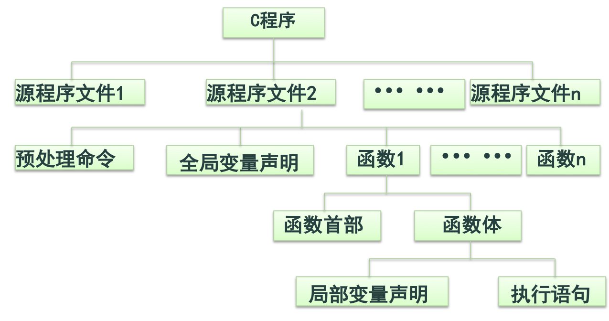

## 一、C语言概述



### C语句分类

```
1. 控制语句(完成一定的控制功能)
if()〜else〜           (条件语句)
for()〜                (循环语句)
while()〜              (循环语句)
do〜while()            (循环语句)
continue              (结束本次循环语句)
break                  (终止语句)
switch(){〜}           (多路分支语句)
return                 (从函数返回语句)

2. 表达式语句          表达式；
3. 空语句               ；
4. 可以用一对大括号{}把一些语句括起来构成一个复合语句，又称分程序、块。    
例如：
     { double t;
       z=x+y;
       t=z/100;
       printf("%f",t);
     }
```

## 二、表达式语句

```c
// 例如：
a=b+c；
if (( a=b )>0)  t=a;
```

## 三、数据输入输出及在C语言中的实现

### 数据输入输出

C语言本身并不提供输入/输出(I/O)语句，其所有的I/O是通过函数来完成的。C语言在其提供的函数库内有一些“标准I/O函数”，它们是以标准I/O设备（一般是指终端和键盘设备）为I/O对象的。

语言已经在头文件stdio.h中对这些函数进行声明。所以，我们在调用这些I/O函数时，必须在源程序前面用预编译命令包含stdio.h文件。例如：`#include <stdio.h>`

- 字符输出：putchar
- 字符输入：getchar
- 格式化输出：printf
- 格式化输入：scanf

## 四、字符数据的输入输出

### putchar函数

putchar函数(字符输出函数)向终端输出一个给定字符。

```c
// 例如：
char c=‘A’；
putchar(c);   // 也可以 putchar(‘A’); 
putchar(‘\n’); 
putchar(‘\'’); 
```

### getchar函数

getchar函数(字符输入函数)从键盘输入一个字符。

```c
// 例如：
char c；
c=getchar(); 
putchar(getchar());    
printf("%c",getchar());
```

### 实例

```c
int main( )
   {     char c1, c2;
           c1 = getchar();
           printf("%c,%d\n",c1,c1);
           c2=c1+32;
           printf("%c,%d\n",c2,c2);…
    }
//运行结果为:A,65 a,97
```

## 五、格式化输入输出

### 格式化输出函数

按“格式串”中格式字符所指定的格式，将参数表列中由参数指出的数据输出到屏幕上显示。同时，按原样输出“格式串”中的非格式字符。

### 格式输出函数

格式输出函数 printf 

```
int printf(格式串，参数表列)

int       返回值表示输出的字符总数；
格式串    是一个用双引号括起来的，由格式说
          明符和非格式说明符(要在屏幕上显
          示的字符)这二类字符构成的字符串；
参数表列  是要输出其所指数据的列表，相互之
          间用逗号分隔。
```
### 格式说明符

由一个 % 为前导符加上一个具有特殊含义的格式字符构成，有时还可以在 % 和 “格式字符” 之间加上修饰符。

**格式字符必须与参数列表中的数据相对应。**

格式字符|含义
---|---
c|输出一个字符
d,i|输出一个十进制整数
f|输出一个浮点数
o|输出一个八进制整数
x,X|输出一个十六进制整数
s|输出一个字符串
e,E|以指数形式输出单、双精度浮点数
g,G|选用e或f格式中输出宽度较短的
% |输出一个百分号

修饰符|说明
---|---
l|加在格式字符d、o、x前表示输出长整数 
m|表示输出数据的最小宽度，默认右对齐输出
.n|用于浮点数，表示输出n位小数；<br/>用于字符串，表示截取n个字符
-|左对齐输出

### 格式说明符

例:格式说明符%s表示输出一个字符串，%d表示输出一个整型数据，%-10.2f表示按左对齐输出一个浮点数，它的输出宽度为10个字符，其中2位是小数。

### 格式输入函数

将用户从键盘键入的数据转换成“格式串”中格式字符所指定的内部形式，赋值给相应的变量。

```
格式输入函数 scanf
    int scanf(格式串，参数表列)

int       返回值表示用户的输入是否正确；
格式串    是一个用双引号括起来的，由格式说明 
          符、空白间隔字符、非空白间隔字符这
          三类字符构成的字符串；
参数表列  指键入的数据要赋值的变量或数组名列
          表，变量或数组名之间用逗号分隔。
          “参数表列”中的变量以“&变量名”的形
          式出现，数组以数组名的形式出现。
```

### 格式输入函数scanf

scanf()函数将从左向右分析格式串，按格式说明符的要求从键盘上读入用户键入的数据赋值给参数表列中对应的变量。
  
**格式字符必须与参数列表中的左值相对应。**

格式字符|含义
---|---
c|读入一个字符
d|读入一个十进制整数
f|读入一个浮点数
o|读入一个八进制整数
x|读入一个十六进制整数
s|读入一个字符串 

修饰符|说明
---|---
l|加在d、o、x三个格式符前表示读入长整数；<br/>加在f前表示读入双精度浮点数
m|表示输入数据的宽度
h|加在d、o、x三个格式符前表示读入短整数；
*|表示本输入项在读入后丢弃

### 格式输入函数实例

格式说明符%s表示读入一个字符串，%d则表示读入一个整型数据，%lf表示读入一个双精度浮点数。

### 实例

```c
// 数据的输入
int main( )
{   int a, b, c;
    scanf("%d%d%d", &a, &b, &c);
    printf("%d,%d,%d\n", a, b, c);             
}
// 运行结果为:3 4 5 3,4,5
```

## 六、关系运算符和关系表达式

## 七、
## 八、
## 九、
## 十、
## 十一、
## 十二、
## 十三、
## 十四、

