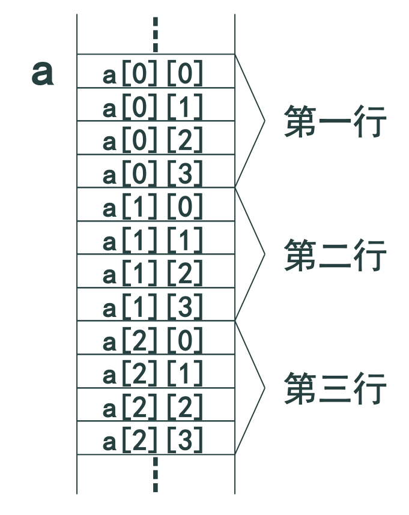
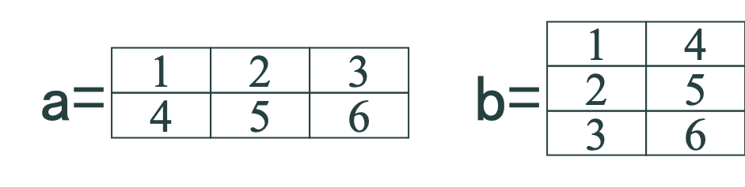

数组是一种构造数据类型。

构造类型(导出类型)由基本类型按一定规则构造而成，包括数组、结构体等。

数组是用一个标识符命名的**同类型**数据的**有序**组合，其中每个数据称为元素，使用时可用数组名和下标唯一确定一个元素。

## 一、一维数组及使用

### 一维数组

`元素类型 数组名[常量表达式]`;
  
例如：`int a[10]`;

定义了一个名称为a的具有10个元素的一维数组 

**数组名用标识符描述。**

方括号内是一个**常量**表达式，表达式的值指定了数组的元素个数(数组的长度)。

常量表达式：C语言不直接支持动态数组。

数组名实际上是一个地址常量,与一般类型的变量一样，数组必须先定义后使用。

使用时，一般只能一个一个的引用数组元素，而不能整体引用。
  
一维数组元素的引用形式：  `数组名[表达式]`

表达式表示数组下标，其类型是int其值范围必须是 0 ~ (数组长度-1) <br/>
(第1个元素的下标是0，最后一个元素的下标是数组长度-1)<br/>
超过范围时发生运行时“越界”错误

```c
// 按与输入相反的次序输出10个数据：
int main()
{ int i,a[10];
  for(i=0;i<10;i++) 
     scanf("%d",&a[i]); /* 为每一个元素输入值 */
  for(i=9;i>=0;i--)     /* 按逆序输出各元素的值 */
    printf("%d ",a[i]);
  printf("\n");
  // ……
}

// 定义时为变量赋初值。
// 例如：
int a[10]={0,1,2,3,4,5,6,7,8,9};
int b[10]={0,1,2,3,4}; // 部分赋初值

// 如果对数组中所有元素赋初值可以写成：  
int a[]={0,1,2,3,4,5,6,7,8,9};
int c[10]={0};// 部分赋初值
int d[10];// 无初值

/* 求前40个Fibonacci数。
该数列的生成方法为：
     F0=0
     F1=1
     Fn=Fn-1+Fn-2(n≥2)
  即从第3个数开始，每个数等于前2个数之和。
*/
int main()
{
    int i,f[40]={0,1};
    for (i=2;i<40;i++) f[i]=f[i-2]+f[i-1];
    for (i=0;i<40;i++)
    {   if(i%4==0) printf("\n");
        printf("%12d",f[i]);
    }
    printf("\n");
    // ……
}
``` 

### 数组存放

连续按序存放各元素。

数组的存贮空间：
  
```c
int a[10];
sizeof(a):  10*sizeof(int)
```

## 二、二维数组及使用

### 二维数组

对于一组线性序列的数据，通常采用一维数组来表示。而对于平面阵列的数据(如矩阵、表)则常用二维数组来表示。

`元素类型 数组名[常量表达式1][常量表达式2];`

例如：`double a[3][4];`定义了一个名称为a的具有3行4列共12个元素的一个数组,在内存中数组元素按行存放。



元素引用形式为：数组名[$下标_1$][$下标_2$]

- $下标_1$和$下标_2$类型是int，
- $下标_1$的值范围必须是 0 ~ (数组长度1-1)
- $下标_2$的值范围必须是 0 ~ (数组长度2-1)

```c
// 分行初始化
int a[3][4]={ {1,2,3,4},{5,6,7,8},{9,10,11,12} };

// 由编译程序分配
int a[3][4]={1,2,3,4,5,6,7,8,9,10,11,12};

// 为部分元素赋初值
int a[3][4]={ {1},{2},{3} };
int a[3][4]={ {1},{0,6},{0,0,9} }; 
int a[3][4]={ {1},{5,6} };

// 对数组中所有元素都赋值
int a[ ][4]={1,2,3,4,5,6,7,8,9,10,11,12};
int a[3][4]={ {1,2,3,4},{5,6,7,8},{9,10,11,12} };
int a[3][4]={ {0,0,3},{},{0,9} };
//只能省略第1维数组的长度！ 
```

将一个二维数组a的行和列元素互换,存到另一个二维数组b中。

例如：



```c
int main()
{ int i,j,a[2][3]={ {1,2,3},{4,5,6} },b[3][2];
  printf("Array a:\n");
  for(i=0;i<2;i++)
  { for(j=0;j<3;j++)    
    { printf("%3d",a[i][j]); 
      b[j][i]=a[i][j];
    }  printf("\n");
  } 
  printf("Array b:\n");
  for(i=0;i<3;i++)
  { for(j=0;j<2;j++)
      printf("%3d",b[i][j]);
    printf("\n");
  }
 // ……
}

/*
运行结果：
Array a:
1  2  3
4  5  6
Array b:
1  4
5
3  6
*/
```

## 三、字符数组、字符串及使用

### 字符数组

字符数组是元素类型为char的一维数组。 

字符数组与一般的一维数组用法相同。

字符数据存放在字符数组中且一个元素存放一个字符，因此可以用字符数组来存放字符串。

#### 字符数组实例

```c
char s[10];
  s[0]='I';s[1]='⊔';s[2]='a';s[3]='m';s[4]='⊔';s[5]='h';s[6]='a';s[7]='p';s[8]='p'; s[9]='y';

char s[10]={'I','⊔','a','m','⊔','h','a','p','p','y'};
char s[ ]={'I','⊔','a','m','⊔','h','a','p','p','y'};

// 其存放形式是
// 'I','⊔','a','m','⊔','h','a','p','p','y'
// 初始化成字符串(注意字符串结束字符'\0')
char s[11]={"I am happy"};
char s[11]="I am happy";
char s[]={"I am happy"};
char s[]="I am happy";
// 'I','⊔','a','m','⊔','h','a','p','p','y','\0'
```

#### 字符数组实例

```c
int main()
{ char str[11]={'I',' ','a','m',' ',
                'h','a','p','p','y','!'};
  int i;
  for(i=0;i<11;i++) printf("%c",str[i]);
  printf("\n");
  // ……
}
// 运行结果是：I am happy！
```

### 字符串

字符串是若干个字符的序列。字符串可以包括字母、数字、专用字符、转义字符等。

以'\0'(或写成0，NULL)作为字符串结束标志。因此可以对字符数组采用另一种方式进行操作 ── 字符数组的整体操作。

- %c逐个输入/输出字符数组的每个字符
- %s整体输入/输出字符串中的全部字符

#### 字符串实例

```c
int main()
{ char  str[]="I am happy!"; 
  printf("%s\n",str);
  // ……
}
// 运行结果是：I am happy！

int main()
{
   char str[20];
   printf("Enter a string:\n");
   scanf("%s",str);
   printf("%s\n",str);
   // ……
} 
// 输入回车后scanf会自动添加一个结束符'\0'。
// 空格、制表符和回车都作为scanf的分隔符处理，因此有时需要使用gets函数。
```

#### 字符串处理函数

对于ANSI C标准库函数中的字符串处理函数，使用时必须包含string.h头文件。

```c
puts(str) // puts(字符串)相当于printf("%s\n",字符串)

gets(str) // gets(字符数组相当于scanf("%s",字符数组),但是gets能输入空格和制表符，而scanf不能。

/*
strcat(字符串1,字符串2)
将字符串2连接到字符串1后面。
返回值与字符串1相同。
要保证字符串1能容下连接后的字符串。
*/

char str1[30]="People's Republic of ";
char str2[]="China.";
printf("%s\n",strcat(str1,str2));
// 结果显示：People's Republic of China. 

/*
strcpy(字符数组,字符串)
将字符串传送到字符数组中。返回值与字符数组相同。
要保证字符数组能容下字符串。
*/
char str1[20];
char str2[]="China";
printf("%s\n",strcpy(str1,str2));
// 结果显示：China

// 注意：
char str1[20];
char str2[]="China";
str1=str2;//是非法的。   

/*
strcmp(字符串1,字符串2)

将字符串1与字符串2进行比较。
返回值=0表示字符串1等于字符串2;
     >0表示字符串1大于字符串2;
     <0表示字符串1小于字符串2。
*/
strcmp(str1,str2);
strcmp("China","Korea"); //结果<0
strcmp(str1,"Beijing"); 

char str1[20];
char str2[]="China";
if (str1==str2) // 是不正确的。

/*
strlen(字符串)
  求字符串的长度。
  不包括字符串结束符'\0'。
*/

char str[]="China";
printf("%d\n",strlen(str));
printf("%d\n",strlen("China"));

// 结果：5 
```