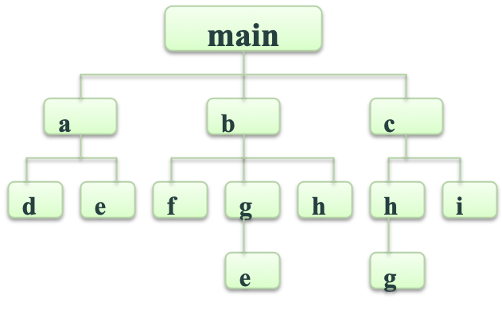
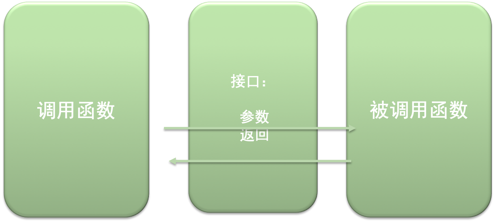
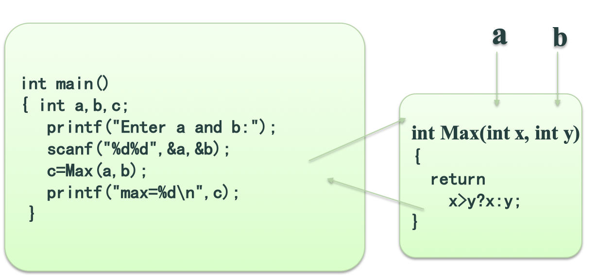
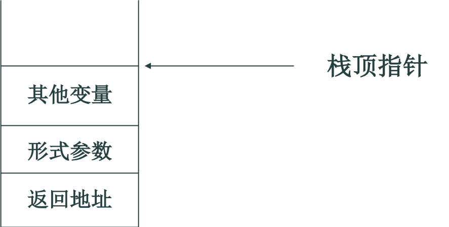
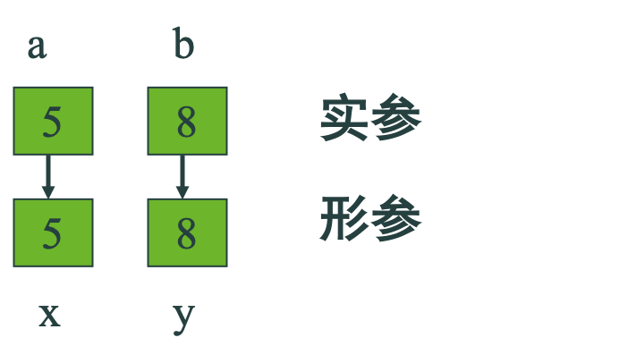
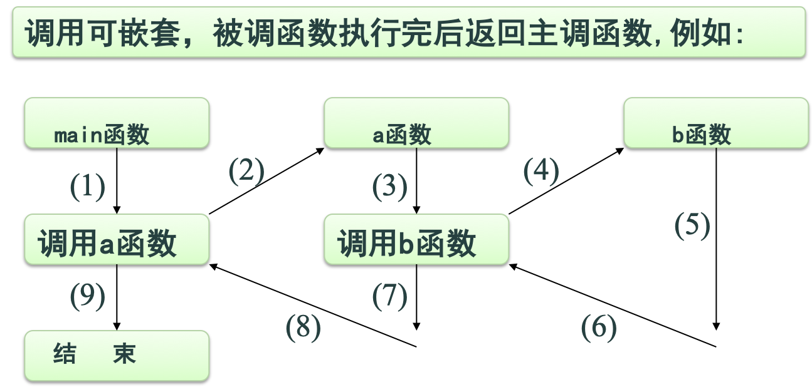
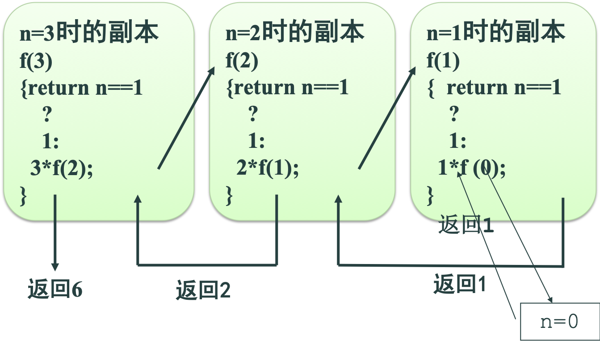
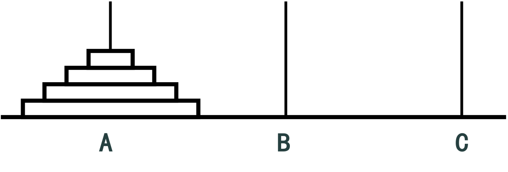

---
title:C语言05-函数
date: 2020-04-29 21:22:38
---

## 一、函数概述

1. C语言支持模块化程序设计风格，模块用函数描述。
2. 函数具有相对独立性,通过函数参数和返回值相互作用。
3. 实现控制抽象
4. 实现代码重用



### 函数调用实例

```c
void printstar()
{ printf("*******************************\n"); }

void print_message()
  { printf("     How do you do!\n"); }
 
int main()
{ printstar();
  print_message();
  printstar();
  // ……
}
/*
运行结果
*******************************
     How do you do!
*******************************
*/
```

### 源程序文件

- 一个源程序文件由一个或多个函数组成，一个源文件(.c)是一个编译单位。
- 一个程序可以由一个或多个源程序文件(.c)组成。
- 连接程序将多个目标文件(.obj)以及相关库函数代码(.lib)连接起来。
- 在VS环境中，将几个源程序文件同时添加到一个工程中，在build时连接程序就能将它们连接起来。

### 程序执行

程序的执行从main函数开始。若在main函数中调用其他函数，在调用后控制流程返回到main函数，最终在main函数中结束整个程序的执行。

调用函数时启动被调用函数执行，执行完成后返回调用函数。main结束时返回操作系统，可认为main函数是由操作系统调用的。

**所有函数都是平行的，函数不能嵌套。**

### 函数分类

- 系统提供的，符合ANSI C规定的标准函数（库函数）vs 用户自己定义的函数
- 无参函数 vs 有参函数
- 无返回值函数 vs 有返回值函数 

## 二、函数定义

### 函数声明与原型

在函数中调用另一个函数时需要具备的条件：

1. 被调用函数必须是已经定义过的函数；
2. 当编译程序对函数扫描进行编译时，被调用函数的定义必须出现在主调函数之前。
3. 由于允许一个函数单独进行编译，同时为对函数调用进行正确性检查，所以在主调函数中必须要有关于被调函数的相关信息。为此，C语言提供了函数声明。函数声明使用函数原型。

### 函数原型

```
类型 函数名(类型1,类型2, …);

或

类型 函数名
      (类型1 变量名1, 类型名2 变量名2,…);
```

编译程序并不关心这些变量名，但能提高程序的可读性。

#### 函数原型实例

```c
double add(double,double);
int main()
{ double a,b;
  printf("Enter a and b with float: ");
  scanf("%lf%lf",&a,&b);
  printf("sum is %f\n",add(a,b));
  // ……
}
double add(double x, double y)
{ return x+y; }

//  函数定义可以看作是一个函数原型。
double add(double x, double y)
{ return x+y; }
int main()
{ double a,b;
  printf("Enter a and b with float: ");
  scanf("%lf%lf",&a,&b);
  printf("sum is %f\n",add(a,b));
  // ……
}
```

#### 库函数的函数原型

包含在相应的头文件中。因此，在调用库函数时，需要将相应的头文件包含进来。

```c
// 例如：
  #include <math.h>

  if (fabs(a)>5) 
  // …   
```

### #include 预编译命令

1. `#include <头文件>`
2. `#include "头文件"`

### 无参函数的定义

```
类型名 函数名( )
{ 
    说明部分
    执行语句部分
} 
```

类型名为void，表示无返回值函数。

类型名省略时，默认返回值类型为int。

### 有参函数的定义

```c
/* 
类型名 函数名(形式参数表)
{ 
    说明部分
    执行语句部分
} 
*/

// 例子
int Max(int x,int y)
{  return x>y?x:y; }
```

类型名为void，表示无返回值函数。

类型名省略时，默认返回值类型为int。

### 函数定义



## 三、函数参数和函数返回

### 形参与实参

- 形式参数:函数定义中的参数称为形式参数，简称形参。
- 实际参数:函数调用中的参数称为实际参数，简称实参。

### 参数间数据传递

```c
int Max(int x,int y)
{   return x>y?x:y; }

int main()
{   int a,b,c;
    printf("Enter a and b:");
    scanf("%d%d",&a,&b);
    c = Max(a,b);
    printf("max=%d\n",c);
    // ……
}
```



### 函数调用的实现

系统运行时使用系统堆栈实现函数的返回及形参的存贮空间分配与释放。



### 堆栈

一种后进先出的数据结构。
 
系统堆栈有一定大小。存储的数据过多时会发生堆栈溢出，导致程序不能正常运行。

### 形参与实参

形参只在函数调用时才分配存储空间。函数返回后，释放形参的存储空间。这与一般的函数内定义的局部变量是一样的。

**实参可以是常量、变量或表达式。**

例如：Max(3,a+b)；


- 在定义函数时要指定形参的类型。
- 实参的类型必须与形参兼容。
- 函数调用时，实参的值传递给形参。

### 值传递

按“值传递”（即单向传递）。例如，上例中实参与形参间数据传递的图示：若a=5,b=8



### 函数的返回值

函数返回类型（简称为函数类型）在定义函数时给出。

- 无返回值函数的函数类型应为void，函数定义中的return语句无表达式。当return语句是函数定义中的最后一个语句时，可省略return语句。
- 有返回值函数的函数定义中，return语句中的表达式类型必须与函数类型相容。
- 函数调用结束时，return表达式的值传递给函数调用者。

#### 函数的返回值实例

```c
// 返回值类型与函数类型不同

int Max(double x,double y)
{  return  x>y？x：y; }

int main()
{   double a,b; int c;
    printf("Enter a and b:");
    scanf("%lf%lf",&a,&b);
    c = Max(a,b);
    printf("max=%d\n",c);
}
```
## 四、函数调用

无参函数的调用：函数名( )  
有参函数的调用：函数名(实参表)

- 实参个数应与形参个数相同，类型应相容，顺序应对应。
- 有返回值的函数调用构成一个表达式，可用于所有允许表达式出现的地方。
- void函数以单独一个语句的形式调用。

#### 函数调用实例

```c   
printstar();
c=2*Max(a,b);
m=Max(a,Max(b,c));
printf("%d",Max(a,b));
if (Max(a,b)<100) 
// …
```

## 五、函数嵌套调用



## 六、递归函数

- 递归算法比较直观。（如Hanoi塔问题）
- 递归过程的实现效率非常低。
- 在递归算法中要防止出现无限递归；
- 在循环算法中则要防止死循环的发生。

### 函数的递归调用

- 函数的递归调用指一个函数在它的函数体内直接或间接地调用它自身。
- 在递归调用中，调用函数又是被调用函数，执行递归函数将反复调用其自身。每调用一次就进入新的一层，在堆栈中记录所有未完成的函数调用
- 为了防止递归调用无终止地进行，必须在函数内有终止递归调用的手段。常用的方法是加条件判断，满足某种条件后就不再作递归调用，然后逐层返回。
- 递归算法多次调用自身，使解决的问题变为规模越来越小的子问题，通过简单子问题的解决，最终求得原问题的解。
- 利用递归方法设计的算法和程序往往能够更自然地反映解题的过程，简短且易于理解。 

#### 函数的递归调用实例

```c
int f(int x)
  {  int z;
     z = f(x);
     return z;
  }
// 无限递归,结果：系统堆栈溢出！！！
```

### 递归定义

递归定义是一种强有力的数学工具，它可以用最精练的方法表述递归过程。

例子：计算n!，记号f (n)表示n! 其递归定义如下：

$$
f(n)=
\begin{cases}
1 \qquad 当n=0时（边界条件）  \\
f(n-1)*n \qquad 当n>1是（地鬼共识）
\end{cases}
$$

根据递归公式: 

当n=0时,有f(0)=1;<br/>
当n=1时,有f(1)=f(1-1)*1=f(0)*1=1*1=1;<br/>
当n=2时,有f(2)=f(2-1)*2=f(1)*2=1*2=2;<br/>
当n=3时,有f(3)=f(3-1)*3=f(2)*3=2*3=6;<br/>
当n=4时,有f(4)=f(4-1)*4=f(3)*4=6*4=24;<br/>
当n=5时,有f(5)=f(5-1)*5=f(4)*5=24*5=120;<br/>
……

### 递归定义要点

当问题是n时，只须考虑其前一个实例n-1和基本实例n=1的情况而无须考虑问题的中间过程，这在设计复杂算法时是有利的。

```c
int f(int n){ return n ? f (n-1)*n : 1; }    
int main() 
{   int n;
    printf("Input n: "); 
    scanf("%d",&n);
    if (n>=0)    
       printf("%d!=%d\n",n,f(n) );
    else printf("n不能小于0\n");
    // ……
} 
// 注意： n不能太大！        
```



### hanoi塔问题

hanoi塔问题是一个经典问题



相传古代东方有一座寺庙，庙内有三个座桩，在其中一个座桩上叠有一摞64个圆盘，并且上面的圆盘总是比下面的圆盘小，呈梵塔状。僧侣们空闲时常常思量着如何每次搬一个圆盘，保持上小下大将这摞圆盘从一个座桩，借助另一个座桩，按原样搬到第三个座桩

许多僧侣按自己的直觉来试搬，他们先将三个座桩分别用A、B、C三个符号表示。

于是原来的问题变成：将A上的圆盘借助B按规则搬到C上。僧侣们发现当A上只有1个圆盘时问题很好解决，此时只需将A上的哪个圆盘搬到C上即可。而当A上有2个圆盘时的情况，发现问题也不难解决。此时只需先将A上的小圆盘搬到B上，然后将A上剩下的大圆盘搬到C上，再将B上的小圆盘搬到C上，问题也同样解决了。

这个过程可以抽象地描述成：A->B, A->C,B->C

然后试A上有3个圆盘时的情况，此时问题也不难解决，整个操作过程可以抽象描述成:

**A->C,A->B,C->B,A->C,B->A,B->C,A->C**

但搬运次数明显增加，为7次。当A上的圆盘增加到4个时，众僧侣发现搬运次数急剧增加到15次。再下去，僧侣们感到头脑发胀有些力不从心了，别说是64个圆盘就是6，7个也难以想象。为此，许多人放弃了努力。从此以后，这个问题被僧侣们看成是天大的难题。 

#### hanoi塔问题的计算机求解

问题可分三步解决：
- 为了能将A上的第n个圆盘搬到C 上，首先必须设法将其上的n-1个圆盘借助C搬到B上。这可用一个四元组表示为(n-1,A,C,B)；
- 把A上剩下的那个圆盘搬到C上，这可用一个二元组表示为(A, C)；即：A->C
- 再将B上的 n-1个圆盘借助A搬到C上，可用四元组表示为(n-1,B,A,C)；

```c
void hanoi(int n,char A,char B,char C)     
{  if (n==1) printf("disk%2d: %c-->%c\n", n, A, C);     
   else {  hanoi(n-1,A,C,B); 
           printf("disk%2d: %c-->%c\n", n, A, C);
           hanoi(n-1,B,A,C);
        }
} 
int main()
{ int n;   printf("Input the number of disks: ");
  scanf("%d",&n);    hanoi(n,'A','B','C'); ……
} 
/*
运行结果：
Input the number of disks: 3
disk 1: A-->C
disk 2: A-->B
disk 1: C-->B
disk 3: A-->C
disk 1: B-->A
disk 2: B-->C
disk 1: A-->C
*/
```

## 七、数组作为函数参数

- 数组元素作函数参数：数组元素用作函数参数时和一般变量一样。
  - 即：使用传值方式将数组元素值传给函数的形参。
- 作为实参的数组名传递给形参，传递的是实参数组的地址。
  - 形参不给每一个元素分配存储空间，形参数组所指数组元素就是实参数组的数组元素。
- 实参数组的元素类型必须与形参数组的元素类型完全一致。
  - 修改形参数组的元素，实际上就是对实参数组的相应元素进行修改。

```c
//  有一个一维数组score，内放10个学生成绩，求平均成绩。
double average（double  array[10]）
{   int i； double  sum=0；
    for(i=0; i<10; i++) sum += array[i];
    return sum/10;
}
int main()
{   double aver,score[10];  int i;
    printf("Enter 10 scores: ");
    for(i=0; i<10; ++i) scanf("%lf",&score[i]);
    aver = average(score);
    printf("Average score is %5.2f\n",aver);
    // ……
}

// 作为形参的数组大小可以省略。增加一个实参数组元素个数的参数，可以使得函数能处理任何元素个数的数组。
double average（double  array[ ]，int n）
{   int i； double  sum=0；
    for(i=0; i<n; i++) sum+=array[i];
    return sum/n;
}
#define N 10
int main()
{   double aver,score[N];  int i;
    printf("Enter scores: ");
    for(i=0; i<N; ++i) scanf("%lf",&score[i]);
    aver = average(score,N);
    printf("Average score is %5.2f\n",aver);
    // ……
}
```