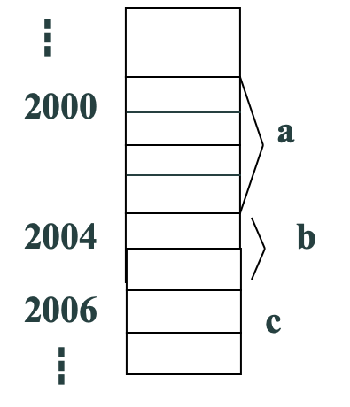
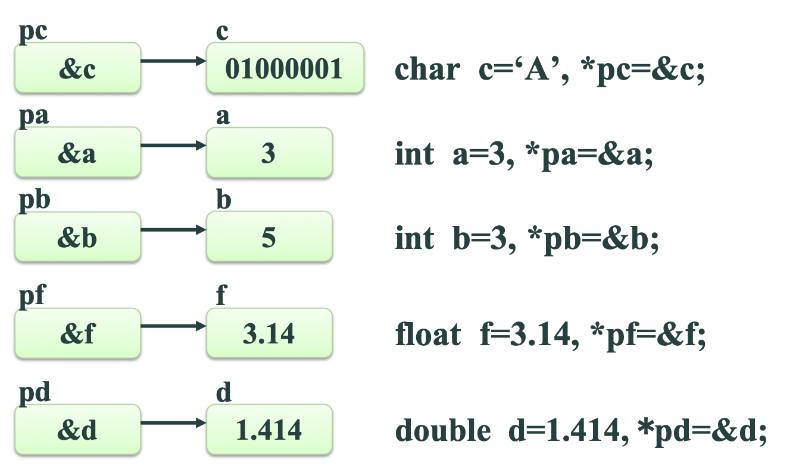
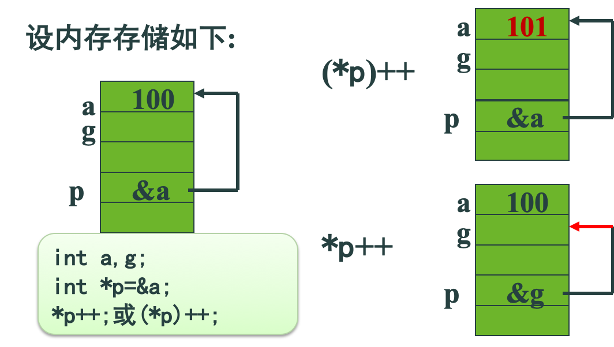
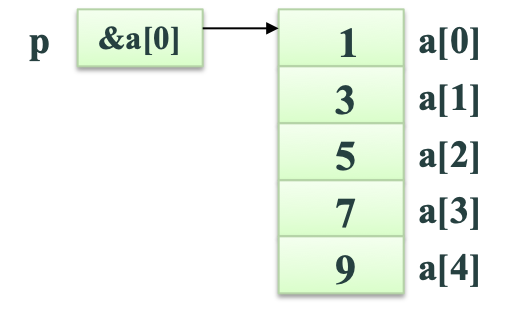
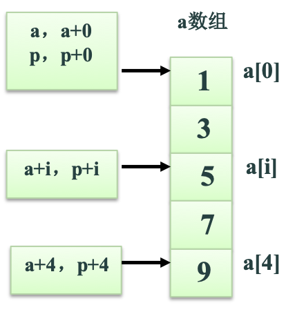
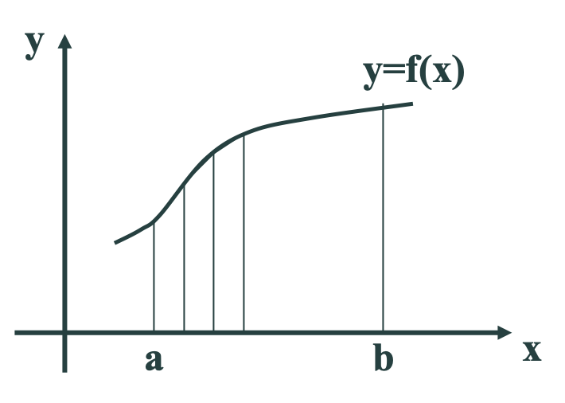
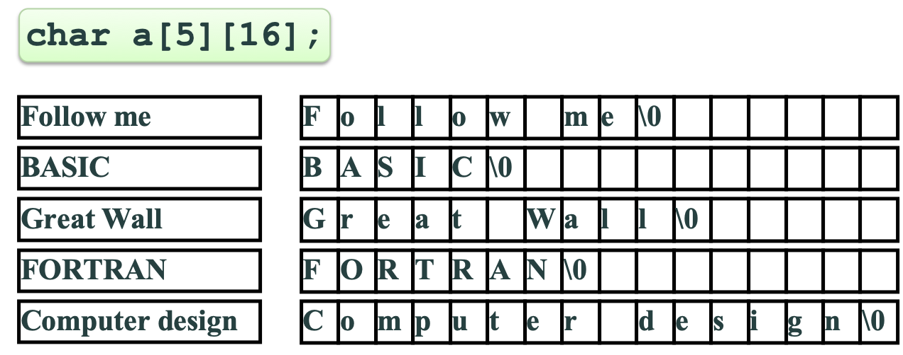
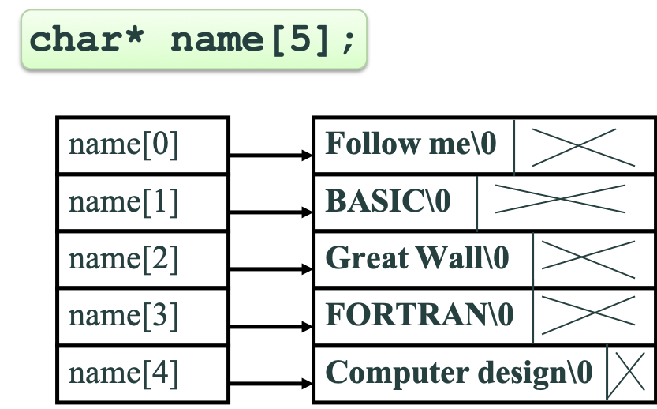
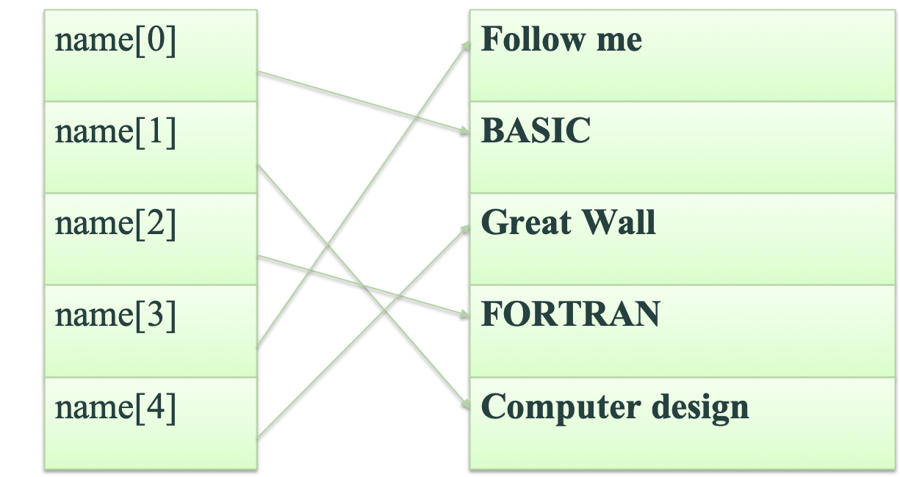
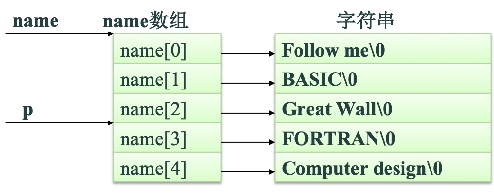

指针是C语言中一个重要的概念，也是C语言的一个重要特色。正确灵活地运用它，可以

1. 有效地表示和构造一些复杂的数据结构
2. 动态分配内存
3. 方便地使用字符串
4. 有效而方便地使用数组
5. 使不同函数之间能共享相同的存储空间
6. 直接访问内存地址 
……

指针对于设计系统软件是十分必要的。正确地应用指针，可以使程序简洁、紧凑、高效。因此，每一个学习和使用C语言的人，都应深入地学习和掌握指针。可以说，不掌握指针就没有掌握C语言的精华。

**对初学者来说，指针这部分内容也相对学习难度较大**

## 一、地址和指针概念

### 存储器地址

为了能访问内存空间，要确定内存最小访问单位的位置，因此要对内存进行编址。内存的最小编址单位是字节。



### 存储单元

对于不同类型的变量，其存储所占的字节数是不同的。

例如：`int a; short b; char c;`

在32位系统中，变量a存储单元占4字节，b占2字节，c占1字节。

同理，float类型变量的存储单元占4个字节，double类型变量的存储单元占8个字节。

### 变量的地址

可以用取地址运算符(&)来获得变量地址。

例如：`int a,b; char c;`

要想得到变量a的地址可以用&a。同样，b的地址是&b，c的地址是&c。

### 指针

指针就是变量的地址。

例如：`int a，b；char c；`
&a、&b、&c都是指针。

## 二、指针变量

指针是一个地址值，它可以被存放在变量中。用来存放指针的变量称为指针变量。

```c
// 定义形式是：
//    基类型 *指针变量名；
// 例如：
char *pc，c；char* p1; char * p2;
int  *pa，*pb，a，b；
float *pf，f；
double *pd，d；
```

指针变量必须指向其定义时指定的基类型的那些变量

```c
// 例如：
float a;
int *pi;
pi=&a; // 是错误的。
```

### 指针变量的值
 
一个变量的地址 -> 一个指针变量，使指针变量指向另一个变量。

不要直接将整型数赋给指针变量(0除外)。

```c
// 例如：
char *pc，c；
int  *pa，*pb，a，b；
float *pf，f；
double *pd，d；
pc=&c;  pa=&a;  pb=&b;
pf=&f;  pd=&d;  // (pc=2000;错误）
pc=0;   pa=pb;
```



### 指针变量获取值的方法

指针变量获取值的方法小结：

1. 0(或NULL)
2. 基类型变量的地址
3. 同类型的另一个指针变量的值

### 指针运算符

\* 指针 表示指针所指的那个变量。

\* 也称为间接访问运算符。

```c
// 使用间接访问运算符之前必须使指针指向一个变量！！！
//例如：
int a = 3，b = 5，*pa，*pb；
pa = &a;
pb = &b;
*pa = *pa + *pb; 

// 例  通过指针变量访问所指变量
int main()
{ int a=100,b=10,*pa,*pb;
  pa=&a;   /*  变量a的地址存放于指针变量pa  */
  pb=&b;   /*  变量b的地址存放于指针变量pb  */
  printf("a=%d,b=%d\n",a,b);
  printf("a=%d,b=%d\n",*pa,*pb);
  // ……
}
```

### 取地址运算符与指针运算符

- &  取地址运算符
- \*  指针运算符

& 和 * 是一对互逆运算符，它们的优先级相同。
      
*(&a)≡a

&(*p)≡p

### *运算符与++运算符

*p++ 与 (*p)++  不同
*p++ 与  *(p++) 相同



### 指针运算

- 指针1 - 指针2 = 指针之间的距离
  - [Addr(指针1)-Addr(指针2)]/sizeof(基类型)
- 指针 + 常数
  - Addr = Addr(指针) + 常数*sizeof(基类型)
- 指针比较大小
  - 判断两个指针的前后位置或判断是否等于0

```c
// 例 按序输出两个数
int main()
{ int *p1,*p2,*p,a,b;
  scanf("%d%d",&a,&b);
  p1=&a;  p2=&b;  
  if (a<b) { p=p1;p1=p2;p2=p); }
  printf("max=%d,min=%d\n",*p1,*p2);
  // ……
}
```


### 指针变量用作函数参数

通过指针变量将一个变量的地址作为实际参数传递给一个函数

```c
// 按序输出两个数
void swap(int* p1,int* p2)
{ int t=*p1; *p1=*p2; *p2=t;}
int main( )
{ int *p1,*p2,a,b;
  scanf("%d%d",&a,&b);
  p1=&a;  p2=&b;  
  if (a<b) swap(p1,p2);
  printf("max=%d,min=%d\n",a,b);……
}
```

### 程序比较

```c
void swap(int* p1,int* p2)
{ int t=*p1; *p1=*p2; *p2=t;}

void swap2(int* p1,int* p2)
{ int* t; *t=*p1; *p1=*p2; *p2=*t;}

void swap3(int* p1,int* p2)
{ int* t; t=p1; p1=p2; p2=t;}

void swap4(int a,int b)
{ int t=a; a=b; b=t;}
```

## 三、数组与指针

### 引用数组元素方法

引用数组元素方法：

1. 下标法（如a[5]）
2. 指针法

通过指向数组元素的指针找到所要访问的元素，如：int *p=a; p+=5; *p=1;

### 指向数组元素的指针

数组元素是变量，所以可用指针指向数组元素。

```c
// 例如： 
int a[5]={1，3，5，7，9}；
int *p；
p=&a[0]；//或 p=a；
for(i=0;i<5;i++)
   printf("%d"，*p++)；
printf（"\n"）；

//例如： 
int a[5]={1，3，5，7，9}；
  
for(i=0;i<5;i++)
   printf("%d"，*a++)；
printf（"\n"）
// a是常量
```


指针也可采用下标表示法。
```c
//例如： 
int a[5]={1，3，5，7，9}；
int *p；
p=&a[0]；//或 p=a；
for(i=0;i<5;i++)
   printf("%d"， p[i])；
printf（"\n"）；
```



### 一维数组的指针

总结：一维数组的指针

```c
int a[5]={1，3，5，7，9}，
*p=a；
```

引用数组元素的方法有：

1. 指针法  *(a+i)、*(p+i)
2. 下标法  a[i]、p[i]



### 用数组名作函数的参数

数组名就是指向数组第1个元素的指针。因此函数形参可定义为指针，而对应实参是数组名。

`void f(int array[])`等同于`void f(int* parray)`

例：将a数组中的n个整数按反向顺序存放。

算法：将a[0]与a[n-1]对换，a[1]与a[n-2] 对换…。设两个位置变量i和j，其中i的初值为0，j的初值为n-1。执行时，将a[i]与a[j] 对换，然后i++，j--，再将a[i]与a[j] 对换，直到i=(n-1)/2为止。

```c
// 例   将a数组中的n个整数按反向顺序存放。
void inv(int *x,int n)  // 与 int x[ ] 相同
{ int *p,t,*i,*j,m=(n-1)/2;  p=x+m;
  for(i=x,j=x+n-1;i<=p;i++,j--)
  { t=*i; *i=*j; *j=t; }
}
int main()
{ int i,a[ ]={3,7,9,111,0,6,7,5,4,2};
  printf("The original array:\n");
  for(i=0;i<10;i++) printf("%d ",a[i]); 
  printf("\n");
  inv(a,10);
  printf("The array has been inverted:\n");
  for(i=0;i<10;i++) printf("%d ",a[i]);
  printf(“\n”);
  // ……
} 
```

作为实参的指针必须已经指向实际存储数据的数组！！

## 四、字符串与指针

### 字符串的表示形式

两种方法访问一个字符串：

1. 用字符数组存放一个字符串
2. 用字符指针指向一个字符串

```c
int main()
{    
    char string[ ] = "Hello!";   
    printf("%s\n",string);
}

int main()
{    
    char* pstring = "Hello!";
    printf("%s\n",pstring);
}

int main()
{    
    char a[]="Hello!",b[10];    int k;
    for (k=0;a[k];k++)  b[k]=a[k]; b[k]=0;
    printf("String a = %s\n",a);
    printf("String b = %s\n",b);
}

int main()
{    
    char a[]="Hello!",b[10],*p1,*p2;    
    p1=a; p2=b;
    for (;*p1;p1++,p2++)  *p2=*p1;  *p2=0;
    printf("String a = %s\n",a);
    printf("String b = %s\n",b);
}
```

### 字符串指针作函数参数

将一个字符串从一个函数传递给另一个函数，可以用地址传递的方法，即用字符数组名作为参数，也可以用指向字符的指针变量作参数。

在被调用的函数中可以改变字符串的内容，在主调函数中可以得到改变了的字符串。

```c
void copy_string(const char from[],char to[])
{  int i;
   while(from[i]) {to[i]=from[i];i++;}  to[i]=0;
}

int main( )
{  char a[]="I am a teacher.";
   char b[]="You are students.";
   printf("a=%s\nb=%s\n",a,b);
   copy_string(a,b);
   printf("a=%s\nb=%s\n",a,b);
}

void copy_string(const char* from, char* to)
{  while(*from) 
    *to++=*from++; 
    *to=0;
} 

int main( )
{  char a[]="I am a teacher.";
   char b[]="You are students.";
   printf("a=%s\nb=%s\n",a,b);
   copy_string(a,b);
   printf("a=%s\nb=%s\n",a,b);
}
```

### copy_string函数形式

```c
void  copy_string(const char *from, char *to)
          {  while(*to=*from) { to++; from++; }  }
void  copy_string(const char *from, char *to) 
          {  while(*to++=*from++);  }
void  copy_string(const char *from, char *to)
          {  while(*from) *to++=*from++; *to=0;  }
void  copy_string(const char *from, char *to) 
          {   for(; *to++=*from++; ) ;   }
void  copy_string(const char from[],char to[])
 {  char p1,p2;  p1=from; p2=to; while(*p2++=*p1++);  }
```

### 字符指针变量与字符数组小结

内存分配方法不同。<br/>
字符指针可赋值；字符数组不能(数组名是常量)。

## 五、函数指针

### 函数指针变量调用函数

函数也有地址，同样可被函数指针所指向。

设置函数指针的目的是通过函数指针间接调用它所指的函数。使得函数指针可以作为另一个函数的参数。

### 函数指针

函数指针的定义

    函数类型 (*函数指针名)(函数参数表)；

函数指针的赋值

        函数指针=&实际函数名；
    或
        函数指针=实际函数名；

通过函数指针间接调用函数
             
         (*函数指针)(实参表)；
    或
        函数指针(实参表)；

```c
/*
不能对函数指针进行加减等运算。
  例如：
  fp++ 
  fp=fp+5
  是错误的。
*/
int max(int x,int y){ return x>y?x:y; }
int (*fp)(int,int); 
int main() 
{  int a,b; 
   fp=max;
   scanf(%d%d",&a,&b);
   printf("a=%d,b=%d,max=%d",
    a,b,(*fp)(a,b));
}
```

### 函数指针作函数的参数

定义了一个某种类型的函数指针变量，就可以用它来指向该类型的任意函数。这就使我们能用函数指针作函数的参数，使该函数能够通过函数指针来引用多个函数，从而使函数更具灵活性和通用性。

```c
int Max(int x,int y){ printf("max=");return x>y?x:y; }
int Min(int x,int y){ printf("min=");return x<y?x:y; }
int Add(int x,int y){ printf("add=");return x+y; }
void process( int x,int y,int (*fp)(int,int) )
{ printf("%d\n",(*fp)(x,y)); }
int main()
{  int a,b;
   printf("Enter a and b:"); 
   scanf("%d%d",&a,&b);
   process(a,b,Max);
   process(a,b,Min);
   process(a,b,Add);
}
```

**例子：编写求定积分的通用函数，用它分别求以下5个函数的定积分。 **

$$\int_a^b (1+x)xdx \int_a^b (2x+3)xdx  \int_a^b (e^x+1)dx \int_a^b (1+x)^2dx \int_a^b x^3dx $$

使用矩形法计算定积分的公式为：

$$((f(a)+f(b))/2.0+ \sum_{i=1}^{n-1}(a+i*h))*h,其中h=(b-a)/n $$



```c
#include <math.h>
float integral(float a,float b,float (*f)(float))
{  float s,h;    int i,n;
   s=((*f)(a)+(*f)(b))/2.0;
   printf(“Enter n:”);   scanf(“%d”,&n);  
   h=fabs(b-a)/n;
   for( i=1; i<n; i++ ) s+=(*f)(a+i*h); 
   return s*h;
}
float f1(float x){ return (1+x)*x; }
float f2(float x){ return (2*x+3)*x; }
float f3(float x){ return exp(x); }
float f4(float x){ return (1+x)*(1+x); }
float f5(float x){ return x*x*x; }

int main()
{  float a,b;
   printf(“Enter a and b for integral f1:”); 
   scanf(“%f%f”,&a,&b); /*  完成对函数f1( ) 的积分  */
   printf(“%f\n”,integral(a,b,f1));
   printf(“Enter a and b for integral f2:”);  
   scanf(“%f%f”,&a,&b); /*  完成对函数f2( ) 的积分  */
   printf(“%f\n”,integral(a,b,f2));
   printf(“Enter a and b for integral f3:”);   
   scanf(“%f%f”,&a,&b);  /*  完成对函数f3( ) 的积分  */
   printf(“%f\n”,integral(a,b,f3));
   printf(“Enter a and b for integral f4:”);  
   scanf(“%f%f”,&a,&b);  /*  完成对函数f4( ) 的积分  */
   printf(“%f\n”,integral(a,b,f4));
   printf(“Enter a and b for integral f5:”);  
   scanf(“%f%f”,&a,&b);  /*  完成对函数f5()的积分  */
   printf(“%f\n”,integral(a,b,f5));
}
```

## 六、指针数组和指向指针的指针

### 指针数组的定义

一个存放指针的变量称为指针变量，同样一个用来存放指针的数组称为指针数组。

类型名* 数组名[数组长度]；

例如：`int* p[4]；`与`int (*p)[4]；`不同

### 使用指针数组的目的

在字符处理中，用二维数组存放不等长的字符串会造成很大的存贮空间浪费。

### 指针数组





```c
//  将若干字符串按字母顺序（由小到大）输出。
#include <string.h>
void  sort(char *name[],int n)
{  char *t;   int i,j,k;
    for(i=0;i<n-1;i++)
    {  k=i;
        for (j=i+1;j<n;j++)
            if (strcmp(name[k],name[j])>0) k=j;
        if (k!=i){   t=name[i]; 
                         name[i]=name[k];
                         name[k]=t;
                    }
     }
}

//  将若干字符串按字母顺序（由小到大）输出。
void print(char *name[],int n)
{  int i;
    for(i=0;i<n;i++) printf("%s\n",name[i]);
}

int main()
{  char *name[]={"Follow me", "BASIC",
       "Great Wall", "FORTRAN","Computer design" };
   sort(name,5);
   print(name,5);
}
```



### 指针的指针

指针的指针是指针变量的地址。

name是指针数组的名字，所以是**该指针数组的指针**。如果要将它存放在某个变量中，那么这个变量可以这样定义： `char **p;`

于是指针变量p就可以用来存放指针的指针。此时，如果有p=name操作，那么就可以用p来指向字符指针数组中的每一个元素。



```c
p=name+2；
printf(“%p\n”,*p); /*输出字符串Great Wall 的地址*/
printf（“%s\n”,*p）；/*  输出字符串Great Wall  */

int main()
{  char *name[]={"Follow me", "BASIC",
       "Great Wall", "FORTRAN","Computer design" };
    char** p;
    for (i=0;i<5;i++)
    {
        p=name+i;
        printf("%s\n",*p);
    }
}
```

## 七、命令行参数

### 指针数组作main函数的参数

 main函数可以有参数，执行时这个参数由操作系统的命令行输入。这些参数称为**命令行参数**或**程序参数**。

`int main（int argc，char* argv[]）`或 `int main（int argc，char** argv）`
  
在操作系统中用命令行运行程序的一般形式是：

      执行程序名 参数1 参数2 … 参数n 

用空格分开的字符序列的个数将传递给argc。本例中argc的值为n+1（n个参数加上执行程序文件名）。同时，这n+1个字符序列被解释成n+1个字符串，它们的地址存放在字符指针数组argv中。在程序中可获取命令行中的各个参数。

```c
// 例子
/*
如果编译连接后生成的可执行文件名为file.exe，则执行时如果输入的命令行为：
                   file Shanghai Beijing
则程序运行结果为： 
Shanghai
Beijing

如果执行时输入的命令行为：file abc 123 “bv n”
则程序运行结果为： 
abc
123
bv n
*/
int main(int argc,char *argv[ ])
{  while ( argc-- > 1 )  printf(“%s\n”,*++argv)； }
```

### 运行带参数命令行的方法

1. 运行Windows命令cmd,在控制台模式(也称DOS模式)运行带命令参数的程序。
2. VS环境中在工程的属性中设置“command arguments”
3. 建立文本形式的BAT文件并运行