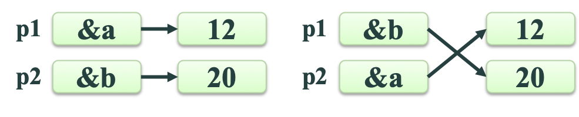

指针是C语言中一个重要的概念，也是C语言的一个重要特色。正确灵活地运用它，可以

1. 有效地表示和构造一些复杂的数据结构
2. 动态分配内存
3. 方便地使用字符串
4. 有效而方便地使用数组
5. 使不同函数之间能共享相同的存储空间
6. 直接访问内存地址 
……

指针对于设计系统软件是十分必要的。正确地应用指针，可以使程序简洁、紧凑、高效。因此，每一个学习和使用C语言的人，都应深入地学习和掌握指针。可以说，不掌握指针就没有掌握C语言的精华。

**对初学者来说，指针这部分内容也相对学习难度较大**

## 一、地址和指针概念

### 存储器地址

为了能访问内存空间，要确定内存最小访问单位的位置，因此要对内存进行编址。内存的最小编址单位是字节。


### 存储单元

对于不同类型的变量，其存储所占的字节数是不同的。

例如：`int a; short b; char c;`

在32位系统中，变量a存储单元占4字节，b占2字节，c占1字节。

同理，float类型变量的存储单元占4个字节，double类型变量的存储单元占8个字节。

### 变量的地址

可以用取地址运算符(&)来获得变量地址。

例如：`int a,b; char c;`

要想得到变量a的地址可以用&a。同样，b的地址是&b，c的地址是&c。

### 指针

指针就是变量的地址。

例如：`int a，b；char c；`
&a、&b、&c都是指针。

## 二、指针变量

指针是一个地址值，它可以被存放在变量中。用来存放指针的变量称为指针变量。

```c
// 定义形式是：
//    基类型 *指针变量名；
// 例如：
char *pc，c；char* p1; char * p2;
int  *pa，*pb，a，b；
float *pf，f；
double *pd，d；
```

指针变量必须指向其定义时指定的基类型的那些变量

```c
// 例如：
float a;
int *pi;
pi=&a; // 是错误的。
```

### 指针变量的值
 
一个变量的地址 -> 一个指针变量，使指针变量指向另一个变量。

不要直接将整型数赋给指针变量(0除外)。

```c
// 例如：
char *pc，c；
int  *pa，*pb，a，b；
float *pf，f；
double *pd，d；
pc=&c;  pa=&a;  pb=&b;
pf=&f;  pd=&d;  // (pc=2000;错误）
pc=0;   pa=pb;
```


### 指针变量获取值的方法

指针变量获取值的方法小结：

1. 0(或NULL)
2. 基类型变量的地址
3. 同类型的另一个指针变量的值

### 指针运算符

\* 指针 表示指针所指的那个变量。

\* 也称为间接访问运算符。

```c
// 使用间接访问运算符之前必须使指针指向一个变量！！！
//例如：
int a = 3，b = 5，*pa，*pb；
pa = &a;
pb = &b;
*pa = *pa + *pb; 

// 例  通过指针变量访问所指变量
int main()
{ int a=100,b=10,*pa,*pb;
  pa=&a;   /*  变量a的地址存放于指针变量pa  */
  pb=&b;   /*  变量b的地址存放于指针变量pb  */
  printf("a=%d,b=%d\n",a,b);
  printf("a=%d,b=%d\n",*pa,*pb);
  // ……
}
```

### 取地址运算符与指针运算符

- &  取地址运算符
- \*  指针运算符

& 和 * 是一对互逆运算符，它们的优先级相同。
      
*(&a)≡a

&(*p)≡p

### *运算符与++运算符

*p++ 与 (*p)++  不同
*p++ 与  *(p++) 相同


### 指针运算

- 指针1 - 指针2 = 指针之间的距离
  - [Addr(指针1)-Addr(指针2)]/sizeof(基类型)
- 指针 + 常数
  - Addr = Addr(指针) + 常数*sizeof(基类型)
- 指针比较大小
  - 判断两个指针的前后位置或判断是否等于0

```c
// 例 按序输出两个数
int main()
{ int *p1,*p2,*p,a,b;
  scanf("%d%d",&a,&b);
  p1=&a;  p2=&b;  
  if (a<b) { p=p1;p1=p2;p2=p); }
  printf("max=%d,min=%d\n",*p1,*p2);
  // ……
}
```



### 指针变量用作函数参数

通过指针变量将一个变量的地址作为实际参数传递给一个函数

```c
// 按序输出两个数
void swap(int* p1,int* p2)
{ int t=*p1; *p1=*p2; *p2=t;}
int main( )
{ int *p1,*p2,a,b;
  scanf("%d%d",&a,&b);
  p1=&a;  p2=&b;  
  if (a<b) swap(p1,p2);
  printf("max=%d,min=%d\n",a,b);……
}
```

### 程序比较

```c
void swap(int* p1,int* p2)
{ int t=*p1; *p1=*p2; *p2=t;}

void swap2(int* p1,int* p2)
{ int* t; *t=*p1; *p1=*p2; *p2=*t;}

void swap3(int* p1,int* p2)
{ int* t; t=p1; p1=p2; p2=t;}

void swap4(int a,int b)
{ int t=a; a=b; b=t;}
```

## 三、数组与指针

### 引用数组元素方法

引用数组元素方法：

1. 下标法（如a[5]）
2. 指针法

通过指向数组元素的指针找到所要访问的元素，如：int *p=a; p+=5; *p=1;

### 指向数组元素的指针

数组元素是变量，所以可用指针指向数组元素。

```c
// 例如： 
int a[5]={1，3，5，7，9}；
int *p；
p=&a[0]；//或 p=a；
for(i=0;i<5;i++)
   printf("%d"，*p++)；
printf（"\n"）；

//例如： 
int a[5]={1，3，5，7，9}；
  
for(i=0;i<5;i++)
   printf("%d"，*a++)；
printf（"\n"）
// a是常量
```


指针也可采用下标表示法。
```c
//例如： 
int a[5]={1，3，5，7，9}；
int *p；
p=&a[0]；//或 p=a；
for(i=0;i<5;i++)
   printf("%d"， p[i])；
printf（"\n"）；
```


### 一维数组的指针

总结：一维数组的指针

```c
int a[5]={1，3，5，7，9}，
*p=a；
```

引用数组元素的方法有：

1. 指针法  *(a+i)、*(p+i)
2. 下标法  a[i]、p[i]


### 用数组名作函数的参数

数组名就是指向数组第1个元素的指针。因此函数形参可定义为指针，而对应实参是数组名。

`void f(int array[])`等同于`void f(int* parray)`

例：将a数组中的n个整数按反向顺序存放。

算法：将a[0]与a[n-1]对换，a[1]与a[n-2] 对换…。设两个位置变量i和j，其中i的初值为0，j的初值为n-1。执行时，将a[i]与a[j] 对换，然后i++，j--，再将a[i]与a[j] 对换，直到i=(n-1)/2为止。

```c
// 例   将a数组中的n个整数按反向顺序存放。
void inv(int *x,int n)  // 与 int x[ ] 相同
{ int *p,t,*i,*j,m=(n-1)/2;  p=x+m;
  for(i=x,j=x+n-1;i<=p;i++,j--)
  { t=*i; *i=*j; *j=t; }
}
int main()
{ int i,a[ ]={3,7,9,111,0,6,7,5,4,2};
  printf("The original array:\n");
  for(i=0;i<10;i++) printf("%d ",a[i]); 
  printf("\n");
  inv(a,10);
  printf("The array has been inverted:\n");
  for(i=0;i<10;i++) printf("%d ",a[i]);
  printf(“\n”);
  // ……
} 
```

作为实参的指针必须已经指向实际存储数据的数组！！

## 四、字符串与指针

## 五、
 
## 六、

## 七、

