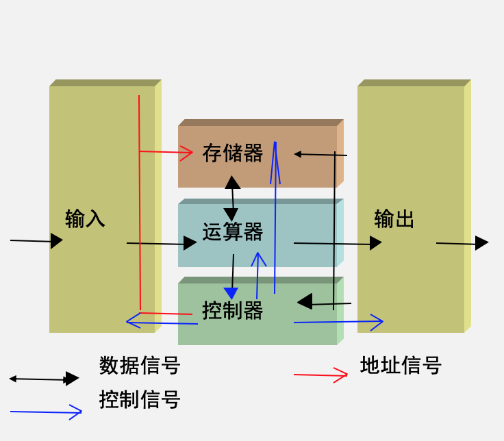

# 计算机的分类

- 电子模拟计算机：“模拟”就是相似的意思。模拟计算机的特点是数值由连续量来表示，运算过程也是连续的。
- 电子数字计算机：他实在算盘的基础上发展起来的，使用数字来表示数量的大小。数学计算机的主要特点是按位运算，并且不连续地跳动计算。目前我们使用的大多是数字计算机。数字计算机根据计算机的效率、速度、价格、运行的经济性和适应性来划分，可以划分为两类：
  - 专用计算机：专用计算机最有效、最紧急和最快速的计算机，但是他的适应性很差。
  - 通用计算机：通用计算机适应性很大，但是牺牲了效率、速度和经济性。

## 通用计算机的分类

通用计算机根据体积、简易性、功率损耗、性能指标、数据存储容量、指令系统规模和机器价格等可以分为：

# 计算机的硬件

## 计算机的基本组成

- 控制器：类比人的大脑的操作控制功能
- 运算器：类比人的大脑的计算功能
- 存储器：类比人的大脑记忆功能
- 输入设备：交互接口，类比笔
- 输出设备：交互接口，类比纸

## 冯诺依曼型计算机

- 存储程序
- 按地址自动执行
- 五大部件：包括控制器、运算器、存储器、输入设备、输出设备
- 以运算器为中心

## 五大部件

### 运算器

- 算术运算和逻辑运算
- 在计算机中参与运算的数是二进制的
- 运算器的长度一般是8、16、32或64位

### 存储器

- 存储数据和程序（指令）
- 容量（存储单元、存储单元地址、容量单位）
- 分类内存（ROM、RAM）、外存
- 存储器单位：
  - $2^10$ byte＝1K
  - $2^10$ K＝1M
  - $2^10$ M＝1G
  - $2^10$ G＝1T

### 控制器

指令和程序：按照一定的顺序一条接着一条取指令、指令译码、执行指令。

### 适配器与I/O设备

- 输入设备：把人们所熟悉的某种信息形式变换为机器内部所能接收和识别的二进制信息形式
- 输出设备：把计算机处理的结果变换为人或其他机器设备所能接收和识别的信息形式
- 适配器：它使得被连接的外围设备通过系统总线与主机进行联系，以便使主机和外围设备并行协调地工作
- 总线：构成计算机系统的骨架，是多个系统部件之间进行数据传送的公共通路。

# 计算机的软件

- 系统软件
  - 各种服务性程序，如诊断程序、排错程序、练习程序等
  - 与原程序，编程程序、编译程序、解释程序等
  - 操作系统
  - 数据库管理软件
- 应用软件：用户利用计算机来解决某些问题而编制的程序，如工程设计程序、数据处理程序、自控控制程序、企业管理程序、情报检索程序、科学计算程序等。

# 五级计算机层次系统

多级计算机系统：计算机不能简单地认为是一种电子设备，而是一个十分复杂的硬、软件结合而成的整体。它通常由五个以上不同的级组成，每一级都能进行程序设计，如图所示

- 微程序设计级
- 一般机器级
- 操作系统级
- 汇编语言级
- 高级语言级

