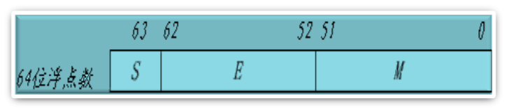

# 数据与文字的表示方法

计算机中使用的数据可分为两大类：

- 符号数据：非数字符号的表示（ASCII、汉字、图形等）
- 数值表示：数字数据的表示方式（定点、浮点）

## 数据格式

计算机常用的数据表示格式有两种：

- 定点表示：小数点位置固定
- 浮点表示：小数点位置不固定

### 定点表示法

- 所有数据的小数点位置固定不变
- 理论上位置可以任意，但实际上将数据表示有两种方法（小数点位置固定-定点表示法/定点格式）：
  - 纯小数
  - 纯整数
- 定点数表示：
  - 带符号数
  - 不带符号数
- 定点纯小数
  - 
  - $x_0 \quad x_1 \quad x_2 \quad  x_3 \dots x_{n-1} \quad  x_n$
  - 示数的范围是$0\leq|ｘ|\leq 1－2^{－n}$
  - (最小数、最大数、最接近0的正数、最接近0的负数）
- 定点纯整数
  - 
  - $x_0 \quad x_1 \quad x_2 \quad x_3 \quad \dot x_{n-1} \quad x_n$
  - 表示数的范围是$0\leq|ｘ|\leq 2^n－1$
  - 最小数、最大数、最接近0的正数、最接近0的负数呢

#### 定点表示法的特点

1. 定点数表示数的范围受字长限制，表示数的范围有限
2. 定点表示的精度有限
3. 机器中，常用定点表示纯整数

### 浮点表示

小数点位置随阶码不同而浮动

1. 格式：$N=R^e.M$
   1. 基数R，取固定的值，比如10，2等
   2. 指数E
   3. 微博数M
2. 机器中表示

|阶符|阶码|数符|尾数|
|---|---|---|---|

### IEEE754标准 

IEEE754标准(规定了浮点数的表示格式,运算规则等)

- 规则规定了单精度(32)和双精度(64)的基本格式. 
- 规则中,尾数用原码,指数用移码(便于对阶和比较)

- 基数R=2，基数固定，采用隐含方式来表示它。
- 32位的浮点数：
  - S数的符号位，1位，在最高位，“0”表示正数，“1”表示负数。
  - M是尾数， 23位，在低位部分，采用纯小数表示
  - E是阶码，8位，采用移码表示。移码比较大小方便。
  - 规格化： 若不对浮点数的表示作出明确规定，同一个浮点数的表示就不是惟一的。
  - 尾数域最左位(最高有效位)总是1， 故这一位经常不予存储，而认为隐藏在小数点的左边。
  - 采用这种方式时，将浮点数的指数真值e变成阶码E时，应将指数e加上一个固定的偏移值127(01111111)，即E=e+127。
- 一个规格化的32位浮点数x的真值表示为
- $x=(-1)^S×(1.M)×2^{E-127}$
- e=E-127

### 例1.若浮点数x的754标准存储格式为$(41360000)_{16}$，求其浮点数的十进制数值。

**解：将16进制数展开后，可得二制数格式为**

1. 0&nbsp;&nbsp;&nbsp;&nbsp;100 00010 $\downharpoonleft\mid$ 011 0110 0000 0000 0000 0000
2. S&nbsp;&nbsp;&nbsp;&nbsp;阶码(8位)&nbsp;&nbsp;&nbsp;&nbsp;&nbsp;尾数(23位)
3. 指数e=阶码-127=10000010-01111111=00000011=$(3)_{10}$
4. 包括隐藏位1的尾数
5. 1.M=1.011 0110 0000 0000 0000 0000=1.011011
6. 于是有$x=(-1)^S×1.M×2^e=+(1.011011)×2^3=+1011.011=(11.375)_{10}$

### 例2.将数$(20.59375)_{10}$转换成754标准的32位浮点数的二进制存储格式。

**解:首先分别将整数和分数部分转换成二进制数：**

1. 20.59375=10100.10011
2. 然后移动小数点，使其在第1，2位之间
3. $10100.10011=1.010010011×2^4$
4. e=4于是得到：
5. S=0, E=4+127=131, M=010010011
6. 最后得到32位浮点数的二进制存储格式为：
7. $01000001101001001100000000000000=(41A4C000)_{16}$

### 数的机器码表示

- 真值:一般书写的数
- 机器码:机器中表示的数, 要解决在计算机内部数的正、负符号和小数点运算问题。

#### 原码表示法

##### 定点小数$x_0.x_1x2\dots x_n$

$$
[x]_原=
\begin{cases}
x \quad 1>x\geq0\\
1-x \quad 0≥x>-1
\end{cases}

符号=
\begin{cases}
0,正\\
1,负
\end{cases}
$$

- 有正0和负0之分
- 范围$2^{-n}-1 \sim 1-2^{-n}$

例：x=+0.11001110 
$[x]_原$=0.11001110 
$[-x]_原$=1.11001110

##### 定点整数X0.X1X2...Xn

$$
[x]_原=
\begin{cases}
x \quad 2^n>x\geq 0 \\
2^n-x 0 \geq x > -2^n
\end{cases}

符号=
\begin{cases}
0,正\\
1,负
\end{cases}
$$

- 说明：有正0和负0之分
- 范围  $1-2^n \sim 2^n–1$

例：x=+11001110 
$[x]_原$=011001110   
$[-x]_原$=111001110

#### 补码表示法

定义：正数的补码就是正数的本身，负数的补码是原负数加上模。

- 计算机运算受字长限制,属于有模运算.
- 定点小数x0.x1x2…..xn溢出量为2，以2为模
- 定点整数x0x1x2…..xn溢出量为2，以$2^{n+1}$为模

##### 定点小数x0.x1x2…xn

$$
[x]_补=
\begin{cases}
x \qquad 1>x \geq 0  \\
2+x \qquad 0\geq x >-1
\end{cases}

符号=
\begin{cases}
0,正\\
1,负
\end{cases}
$$

**例:  x= -0.1011**

- $[x]_补$=10+x=10.0000-0.1011=1.0101
- y=-0.01111
- $[y]_补$=10+y=10.00000-0.01111=1,10001

##### 定点整数x0x1x2…xn

$$
[x]_补=
\begin{cases}
x \qquad 2^n>x\geq 0  \\
2^{n+1}+x \qquad 0\geq x >-2^n 
\end{cases}

符号=
\begin{cases}
0,正\\
1,负
\end{cases}
$$

#### 反码表示法

对尾数求反，它跟补码的区别在于末位少加一个1，所以可以推出反码的定义

定点小数$x0.x1x2\dots xn$

$$
[x]_反=
\begin{cases}
x \qquad\qquad 1>x\geq 0\\     
2+x–2^{-n} \qquad \qquad 0\geq x>-1
\end{cases}
$$

X1=+0.1011011,$[X1]_反$ =0.1011011 
X2= -0.1011011,$[X2]_反$ =1.0100100

#### 移码表示法

移码表示法（用在阶码中） 
定点整数定义$[x]_移=2^n+x \qquad 2n>x\geq-2n$

**例+1011111**

- 原码为01011111
- 补码为01011111    
- 反码为01011111
- 移码为 11011111

#### 总结

正数 原码=补码=反码
负数 源码=真值，补码为源码+1，反码=补码+1

- 补码=反码+1
  - 正数=真值
  - 负数：按位取反，最低位+1
- 反码
  - 正数=真值
  - 负数：最低位按位取反
- 移码:n=二进制长度

#### 字符和字符串(非数值)的表示方法

- 符号数据：字符信息用数据表示，如ASCII等；
- 字符表示方法ASCII:用一个字节来表示,低7位用来编码(128),最高位为校验位

# 定位加法、减法运算

## 补码加减法

- 补码加法，公式：$[x+y]_补=[x]_补+[y]_补$
- 补码减法，公式：$[x-y]_补=[x]_补+[-y]_补$

如：$y=0.0111 \qquad [y]_补=0.0111 \qquad [-y]_补=1.1001$

从右边到左边，除了第一个1和右边的0保持不变以外，其它按位取反,很重要！

### 例:x=-0.1011,y=0.0111

$[x]补=1.0101   [y]补=0.0111$
$[x+y]补=[x]补+[y]补=1.0101+0.0111=1.1100$
x+y=-0.0100

### 例:x=+0.11011,y=-0.11111

$[x]_补=0.11011 [y]_补=1.00001 [-y]_补=0.11111$
$[x-y]_补=[x]_补+[-y]_补=1.11010$

## 溢出的检测

可能产生溢出的情况：

- 两正数加，变负数，上溢（大于机器所能表示的最大数）
- 两负数加，变正数，下溢（小于机器所能表示的最小数）

### 一、检测方法

双符号位法（参与加减运算的数采用变形补码表示）

$$
[x]补=
\begin{cases}
x \qquad 2>x\geq 0\\
4+x \qquad 0\geq x >-2
\end{cases}
$$

|Sf1|SF2||
|---|---|---|
|0|0|正确（正数）|   
|0|1|上溢|
|1|0|下溢|   
|1|1|正确（负数|

Sf1 表示正确的符号，逻辑表达式为$V=Sf1 \bigoplus Sf2$,可以用异或门来实现

### 二、检验举例：

ｘ＝＋0.1100, ｙ＝＋0.1000,求ｘ＋ｙ 

**解:**

- $[ｘ]_补＝00.1100,[ｙ]_补＝00.1000$
- $[ｘ]_补\qquad 00.1100$
- $＋[ｙ]_补\qquad 00.1000$
- $[ｘ＋ｙ]_补 \qquad 01.0100$

两个符号位为“01”，表示运算结果溢出，为正溢出 
最高符号位为0，表示运算结果为正 
$\therefore x+y = + 1.01B$

ｘ＝－0.1100, ｙ＝－0.1000, ｘ＋ｙ

**解:**

- $[ｘ]_补＝11.0100,[ｙ]_补＝11.1000$
- $[ｘ]_补 \qquad 11.0100$
- $＋[ｙ]_补 \qquad 11.1000$
- $[ｘ＋ｙ]_补 \qquad 110.1100$　　

两个符号位为“10”，表示运算结果溢出，为负溢出 
最高符号位为1，表示运算结果为负 
$\therefore  x+y = - 1.01B$

# 浮点运算