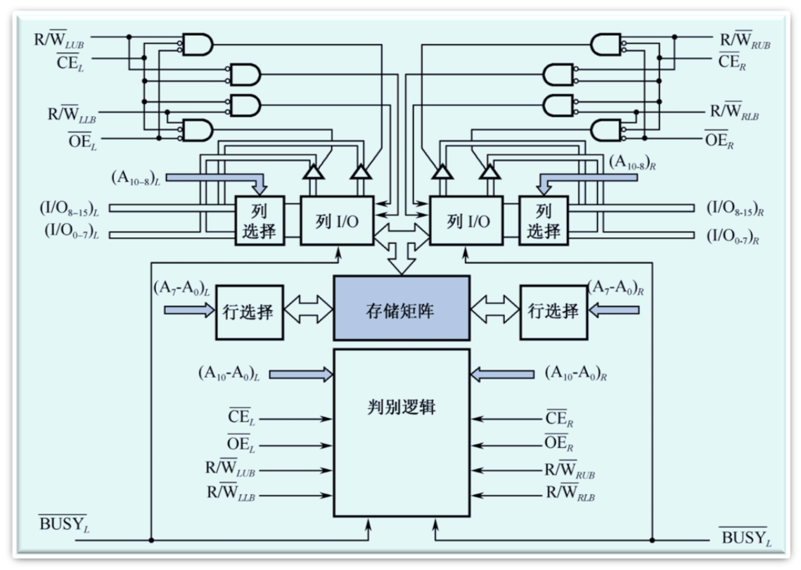
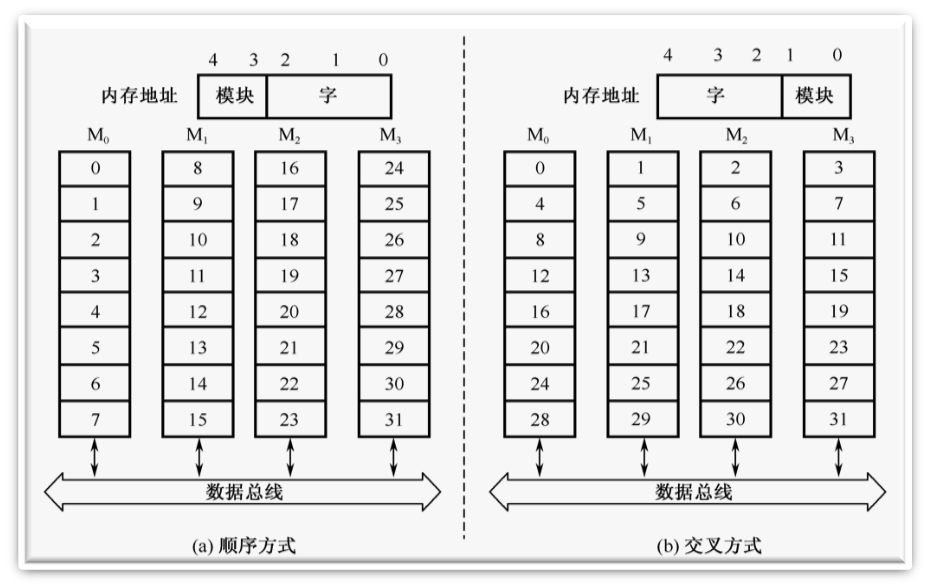
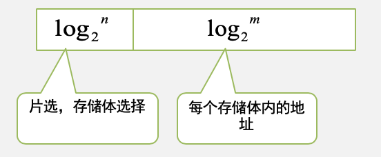
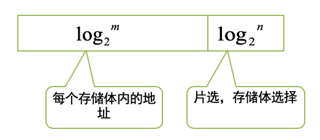

# 存储器概述

## 存储器分类

- 按存储介质分类
  - 磁表面
  - 半导体存储器
- 安存储方式分类
  - 随机
  - 顺序存储（磁带）
- 按读写功能分类
  - ROM
  - RAM
- 按信息的可保存性分类
  - 永久性
  - 非永久性
- 按存储器系统中的作用分类
  - 主存
  - 辅存
  - 缓存

## 存储器的特点

1. 速度快的存储器价格贵，容量小；
2. 价格低的存储器速度慢，容量大

### 存储器分级结构

- 高速缓冲存储器简称cache，它是计算机系统中的一个高速小容量半导体存储器。
- 主存储器简称主存，是计算机系统的主要存储器，用来存放计算机运行期间的大量程序和数据。
- 外存储器简称外存，它是大容量辅助存储器。

## 存储器的技术指标

- 字存储单元：存放一个机器字的存储单元。
- 字节存储单元：存放一个字节的单元。
- 存储容量：指一个存储器中可以容纳的存储单元总数。
- 存取时间：又称存储器访问时间，指一次读操作命令发出到该操作完成，将数据读出到数据总线上所经历的时间。通常取写操作时间等于读操作时间，故称为存储器存取时间。
- 存储周期：指连续启动两次读操作所需间隔的最小时间。通常，存储周期略大于存取时间。
- 存储器带宽：单位时间里存储器所存取的信息量，通常以位/秒或字节/秒做度量单位。

## 主存

主存（内部存储器）是半导体存储器。根据信息存储的机理不同可以分为两类：

- SRAM：静态读写存储器
- DRAM：动态读写存储器

### SRAM存储器

#### 基本的静态存储元阵列

1. 存储位元
2. 三组信号线
   - 地址线
   - 数据线
   - 控制线

#### 逻辑结构与地址译码器

- 基本的SRAM逻辑结构
  - SRAM采用双译码方式，将地址分成x向、y向两部分
- 地址译码器
  - 采用双译码的方式（减少选择线的数目）。
  - A0~A7为行地址译码线，A8~A14为列地址译码线

#### 存储器的读写周期

- 读周期
  - 读出时间$t_{AQ}$
  - 读周期时间$t_{RC}$
- 写周期
  - 写周期时间$t_{WC}$
  - 写时间$t_{WD}$
- 存取周期
  - $读周期时间t_{RC}=写周期时间t_{WC}$

### DRAM存储器

#### DRAM存储位元的记忆原理
 		
SRAM存储器的存储位元是一个触发器，它具有两个稳定的状态。而DRAM存储器的存储位元是由一个MOS晶体管和电容器组成的记忆电路。 

#### 读/写周期

- 读周期、写周期的定义是从行选通信号RAS下降沿开始，到下一个RAS信号的下降沿为止的时间，也就是连续两个读/写周期的时间间隔。
- 通常为控制方便，读周期和写周期时间相等。

#### 刷新周期 

- 必须定期地刷新DRAM ，以保持它们原来记忆的正确信息。
- 刷新操作有两种刷新方式：
  - 集中式刷新:DRAM的所有行在每一个刷新周期中都被集中刷新。
  - 分散式刷新:每一行的刷新插入到正常的读/写周期之中。

#### 存储器容量的扩充 

1. 字长位数扩展
   - 给定的芯片字长位数较短，不满足设计要求的存储器字长，此时需要用多片给定芯片扩展字长位数。
   - 三组信号线中，地址线和控制线公用而数据线单独分开连接。
   - 所需芯片数量=设计要求的存储器容量/选择芯片存储器容量
2. 字存储容量扩展 
   - 给定的芯片存储容量较小（字数少），不满足设计要求的总存储容量，此时需要用多片给定芯片来扩展字数。
   - 三组信号组中给定芯片的地址总线和数据总线公用，控制总线中R/W公用，使能端EN不能公用，它由地址总线的高位段译码来决定片选信号。
   - 所需芯片数=设计要求的存储器容量/选择芯片存储器容量

### SRAM和DRAM对比

--- 
|名称|存储单元|存储方式|存储密度|速度|安全性|价格|
|---|---|---|---|---|---|---|
|SRAM（机械硬盘）|6个晶体管|触发器（01两种状态）|小|快|高|贵|
|DRAM（SSD）|4个晶体管|电容效应（充放电效应）|大|慢|低（电容放电，注意刷新）|便宜|

# 只读存储器和闪存存储器

## 只读存储器

ROM叫做只读存储器。顾名思义，只读的意思是在它工作时只能读出，不能写入。然而其中存储的原始数据，必须在它工作以前写入。只读存储器由于工作可靠，保密性强，在计算机系统中得到广泛的应用。主要有两类：

- 掩模ROM：掩模ROM实际上是一个存储内容固定的ROM，由生产厂家提供产品。 
- 可编程ROM：用户后写入内容，有些可以多次写入。
  - 一次性编程的PROM
  - 多次编程的EPROM和$E^2$PROM。

ps:E表示可擦除,一开始的EPROM需要专业设备擦除，后来发展为可点擦除，EPROM代表擦除的PROM

### 闪速存储器

FLASH存储器也翻译成闪速存储器，它是高密度非失易失性的读/写存储器。高密度意味着它具有巨大比特数目的存储容量。非易失性意味着存放的数据在没有电源的情况下可以长期保存。总之，它既有RAM的优点，又有ROM的优点，称得上是存储技术划时代的进展。 

# 并行存储器

由于CPU和主存储器之间在速度上是不匹配的，这种情况便成为限制高速计算机设计的主要问题。为了提高CPU和主存之间的数据传输率，除了主存采用更高速的技术来缩短读出时间外，还可以采用并行技术的存储器 

## 双端口存储器

双端口存储器由于同一个存储器具有两组相互独立的读写控制电路而得名。由于进行并行的独立操作，因而是一种高速工作的存储器，在科研和工程中非常有用。

## 多模块交叉存储器

一个由若干个模块组成的主存储器是现行编址的

- 地址在模块中如何安排
  - 顺序方式
  - 较差方式

## 存储方式

### 顺序方式

假设有n个存储体，每个存储体的容量为m个存储单元

- M0－M3共四个模块，每个模块8个字
  - M0：0—7
  - M1：8－15
  - M2：16－23
  - M3：24－31
- 5位地址组织如下： X X    X X X
- 高位选模块，低位选块内地址
- 某个模块进行存取时，其他模块不工作，优点是某一模块出现故障时，其他模块可以照常工作，通过增添模块来扩充存储器容量比较方便。缺点是各模块串行工作，存储器的带宽受到了限制。

### 交叉方式

可以实现多模块流水式并行存取

- M0－M3共四个模块，每个模块8个字
  - M0：0，4,...除以4余数为0
  - M1：1，5,...除以4余数为1
  - M2：2，6,...除以4余数为2
  - M3：3，7,...除以4余数为3
- 5位地址组织如下： X X X    X X
- 高位选块内地址，低位选模块
- 特点：连续地址分布在相邻的不同模块内，同一个模块内的地址都是不连续的。优点是对连续字的成块传送可实现多模块流水式并行存取，大大提高存储器的带宽。使用场合为成批数据读取。

# Cache存储器