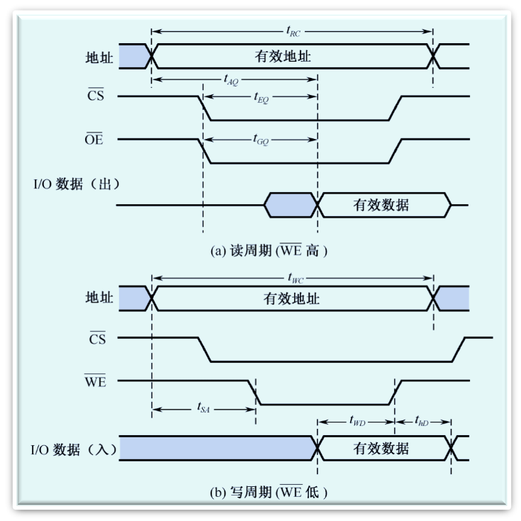

# 存储器概述

## 存储器分类

- 按存储介质分类
  - 磁表面
  - 半导体存储器
- 安存储方式分类
  - 随机
  - 顺序存储（磁带）
- 按读写功能分类
  - ROM
  - RAM
- 按信息的可保存性分类
  - 永久性
  - 非永久性
- 按存储器系统中的作用分类
  - 主存
  - 辅存
  - 缓存

## 存储器的特点

1. 速度快的存储器价格贵，容量小；
2. 价格低的存储器速度慢，容量大

### 存储器分级结构

- 高速缓冲存储器简称cache，它是计算机系统中的一个高速小容量半导体存储器。
- 主存储器简称主存，是计算机系统的主要存储器，用来存放计算机运行期间的大量程序和数据。
- 外存储器简称外存，它是大容量辅助存储器。

## 存储器的技术指标

- 字存储单元：存放一个机器字的存储单元。
- 字节存储单元：存放一个字节的单元。
- 存储容量：指一个存储器中可以容纳的存储单元总数。
- 存取时间：又称存储器访问时间，指一次读操作命令发出到该操作完成，将数据读出到数据总线上所经历的时间。通常取写操作时间等于读操作时间，故称为存储器存取时间。
- 存储周期：指连续启动两次读操作所需间隔的最小时间。通常，存储周期略大于存取时间。
- 存储器带宽：单位时间里存储器所存取的信息量，通常以位/秒或字节/秒做度量单位。

## 主存

主存（内部存储器）是半导体存储器。根据信息存储的机理不同可以分为两类：

- SRAM：静态读写存储器
- DRAM：动态读写存储器

### SRAM存储器

#### 基本的静态存储元阵列

1. 存储位元
2. 三组信号线
   - 地址线
   - 数据线
   - 控制线

#### 逻辑结构与地址译码器

- 基本的SRAM逻辑结构
  - SRAM采用双译码方式，将地址分成x向、y向两部分
- 地址译码器
  - 采用双译码的方式（减少选择线的数目）。
  - A0~A7为行地址译码线，A8~A14为列地址译码线

#### 存储器的读写周期

- 读周期
  - 读出时间$t_{AQ}$
  - 读周期时间$t_{RC}$
- 写周期
  - 写周期时间$t_{WC}$
  - 写时间$t_{WD}$
- 存取周期
  - $读周期时间t_{RC}=写周期时间t_{WC}$

### DRAM存储器

# 只读存储器和闪存存储器

# 并行存储器

# Cache存储器