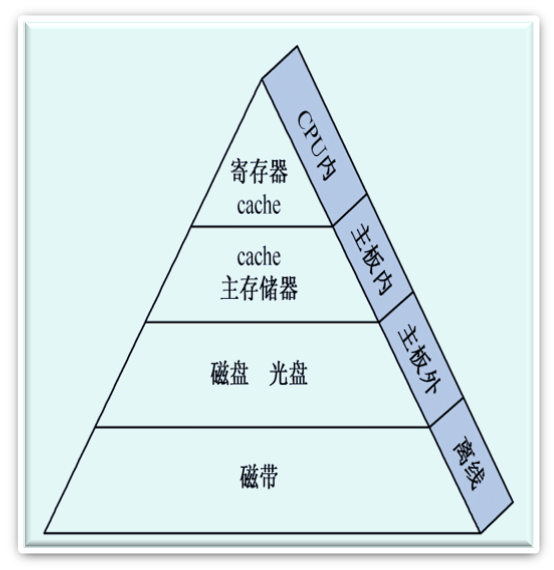
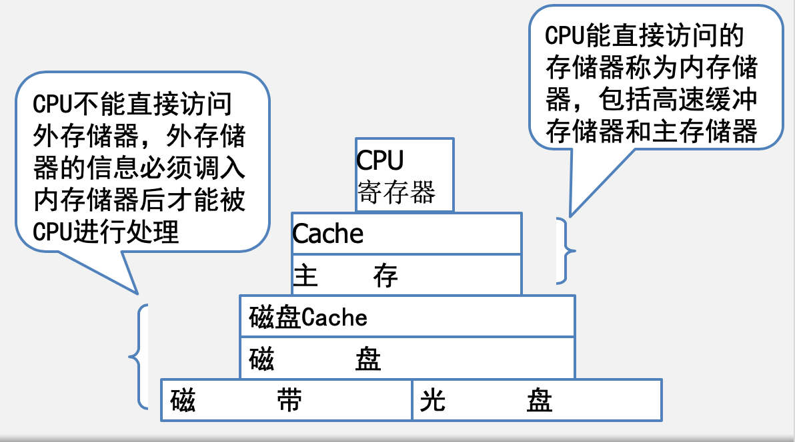
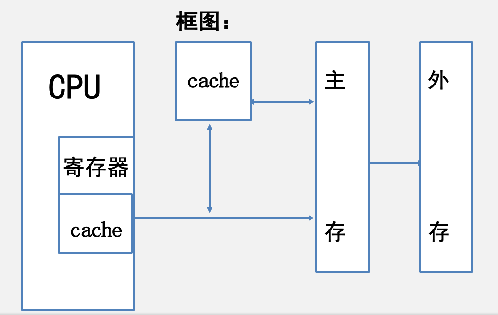
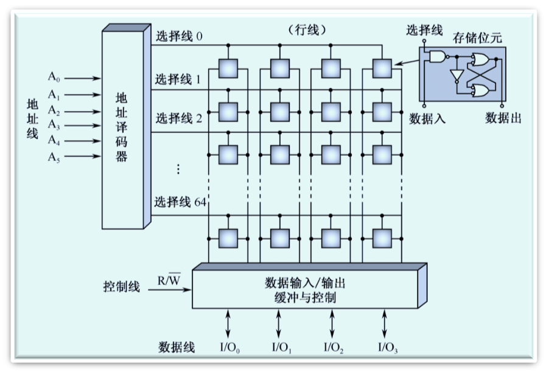
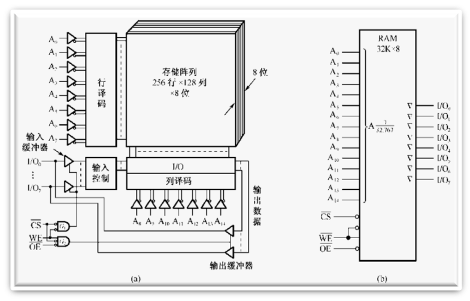
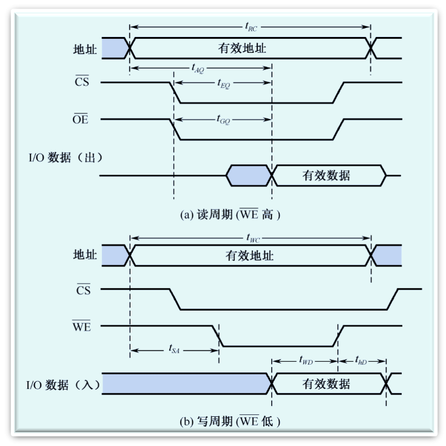
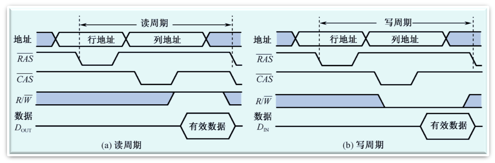

# 存储器概述

## 存储器分类

- 按存储介质分类
  - 磁表面
  - 半导体存储器
- 安存储方式分类
  - 随机
  - 顺序存储（磁带）
- 按读写功能分类
  - ROM
  - RAM
- 按信息的可保存性分类
  - 永久性
  - 非永久性
- 按存储器系统中的作用分类
  - 主存
  - 辅存
  - 缓存

## 存储器的特点

1. 速度快的存储器价格贵，容量小；
2. 价格低的存储器速度慢，容量大

### 存储器分级结构

- 高速缓冲存储器简称cache，它是计算机系统中的一个高速小容量半导体存储器。
- 主存储器简称主存，是计算机系统的主要存储器，用来存放计算机运行期间的大量程序和数据。
- 外存储器简称外存，它是大容量辅助存储器。

## 存储器的技术指标

- 字存储单元：存放一个机器字的存储单元。
- 字节存储单元：存放一个字节的单元。
- 存储容量：指一个存储器中可以容纳的存储单元总数。
- 存取时间：又称存储器访问时间，指一次读操作命令发出到该操作完成，将数据读出到数据总线上所经历的时间。通常取写操作时间等于读操作时间，故称为存储器存取时间。
- 存储周期：指连续启动两次读操作所需间隔的最小时间。通常，存储周期略大于存取时间。
- 存储器带宽：单位时间里存储器所存取的信息量，通常以位/秒或字节/秒做度量单位。

## 主存

主存（内部存储器）是半导体存储器。根据信息存储的机理不同可以分为两类：

- SRAM：静态读写存储器
- DRAM：动态读写存储器

### SRAM存储器

#### 基本的静态存储元阵列

1. 存储位元
2. 三组信号线
   - 地址线
   - 数据线
   - 控制线

#### 逻辑结构与地址译码器

- 基本的SRAM逻辑结构
  - SRAM采用双译码方式，将地址分成x向、y向两部分
- 地址译码器
  - 采用双译码的方式（减少选择线的数目）。
  - A0~A7为行地址译码线，A8~A14为列地址译码线

#### 存储器的读写周期

- 读周期
  - 读出时间$t_{AQ}$
  - 读周期时间$t_{RC}$
- 写周期
  - 写周期时间$t_{WC}$
  - 写时间$t_{WD}$
- 存取周期
  - $读周期时间t_{RC}=写周期时间t_{WC}$

### DRAM存储器

#### DRAM存储位元的记忆原理
 		
SRAM存储器的存储位元是一个触发器，它具有两个稳定的状态。而DRAM存储器的存储位元是由一个MOS晶体管和电容器组成的记忆电路。 

#### 读/写周期

- 读周期、写周期的定义是从行选通信号RAS下降沿开始，到下一个RAS信号的下降沿为止的时间，也就是连续两个读/写周期的时间间隔。
- 通常为控制方便，读周期和写周期时间相等。

#### 刷新周期 

- 必须定期地刷新DRAM ，以保持它们原来记忆的正确信息。
- 刷新操作有两种刷新方式：
  - 集中式刷新:DRAM的所有行在每一个刷新周期中都被集中刷新。
  - 分散式刷新:每一行的刷新插入到正常的读/写周期之中。

#### 存储器容量的扩充 

1. 字长位数扩展
   - 给定的芯片字长位数较短，不满足设计要求的存储器字长，此时需要用多片给定芯片扩展字长位数。
   - 三组信号线中，地址线和控制线公用而数据线单独分开连接。
   - 所需芯片数量=设计要求的存储器容量/选择芯片存储器容量
2. 字存储容量扩展 
   - 给定的芯片存储容量较小（字数少），不满足设计要求的总存储容量，此时需要用多片给定芯片来扩展字数。
   - 三组信号组中给定芯片的地址总线和数据总线公用，控制总线中R/W公用，使能端EN不能公用，它由地址总线的高位段译码来决定片选信号。
   - 所需芯片数=设计要求的存储器容量/选择芯片存储器容量

### SRAM和DRAM对比

--- 
|名称|存储单元|存储方式|存储密度|速度|安全性|价格|
|---|---|---|---|---|---|---|
|SRAM（机械硬盘）|6个晶体管|触发器（01两种状态）|小|快|高|贵|
|DRAM（SSD）|4个晶体管|电容效应（充放电效应）|大|慢|低（电容放电，注意刷新）|便宜|

# 只读存储器和闪存存储器

# 并行存储器

# Cache存储器