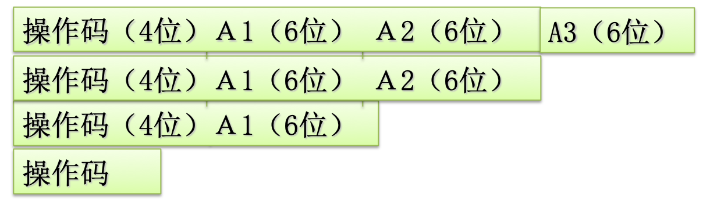
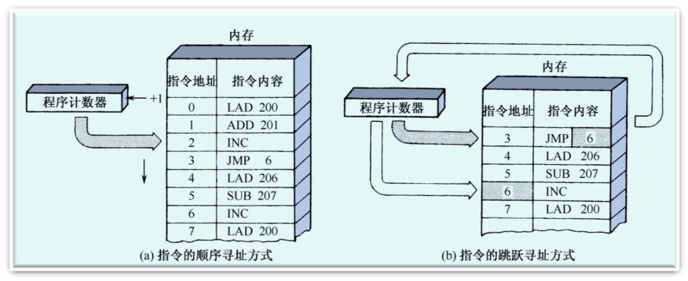
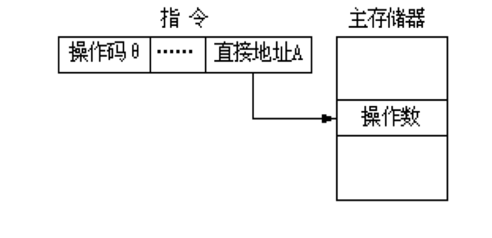
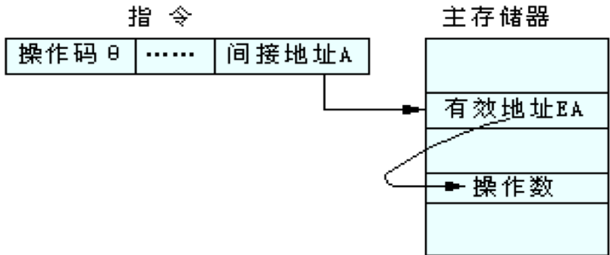
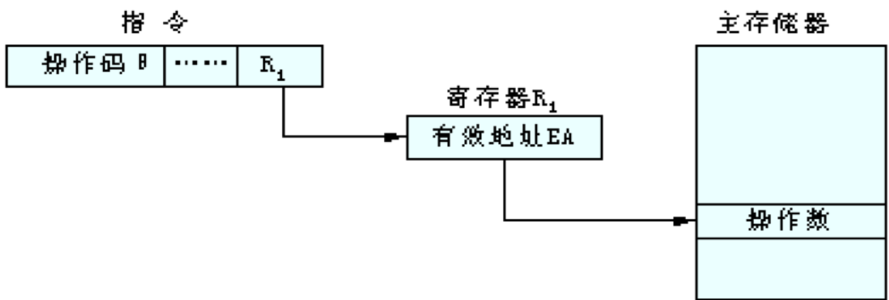
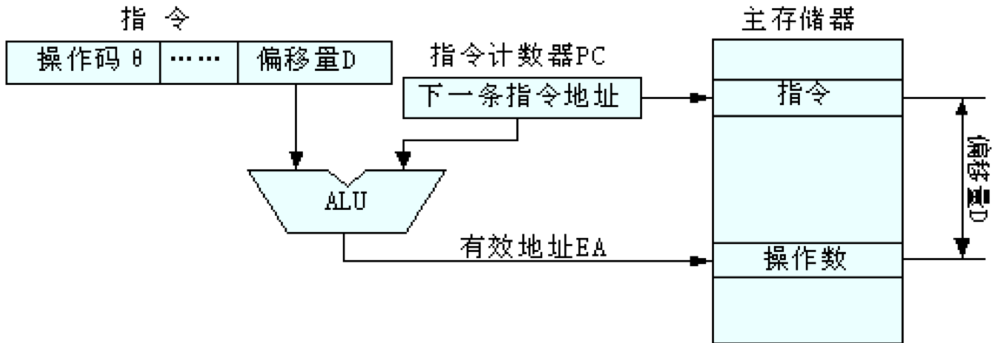
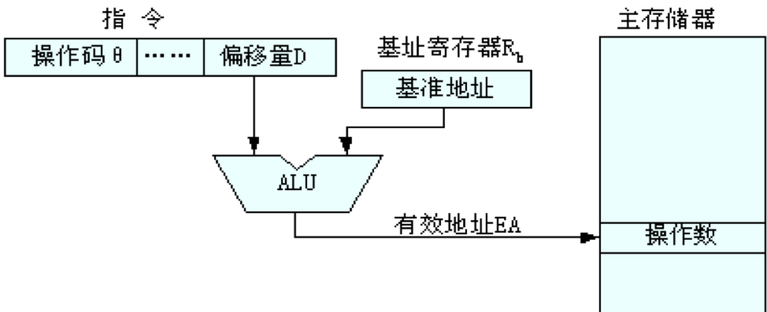
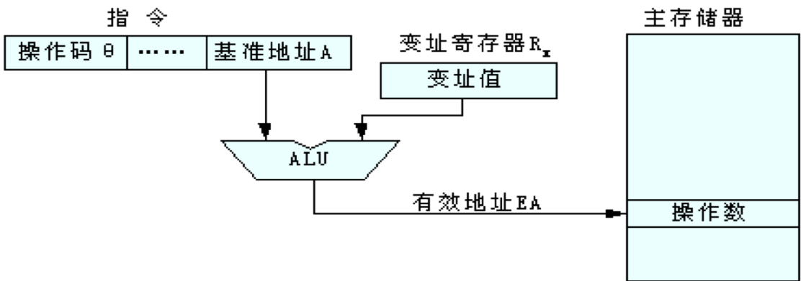

# 指令系统的发展与性能要求

## 指令在计算机系统中的地位

软件和硬件分界面的一个主要标志

- 硬件设计人员采用各种手段实现它
- 软件设计人员则利用它编制各种各样的系统软件和硬件应用
**硬件设计人员和软件设计人员之间的分界面，也是他们之间沟通的桥梁**

### 指令系统的基本概念

- 指令：就是要计算机执行某种操作的命令。
  - 计算机的指令有微指令、机器指令和宏指令之分。
- 微指令是微程序级的命令，它属于硬件；
- 宏指令：由若干条机器指令组成的软件指令，它属于软件；
- 机器指令：介于微指令与宏指令之间，通常简称为指令，每一条指令可完成一个独立的算术运算或逻辑运算操作。
- 一台计算机中所有机器指令的集合，称为这台计算机的指令系统。

# 指令格式

- 指令能反映以下信息
  - 做什么操作
  - 如果需要操作数，从哪里取
  - 结果送哪里
  - 下一条指令从哪里取
- 指令格式包括两个方面：
  
  |操作码字段|地址码字段|
  |---|---|

- 根据一条指令中的操作数地址，可将该指令分类。
- 三地址指令
- 二地址指令
- 单地址指令
- 零地址指令

# 指令和数据的寻址方式

- 研究问题
  - 确定本条指令中各操作数的地址
  - 下一条指令的地址
- 寻址方式是指CPU根据指令中给出的地址码字段寻找相应的操作数的方式，它与计算机硬件结构紧密相关，而且对指令的格式和功能有很大的影响。
- 指令的寻址方式
  - 顺序方式
  - PC跳跃方式

## 操作数的寻址方式

1. 操作数包含在指令中
2. 操作数包含在CPU的某一个内部寄存器中
3. 操作数包含在主存储器中
4. 操作数包含在I/O设备的端口中

## 指令寻址

- 指令中隐含着操作数的地址
- 如某些运算，隐含了累加器AC作为源和目的寄存器，如8086汇编中的STC指令，设置标志寄存器的C为1  

### 立即寻址

- 立即寻址是一种特殊的寻址方式，指令中在操作码字段后面的部分不是通常意义上的操作数地址，而是操作数本身，也就是说数据就包含在指令中，只要取出指令，就取出了可以立即使用的操作数，因此，这样的操作数被称为立即数。
- 指令格式：操作码  操作数

### 直接寻址

指令中地址码字段给出的地址A就是操作数的有效地址EA(Effective Address)，即EA＝A。

### 间接寻址

间接寻址意味着指令的地址码部分给出的地址A不是操作数的地址，而是存放操作数地址的主存单元的地址，简称操作数地址的地址。操作数的有效地址的计算公式为：EA＝(A)

### 寄存器寻址

在指令的地址码部分给出CPU内某一通用寄存器的编号，指令的操作数存放在相应的寄存器中，即EA=Ri

### 寄存器间接寻址

为了克服间接寻址中多次访存的缺点，可采用寄存器间接寻址，即将操作数放在主存储器中，而操作数的地址放在某一通用寄存器中，然后在指令的地址码部分给出该通用寄存器的编号，这时有EA=(Ri)

### 相对寻址

由程序计数器PC提供基准地址，而指令的地址码部分给出相对的位移量D，两者相加后作为操作数的有效地址，即：EA＝(PC)＋D。

### 基址寻址

在基址寻址方式中，指令的地址码部分给出偏移量D，而基准地址放在基址寄存器Rb中，最后操作数的有效地址仍然是由基准地址A与偏移量D相加而成，即：EA＝(Rb)＋D。用哪一个寄存器作为基址寄存器也必须在硬件设计时就事先规定，基址寄存器Rb中的内容称为基准地址，该值可正可负。

### 变址寻址

变址寻址就是将指令的地址码部分给出的基准地址A与CPU内某特定的变址寄存器Rx中的内容相加，以形成操作数的有效地址，即：EA＝A＋(Rx)。用哪一个寄存器作为变址寄存器必须在硬件设计时就事先规定，变址寄存器Rx中的内容称为变址值，该值可正可负。

