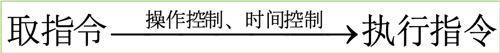

# CPU的功能和组成

## CPU的功能

- 指令控制（程序的顺序控制）
- 操作控制（一条指令有若干操作信号实现）
- 时间控制（指令各个操作实施时间的定时）
- 数据加工（算术运算和逻辑运算）

## CPU的基本组成

- 控制器组成：程序计数器、指令寄存器、数据缓冲器、地址寄存器、通用寄存器、状态寄存器、时序发生器、指令译码器、总线（数据通路）
  - 程序计数器PC
    - 用来存放正在执行的指令的地址或将要执行的下一条指令的地址。
    - 顺序执行时，每执行一条指令，PC的值应加1
    - 要改变程序执行顺序的情况时，一般由转移类指令将转移目标地址送往PC ，可实现程序的转移。
  - 指令寄存器IR   
    - 指令寄存器用来存放从存储器中取出的待执行的指令。
    - 在执行该指令的过程中，指令寄存器的内容不允许发生变化，以保证实现指令的全部功能。
  - 指令译码器ID
    - 暂存在指令寄存器中的指令只有在其操作码部分经译码后才能识别出是一条什么样的指令。
    - 译码器经过对指令进行分析和解释，产生相应的控制信号提供给时序控制信号形成部件。
  - 时序控制信号形成部件   
  - 时序控制信号形成部件又称微操作信号发生器，真正控制各部件工作的微操作信号是由指令部件提供的操作信号、时序部件提供的时序信号、被控制功能部件所反馈的状态及条件综合形成的。
- 地址形成部件   
  - 根据指令的不同寻址方式，用来形成操作数的有效地址
  - 功能就是指令流出的控制，实质上就是对取指令的控制。
- 指令分析与执行的控制
  - 对指令流中的每条指令进行分析解释，根据指令的操作性质和寻址方式形成操作数的地址，然后根据该操作数的地址找到相应的存储单元，并从中取出指令执行过程中要用到的操作数，最后还要形成相应的操作控制信号序列，通过运算器、存储器及输入／输出设备的动作，来实现这条指令的功能。

# 指令周期

# 时序产生器

# 微程序控制器机器设计

# 硬布线控制器机器设计

# 流水CPU