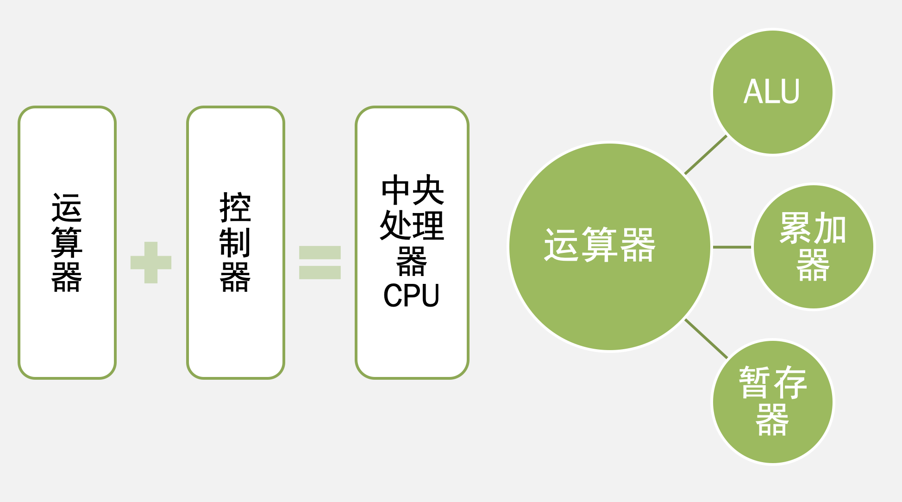

# CPU的功能和组成

## CPU的功能

- 指令控制（程序的顺序控制）
- 操作控制（一条指令有若干操作信号实现）
- 时间控制（指令各个操作实施时间的定时）
- 数据加工（算术运算和逻辑运算）

## CPU的基本组成

- 控制器组成：程序计数器、指令寄存器、数据缓冲器、地址寄存器、通用寄存器、状态寄存器、时序发生器、指令译码器、总线（数据通路）
  - 程序计数器PC
    - 用来存放正在执行的指令的地址或将要执行的下一条指令的地址。
    - 顺序执行时，每执行一条指令，PC的值应加1
    - 要改变程序执行顺序的情况时，一般由转移类指令将转移目标地址送往PC ，可实现程序的转移。
  - 指令寄存器IR   
    - 指令寄存器用来存放从存储器中取出的待执行的指令。
    - 在执行该指令的过程中，指令寄存器的内容不允许发生变化，以保证实现指令的全部功能。
  - 指令译码器ID
    - 暂存在指令寄存器中的指令只有在其操作码部分经译码后才能识别出是一条什么样的指令。
    - 译码器经过对指令进行分析和解释，产生相应的控制信号提供给时序控制信号形成部件。
  - 时序控制信号形成部件   
  - 时序控制信号形成部件又称微操作信号发生器，真正控制各部件工作的微操作信号是由指令部件提供的操作信号、时序部件提供的时序信号、被控制功能部件所反馈的状态及条件综合形成的。
- 地址形成部件   
  - 根据指令的不同寻址方式，用来形成操作数的有效地址
  - 功能就是指令流出的控制，实质上就是对取指令的控制。
- 指令分析与执行的控制
  - 对指令流中的每条指令进行分析解释，根据指令的操作性质和寻址方式形成操作数的地址，然后根据该操作数的地址找到相应的存储单元，并从中取出指令执行过程中要用到的操作数，最后还要形成相应的操作控制信号序列，通过运算器、存储器及输入／输出设备的动作，来实现这条指令的功能。

# 指令周期

- 指令周期：指取指令、分析指令到执行完该指令所需的全部时间。
- 机器周期或者CPU周期
  - 通常把一条指令周期划分为若干个机器周期，每个机器周期完成一个基本操作。
  - 主存的工作周期(存取周期)为基础来规定CPU周期，比如，可以用CPU读取一个指令字的最短时间来规定CPU周期
  - 一个CPU周期中，包含若干个节拍脉冲或T脉冲。
- 时钟周期
  - 把一个机器周期分为若干个相等的时间段，每一个时间段称为一个节拍（时钟周期）。
  - 是CPU处理操作的最基本单位

# 时序产生器

## 时序产生器的作用和体制

### 作用

- CPU中的控制器用它指挥机器的工作
- CPU可以用时序信号/周期信息来辨认从内存中取出的是指令（取指）还是数据（执行）
- 一个CPU周期中时钟脉冲对CPU的动作有严格的约束
- 操作控制器发出的各种信号是时间（时序信号）和空间（部件操作信号）的函数。

### 体制

组成计算机硬件的器件特性决定了时序信号的基本体制是电位—脉冲制

## 时序信号产生器

### 构成

- 时钟源
- 环形脉冲发生器
- 节拍脉冲和读写时序译码逻辑
- 启停控制逻辑

## 控制方式

- 机器指令所包含的CPU周期数反映了指令的复杂程度，不同CPU周期的操作信号的数目和出现的先后次序也不相同。
- 控制方式为控制不同操作序列时序信号的方法
  - 同步控制方式
  - 异步控制方式
  - 联合控制方式

# 程序控制器

基本思想：仿照解题的方法，把操作控制信号编制成微指令，存放到控制存储器里，运行时，从控存中取出微指令，产生指令运行所需的操作控制信号。从上述可以看出，微程序设计技术是用软件方法来设计硬件的技术。

## 微程序控制原理

### 微命令

控制部件向执行部件发出的各种控制命令叫作微命令，它是构成控制序列的最小单位。

- 例如：打开或关闭某个控制门的电位信号、某个寄存器的打入脉冲等。
- 微命令是控制计算机各部件完成某个基本微操作的命令。

### 微操作

是微命令的操作过程。

- 微命令和微操作是一一对应的。
- 微命令是微操作的控制信号，微操作是微命令的操作过程。
- 微操作是执行部件中最基本的操作。

### 微指令

把在同一CPU周期内并行执行的微操作控制信息存储在控制存储器里，称为一条微指令。

- 它是微命令的组合，微指令存储在控制存储器中
- 一条微指令通常至少包含两大部分信息：
  - 微操作码字段，用以产生某一步操作所需的各个微操作控制信号。
  - 微地址码字段用以控制产生下一条要执行的微指令地址。
 
### 微程序

一系列微指令的有序集合就是微程序，一段微程序对应一条机器指令。

#### 微程序控制原理

1. 从CM中取出第一条微指令：（通常存放在0号单元）根据微命令字段产生的操作控制信号，完成从主存中读取机器指令送IR的操作
2. 对机器指令的OP译码，并通过地址转移逻辑产生相应的微程序入口地址
3. 逐行取出对应的微指令，由微指令提供的微命令序列控制有关操作
4. 微程序执行完毕，返回0号单元，继续取下条机器指令

# 硬布线控制器机器设计

## 实现方法

通过逻辑电路直接连线而产生的，又称为组合逻辑控制方式

## 设计目标

- 使用最少元件（复杂的树形网络）
- 速度最高

# 流水CPU

## 流水CPU的结构

## 流水线中的主要问题