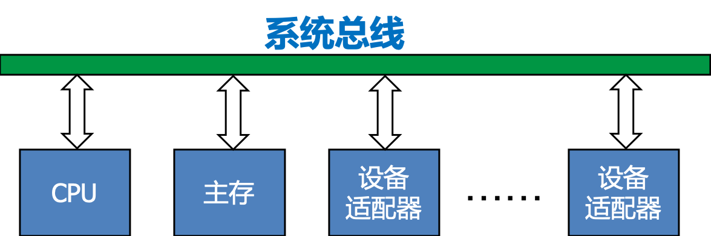
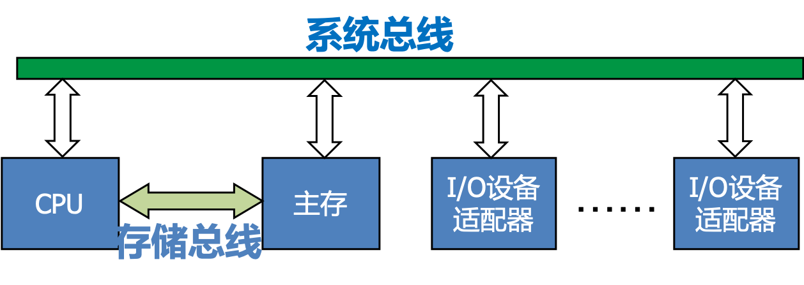
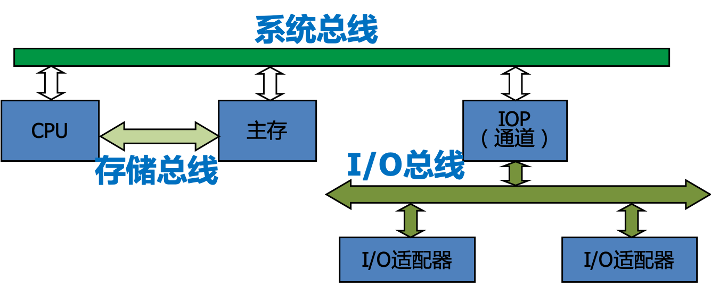
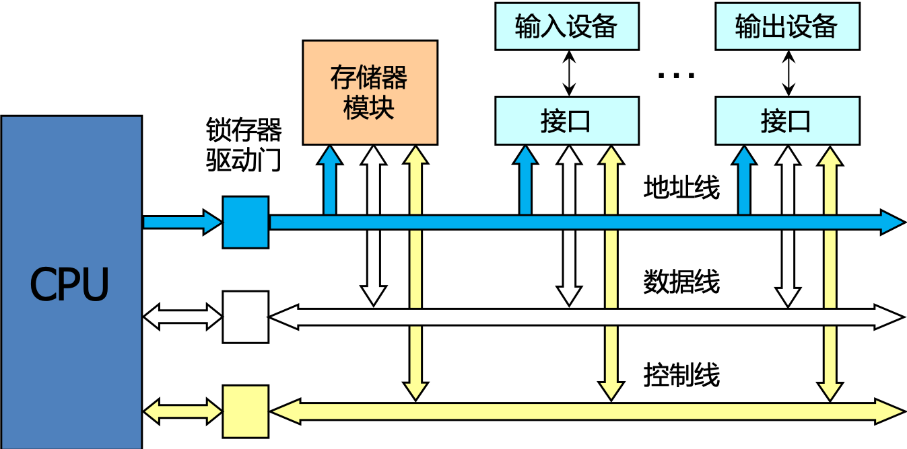
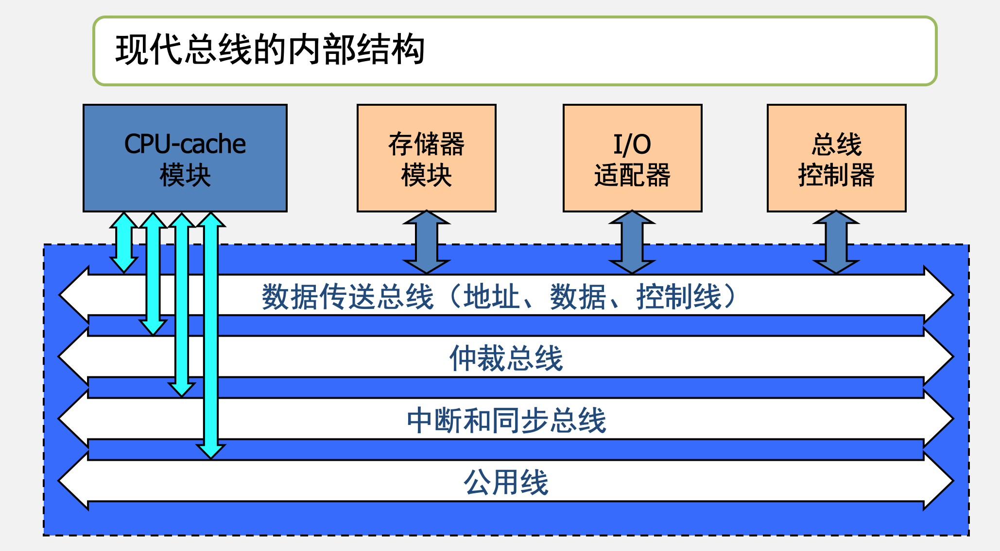
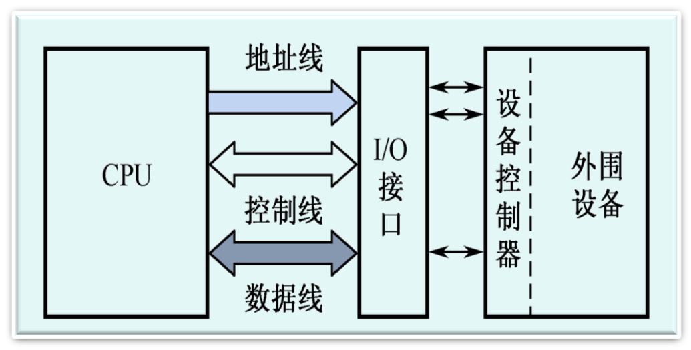

# 总线的概念和结构形态

## 总线的基本概念

- 数字计算机是由若干系统功能部件构成的，这些系统功能部件在一起工作才能形成一个完整的计算机系统。
- 总线定义：计算机的若干功能部件之间不可能采用全互联形式，因此就需要有公共的信息通道，即总线。 
- 总线是构成计算机系统的互联机构，是多个系统功能部件之间进行数据传送的公共通路。借助于总线连接，计算机在各系统功能部件之间实现地址、数据和控制信息的交换，并在争用资源的基础上进行工作。 

### 总线的分类

- 内部总线：CPU内部连接各寄存器及运算器部件的总线。 
- 系统总线：外部总线。CPU和计算机系统中其他高速功能部件相互连接的总线。 
- I/O总线：中低速I/O设备相互连接的总线。 

### 总线带宽

总线本身所能达到的最高传输速率。

**例:**

1. 某总线在一个总线周期中并行传送4个字节的数据，假设一个总线周期等于一个总线时钟周期，总线时钟频率为33MHz，总线带宽是多少?
2. 如果一个总线周期中并行传送64位数据，总线时钟频率升为66MHz，总线带宽是多少?

**解：**	

1. 带宽=4B×33×106/s=132MB/s
2. 64位=8B,带宽=8B×66×106/s=528MB/s

## 总线的连接方式

适配器（接口）：实现高速CPU与低速外设之间工作速度上的匹配和同步，并完成计算机和外设之间的所有数据传送和控制。 

单机系统中总线结构的三种基本类型

### 单总线结构

使用一条单一的系统总线来连接CPU、内存和I/O设备。 

#### 单总线结构特点

在单总线结构中，要求连接到总线上的逻辑部件必须高速运行，以便在某些设备需要使用总线时，能迅速获得总线控制权；而当不再使用总线时，能迅速放弃总线控制权。否则，由于一条总线由多种功能部件共用，可能导致很大的时间延迟。

### 双总线结构

- 单总线使信息传送的吞吐量受到限制，所以在CPU和主存之间又增设了一条高速的存储总线，以减轻系统总线的负担
- 优点：既保持了单总线系统简单、易于扩充的优点，又使CPU与主存能高速交换数据<
- 缺点：增加了硬件代价

**CPU←→主存操作 以及 主存←→I/O操作可同时进行**

### 三总线接口

- 在双总线系统的基础上增加了I/O总线
- 优点：各种不同性能的部件通过各自的总线传输信息，效率高
- 缺点：增加了硬件代价
- 通道实际上是一台具有特殊功能的处理器，又称为IOP(I/O处理器)，它分担了一部分CPU的功能，以实现对外设的统一管理及外设与主存之间的数据传送。显然，由于增加了IOP，使整个系统的效率大大提高

### 早期总线结构

1. 总线是处理器芯片引脚的延伸，是处理器与I/O设备适配器的通道
2. 这种简单的总线一般由50—100条线组成，这些线按其功能可分为三个子类：地址线、数据线和控制线

### 不足之处

1. CPU是总线上的唯一主控者，即使后来增加了DMA控制器，也不能满足多CPU环境的要求
2. 总线信号是CPU引脚信号的延伸，故总线结构与CPU紧密相关，通用性较差，升级困难

### 现代总线的内部结构

- CPU和它私有的cache一起作为一个模块与总线相连，系统中允许有多个这样的处理器模块
- 总线控制器对主设备的总线请求完成协调与仲裁
- 数据传送总线： 由地址线、数据线、控制线组成
- 仲裁总线： 包括总线请求线和总线授权线
- 中断和同步总线：用于处理带优先级的中断操作，包括中断请求线和中断认可线
- 公用线： 包括时钟信号线、电源线、地线、系统复位线以及加电或断电的时序信号线等

# 总线接口

接口是CPU和主存、外设之间通过总线进行连接的逻辑部件。

# 总线的仲裁

- 连接到总线上的功能模块有主动和被动两种形态，其中主方可以启动一个总线周期，而从方只能响应主方请求。每次总线操作，只能有一个主方，但是可以有多个从方。
- 为了解决多个功能模块争用总线的问题，必须设置总线仲裁部件。
- 按照总线仲裁电路的位置不同，仲裁方式分为集中式和分布式两种。

## 集中式仲裁有

1. 链式查询方式：离中央仲裁器最近的设备具有最高优先权，离总线控制器越远，优先权越低。
2. 计数器定时查询方式：总线上的任一设备要求使用总线时，发出总线请求。中央仲裁器接到请求信号以后让计数器开始计数，计数值通过一组地址线发向各设备。每个设备接口都有一个设备地址判别电路，当地址线上的计数值与请求总线的设备地址相一致时，该设备 获得了总线使用权，此时中止计数查询。
3. 独立请求方式：每一个共享总线的设备均有一对总线请求线和总线授权线。当设备要求使用总线时，便发出该设备的请求信号。总线仲裁器中根据一定的优先次序决定首先响应哪个设备的请求，给设备以授权信号。

## 分布式仲裁

不需要中央仲裁器，而是多个仲裁器竞争使用总线。当它们有总线请求时，把它们唯一的仲裁号发送到共享的仲裁总线上，每个仲裁器将仲裁总线上得到的号与自己的号进行比较。如果仲裁总线上的号大，则它的总线请求不予响应，并撤消它的仲裁号。最后，获胜者的仲裁号保留在仲裁总线上。显然，分布式仲裁是以优先级仲裁策略为基础。