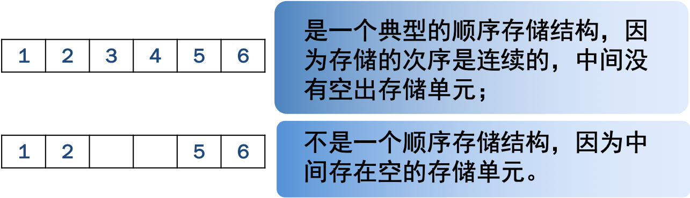
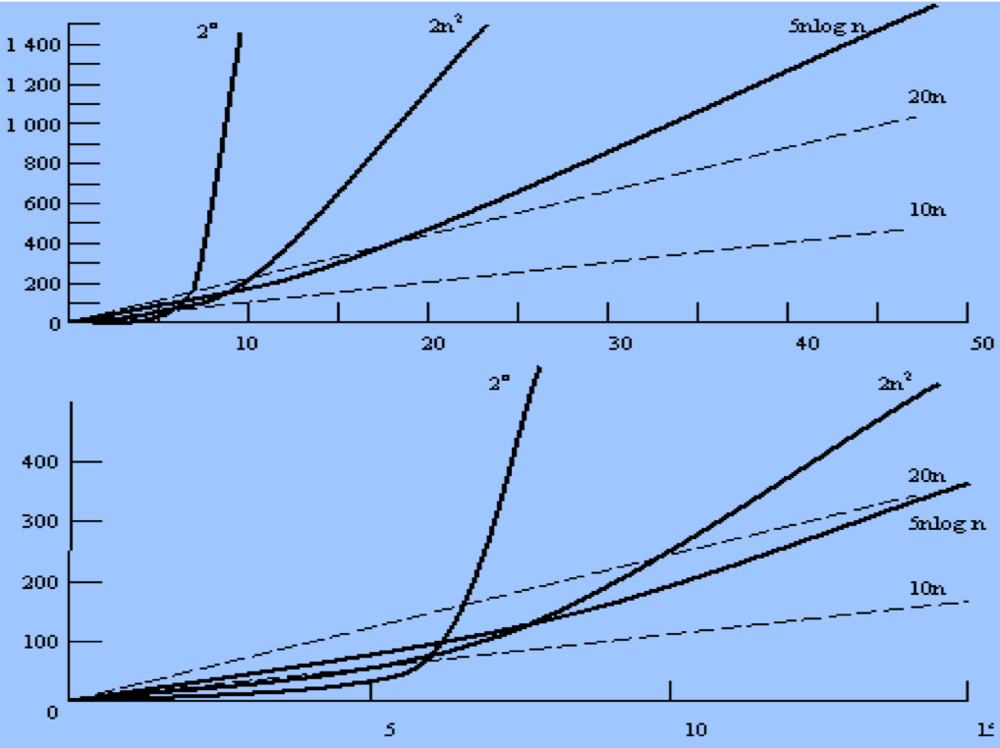

## 一、数据的逻辑结构

### 什么是数据

数据（data）是对客观事物的符号表示，在计算机科学中是指所有能输入到计算机中并被计算机程序处理的符号的总称。这是计算机程序加工的"原料"。

例如，一个利用数值分析方法解代数方程的程序，其处理对象是整数和实数；一个编译程序或文字处理程序的处理对象是字符串。因此，对计算机科学而言，数据的含义极为广泛，如图像、声音等都可以通过编码而归之于数据的范畴。

### 什么是数据元素

数据元素(data element）是数据的基本单位，在计算机程序中通常作为一个整体进行考虑和处理。例如，图1.1(a)组织结构的"树"中的一个方框、图 1.1(b) 中的一个圆圈，都被称一个数据元素。

有时，一个数据元素可由若干个数据项（data item）组成，例如，一本书可以看作一个数据元素，而书目信息中的每一项（如书名、出版社、作者名等）为一个数据项。数据项是数据的不可分割的最小单位。


### 什么是数据结构

数据结构（data structure）是相互之间存在一种或多种特定关系的数据元素的集合。从上述例子可以看到，在任何问题中，数据元素都不是孤立存在的，它们之间存在着某种关系，这种元素之间的关系称为结构（structure）。

### 什么是数据的逻辑结构

结构定义中的"关系"描述的是数据元素之间的逻辑关系，因此又称为数据的逻辑结构。

## 二、数据的物理结构

### 什么是存储结构

数据结构在计算机中的表示（又称映象）称为数据的物理结构，又称为存储结构。它包括数据元素的表示和关系的表示。

数据元素之间的关系在计算机中有两种不同的表示方法：


### 顺序存储结构

顺序存储结构即为：每个存储结点只包含一个数据元素，所有存储结点相继存放在一个连续的存储区里，用存储结点的位置关系表示数据元素之间的逻辑关系。



### 描述存储结构的方式

例如，可以用"一维数组"类型来描述顺序存储结构，以"指针"来描述链式存储结构等。

### 学习数据结构的意义

数据结构是介于数学、计算机硬件和计算机软件三者之间的一门核心课程。在计算机科学中，数据结构不仅是一般程序设计（特别 是非数值计算的程序设计）的基础，而且是设计和实现编译程序、操作系统、数据库系统及其他系统程序和大型应用程序的重要基础。

## 三、算法的描述和分析

**算法（algorithm）**实质解决问题的一种方式或一个过程。

**程序（program）**被认为是对一个算法使用某种程序设计语言的具体实现。本书中的几乎所有算法都给出了用C语言描述的程序。

有一种方法可以较好地解决上述这些问题，称之为渐近算法分析（asymptotic algorithm analysis），简称算法分析（algorithm analysis）。它可以估算出当问题规模变大时，一种算法及实现它的程序的效率和。这种方法实际上是一种估算方法，但是在实际应用中，它被证明是很有效的。

### 算法效率的考虑因素

运行时间经常是算法代价的一个关键方面，但是也不能片面地注重运行速度，而应该同时考虑其他因素，如运行该程序所需要的空间代价（包括内存和磁盘空间）。

通常我们需要分析一种算法（或者是实现该算法的一个程序实例）所花费的时间，以及一种数据结构所占用的空间。

判断算法性能的一个基本考虑是处理一定"规模"（size）的输入时，该算法所需要执行的"基本操作"数。"**基本操作**"和"**规模**"这两个名词的含义都是比较模糊的，而且要视具体算法而定。

**规模**一般是指输入量的数目。比如，在排序问题中，问题的规模一般可以用被排序的元素个数来衡量。

一个"**基本操作**"必须具有这样的性质：完成该操作所需时间与操作数的具体取值无关。在大多数高级语言中，两个整数相加、比较两个整数的大小都是基本操作，二n个整数累加就不是基本操作，因为其代价（cost）要由n的大小来决定。

#### 举例说明程序的算法效率

例如查找一维n元整数数组中最大元素的算法。该算法依次遍历数组中的元素，并保存当前的最大元素，被称为"最大元素顺序检索"。下面就是使用C语言编写的程序：

```c
int largest (int * array, int n)   // 找最大值
{          
    int currlarge=0;              // 赋初值
	for (int i=0;i<n; i++)        // 进入循环
	if (array [i]>currlarge)      // 找大元素
	currlarge=array[i];           // 存储大元素
	return (currlarge);           // 返回最大元素值
}
```

其中，问题的规模为n。这n个整数放在数组array中，基本操作是”检查“，一般来说影响时间代价的最主要因素是输入的规模，我们经常把执行算法所需要的时间代价T携程输入规模n的函数，记作T(n)。

$$T(n)=Cn$$

这个等式表明了最大元素顺序检索时间代价的增长率。

**以函数曲线的方法表示函数的运行时间**

下面一张图给出了5条运行时间函数的曲线，每条曲线反映一个程序或者一种算法的时间代价，图中显示了不同算法的增长率。



## 四、 小结

本篇概要介绍了数据和算法的三方面的内容，即数据的逻辑结构、数据的物理结构以及算法的概述。

在数据与数据结构中涉及到的概念:有数据、数据元素、数据结构、数据项。

数据结构的定义仅是对操作对象的一种数学描述，它是从操作对象抽象出来的数学模型。结构定义中的"关系"描述的是数据元素之间的逻辑关系，因此又称为数据的逻辑结构。

数据结构在计算机中的表示（又称映象）称为数据的物理结构，又称为存储结构。

数据元素之间的关系在计算机中有两种不同的表示方法：顺序映象和非顺序映象，并由此得到两种不同的存储结构：顺序存储结构和链式存储结构。

算法（algorithm）是指解决问题的一种方法或一个过程。算法需要用一种语言来描述，同时，算法可有各种描述方法以满足不同的需求。