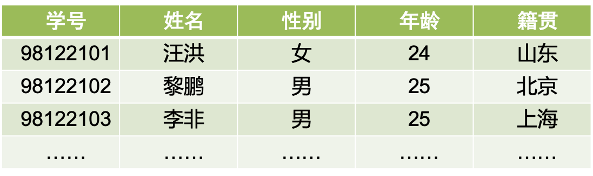
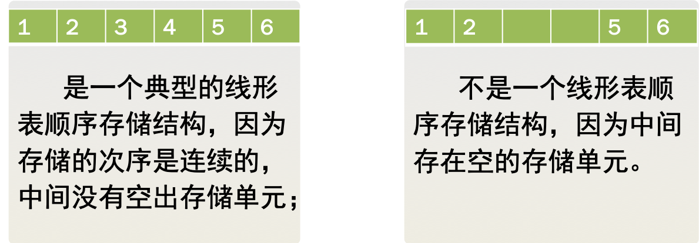
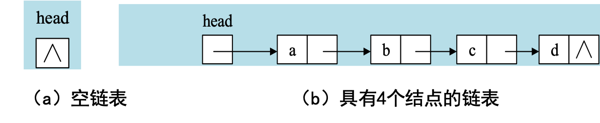
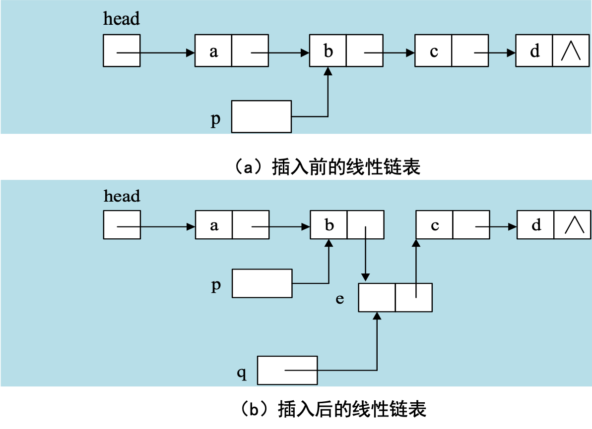
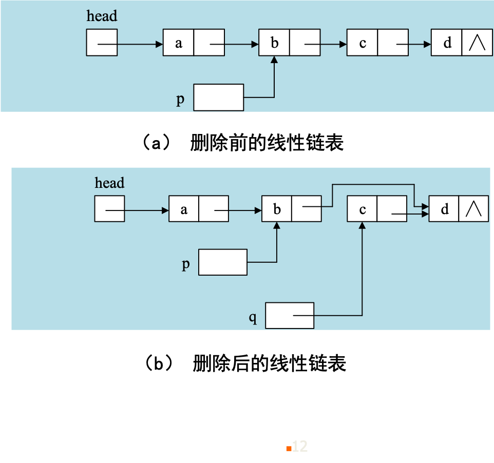

## 一、线性表的基本概念

### 什么是线性表

线性表（list）是由叫做元素（element）组成的一种有限并且有序的序列，记为（k0，k1，…，kn－1）。

**例如：（1，2，3，4，5）是一个线性表，其中的数据元素是数字，共有五个数据元素；（A，B，C......,Z）是一个线性表，其中的数据元素是英为答谢字母，共有二十六个数据元素。**

**例如：（1，2，3）线性表中的1的位置为第一个元素，2为第二个元素；（A，B，C）中的A为第一个元素，B为第二个元素。**

**例如：（1，2，3）中的每个元素的数据类型是整型的，（A，B，C）中的每个元素的数据类型是字符型的。**

线性表中不包含任何元素时，我们称之为**空（empty）表**。当前存储的元素数目叫做线性表的**长度（length）**。

线性表中的数据元素也称为**结点**，或称为记录，它可以是一个整数、一个实数、一个字符或一个字符串。

**例如：线形表（1，2，3）的长度为3；线形表（1，2，3，4，5）的长度为5。**

性表中的元素也可以由若干个**数据项**组成，其中每个数据项可以是一般数据类型，也可以是构造类型。数据项也称为字段，或称为域。


**例如：一个元素为上图，其中的birthday数据项就是构造类型的。**

线性表的开始节点叫做**表头（head）**,最后一个节点叫做**表尾（tail）**。当$n \geq 1$ 时，k0是最前面的一个元素，kn-1是最后一个元素，线性表中数据元素的相对位置是确定的。

线性表的数据元素构成一个序列，在序列中，kj排在kj+1的前面，我们成kj为kj+1的**直接前驱元素**；kj+1排在kj后面，我们成kj+1是kj的**直接后继元素**。k0没有前驱元素，kn-1没有后继元素。当$n \geq 2$时，k0有后继元素k1，kn-1有前驱元素kn-2。

**例如：线性表（a,b,c,d,e）中的a节点就是表头，e就是表尾；线性宝（A，B，C，D）中的A节点就是表头，D节点就是表尾。**

**例如：线性表（9,3,6,8）中的9即为3的前驱结点，3即为9的后继节点，同样，8为6的后继节点，3为6的前驱结点。同时，9没有前驱结点，而9也没有后继节点**。


线形表中的数据项同样有三个名字：**数据项、字段和域**。

下表是一个线性表，它是一个班级的学生档案。该表由学号、姓名、性别、年龄、籍贯5个字段组成，其中学号、年龄的数据类型是整数；姓名、性别和籍贯的数据类型是字符串。



### 线性表的实现途径

线性表的实现有两种标准途径--顺序表（array-based list或sequential list）和链表（linked list），其中链表的知识就是后文中的单链表。

## 二、顺序存储的线性表和运算

### 顺序表

线形表顺序存储的概念以及存储方式：

所谓线性表的顺序存储，就是用一组连续的存储单元依次存储线性表中的结点。顺序表一般用数组实现。



#### 计算线形表结点地址的计算公式

因为线性表中所有结点的数据类型是相同的，所以每个结点在存储器中占用的空间相同。如果每个结点占用计算机中按机器字编址或按字节编址的s个地址的存储单元，并假设存放结点k0的开始地址为loc（k0），那么结点ki的地址为loc（ki），地址计算公式为：

$$loc (ki)＝loc（k0）＋i\times s$$

对于顺序存储的线性表，因为可以利用地址计算公式直接计算ki出的开始地址loc（ki），所以存取第i（0≤i≤n－1）个结点特别方便。

#### 用C语言表示的线性表

如果用C语言的数组表示线性表（k0,k1,……，kn-1）,可使用如下的说明

```c
#define MAXSIZE 100
int list [MAXSIZE];
int n;
// 其中MAXSIZE是数组list中元素个数的最大值。
```

### 顺序表的插入运算

#### 顺序表插入的概念

这里所说的插入是在具有n个结点的线性表中，把新结点插在线性表的第$i（0 \leq i \leq n）$个位置上，使原来长度为n的线性表变成长度为（n＋1）的线性表。

#### 顺序表插入的过程

在把新结点放进线性表前，必须把原来位置号为i的结点依次往后移动一个位置，然后把新结点放在第i个位置上，此时共移动（n－i）个结点。当i＝n时，只要把新结点插在第n个位置上，此时无需移动结点。

### 顺序表的插入运算

下面用一个C语言函数sq_insert()实现上述的插入算法。此函数在具有n个节点的线性表list中，把值为x的节点插入在第$i(0 \leq i \leq n)$个位置上。若插入位置i不在可以插入的位置上（即i <0 或 i > n）,则返回1；表满之后：若n=MAXSIZE (即线性表已满)，此时list数组没有存储单元存放新节点，则返回2；若插入成功，则返回0。

在函数的参数中，有一个指针变量p_n,在调用时，把存放线性表的当前节点个数的变量n的地址赋给指针变量p_n,以此来实现插入后线性表长度n增加1。

```c
int sq_insert(list, p_n, i, x)       //定义插入函数
int list[], x;            //定义线性表list和插入元素x
int *p_n, i; //定义指针*p_n（用来记录顺序表长度）和插入位置i
{
int j;
//如果插入位置i不在线性表的范围里，就返回1
if(i<0 || i>*p_n) return (1); 
//如果*p_n所显示的表的长度已是最大长度，返回2 
if(*p_n==MAXSIZE) return (2); 
//当插入的位置在顺序表之内中，进行后移，把j位置以后的元素依次向后移动
for(j=*p_n; j>i; j--)
     list[j]=list[j-1]; 
list[i]=x;            //将该插入的元素x插在i位置上
(*p_n)++;           //表的长度加1
return (0);           //返回0，表明插入成功
}
```

在具有n个结点的线性表中，插入一个新结点时，其执行时间主要花费在移动结点的循环上。

### 顺序表的删除运算

#### 顺序表删除的概念

顺序表的删除是在具有n个结点的线性表中，删除第$i（0 \leq i \leq n－1）$个位置上的结点，使原来长度为n的线性表变成长度为（n－1）的线性表。

#### 顺序表删除的过程

删除时，要把位置号为（i＋1）至位置号为（n－1）的结点都依次向前移动一个位置，此时共需移动（n―i―1）个结点。

#### 顺序表的删除运算

下面用一个C语言函数sq_delete()实现上述的删除算法。此函数在具有n个节点的线性表list中，删除第$i(0 \leq i \leq n-1)$个位置上的节点。若插删除的节点不在可删除的位置上（即i <0 或 $i \geq  n$）,则返回1；若删除成功，则返回0.

在函数的参数中，有一个指针变量p_n,在调用时，把存放线性表的当前节点个数的变量n的地址赋给指针变量p_n,实现删除后线性表长度n减少1。

```c
int sq_delete(list, p_n, i)       //定义删除函数
  int list[];              //定义顺序表
  int *p_n, i; 	 //定义指针记录顺序表长度，和删除位置
  {   int j;         //定义整形数，用来作为自加数，进行元素后移
//如果删除位置的元素不在顺序表中，就返回1，表明删除失败    
if(i<0 || i≥*p_n) return (1);
//从要被删除的位置的后一位开始，一直到顺序表的最后，把元素依次向前
//移动，注意，先移删除位后的第一个 
for(j=i+1; j＜*p_n; j++) 
    list[j-1]=list[j];  
   (*p_n)--;            //将顺序表的长度减1
   return (0);           //成功删除，返回0
  }
```

## 三、链式存储的线性表和运算

### 单链表的概念

采用链式存储方式存储的线性表称为线性链表，也称为单链表（linked list）。

#### 链表结点的基本结构

线性表的每个结点除了有一个字段存放结点值外，还需要有一个字段用来存放其后继结点的地址，这个字段称为链接指针，如下图。

结点值|指针
---|---

线性链表就是通过链接指针来体现线性表中结点的先后次序。每个链表需要有一个指向链表中第一个结点的头指针。当线性链表为空时，应将其头指针置为空，若线性链表非空时还需将最后一个结点的链接指针置为空，以此表示该结点没有后继结点。

#### 单链表的逻辑结构

下面两张图表示了一个线性链表的逻辑结构，图中指针变量head为头指针，线性表中的结点值为字符，记号∧表示NULL（空结点）。



### 线性链表的函数例子

```c
NODE * create_link_list(n)
//定义一个建立链表的函数，返回NODE指针型变量，其中n是要建立的结点的个数

int n; 	// n>=0
{
	int i;               // 建立变量i用来执行循环，建立结点
	NODE *head, *p,*q;   // 定义NODE型指针变量，其中head为头指针
	//如果要建立的结点个数是0，则返回的头指针为空指针
	if(n==0) return NULL; 
	head=(NODE*)malloc(sizeof(NODE));  // 用malloc动态分配结点
  //  的大小，并用sizeof函数来指定结点的大小，并用NODE*强制将分配单元的类
  // 型变为NODE指针型
	p=head;  // 为保证头指针在生成链表的过程中不至于改变，而用p代替
	for(i=0; i<n; i++)              // 开始建立链表结点
  {
	  scanf(“%c”,&(p->data));     // 以用户输入结点值的方式建立结点
	  q=(NODE*)malloc(sizeof(NODE)); 
	  //重新按上述方式分配新的空间，来建立下一个链表结点
  	p->next=q;      // 将刚才建立好的链表结点的指针指向新建立的结点
	  p=q;
  }                 // 将要目标定在要输入值的链表结点上
	
  scanf(“%c”,&(p->data));       // 输入链表最后一个结点的值
	p->next=NULL;       // 链表结束，所以最后一个结点的指针值为空
	return(head);       // 将链表的头指针返回，用于以后的访问链表
}
```

### 单链表的插入运算

如何在给定的线性链表中，在指定的结点后面插入一个新结点的处理方法？

后面一张图表明了在链表head中，在指针p所指的结点b后面插入新结点e的处理方法。



#### 单链表插入的函数例子

下面给出的函数insert (p_head, a, b)，实现在head线性链表中把值为b的结点插在值为a的结点之后。若a不在head线性链表中，则把b插在该链表的最后。

```c
void insert(p_head,a,b)
NODE **p_head;
char a,b;
{   NODE *p, *q;
q=(NODE*)malloc(sizeof(NODE));
q->data=b;
q->next=NULL;
if (*p_head==NULL) *p_head=q;
else {	p=*p_head;
	while(p->data!=a && p->next!=NULL)
p=p->next;
	q->next=p->next;
	p->next=q;}
}
```

### 单链表的删除运算

如何在给定的线性链表中删除指定的后继结点的处理方法。

下图表明了在线性链表head中删除位于指针p所指的结点b之后的结点c的处理方法。



#### 单链表删除的函数例子

下面给出的函数delete (p_head, a)实现在head链表中删除值为a的结点。如果删除成功，返回0；否则，返回1。

```c
void delete(p_head,a)
NODE **p_head;
char a;
{   
  NODE *p, *q;
	q=*p_head;
	if (q==NULL)  return (1);
	
  if (q->data==a)
	{
    *p_head=q->next;
	  free (q);
	  return (0);
    }else { 
      while(q->data!=a && q->next!=NULL)
      {
	    p=q; q=q->next;}
	    if (*q->data==a){ 
        p->next=q->next;
	    free(q);
	    return (0);
      }else {
      return (1);
      }
}
```

## 四、双向链表和循环链表

## 五、栈和运算


## 六、队列和运算

## 小结


