## 一、数组的顺序存储

数组的顺序存储结构，是指用计算机中的一组地址连续的存储单元，按照一定的先后次序来依次存放一个数组中各个数据元素的值。 
下面将给出一维、二维、三维数组的地址公式。（假定：每个数组元素占计算机中s个存储单元）。

### 一维数组的地址

一维数组a[t]如果采用顺序存储结构，就按下图所示依次存放数组中各个元素。

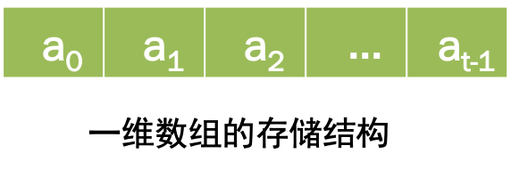

我们已假定每个数组元素占s个存储单元，则此数组中数组元素a[i]的地址与数组元素a[i-1]的地址有如下等式： 

$$loc[a[i]]=loc[a[i-1]]+1*s$$

因此，我们可以推出一维数组的地址公式：

$$loc[a[i]]=loc[a[0]]+i*s;$$

### 二维数组的地址

二维数组a[m][n]有m×n个数据元素组成，我们可用下图中的矩阵来表示它，此矩阵中共有m行n列。

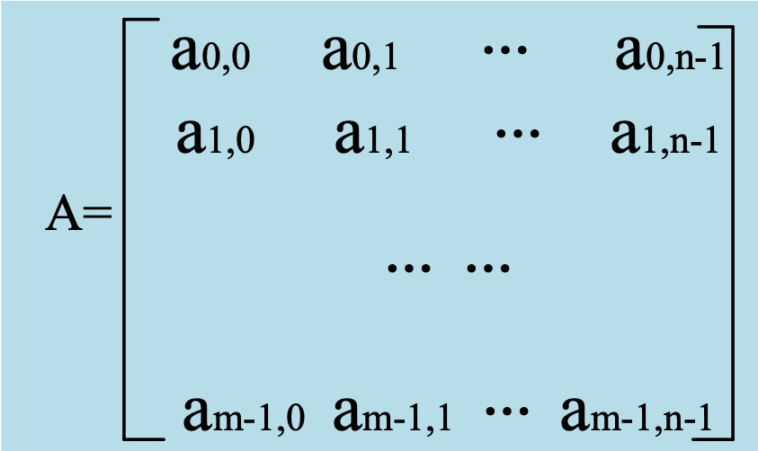

二维数组有二种顺序存储结构，一种是以行序为主序的存储结构，另一种是以列序为主序的存储结构。

以行序为主序的存储结构，是按数组元素行的大小升序的存储方式，即先存第0行元素，再存第1行元素，……,每行内的元素按列的大小升序进行存储。 

例如：上面的矩阵A的以行序为主序的存储结构如下图所示

#### 以行序为主序的矩阵存储结构

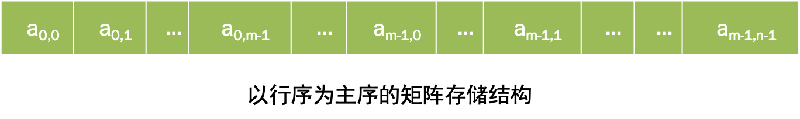

从上图可以看出

$$loc[ai,j]=loc[ai,0]+j * s;$$

即ai,j的地址等于第i行的第一个元素ai,0的地址加上ai,0后的j个元素所占的存储容量的大小jxs。而ai,0这个元素前面存有第0行的全部元素，第1行的全部元素，第i-1行的全部元素，这个i行元素共有ixn个元素，因此有：

$$loc[ai,0]=loc[a0,0]+i*n*s;$$

我们可以得出二维数组的行序为主的地址计算公式为：

$$\begin{aligned}
loc[ai,j]&=loc[a0,0]+i*n*s+j*s;\\
&=loc[a0,0]+(i*n+j)*s 
\end{aligned}
$$

#### 以列序为主序的矩阵存储结构

二维数组的以列序为主序的存储结构，是一种按数组元素列的大小的升序的存储方式，即先存第0列元素，再存第1列元素，……，每列内的元素按元素行的大小的升序进行存储。 
例如：上面的矩阵A的以列序为主序的存储结构如下图所示。

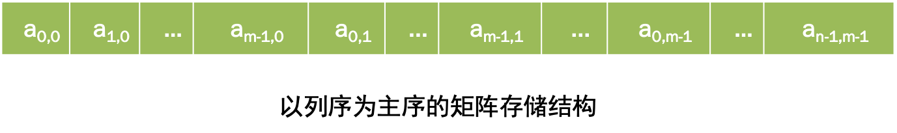


从上图可以看出

$$loc[ai,j]=loc[ao,j]+i * s;$$

即ai,j的地址等于第j列第一个元素a0,j的地址加上a0,j后的i个元素所占的存储容量的大小jxs。而

$$loc[a0,j]=loc[a0,0]+j*m*s;$$

我们可以得出二维数组的列序为主的地址计算公式为：

$$loc[ai,j]=loc[a0,0]+(j*m+i)*s;$$

## 二、特殊矩阵

本节介绍的特殊矩阵有上三角矩阵，下三角短阵，带状矩阵。特殊矩阵多采用压缩存贮，压缩存贮的方法是：总结出此种特殊矩阵中元素的分布规律，值相同的多个元素只分配一个存储单元，值为0的多个元素不存储，其它元素按照一定的次序依次顺序存贮。

### 上（下）三角矩阵

三角矩阵分为上三角矩阵，下三角矩阵两种，以上（下）三角矩阵是指矩阵主对角线（a00,a11,……,an-1,n-1）以下（或以上，不包括主对角线）的元素值全是0或全是常数c的矩阵，如下图所示。

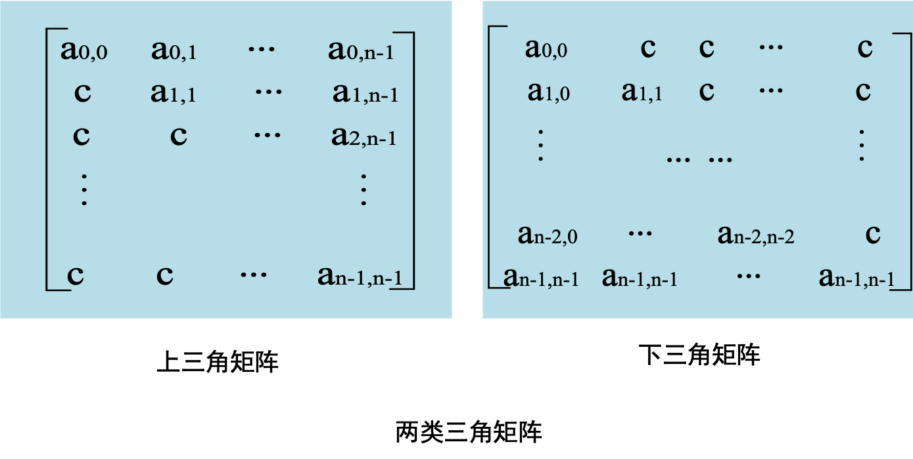

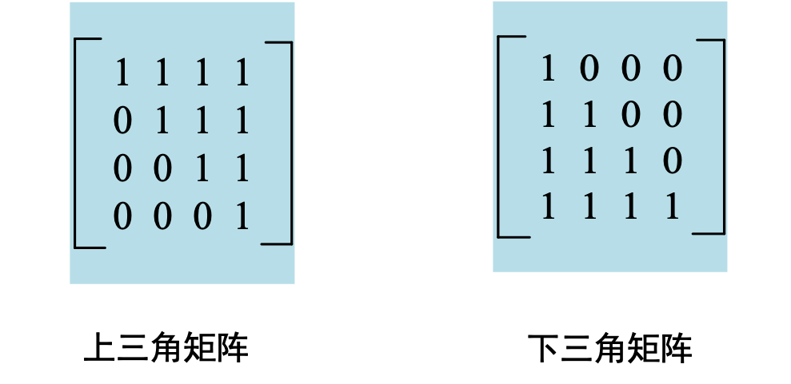


下面讨论n阶上三角矩阵的行序为主序的压缩存贮结构，存贮结构图如下：

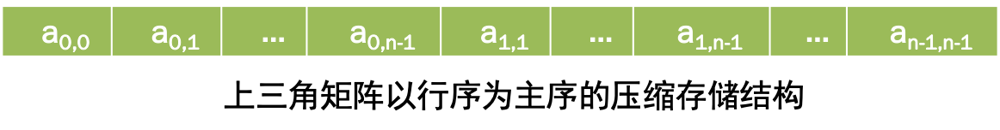

其中，第i行的第一个元素aio前面共存贮有i行汇总的元素，因此

$$loc[aio]=loc[a00]+(1/2)*i(2n-i+1)*s$$

则：

$$
\begin{aligned}
loc[aij]&=loc[ai0]+j*s\\
&=loc[a00]+(j+1/2*i*(2n-i+1))*s
\end{aligned}$$
<!-- 括号少了 -->

### 带状矩阵

带状矩阵又叫对角矩阵，是另一种常见的特殊矩阵，对于一个n×n 的带状矩阵N, 其所有非零元素集中在以主对角线为中心的带状区域中，即在上方和下方各形成了w条对角线，而其上三角和下三角的其余元素均为零。下图为一个6×6 的带状矩阵。

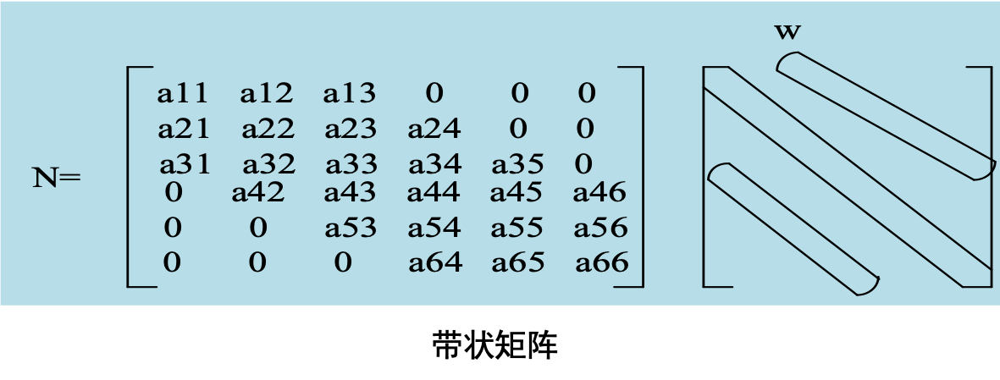
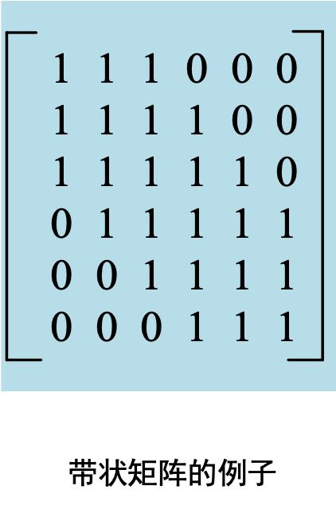

## 三、稀疏矩阵

当一个矩阵中有很多元素为零并且非零元素的分布没有规律时，我们就称其为稀疏矩阵。我们必须构造一种数据结构——三元组来存贮。

三元组的定义如下：

```c
typedef struct {
	int row;
	int col ;
	int val ;
}THA ;
```

定义一个三元组型的一维数组array, 以行序（或列序）为主序对稀疏矩阵的非零元素进行存贮，并且规定array[0]记录矩阵的行数，列数及非零元素个数。

例如，稀疏矩阵M及其三元组（以行序为主序）如下：

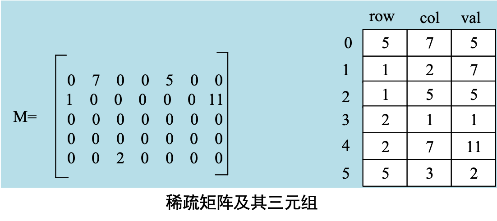

当系数矩阵已经转化为用三元组表示以后，我们就可对其进行一些操作，如矩阵的转置等。

矩阵的转置是矩阵中的一项基本运算，对一个mxn的矩阵S，期转置矩阵T为一个nxm的矩阵且S中的元素sij对应于T中的元素tji($1 \leq i \leq m,1 \leq j \leq n$)。对一个三元组表示的系数矩阵进行转置操作，即使（例如i,j,sij）变成（j,i,tji）同时使变换后的三元组仍按行序（或列序）为主序进行顺序存贮。

设三元组数组s和t分别存贮矩阵S及其转置矩阵T，为了使转置后t仍按T行序递增进行存贮，我们必须对三元组s的col域进行扫 描，按col域从小到大的顺序将其row、col值互换后连其val依次存入数组t。：前面图上的稀疏矩阵M转置后对应的矩阵M’＝

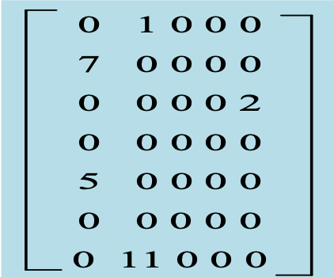

其对应的三元组为:

||Row|Col|Val
---|---|---|---
0|7|5|5
1|1|2|1
2|2|1|7
3|3|5|2
4|5|1|5
5|7|2|11

### 稀疏矩阵的函数例子

```c
#include <stdio.h>
typedef struct{
int row;
int col;
int val;
}THA;
#define MAX 20

void main(){
int i,j,count=1;
int col,row,val;
THA s[MAX]; THA t[MAX];
printf(“input the number of row,col and elements:”);
scanf(“%d,%d,%d\n”,&s[0].row, &s[0].col, &s[0].val);
if(s[0].val==0) return; /无非零元素返回/
val=s[0].val;
for(i=1;i<=val;i++)
scanf(“%d,%d,%d\n”,&s[i].row, &s[i].col, &s[i].val);
row= s[0].row;
col= s[0].col;
count=1;

for(i=1; i<=col; i++)
 for(j=1; j<=val; j++)
  if(s[j].col==i)
  {
   t[count].row=s[j].col;
   t[count].col=s[j].row;
   t[count++].val=s[j].val;
  }
t[0].row= col;
t[0].col= row;
t[0].val= val;
for(i=1; i<=val; i++)
printf(%d,%d,%d\n”,&t[i].row, &t[i].col,
&t[i].val)
}
```

## 四、

## 五、

