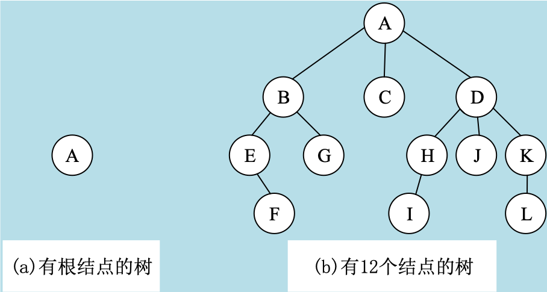
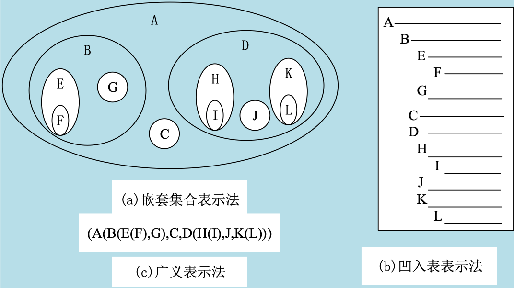
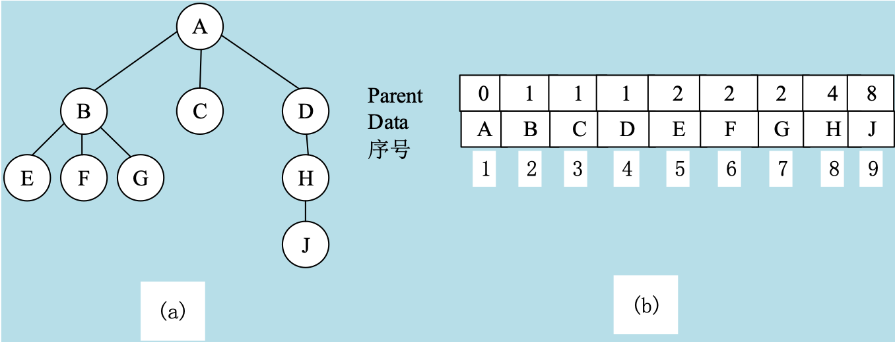

## 一、树的概念与存储表示

### 树（tree）的基本概念

树是一个或多个结点的有穷集合，在一棵非空树中存在如下关系：

1. 有且仅有一个特定的被称为根(root)的结点；    
2. 除根以外的其余结点被分成m(m>0)个互不相交的有限集T1,T2,...Tm,这些集合本身又是一棵树，并且被称为根的子树(subtree)。

下图表示两棵树，图(a)所示的是只有根结点的树，图(b)所示的是有12个结点的树，结点A是这棵树的根，其余的11个结点分为三个互不相交的集合 T1,T2和T3，其中T1={B，E，G，F},T2={C}，T3={D，H，J，K，I，L}

T1，T2，T3又都是树，且是根结点A的子树，对于树T1，根结点是B，余下的三结点又分为互不相交的两个集合，T11={E，F}，T12={G}，T11，T12又是结点B的子树，T11的根结点是 E,余下的结点F又是它的子树。T2是只有根结点C的树。T3的根结点是D，余下的结点又分为T31={H，I}，T32={J}，T33={K，L}的子树。

由上例可知，树的定义具有递归性，即在树的定义中又用到了树的概念，它道出了树的固有特性。

- 结点的度
  - 结点N的子树数称为结点N的度（Degree）或次数。
  - 前面图中A的度为3；B的度为2；D的度为3；E，K，H的度为1；F，G，C，I，J，L的度为0。
- 叶子
  - 度为0的结点称为叶子或终端结点（Leaf）。C，F，G，I，J，L即为前面图中树的叶子。树中度不为0的结点称为非终端结点。
  - 前面图中结点A，B，D，E，H，K都是非终端结点。
- 树的度
  - 结点N的子树数称为结点N的度（Degree）或次数。
  - 前面图中A的度为3；B的度为2；D的度为3；E，K，H的度为1；F，G，C，I，J，L的度为0。
- 双亲（Parents）和孩子（Child）
  - 结点的子树的根称为该结点的孩子（子女结点），相应地，该结点称为孩子的双亲（父结点）。在树中，该树的根结点没有双亲，叶子没有孩子。
  - 前面图中A是C的父结点，C是A的子结点。
- 兄弟和堂兄弟
  - 同一双亲的孩子之间互称为兄弟（兄弟结点或同胞结点）。其双亲兄弟的孩子称为堂兄弟。
  - 前面图中，B，C，D为兄弟，E，H为堂兄弟。
- 祖先和孩子
  - 一个结点的祖先是指从根到该点所经分支上的所有结点；
  - 一个结点的子树的所有结点都为该结点的子孙。
  - 前面图中，I结点的祖先是A，H，D；B子孙是E，G，F。（I的祖先不包括结点I本身）
- 结点的层数
  - 我们定义一棵树的根结点所在的层次为1，而其它结点所在的层次等于它的父结点所在的层次加1。
  - 我们说树形结构具有明显的层次关系，从前面图中可看出，结点A是第一层，结点B，C，D是第二层，结点E，G，H，J，K是第三层，结点F，I，L是该树的第四层。
- 树的深度
  - 树中的各结点的层数的最大值称为该树的深度或高度，前面图中所示树的深度为4。
- 有序树和无序树
  - 如果树中各子树从左至右是有次序的（即不能互换），则称该树为有序树，否则为无序树。在有序树中最左边的子树的根称为第一个孩子，最右边的称为最后一个孩子。
- 深林
  - n（n≥0）棵互不相交的树的集合称为森林（Forest）。一棵树如果删去其根结点，便得到一个森林。如果给一个森林加上一个结点，使原森林的各棵树成为所加结点的子树，便得到一棵树。

### 树的其他表示方法

在前面图中，我们一般用一个圆圈表示一个结点，并在圆圈中标出一个字母、数字或字符串作为结点名字或结点值，在根结点与它的子树的根结点之间的连线，表明了它们之间的逻辑关系。

除了以上树的图示之外，还可用其它形式表示一棵树，例如可以用嵌套集合、凹入表表示法、广义表等形式表示，下面列出了树的其它三种表示方法。

### 树的顺序存储 

通常我们使用结点双亲的信息，如果用一维数组tree[n]来表示存储结构，则在数组中，每个元素是一个结构体，它包含两各成员：data和pointer,其中tree[i].data表示结点i的值，tree[i].pointer表示该结点的指针部分，它可以由若干个指针所组成，每个指针用来体现树中结点之间所存在的某种特定的关系，每个指针可以具有多个分量，用来表示树中结点之间存在的非线形关系。

下图（a）所示的树，其数组表示如图（b）所示。

## 二、二叉树

## 三、二叉树的遍历

## 四、森林与二叉树的转换

## 五、哈弗曼树及其应用

## 六、

