## 一、树的概念与存储表示

### 树（tree）的基本概念

树是一个或多个结点的有穷集合，在一棵非空树中存在如下关系：

1. 有且仅有一个特定的被称为根(root)的结点；    
2. 除根以外的其余结点被分成m(m>0)个互不相交的有限集T1,T2,...Tm,这些集合本身又是一棵树，并且被称为根的子树(subtree)。

下图表示两棵树，图(a)所示的是只有根结点的树，图(b)所示的是有12个结点的树，结点A是这棵树的根，其余的11个结点分为三个互不相交的集合 T1,T2和T3，其中T1={B，E，G，F},T2={C}，T3={D，H，J，K，I，L}


T1，T2，T3又都是树，且是根结点A的子树，对于树T1，根结点是B，余下的三结点又分为互不相交的两个集合，T11={E，F}，T12={G}，T11，T12又是结点B的子树，T11的根结点是 E,余下的结点F又是它的子树。T2是只有根结点C的树。T3的根结点是D，余下的结点又分为T31={H，I}，T32={J}，T33={K，L}的子树。

由上例可知，树的定义具有递归性，即在树的定义中又用到了树的概念，它道出了树的固有特性。

- 结点的度
  - 结点N的子树数称为结点N的度（Degree）或次数。
  - 前面图中A的度为3；B的度为2；D的度为3；E，K，H的度为1；F，G，C，I，J，L的度为0。
- 叶子
  - 度为0的结点称为叶子或终端结点（Leaf）。C，F，G，I，J，L即为前面图中树的叶子。树中度不为0的结点称为非终端结点。
  - 前面图中结点A，B，D，E，H，K都是非终端结点。
- 树的度
  - 结点N的子树数称为结点N的度（Degree）或次数。
  - 前面图中A的度为3；B的度为2；D的度为3；E，K，H的度为1；F，G，C，I，J，L的度为0。
- 双亲（Parents）和孩子（Child）
  - 结点的子树的根称为该结点的孩子（子女结点），相应地，该结点称为孩子的双亲（父结点）。在树中，该树的根结点没有双亲，叶子没有孩子。
  - 前面图中A是C的父结点，C是A的子结点。
- 兄弟和堂兄弟
  - 同一双亲的孩子之间互称为兄弟（兄弟结点或同胞结点）。其双亲兄弟的孩子称为堂兄弟。
  - 前面图中，B，C，D为兄弟，E，H为堂兄弟。
- 祖先和孩子
  - 一个结点的祖先是指从根到该点所经分支上的所有结点；
  - 一个结点的子树的所有结点都为该结点的子孙。
  - 前面图中，I结点的祖先是A，H，D；B子孙是E，G，F。（I的祖先不包括结点I本身）
- 结点的层数
  - 我们定义一棵树的根结点所在的层次为1，而其它结点所在的层次等于它的父结点所在的层次加1。
  - 我们说树形结构具有明显的层次关系，从前面图中可看出，结点A是第一层，结点B，C，D是第二层，结点E，G，H，J，K是第三层，结点F，I，L是该树的第四层。
- 树的深度
  - 树中的各结点的层数的最大值称为该树的深度或高度，前面图中所示树的深度为4。
- 有序树和无序树
  - 如果树中各子树从左至右是有次序的（即不能互换），则称该树为有序树，否则为无序树。在有序树中最左边的子树的根称为第一个孩子，最右边的称为最后一个孩子。
- 深林
  - n（n≥0）棵互不相交的树的集合称为森林（Forest）。一棵树如果删去其根结点，便得到一个森林。如果给一个森林加上一个结点，使原森林的各棵树成为所加结点的子树，便得到一棵树。

### 树的其他表示方法

在前面图中，我们一般用一个圆圈表示一个结点，并在圆圈中标出一个字母、数字或字符串作为结点名字或结点值，在根结点与它的子树的根结点之间的连线，表明了它们之间的逻辑关系。

除了以上树的图示之外，还可用其它形式表示一棵树，例如可以用嵌套集合、凹入表表示法、广义表等形式表示，下面列出了树的其它三种表示方法。


### 树的顺序存储 

通常我们使用结点双亲的信息，如果用一维数组tree[n]来表示存储结构，则在数组中，每个元素是一个结构体，它包含两各成员：data和pointer,其中tree[i].data表示结点i的值，tree[i].pointer表示该结点的指针部分，它可以由若干个指针所组成，每个指针用来体现树中结点之间所存在的某种特定的关系，每个指针可以具有多个分量，用来表示树中结点之间存在的非线形关系。

下图（a）所示的树，其数组表示如图（b）所示。


## 二、二叉树

二叉树（binary tree）是应用最广泛的一类树结构，它的存储表示比一般树的存储表示简单，而一般的树又可以比较方便地转化为二叉树，转化的方法将在后面介绍。

二叉树具有如下两个特点：

1. 二叉树可以是空集，如果是非空二叉树，则可以只有一个根结点。
2. 二叉树中每个结点最多只有两棵子树，分别称为该结点的左子树和右子树。

### 五种基本形态

二叉树共有5种基本形态，如图所示。

- 图(a)为空二叉树；
- (b)为只有根结点，其左右子树均为空的二叉树；
- (c)为有根结点，左子树非空，右子树为空的二叉树；
- (d)为有根结点，左子树为空，右子树为非空的二叉树；
- (e)为有根结点，其左右子树均为非空二叉树。

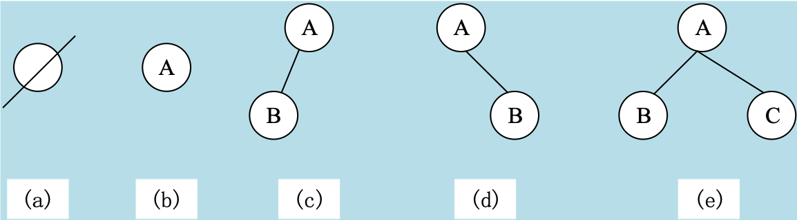

### 二叉树的基本性质

1. 位于二叉树的第k层上最多有2k－1（k≥1）个结点。
2. 深度为m的二叉树最多有2m－1个结点。
3. 在任意一棵二叉树中，度为0的结点（即叶子结点）总比度为2的结点多一个。
4. 具有n个结点的二叉树，其深度至少为[log2n]＋1，其中[log2n]表示取log2n的整数部分。这个发生可由性质2直接得到。

### 几种特殊的二叉树

#### 满二叉树

- 所谓满二叉树（简称满树）是一棵深度为k的具有2k－1个结点的树。
- 图4.8(a)，(b)，(c)分别是深度为2，3，4的满二叉树。

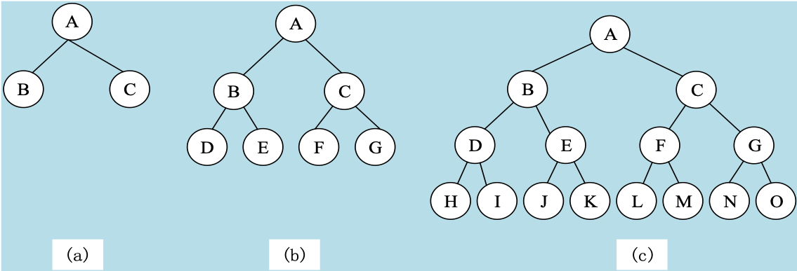

#### 完全二叉树

如果把深度是k的满二叉树按层次从上到下、从左到右地进行编号（1~2k-1），则深度是k的具有n个结点的二叉树，它的每一个结点都与深度为k的满二叉树中的编号从1到n的结点想对应，则这样的二叉树称之为完全二叉树。

对于完全二叉树，叶子结点只可能在层次最大的两次上出现，最后一层上的叶子结点一定依次都处在该层最左边的位置上。例如下图所示的是完全二叉树。

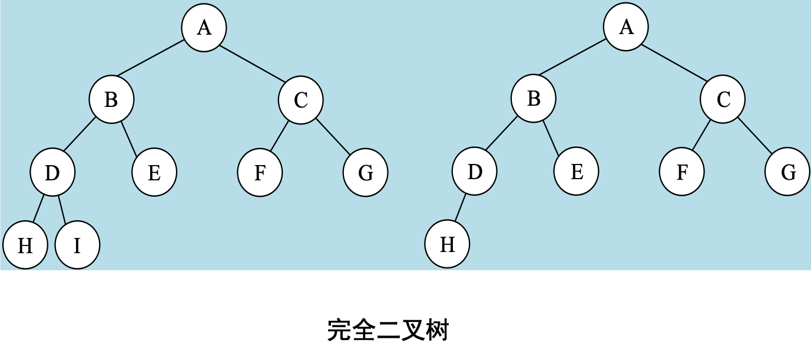

### 二叉树的存储结构

#### 顺序存储方式

顺序存储方式就是用一个连续存储空间作为二叉树的存储单元。如果用一个一维数组tree来表示存储结构，则数组的下标对应于某棵树的编号，因为要反映结点与结点间的逻辑关系，结点的编号应从根结点开始，按层次，左右顺序进行顺序编号。

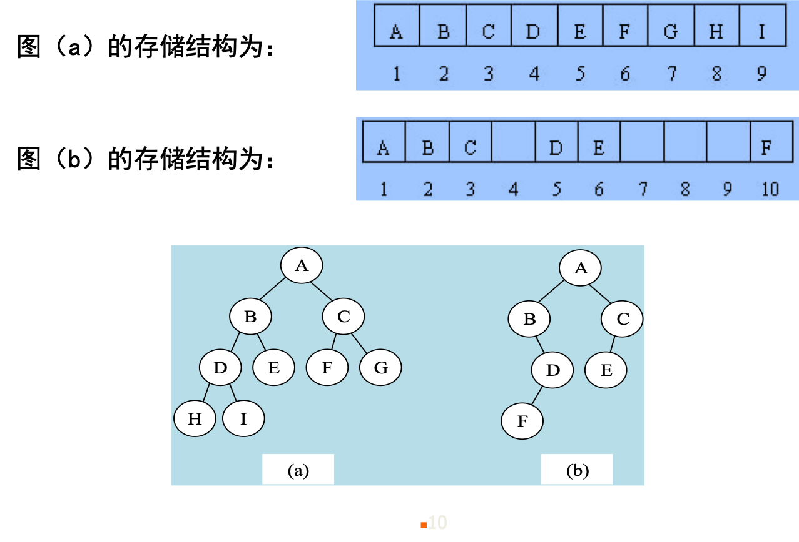

#### 链表存储方式

由于二叉树每个结点至多只有2个孩子，且分别为左孩子、右孩子，因此每个结点的结构通常表示为：

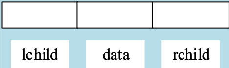

其中左链域lchild为指向左孩子的指针，右链域rchild为指向右孩子的指针，数据域data表示结点的值。如某结点没有左孩子或右孩子，其相应的链域为空指针。另外，还需设立指向根的指针root，这类似前面讲到的链表的头指针，只要知道某棵树链表的根指针，则可以方便地知道该树的信息。

例如前面提到的右图（a）和（b）所表示的两棵树的链表表示，分别如下图（a）和（b）所示。

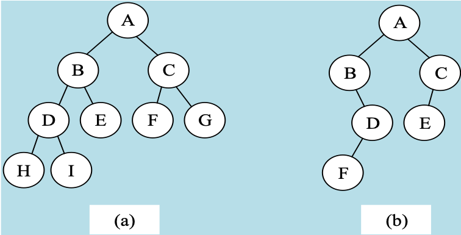
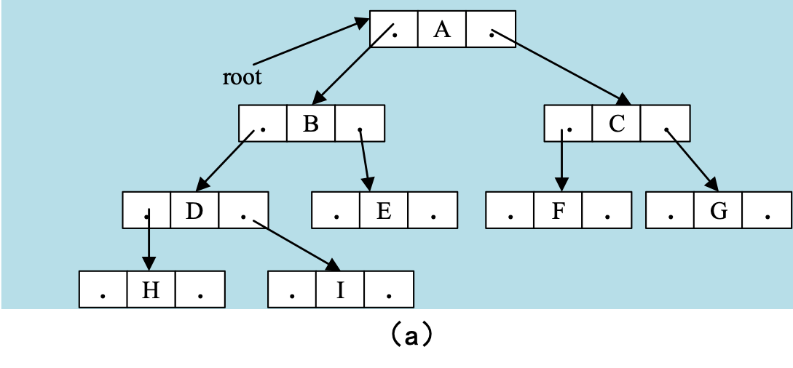
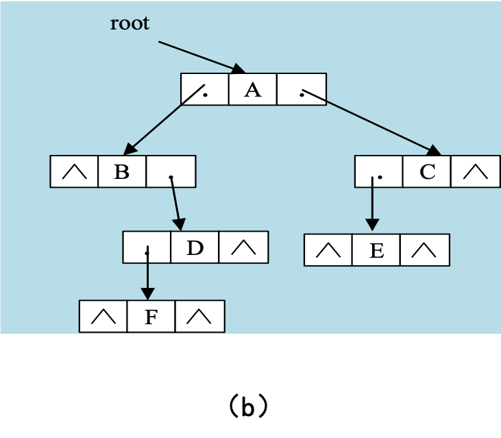

## 三、二叉树的遍历

遍历二叉树就是按照某种规则去访问二叉树的每个结点，而且每个结点仅被访问一次。则只有3种情况DLR，LDR，LRD，分别 称之为前序遍历，中序遍历与后序遍历。

### 前序遍历二叉树

前序遍历二叉树的操作定义为：若二叉树为空，则遍历结束，否则：

1. 访问根节点。
2. 前序遍历跟的左子树。
3. 前序遍历根的右子树。

在这里需要说明的是，遍历左右子树时仍应采用前序遍历的方法，这是一个递归过程。如图所示一棵二叉树的遍历，其过程是：

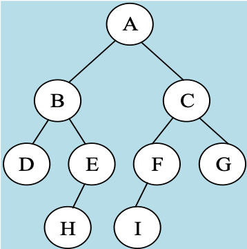

1. 首先访问跟A，然后遍历A的左子树（由B，D，E，H所组成）。
2. 在遍历A的左子树，先访问跟B，再遍历B的左子树（D），在访问根D的左、右子树，再遍历B的右子树（E、H），首先访问根E，再遍历E的右子树（H），访问其根H，因H的左右子树均为空，则遍历E的右子树，因右子树为空，则B的根子树遍历完毕。
3. 也即A的左子树遍历完毕，然后遍历A的右子树。
4. 依次类推，可得该树前序遍历的顺序结果为A，B，D，E，H，C，F，I，G。

#### 前序遍历的递归算法

```c
# include "stdio.h"
struct btnode //定义链表结构
{ char data; //定义结点值
    struct btnode * lchild; //定义左子结点
    struct btonde * rchild; //定义右子结点指针
};
    preorder(root) //前序遍历
    struct btnode * root; //定义根结点指针
{       if(root! = NULL) //如果不是空结点
      { printf("%c \ n", root->data); //输出当前结点值
         preorder(root->lchild); //递归前序遍历左子结点
         preorder(root->rchild); //递归前序遍历右子结点
}       return; //结束
｝
```

### 中序遍历二叉树

中序遍历二叉树的操作定义为：若二叉树为空，则遍历结束，否则：

1. 中序遍历根的左子树。
2. 访问根结点。
3. 中序遍历

中序遍历的过程是：首先遍历根结点A的左子树，然后访问A，最后遍历A的 右子树。依次类推，得中序遍历、的结点顺序为D，B，H，E，A，I，F，C，G。

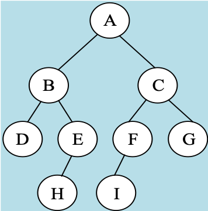

#### 中序遍历的递归算法

```c
# include "stdio.h"
struct btnode //定义链表结构
{ char data; //定义结点值
   struct btnode * lchild; 
                       //定义左子结点指针
   struct btonde * rchild; 
                       //定义右子结点指针
}; 

inorder(root) //中序遍历

struct btnode * root; //定义根结点指针
{   if(root! = NULL) 
                 //如果不是空结点
{   inorder(root->lchild); 
              //递归中序遍历左子结点
    printf("%c \ n", root->data); 
                   //输出当前结点值
    inorder(root->rchild); 
               //递归中序遍历右子结点
}    return;//结束
｝
```

## 后序遍历二叉树

后序遍历二叉树的操作定义为：若二叉树为空，则遍历结束，否则：

1. 后序遍历根的左子树。
2. 后序遍历根的右子树。
3. 访问根结点。

对图4.13进行后序遍历结果是：D，H，E，B，I，F，G，C，A。

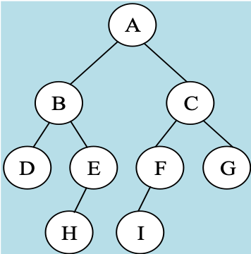

### 后序遍历的递归算法

```c
# include "stdio.h"
struct btnode //定义链表结构
{ char data; //定义结点值
   struct btnode * lchild; 
                 //定义左子结点指针  
  struct btonde * rchild; 
                 //定义右子结点指针
};
   postorder(root) //后序遍历
   struct btnode * root; 
                  //定义根结点指针
{      if(root! = NULL)
                   //如果不是空结点
{   postorder(root->lchild); 
               //递归后序遍历左子结点
      postorder(root->rchild); 
               //递归后序遍历右子结点
      printf("%c \ n", root->data); 
                          //输出当前结点值
}         return; //结束
	}
｝
```

## 四、森林与二叉树的转换

将一棵树转化为等价的二叉树方法如下：

1. 将树中的各兄弟（堂兄弟除外）之间加一根连线。
2. 对于任一结点，除保留它与最左边孩子的连线外，删去它与其余孩子之间的分支。
3. 以树的根为轴心，将整棵树按顺时钟方向旋转大约45°。

下图（a）所示的一棵树，转化为二叉树的过程如图（b）所示。

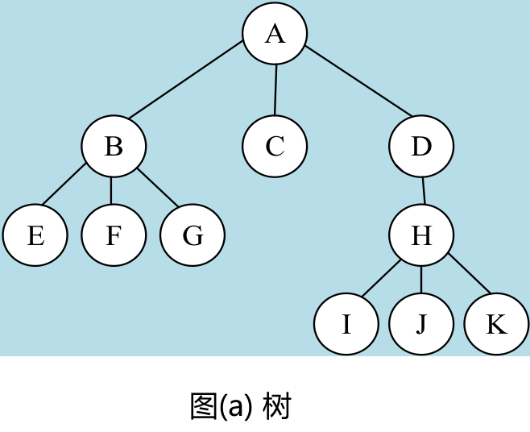
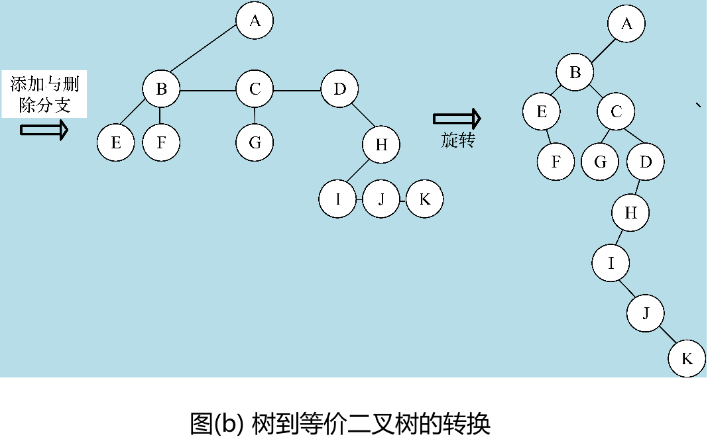

把一个森林转化为二叉树的方法如下：

1. 将森林中的每棵树先依次转化为相应的二叉树。
2. 将第二棵二叉树作为第一棵二叉树的根结点的右子树连接起来，将第三棵二叉树作为第二棵二叉树的根结点的右子树连接起来。
3. 依次进行，直到把所有的二叉树连接起一棵二叉树。

下面（c）（d）两图为森林转化为二叉树的过程。

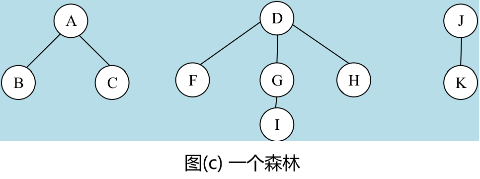

从图（d）可以看出，森林中第一棵树的根结点为转化后等价二叉树的根结点，右子树的根结点为第二棵树的根结点，该根结点加上其左子树即为另一棵树，以此类推，如果把转换过程反过来，可以将一棵二叉树转化为等价的森林。

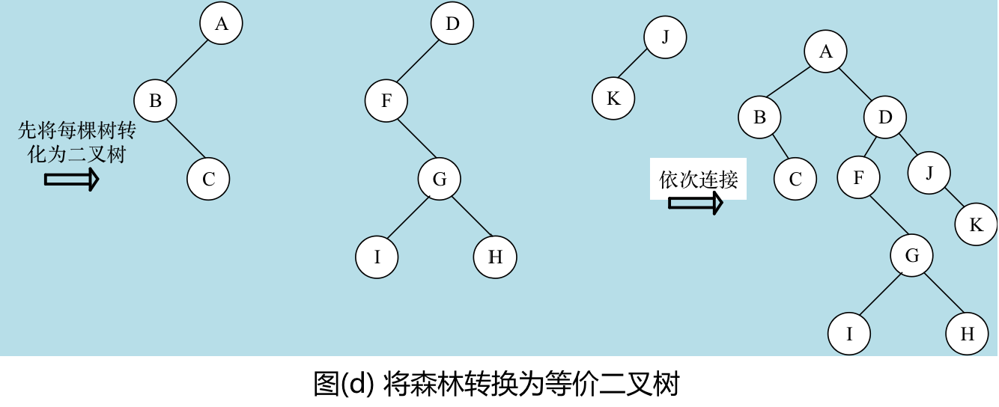

## 五、哈夫曼树及其应用

- 哈夫曼（Huffman）树：又称最优二叉树或最优搜索树，是一类带权路径长度最短的树。
- 二叉树路径长度
  - 树中一个结点到另一个结点之间的路径长度是这两个结点之间的分支所构成的路径上的分支数。
  - 由树的定义可知，从根结点到达树的每个结点有且仅有一种路径。我们规定根的层数为1，如果树中某个结点的层次为k，则从根到该点的路径长度为（k－1）。 

如下图为三棵二叉树，其中图（a）所示的二叉树中，从根A到B，C，D，E，F，G，H，I的路径长度分别为1，1，2，2，3，3，4，4。

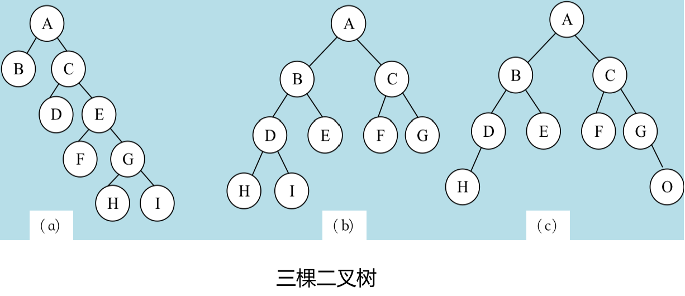

### 哈夫曼树

树的路径长度是从树的根结点到树的各个结点的路径长度之和，记作TL，例如上图所示的三棵二叉树的路径长度分别为：

- TL（a）＝0＋1＋1＋2＋2＋3＋3＋4＋4＝20	
- TL（b）＝0＋1＋1＋2＋2＋2＋2＋3＋3＝16	
- TL（c）＝0＋1＋1＋2＋2＋2＋2＋3＋3＝16  

若将上述概念推广到一般情况，考虑带权的结点，则某结点的带权路径长度是指该结点的路径长度与该结点上权的乘积，二叉树的带权路径长度是指所有带权叶子结点的带权路径长度之和。

如果假定一个有n个权值的集合{w1，w2，…，wn}，其中wi≥0（1≤i≤n），若T是一个有n个叶子的二叉树，而且将权w1，w2，…，wn分别赋给树的n个叶子，则n个叶子的二叉树带权路径长度定义为：

$$WTL = \sum^n_{i=l}w_il_i$$

其中wi为叶子i的权，li为根结点到叶子i之间路径长度，在权w1，w2，w3，…，wn的二叉树中，WTL最小的二叉树称为哈夫曼树或最优树。

### 森林与二叉树的转换

哈夫曼树:又称最优二叉树。它是ｎ个带权叶子结点构成的所有二叉树中，带权路径长度WTL最小的二叉树。因为构造这种树的算法是最早由哈夫曼于1952年提出的，所以被称为哈夫曼树，相应的算法称为哈夫曼算法。

如何构造一棵带权路径长度最短的哈夫曼二叉树呢？

1. 根据n个权值{w1，w2，…，wn}构成n棵二叉树的森林T＝{T1，T2，…，Tn}，其中Ti只有一个带权为 wi的根结点，且左右子树均为空。
2. 在T中选取两棵根结点的权值最小的树作为左右子树，构造一棵新的二叉树，且置新的二叉树的根结点的权值为其左右子树上根结点的权值之和。
3. 在T中删除这两棵树，同时将新得到的二叉树加入森林中。
4. 重复（2）和（3），直到森林中只有一棵树为止，这棵树即为哈夫曼树。

给定权值集合{5，15，40，30，10}构造哈夫曼树，其中最优的带权路径长度为：WTL＝（5＋10）×4＋15×3＋30×2＋40＝205

由下图可以看出，哈夫曼树的结点的度数为0或2，没有度为1的结点。

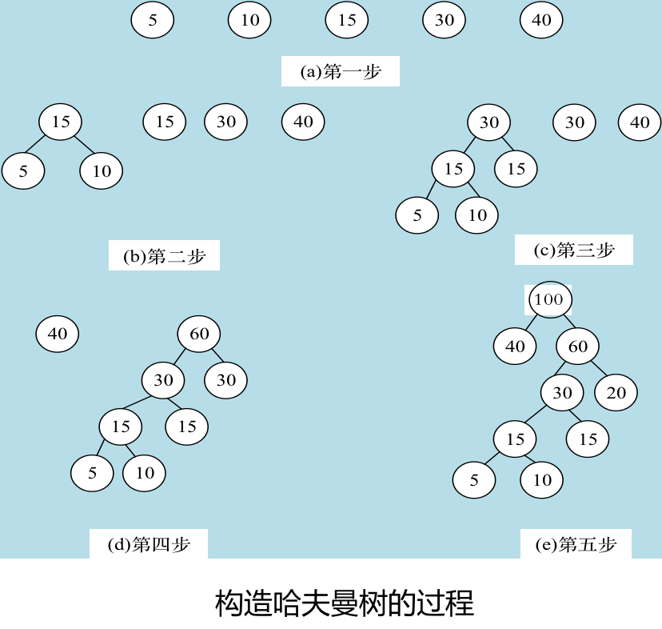

### 哈夫曼编码

哈夫曼树的应用很广，哈夫曼编码就是其在电讯通信中的应用之一。在电讯通信业务中，通常用二进制编码来表示字母或其他字符，并用这样的编码来表示字符序列。

例如，如果在电文中只用到A，B，C，D四种字符，它的二进制编码分别为00，01，10，11，此时若需要传送电文"CDABB"，则实际传送的电文为"1011000100"，译码员按两位进行分组译码，恢复原来的电文。

假定要编码的字符集为{c1，c2，…，cn }，设各个字符的文本中出现的次数（或频率）为集合{ w1，w2，…，wn }。显然，可以把提出的问题归结为构造一棵有n个叶子的哈夫曼叶子中的权值代表字符ci（$1 \leq i\leq n$）的出现次数wi。最优编码的标准是使下面的带权路径长度具有最小值。这里l是字符ci的编码长度，即从根结点到叶子wi的路径长度。

$$WTL = \sum^n_{i=l}w_il_i$$

例如，设有一文本的字符序列是：DATA TRERTER ARE AREA ART上面的文本里面字符集为{A，D，T，R，E}，各字母出现的次数为{6，1，4，6，4}。现设计每个字母的最优编码。可以选用{6，1，4，6，4}作权构造一棵最优树，如下图所示。

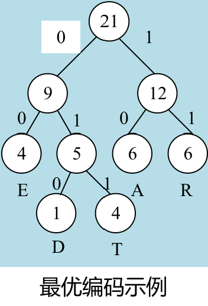

规定从各非终端结点发出的左分支上标上0，右分支上标上1，于是，从根结点到叶子的路径上的0和1组成的序列，就是该叶子所对应的字母编码，本例中各字母的哈夫曼码为：

字母|A|D|T|R|E
---|---|---|---|---|---
编码|10|010|011|11|00

## 六、小结

本章主要介绍了树和与树相关的存储结构和算法，这些内容是本课程的重点。 

而本章的重点是二叉树，介绍了二叉树的定义，性质及遍历算法。要求读者能熟练掌握二叉树的前序，中序，后序遍历的递归算法，以及树和二叉树之间，森林和树之间转换的具体方法。 

本章还介绍了哈夫曼树和哈夫曼编码。