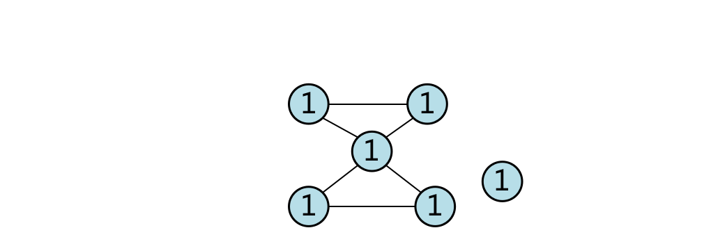

## 一、图的基本概念

图（graph）是一种比线性表、树更为复杂的数据结构，在树中节点之间有明显的层次关系，每层上的节点可以和它下一层中的多个节点相连，但只能和它上面一层的一个节点（即双亲节点）相联接。 

- 图的构成：一个图是由两个集合V和E所组成的，V是有限的非空顶点（vertex）集合，E是用顶点对表示的边（edge）集合，图G的顶点集和边集分别记为V（G）和E（G），而将图G表示为G＝（V，E）也就是说，决定一个图需要知道它的顶点集合与边的集合。
- 无向图：无向图（undirected graph）的边是无序的，即（Vi，Vj）和（Vj，Vi）都代表连接顶点Vi和顶点Vj的一条边，它们的相同的。
- 有向图：有向图（directed graph）的边是有序的，〈Vi，Vj〉和〈Vj，Vi〉都关联于顶点Vi和Vj，但它们不是同一条边，〈Vi，Vj〉表示从顶点Vi到顶点Vj的边，〈Vj，Vi〉则表示从顶点Vj到顶点Vi的边，两者不一定相同。 

例如，两个城市A和B，如果边表示的涵义是两个城市的距离，则（A，B）和（B，A）是相同的。如果边的涵义是两城市之间人口流动的情况，则〈A，B〉和〈B，A〉是不同的。为了在表示上区别于无向图，用〈Vi，Vj〉和〈Vj，Vi〉表示有向图的边。

在下图上，图的顶点通常画成一个小圆圈，圆圈中放置顶点的编号，两同点之间的边用直线或弧线连接。有向图的边还需加上箭头以示方向，给出了两个图G1和G2，其中G1是无向图，G2是有向图。


- 顶点的度（degree）：图的顶点的度是关联于该顶点的边的数目。如果与顶点Vi相连的数目为n，则称顶点Vi的度为n。若是有向图，则顶点的度还包含着出度与入度，从顶点发出的边的数目称为出度，记为outdegree，进入顶点的边的数目叫作该顶点的入度，记为indegree，有向图的某个顶点Vi的degree（Vi）＝outdegree（Vi）＋indegree（Vi）。
- 子图：$设G`和G是两个图，若有V（G`）\subseteq V（G），E（G`）\subseteq E（G），则称G`为G的子图，如果V（G`）\subset V（G），E（G`）\subset E（G），则把G`为G的真子图。$
- 完全图
  - 在无向图中，若每对顶点之间都有一条边相连，则称该图为完全图（complete graph）。 
  - 在有向图中，若每对顶点之间都有二条有向边相互连接，则称该图为完全图。
    
- 路径：路径是由边所组成，一个图的顶点V1到顶点V2的路径是在“有路可达”的前提下，以V1为起点，V2为终点所经历的边的序列。路径上边的数目称为路径的长度。
- 回路：如果某条路径的起点与终点都是同一顶点，则称此路径为回路，如果回路上除顶点与终点外，不再有相同的顶点，则称此回路为简单回路。如下图（a）中，1234531为回路，1231和3453为简单回路，在（b）图中1423421是回路，14231，1421，2342是简单回路。
    
- 连通图和连通分量
  - 对于无向图，如果图中任何两顶点间都是有路径可达的，则称此图是连通图，无向图的最大连通子图称为它的连通分量。 
  - 对于有向图，如果图中任何两顶点都是相互有路径可达的，则称此有向图是强连通的，如果图中任何两顶点至少有一个顶点由另一顶点可达，则称此有向图是单向连通的。有向图的最大强连通子图称为它的强连通分量。
    
    
- 网络：网络（network）是每条边上带有数量指标（权）的连通图，按问题的需要，权可以是距离、费用、时间流量等。一个网络由三个因素决定，一是顶点集、二是边集、三是每条边上的权集，记作G＝（V，E，W）。网络也分为无向网络和有向网络。

## 二、图的存储结构

### 邻接矩阵

在实际应用中，一般根据对图的具体运算来选取适当的存储结构，这里介绍两种常用的存储方法—邻接矩阵和邻接表表示法。

假设图有n个结点，顶点编号为1，2，…，n，用一个n阶方阵R来存放图中各结点的关联信息，其矩阵元素Rij定义为右图：


例如下图（a）和（b）中的邻接矩阵分别为下图。


由于网络是一种带权的连通图，所以将邻接矩阵稍加改变便可以用来表示网络。设网络G＝（V，E，W）具有n个顶点，编号1，2，…，n。描述网络G的带权邻接矩阵为n阶方阵R，其元素Rij，定义为下图


观察左图所示的网络，该网络的带权矩阵为右图所示


实现一个图的邻接矩阵是很容易的，只需定义一个n×n二维数组，然后在给数组赋值时，根据顶点的邻接信息给出相应的值，就可以得到。

### 邻接表

邻接表又叫邻接链表，它首先把每个顶点的邻接顶点用链表示出来，该表的结点结构可以设计为vertex llink，这样n个顶点就有n个链表。然后用一个一维数组来顺序存储上面每个链表的头指针。一维数组的元素也可设计成为vertex link，这样只要知道了数组的元素就可以确定该顶点与之相关联的顶点信息了。

例如下图所示的回路，其邻接表如下图所示。




如果图为有向图，结构应稍有些变化，因为我们要考虑每个顶点与它相关联的边是发出边还是进入边，然后根据发出边和进入边，建立相应的链表和邻接表和逆邻接表，如下图（b），建立的邻接表和逆接表如后面一张图所示。


## 三、图的遍历

给定一个无向连通图，从图的任意指定顶点出发，依照某种规则去访问图中所有顶点，且每个顶点仅被访问一次，这一访问过程叫作图的遍历（graph traversal）。
图的遍历按照深度优先和宽度优先规则去实施，通常有深度优先搜索法（depth_firstsearch）和宽度优先搜索法（breadth_frist search）两种。

### 深度优先搜索算法

深度优先搜索也叫纵向优先搜索，它的基本思想是：

1. 首先访问指定的起始顶点；
2. 然后在与该顶点邻接的顶点中选择一个未被访问的顶点进行访问；
3. 接着再从现在访问的顶点的邻接顶点中任意选择一个未被访问的顶点进行访问；
4. 如此继续，若到达没有未被访问的邻接顶点的顶点时，则退回到最近访问过的那个顶点上，若它还有未被访问的邻接顶点，则选择一个顶点进行访问。重复上述访问过程，直到全部顶点都访问完毕。

无向图的深度优先搜索发的遍历过程如下：

首先访问出发顶点v。接着，选择一个与v相邻接且未被访问过的顶点w访问之，再从w开始进行深度优先搜索。每当到达一个其所有相邻接的顶点都被访问过的顶点，就从最后所访问的顶点开始，依次退回到尚有邻接顶点未曾访问的顶点u，并从u开始进行深度优先搜索。这个过程进行到所有顶点都访问过，或从任何一个已访问过的顶点出发，再也无法到达未曾访问过的顶点，则搜索过程结束。

对右上图从顶点1出发，用深度优先搜索法遍历，可得到一个访问顺序：①－＞②－＞⑤－＞⑥－＞③－＞④。用深度优先搜索法对右上图进行遍历，还可以得到以下序列（假设①为起始顶点）


下面即将演示的算法程序中，用一个数组visit来存放结点访问标志，数组的每一个元素visit[i]记录图中编号为i的结点是否被访问过，即visit[i]＝0为结点i未被访问过，visit[i]＝1为结点i已被访问过。在开始主遍历前，数组中的所有元素都是0。

```c
struct node // 单链表中结点结构 
{ int vertex; // 顶点编号 
struct node * next }; // 指针域 
struct headnode // 数组中元素的结构 
{ int vert; // 顶点编号 
struct node * link}; // 指针域

struct headnode *adjlist(d, n) 
int n; 
int d[]; 
{  struct headnode head[100] ; 
   struct node * q, * p ; 
   int i, vl; 
   for(i=0; i<n; i++ ) 
{  head[i].vert=d[i]; 
     // 为每个顶点建立一个连接 
   head[i].link=NULL; 
           //下一个指针先置空
   printf (“input linked list of \ n”); 

scanf (“%d”, &vl); 
 while (vl> =0)		// 若此数值为有效 
{  p=(struct node *）
   malloc(sizeof(struct node));    // 开辟新节点 
    p->vertex =vl; 		// 放入顶点编号 
    p->next = head[i].link;	// 重新将指针定向 
     head[i].link= p; 
     scanf(“%d”, &vl); 	// 再输入下一个相连的顶点编号
} 
} 
  return (head); 
} 
 
void dfs(head, k, visit) 
  struct headnode head[1000]; 
int k, vist []; 
{  int i; 
   struct node * p; 
   printf(“v%d”, k); 	// 输出起始点
   visit[k]=1; 	// k节点已被访问过 
   p=head[k－1].link; 

 // p指针指向节点k相连的下一个顶点 
while ( p! = NULL) // 当存在与k节点相连的顶点时 
{ if (visit[p->vertex] = =0)
       // 若此顶点未被访问过 
   dfs(head, p->vertex, visit);
             // 递归调用此函数 
  p=p->next; // 指向下一个顶点 
} 
    return; 
} 

main()
{int d[100],visit[100];
　struct headnode * head;　　
　int n=5;	//此例中只用到5个顶点
　int i;k=1;
　for(i=0;i<n;i++)
{scanf("%d",&d[i]);
visit[i]=1;}
　head=adjlist(d, n);
　dfs(head, k, visit);	//k为起始顶点 这里是1
}
```

## 四、生成树和最小生成树

## 五、最短路径(Dijkstra算法)

## 六、拓扑排序

## 七、小结


