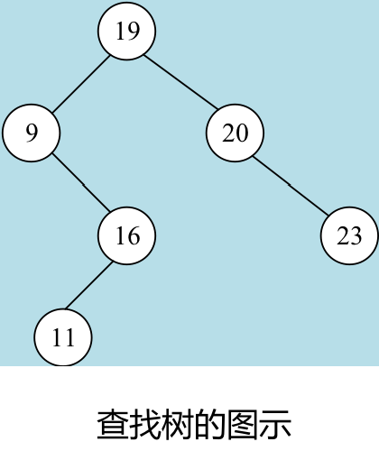
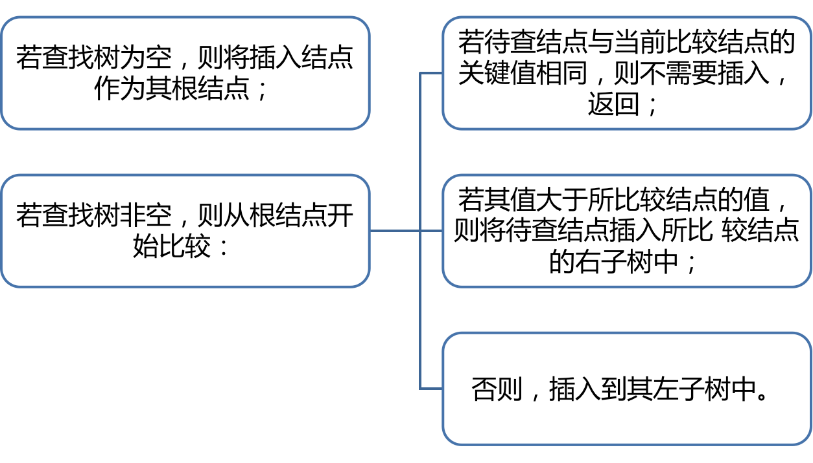
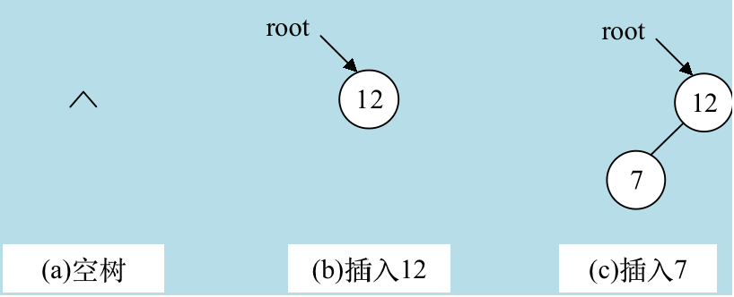
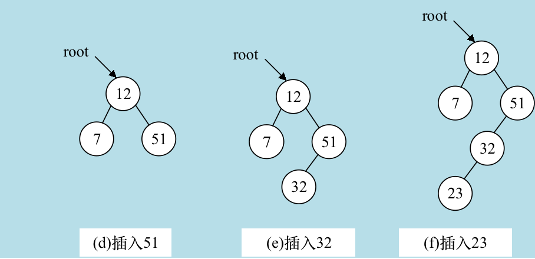
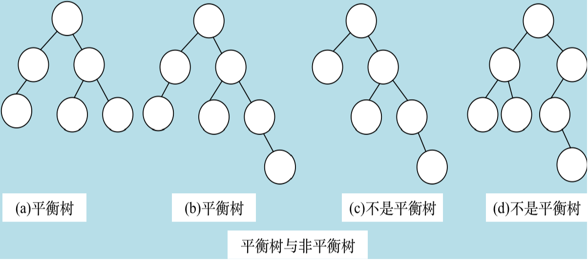

## 一、线性表的查找

### 顺序查找

它的基本思路是：从线性表的第一个结点开始，一个接一个地依次往下查找，如找到的结点关键字与给定的值x相等，则查找成功，否则查找失败。
如果线性表中n个数存储在一位数组array[n]中，相应查找的函数如下：

```c
#define MAX 128
int shx(array, n, k)
int array[], n,k;
{ int i;
array[n]=k;
i=0;
while(array[i]!=k) i++;
if(i<n) return (1);
else return (-1);
}

void main()
{ int a[MAX]; int i,n,k;
printf(“How many nodes in the array\n”);
scanf(“%d”,&n);
printf(“Please input the value of array element \n”);
for(i=0; i<n; i++) scanf(“%d”, &a[i]);
printf(“The key word?”);
scanf(“%d”, &k);
i=shx(a,n,k);
if(i>0) printf(“Found No.%d element of the array \n”,i+1);
else printf(“Not found”);
}
```

### 二分查找

二分查找，又称折半查找，进行二分查找前必须具备以下两个条件：

1. 现象表采用顺序存储结构。
2. 线性表中结点的关键字已排好序（递增或递减），下面的讨论均假定线性表是递增的。

二分查找是一种高效率的查找，假设被查找的线性表存在于一维数组 re[0]，…，re[n-1]中，现要查找其中是否有k值，二分查找的基本思路是：

1. 令l=0，r=n-1。
2. 如果$l\leq r$，则转（3），否则，查找失败。
3. 令mid= [(l+r)/2]，则re[mid]为此数组从re[l]到re[r]这一个段在中间位置的结点的键值。
4. 如果k=re[mid]，查找成功，结束；否则,转（5）。
5. 如果k<re[mid]，因为已假定线性表是递增有序的，则只需在re[mid]的"左"边的值中查找即可，因此令r=mid-1，转(2)；如果k>re[mid]，令l=mid+1，转（2）。

根据上面的思路，如果k$\neq$re[mid]，则将查找范围缩小为原查找范围的一半再查找，所以称为二分查找。

```c
#define MAX 128
int erfen(int array[], int n,int key)
{ int l, r, mid;
l=0; r=n-1;
while(l<=r)
{ mid=(l+r)/2;
if (key==array[mid]) return mid;
if (key<array[mid]) r=mid-1;
else l=mid+1;
}
return -1;
} 

void main()
{ int i,result;
int a[MAX];
int key,n;
printf(“Input the array size the array \n”);
scanf(“%d”,&n);
for(i=0; i<n; i++) scanf(“%d”, &a[i]);
printf(“The key word:”);
scanf(“%d”, &key);
result=erfen(a, n, key);
if(result>=0) 
printf(“In the No.%d of the array”,result+1);
}
```

## 二、查找树的查找

### 查找树的概念

查找树即二叉查找树，又称二叉排序树（Binary Sort Tree）。一棵二叉查找树，或者是一棵空树，或者满足以下递归条件：

1. 查找树的左、右子树各是一棵查找树。
2. 若查找树的左子树非空，则其左子树上的各结点值均小于根结点的值。
3. 若查找树的右子树非空，则其右子树上的各结点值均大于根结点的值。



下面讨论二叉查找树的运算。现定义查找树中的一个结点的存贮结构如下： 

### 查找树的运算

```c
struct node {
int val；
struct node * lchild，* rchild；
}；
typedef struct node NODE；
```

### 查找树的查找

由查找树的定义，结合以前学过的树的遍历知识，查找树的中序遍历是一个严格递增序列，如上图中查找树的中序遍历序列为 9，11，16，19，20，23。因此对查找树的查找与二分查找类似，其查找次数不超过树的深度。假设现已存在一棵查找树，很容易给出如下的查找算法：

```c
NODE *search(NODE *root, int key)
    //在以root为根节点的查找树中查找关键字key的节点，返回该结点的指针
{
NODE *p;
if(root==NULL) return NULL;  //查找树为空返回
p=root;
while(p)
{ if(p->val==key) return p;     //找到返回该结点的指针
if(p->val>key) p=p->lchild;    //待查值在当前结点的左子树中
else p=p->rchild;}            //待查值在当前结点的右子树中
return p;                    //没找到返回NULL
}
```

### 查找树的插入和生成



上述过程是一个递归的过程，其结果是待查结点总是作为一个叶子结点插入到查找树中。

例如对一个给定的序列 12，7，51，32，23其查找树的形成过程如下图所示。




## 三、平衡树的查找

平衡树 ：又称平衡二叉树（Balanced Binary Tree），它或者是一棵空树，或者是一棵这样的树：树中任一结点的左、右子树的深度相差不超过1。如定义结点的平衡度为其右子树的深度减去其左子树的深度，则对于平衡查找树，它的每个结点的平衡度只能为-1，0，1三个值之一。如下图所示：



## 四、哈希(Hash)表的查找

对于一个各个年龄血压值的统计记录，其相应的记录就可以年龄作为自变量，而该自变量对应的函数值即为存贮该年龄记录的地址。定义该函数为h(n)=n， （单位为一个记录的贮存区的大小），这样要取得某个年龄，比如30岁的血压统计值只要直接取得地址30的内容即可。

对于一个各个年龄血压值的统计记录，其相应的记录就可以年龄作为自变量，而该自变量对应的函数值即为存贮该年龄记录的地址。定义该函数为h(n)=n， （单位为一个记录的贮存区的大小），这样要取得某个年龄，比如30岁的血压统计值只要直接取得地址30的内容即可。