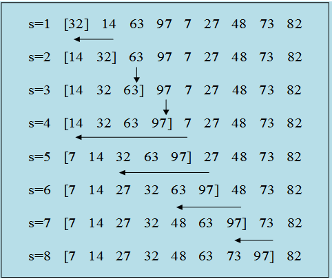
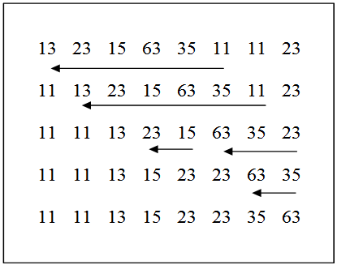
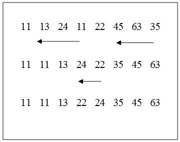
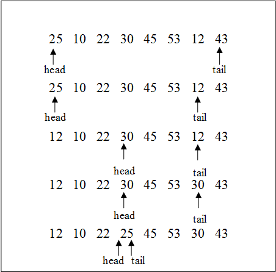
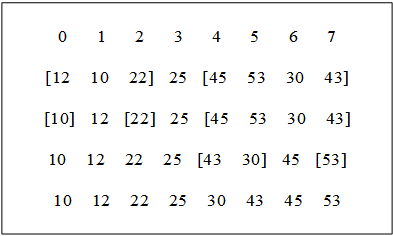
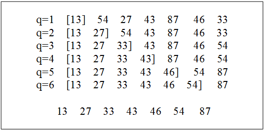

## 一、排序的基本概念

什么是排序？设有n个结点的一个序列{R1，R2，R3，……，Rn}，它们对应的关键字值序列为{K1，K2，K3，……，Kn}，排序就是要确定出这n个结点的一个新的序列{Rq1，Rq2，……Rqn}，这个新序列中的关键字Kq1，Kq2，……，Kqn满足递增或递减的关系，即：$Kq1 \leq Kq2\leq …… \leq Kqn或Kq1 \geq Kq2 \geq Kqn。$

排序的过程中具有相同关键字的那些结点再排序前后，如果它们在结点序列中的先后相对次序保持不变，则称这种排序方法是稳定的；否则称这种排序方法是不稳定的。
例如：一组数5，2，6，3，2，用一种排序方法排序后，这组数成为：2，2，3，5，6，则这种排序方法是稳定的。而用另一种排序方法排序后，这组数成为：2，2，3，5，6，则这种排序方法是不稳定的。

### 排序排序的分类

按储存的位置来区分，排序分成内部排序和外部排序两大类。

- 内部排序：是指排序期间全部结点都存放在内存中，并在内存中按某种关系（递增或递减关系）调整等待排序结点的存放位置。内部排序不涉及数据的内、外交换。
- 外部排序：是指在排序期间，大部分结点都存放在外存中，但排序的过程还是要借助内存来调整存放在外存的等待排序结点的位置。

## 二、插入排序

### 直接插入排序

直接插入排序是一种简单的排序方法，一般采用一维数的存储方式，基本操作是每次将一个结点按关键字值的大小插入到一个已排好序的序列当中，直到所有的结点全部插完为止。插入步骤如下：

对n个等待排序的结点序列{d0,d1,……,dn-1},已有s各结点d0,d1,d2,……，ds-1排好序，所以存在不等式：

$d0 \leq d1 \leq ……\leq ds-1$，对下一个要插入的结点ds，首先将ds的值送到一个临时的变量t，然后用t值依次与排好序的结点序列中的ds-1,ds-2,……，d0进行比较,并且将比t大的结点依次右移一个位置。如果存在某个$dm(0 \leq m\leq s-1)$，满足ds>=dm，则把t送到dm+1；如果这样的dm不存在，那么在比较过程中，ds-1,ds-2,……，d0都依次后移了一个位置，最后在d0放置t即ds。
上述步骤执行了（n-1）遍后，排序完成。

下面我们用例子来说明排序的过程。

一组记录的关键字序列为{32,14,63,97,7,52，27，48，73，82}。按递增顺序进行排序，过程如下图所示：



```c
以下是直接插入排序的程序代码：
#define MAX 100
void main()
{ int d[MAX];
  int s, q, t, n;                    
              /*结点数*/
  printf(“How many  
        nodes?\n”);
  scanf(“%d”,&n);            /* 接受输入结点值，放置在数组d中 */
  for(s=0; s<n; s++)
{printf(“Input No %d value \n”, s+1);

scanf(“%d”, &d[s]);}
}
/*插入排序*/
s=1;
while(s<n)
{ t=d[s]; /*t是临时变量*/
for(q=s-1; q>=0&&t<d[q]; q--)    
  d[q+1]=d[q];	/*结点右移一个位置*/
 d[q+1]=t; 		/*q值为-1，则不存在某个值比t小…*/
 s+=1;
}
// (在这里设n=9，输入数的顺序为32,14,63,97,7,27,48,73,82)
```

## 三、交换排序

### 冒泡排序

冒泡排序是一种较为简单的排序方法。它的算法是：首先将待排序结点中相邻两结点值相比较，若不满足顺序条件（从小到大）则交换两结点位置，反之，则保持不变。这样每次最小的结点就象气泡一样浮到序列的最前位置（所以称之为冒泡），而较大的结点逐渐往下沉，并且每次都要缩小比较的范围。对有n个结点的序列至多需要（n-1）次冒泡。

例如待排序序列为{13,23,15,63,35,11,11,23}，冒泡排序的执行过程如右图所示.假设排序结点有n个，那么冒泡排序最多执行（n-1）遍。第一遍最多执行（n-1）次比较，第二遍最多执行（n-2）遍比较，……，第（n-1）遍最多执行一次比较。所以，整个排序过程最多进行n（n-1）/2次比较。如果待排序序列已经排好序，那么只要执行一遍排序，即（n-1）次比较就可以结束排序了。



```c
// 以下是冒泡排序的程序代码：
#define MAX 100
void main()
{ 
    int d[MAX];
    int s, q, t, n;
    printf(“How many nodes?\n”);
    scanf(“%d”,&n);            /* 接受输入结点值，放置在数组d中 */
    for(s=0; s<n; s++)
    {
        printf(“Input No %d value \n”, s+1);
     scanf(“%d”, &d[s]);}
    /*冒泡排序*/
        for(s=0; s<n; s++)     
        { 
            for(q=n-1; q>s; q--)    /*从后往前比较，将最小的值放在前面*/
                if(d[q]<d[q-1])           /*比较相邻结点的值*/
            { t=d[q];d[q]=d[q-1];
                d[q-1]=t;
            }
        }
/*输出排序后的结点序列*/
for(s=0; s<n; s++) {
    printf(“%d”,d[s]);
    printf(“\n”);}
}

// （此处n=8，输入的数组及顺序为13,23,15,63,35,11,11,23）
// 以下是改进的冒泡排序的程序代码：
#define MAX 100
void main()
{ int d[MAX];
int s, q, t, n;                   /*结点数*/
printf(“How many nodes?\n”);
scanf(“%d”,&n);            /* 接受输入结点值，放置在数组d中 */

for(s=0; s<n; s++)
{printf(“Input No %d value \n”, s+1);
 scanf(“%d”, &d[s]);}
}
m=0;/*首次交换的范围为0至n-1*/
while(m<n-1) 		/*若m=n-1时，则循环结束*/
{ q=n-1; 	/*q用来记录此次交换的位置，每次初始化为n-1*/
for(s=n-1; s>m-1; s--)   
/*从此往后比较，找出最小的结点值“冒泡”，比较的范围每次为m至n-1*/

 if(d[s]<d[s-1])
       /*比较相邻结点的值*/
{  t=d[s];d[s]=d[s-1];
   d[s-1]=t;
   q=s;
    /*必须写在if语句的内部*/
}
      /*记录本次发生交换的当前位置*/
   m=q;  
    /*一次交换发生位置互换的最后位置，如果为n-1，则说明未发生交换 */
}

for(s=0; s<n; s++)
/*输出排序后的结点序列*/
printf(“%d”,d[s]);
printf(“\n”);
}
(这里n=8，输入的数依次为：11,13,24,11,22,45,63,35)
```

### 冒泡排序的改进方法

用m的值来记录上次发生交换的最后位置，那么，d[0]，d[1]，……，d[m-1]这些数中未发生过两数的交换，说明这些数已经是从小到大排列的，而最后一次交换发生在d[m-1]与d[m]之间，这说明d[m-1]是d[m]，……，d[n]这些数中的最小数，从上面的分析可以看出：d[0]，d[1]，……d[m-1]已最终排好序。如果m=n-1，那么结束整个排序过程。如果m<n-1则排序交换的范围缩小为m至n-1。

对于结点序列{11，13，63，45，22，24，11，35}，改进方案排序过程如下图所示。



### 快速排序

快速排序的基本方法是：进行多次划分，最终实现排序。

所谓划分指的是：在一组待排序的数中任选一个结点的值（通常取第一个结点）作为分界值，然后重新排列所有数，形成一个新的序列，在这个新的序列中，分界值位置之前的所有数（这些数称为左子集）都小于或等于分界值，分界值位置之后的所有数（这些数称为右子集）都大于或等于分界值。

例如：一组数 25，10，22，30，45，53，12，43，选取25作为分界值，进行一次划分后这组数的新序列为12，10，22，25，45，53，30，43。我们发现：

1. 一次划分后，分界值不再需要移动位置，它已处于排序后的正确位置。
2. 只需分别在左子集、右子集多次进行类似的递归划分，最终就能实现整组数的排序。那么如何进行划分呢？

设一组待排序的数为：d[min],d[min+1],……,d[max],设定两个变量head，tail，令它们的值为：head=min，tail=max，取分界值P=d[min]，一次划分的具体算法是：

1. 当head<tail时转到（2），否则（说明head=tail）转（4）。
2. 从右向左扫描，直到找到一个值小于P的X，然后将X放到d[head]位置，然后转（3），即

    ```c
    while(head<tail&&d[tail]>=P)tail--;
    if(head<tail)d[head++]=d[tail];
    ```
3. 从左向右扫描，直到找到一个大于P的值Y，把Y的值赋给d[tail]，然后转（1），即
    ```c
    while(head<tail&&d[head]<=P)head++;
    if(head<tail)d[tail--]=d[head];
    d[head]=P;
    // 结束。
    ```

根据这个算法，对这组数25，10，22，30，45，53，12，43 的一次划分过程如下图：（P=25)



一次划分也称为快速排序中的一趟排序，一次划分后再对左子集。右子集分别进行多次划分，最终就可以实现所有数的排序。下图为上面这组数整个排序过程。



图中，将第一个结点的值作为分界值，当然还可以把结点序列中间一个结点的值作为分界值P，可以证明，利用快速排序的方法对n各结点序列所需的结点平均比较次数为nlog2n次。

如果再精确点，一般为1.4nlog2n。这与同数量级nlog2n的其他排序方法比较，平均速度要快得多。虽然，快速排序的平均排序时间要短得多，但对几乎已经排好序的结点序列，快速排序的效率是最差的。同时快速排序是不稳定的。

交换排序的方法是：比较两个待排序结点的值，若不满足从小到大的顺序条件，则交换两结点的位置，反之则保持两结点的相对位置。

## 四、选择排序

选择排序的方法是：每次从待排序结点序列中选出结点值最大或最小的，然后将它放在已排好序的结点序列的前部或尾部，直到待排序序列已无任何结点。

### 直接选择排序

直接选择排序，是一种简单的排序方法。它的算法是：

1. 对n个待排序结点做（n-1）次的扫描，第一次扫描找出整个结点序列中结点值最小的，并将它与第一个结点交换位置；
2. 第二次扫描从第二各结点开始，找出剩余的n-1个结点中结点值最小的，并把它与第二各结点交换位置……；
3. 如此重复至n-1次。则整个个结点序列已是排好序的。

例如，结点序列:{54,13,27,43,87,46,33}直接选择排序执行过程如下图所示。



```c
#define MAX 100              /*最多结点数*/
void main()
{ int d[MAX];
  int s, q, t, n;
  printf(“How many nodes?\n”);     /*结点数*/
  scanf(“%d”,&n); /* 接受输入结点值，放置在数组d中 */
  for(s=0; s<n; s++)
{ printf(“Input No %d value \n”, s+1);
 scanf(“%d”, &d[s]);} 
}

/*直接选择排序*/
for(s=0; s<n; s++)
{k=s;
for(q=s+1; q <n; q++)
if(d[k]>d[q]) k=q;
t=d[s];
d[s]=d[k];
d[k]=t; /*结点右移一个位置*/
}/*输出排序后的结点序列*/
for(s=0; s<n; s++) 
 printf(“%d”,d[s]);
 printf(“\n”); 
}
(此处n=7，输入数的顺序为54,13,27,43,87,46,33)
```

### 堆排序

堆是一棵拟满二叉树，且堆中的任意结点的值都不小于它的左子结点（如果有的话）也不小于它的右子结点（如果有的话）。
如果一棵具有n个结点的拟满二叉树是堆，那么按照顺序存放该树的数组d[n]就表示该堆。这样，堆中的任意点就具有以下性质：

1. d[i]>=d[2i+1]，2i+1<n 
2. d[i]>=d[2i+2]，2i+2<n

堆排序的主要工作是将n个结点的序列构造成堆和将对调后剩余的结点调整成新堆。对具有n结点的堆，共需要进行n-1次对调结点和堆调整。

构造堆的方法是将二叉树逐步调整成堆。如果将要构造成堆的结点序列描述为一个拟满的二叉树，最后一个非子叶结点是第[（n-1）/2]各结点。由此调整可从第[（n-1）/2]个结点开始构造。

有如右上图所示，调整应丛第三个结点37开始。由于37小于左子树结点，不符合堆的定义，将以37为根的子树调整成堆如第二步。第二个结点43小于左子树结点86，将以43为根的子树调整成堆如第三步。同理，第一个结点为56的子树，其结果如第四步。最后将整个二叉树调整成堆如第五步。

```c
#define MAX 100              /*最多结点数*/
void duitiaozheng(d,s,n)	/*调整成堆的子程序*/
int d[]; int s,n;
{ int q, t=d[s];
while((q=2*s+1)<n)             /*有左孩子  */
 {if (q<n-1&&d[q]<d[q+1])
	q++;        /*找出其左右孩子树中较大的一个*/
if(t<d[q])
{ d[(q-1)/2]=d[q];
 s=q;}		/*与较大的孩子结点交换，并比较孙子结点*/
else 
break;
} 			/*直至左右结点都不大于它*/
d[(q-1)/2=t; 
}

void dui_sort(d, n)
{   int d[]; int n;
{  int s,t;
   s=(n-1)/2;
 
/*对从d[(q-1)/2的结点构成的子树开始调整堆，
直while(s>=0) 至结点d[0]形成整个结点序列的堆*/

{ duitiaozheng(d,s,n); s--; }
   
/*堆每个以下标为s的结点为根结点的子堆调用堆调整函数，形成大堆*/

s=n-1;				   /*堆排序，循环次数为n-1*/
while(s>0)  
{ t=d[0]; 			  /*对调结点*/
  d[0]=d[s];
  d[s]=t;
  duitiaozheng(d,s,n);         /*对调后重新调整堆*/
  s--;}
}
void main()
{ int d[MAX]; 
  int s, t, n; /*结点数*/
  printf(“How many nodes?\n”);

 scanf(“%d”,&n);            
  for(s=0; s<n; s++)
{ printf(“Input No %d value \n”, s+1);
 scanf(“%d”, &d[s]);}     /* 接受输入结点值，放置在数组d中*/
  dui_sort(d,n);
  for(s=0; s<n; s++)
  printf(“%d”,d[s]);   /*输出排序后的结点序列*/
  printf(“\n”);
}
```

## 五、小结

上面介绍的只是几种简单的排序方法。到现在为止，已有的排序方法远远不止这些。选取排序方法主要考虑以下情况：

1. 节点本身信息量的大小；
2. 待排序的节点数目；
3. 节点关键字的架构；
4. 排序稳定性的要求；

可以得出的结论有：

当待排序的结点个数n较大时，则应该采用快速排序或堆排序。从平均排序速度来看，快速排序的速度最快，但在最坏情况下（待排序的结点序列已经几乎排好序），他的时间性能却很差。这时不如采用堆排序。但要注意快速排序和堆排序都是不稳定的。

当n较小时，则可采用直接插入排序或直接选择排序。其中，直接插入排序所需的结点移动操作较多。

下表归纳了本章介绍的6种排序方法的时间复杂性和稳定性。

排序方法|结点比较次数|稳定性
:---:|:---:|:---:
直接插入排序|n的平方|稳定
希尔排序|n的1.3次方|不稳定
冒泡排序|n的平方|稳定
快速排序|nlog2n|不稳定
直接选择排序|n的平方|不稳定
堆排序|nlog2n|不稳定