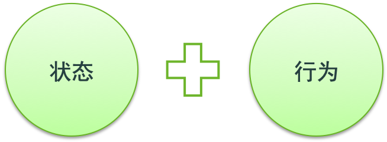
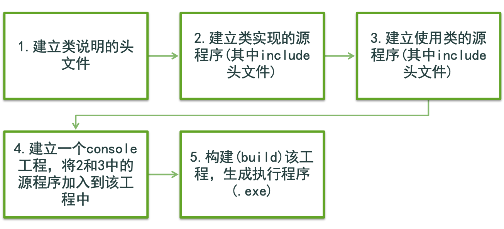
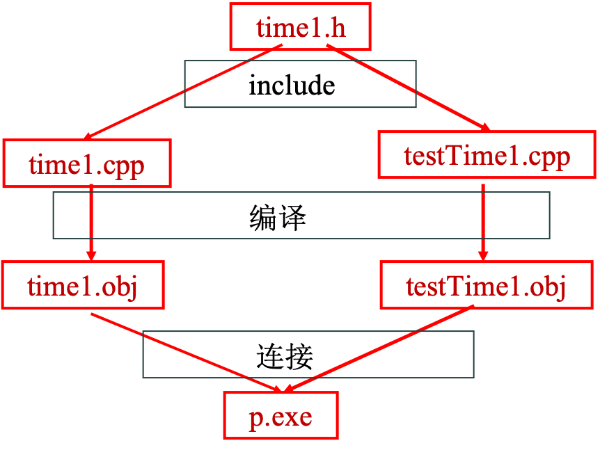

## 2.1 引言

### 什么是对象(object)

世界中的任何事物都是对象。对象由状态和行为封装(encapsulation)组合而成。



### 对象的特点

1. 对象的状态只能被自己的行为所改变。对象之间通过消息(message)相互作用，一个对象可以向另一个对象发送消息，以达到相互联系的目的。
2. 面向对象程序设计(OOP)用软件方法模拟现实世界中的各种对象。在C++语言中，将具有相同属性和行为的对象抽象(abstract)为类(class)。
3. C++语言还利用继承(inheritance)的关系---新建类通过先用类派生建立。一个类中的一个行为可接收来自不同对象的不同类型的消息，并做出不同的反应，这就是面向对象程序设计中的**多态性**(polymorphism)。

### 面向对象程序设计的优点

1. 因为直接模拟了现实世界中的对象，因此这种设计方法更自然、更直观。 
2. 对象之间通过消息通信，因此可实现对象的自包含和相对独立性。 
3. 由于对象中封装了数据(状态)和函数(行为)，因此能实现信息隐藏(data hiding)，对另一个对象来说，它的实现细节完全隐藏。 

### 面向对象程序设计的特点总结

- 继承性
- 抽象性
- 封装性
- 多态性

### 面向对象程序设计的实现

通过类(class)这种自定义类型(user defined type)描述一组对象所共有的属性(数据成员 data member)和行为方法(成员函数 member function)。这实现了面向对象程序设计的**抽象性和封装性**。

通过类的导出（derive）机制建立新的类。这实现了面向对象程序设计的**继承性**。

通过函数名重载(function overloading)、运算符重载(operator overloading)和虚函数(virtual function)机制实现静态多态性和动态多态性。这实现了面向对象设计的**多态性**。

## 2.2 结构的定义

在C语言中，使用struct定义结构类型。struct和类型标志(tag)作为一个自定义的类型名使用。例： 

```c++
struct Time  
{ 
    int hour;
    int minute;    
    int second;  
}; 
```
定义了一个类型名称为struct Time的新类型。

在C++语言中，使用struct定义结构类型，类型标志位一个自定义的类型名使用。这里类型名称为Time。

在C语言中，结构直播暗含数据成员(data member)，而在C++语言中，除了包含数据成员之外，还允许包含成员函数(member function)_ 

## 2.3 访问结构的成员

访问结构成员(无论是数据成员，还是成员函数)均使用两个运算符：          
`.      -> `

这两个运算符都是双目(binary)运算符。 

`.`的左操作数是结构对象的名称，右操作数是结构中的某一个成员的名称。 <br/>
`->`的左操作数是指向结构对象指针的名称，右操作数也是结构中的某一个成员的名称。

### 程序例子

```c++
struct Time 
{  
    int hour;    
    int minute;    
    int second; 
}; 
Time t; 
Time* pt; 
…… 
cout << t.hour; 
pt = &t; 
cout << pt->minute;
```

## 2.4 用结构实现用户定义的类型

问题：定义一个表示时间概念的类型Time 。

```c++
//*****************************************
// 建立一个结构、设置其成员和打印该结构
//******************************************
#include <iostream>
using namespace std;
struct Time {  // 结构的定义
  int hour;    // 0 - 23
  int minute;  // 0 - 59
  int second;  // 0 - 59
};
void printMilitary(const Time&); // 函数原型
void printStandard(const Time&); // 函数原型

// 以军用格式打印时间
void printMilitary(const Time& t)
{
   cout << ( t.hour < 10 ? "0" : "" ) 
        << t.hour << ":"
        << ( t.minute < 10 ? "0" : "" ) 
        << t.minute << ":"
        << ( t.second < 10 ? "0" : "" ) 
        << t.second;
}

// 以标准格式打印时间
void printStandard(const Time& t)
{
   cout << (( t.hour == 0 || t.hour == 12 ) 
            ? 12 : t.hour%12 )
        << ":" << ( t.minute < 10 
            ? "0" : "" ) << t.minute 
        << ":" << ( t.second < 10 
            ? "0" : "" ) << t.second
        << ( t.hour < 12 ? "AM" : "PM" );
}

int main()
{  Time dinnerTime;  // 新类型Time的变量
   
   // 给成员设置合法的值
   dinnerTime.hour=18;
   dinnerTime.minute=30;
   dinnerTime.second=0;
   
   cout << "Dinner will be held at ";
   printMilitary(dinnerTime);
   cout << " military time, \nwhich is ";
   printStandard(dinnerTime);
   cout << " standard time. " << endl;

   // 给成员设置不合法的值
   dinnerTime.hour=29;
   dinnerTime.minute=73;
   dinnerTime.second=103;
   
   cout << "\nTime with invalid values: ";
   printMilitary(dinnerTime);
   cout << endl;
       
   return 0;
}
```

### 使用结构定义Time类型的缺陷

定义结构对象（变量）时如果没有给出初始值，则对象处于不稳定状态（其数据成员的值可能是随机值），而这时使用该对象会产生语义错误。

对结构对象的数据成员复制由于没有收到控制，因此也可能被赋予不合理的值而导致语义错误。

因使用结构类型的程序代码直接操作了结构类型中的数据成员，则当改变结构的实现方法（如用一个整型数表示时间[从0:0:0]到现在的时间秒数）时，所有使用改机构的程序代码也需要进行对应的修改，以适应新的结构定义。

使用结构的程序代码以结构中的单个数据成员作为基本使用单位，不能对结构进行整体操作。如要比较两个时间的先后顺序，只能通过比较各个数据成员才能完成。

### 解决缺陷的方法

使用类定义方法替代结构定义方法可以解决

使用结构定义时产生的一些缺陷。

## 2.5 用类实现抽象数据类型

类用来模拟具有属性（数据成员）和行为（成员函数）的对象，用关键字class开始定义类这种自定义的数据类型(user-defined data type)。 

### 程序例子 类Time

```c++
#include <iostream>
using namespace std;
class Time {  
public: Time();               // 缺省构造函数
   void setTime(int,int,int); // 设置时、分、秒
   void printMilitary();      // 打印军用格式时间
   void printStandard();      // 打印标准格式时间
private:
    int hour;    // 0 - 23
    int minute;  // 0 - 59
    int second;  // 0 - 59
};


// 类Time的构造函数把每一个数据成员初始化为0，
// 从而保证类Time的所有对象都有稳定的初始状态。
Time::Time() { hour=minute=second=0; }

// 用军用格式的时间为类Time的数据成员设置新的值。
// 检查数据的合法性。把不合法的值设置为0。
void Time::setTime( int h, int m, int s )
{
    hour = ( h >= 0 && h < 24 ) ? h : 0;
    minute = ( m >= 0 && m < 60 ) ? m : 0;
    second = ( s >= 0 && s < 60 ) ? s : 0;
}

// 打印出军用格式时间
void Time::printMilitary()
{
   cout << ( hour < 10 ? "0" : "" ) 
        << hour << ":"
        << ( minute < 10 ? "0" : "" ) 
        << minute<< ":"
        << ( second < 10 ? "0" : "" ) 
        << second;
}


// 打印出标准格式时间
void Time::printStandard()
{
   cout << ( ( hour == 0 || hour == 12 ) 
             ? 12 : hour % 12 )
         << ":" << ( minute < 10 
             ? "0" : "" ) << minute
         << ":" << ( second < 10 
             ? "0" : "" ) << second
         << ( hour < 12 ? " AM" : " PM" );
}

// 测试简单的类Time
int main()
{ Time t; // 建立类Time的实例对象t
  cout << "The initial military time is ";
  t.printMilitary();
  cout << "\nThe initial standard time is ";
  t.printStandard();
  t.setTime( 13, 27, 6 );
  cout << "\n\nMilitary time after setTime is ";
  t.printMilitary();
  cout << "\nStandard time after setTime is ";
  t.printStandard();


 t.setTime( 99, 99, 99 ); // 试图设置非法值
 cout << "\n\nAfter attempting invalid settings:"
      << "\nMilitary time: ";
 t.printMilitary();
 cout << "\nStandard time: ";
 t.printStandard();
 cout << endl;
     
 return 0;
}
```

### 用类实现抽象数据类型

#### 类的访问属性

- public: 使用对象的任何函数均可访问。一般对应于类的使用界面（接口）。 
- private: 只有本类中成员函数才能访问，不能被任何非类成员函数访问。一般对应于类的内部表示，对类的使用者（也称客户client）隐藏。

#### 构造函数

构造函数(constructor)是一种与类同名的具有public访问属性的一种特殊函数，专门用于初始化类的对象。在建立类对象时，构造函数被自动隐式地调用。 

#### 作用域约束符

- 在类说明之后定义成员函数时，成员函数名前必须加上类名作用域(class scope)约束符::，表示该函数不是一个全局函数，而是属于类作用范围的一个成员函数。
- 类名作用域约束符::是必须的，否则就无法区分一个函数是全局函数，是这个类的成员函数，还是另一个类的成员函数。 

#### 使用类说明对象

定义好的类可用于说明对象。 

例： 

```c++
Time sunset,      
arrayofTime[10],       
*pTime,       
&dinnertime=sunset; 
```

分别定义了对象sunset，数组arrayofTime，指针pTime和引用dinnertime 。

#### 使用类的好处

1. 类的使用者不依赖于具体实现，也不需要了解实现细节。 
2. 使用构造函数保证对象具有稳定性，不至于出现具有非法时间值的一个Time对象。 
3. 由于构造函数是在建立对象的时候自动被调用的，所以一开始对象就是稳定的。 
4. 通过成员函数SetTime修改时间，该函数也保持了对象的稳定性。 
5. 由于hour等是private成员，因此类的使用者不可能直接对它们进行修改，也不可能破坏对象的稳定性。

### 使用类的注意点

- 数据成员不能在说明处赋值。因为说明类只是建立一种新的数据类型，而不是定义一个对象，因此对象还不存在，也就没有对应的存贮空间，更谈不上对一个对象赋值了。 
- 类的初始化(initialization)在类的构造函数中完成。构造函数在建立对象的时候自动被调用。 
- 类的使用者只能访问类的接口(interface)（public 成员函数），不能访问类的实现(implementation)（private数据成员或成员函数）。 
- 类的销毁(destroy)在类的析构函数(destructor)中完成。析构函数在销毁对象的时候自动被调用。析构函数是具有public访问属性的成员函数，函数名为符号~加上类型名。通常执行一些对象销毁前的清理(cleanup)工作。在类Time中，由于无需做清理工作，因此没有定义析构函数。 
- 类在说明后，还必须进行实现(implement)。实现就是定义每一个类的成员函数。定义成员函数可以在类说明时完成，也可在类说明后再给出它们的函数定义。
- 实现时，小的函数定义可直接在类说明中给出定义。大部分成员函数的函数定义应在类说明之后再给出。 
- 在类说明后再给出成员函数的定义，有助于分离类的接口和类的实现，满足面向对象程序设计中数据抽象的基本要求。 
- 在Time类中，两个print成员函数没有参数，表示它们操作的数据就是本对象中的数据成员。可以这样理解：这两个函数的操作对象就是函数名之前点运算符 . 左边的对象。 

## 2.6 类的作用域和访问类的成员

类范围是一种作用域。一个类中的数据成员和成员函数均具有以该类名为名称的作用域。

在类成员函数定义中，具有该类作用于的标识符可以使用雷鸣约束，但也可省略。

- 在全局范围，类成员函数名必须使用该类作用域作为类名约束，不可省略。形式为：`类名::类成员函数名 `
- 在其它函数中，使用对象名访问类作用域中的标识符时，形式为：`对象名.类成员 `
- 在其它函数中，使用对象指针访问类作用域中的标识符时，形式为：`对象指针->类成员 `

### 重载类的成员函数

1. 在一个类的作用域内，函数名可以重载，只要这些函数之间的参数类型不同就可以了。 
2. 不同类作用域内的函数名之间没有重载关系。

### 程序例子

```c++
//*******************************************
// 演示成员访问运算符 . 和 ->
//*******************************************
#include <iostream>
using namespace std;
// 简单的类Count
class Count {
public:
    int x;
    void print() { cout << x << endl; }
};

int main()
{ 
    Count  counter,    // 建立对象counter
        *counterPtr = &counter, 
                    // 指向counter的指针
        &counterRef = counter;
                    // 对counter的引用
    cout << "Assign 7 to x and print using the object's name: ";
    counter.x = 7;    // 把7赋给数据成员x
    counter.print();  // 调用成员函数print
 
    cout << "Assign 8 to x and print using a reference: ";
    counterRef.x = 8;     // 把8赋给数据成员x
    counterRef.print();   // 调用成员函数print

    cout << "Assign 10 to x and print using a pointer: ";
    counterPtr->x = 10;   // 把10赋给数据成员x
    counterPtr->print();  // 调用成员函数print
 
    return 0;
}
```

## 2.7 接口和实现的分离

接口是类的使用界面，接口和实现相互分离，使得程序易于修改，不易产生“水波效应”。对使用者来说，只要接口不变，使用者就不需要修改使用类相关的代码。实现发生改变（如采用更好的数据表示方法或采用更好的函数定义算法）时，使用者只要重新编译其程序即可，编写的代码无须改变。 

### 接口和实现的分离方法

1. 接口放在一个自制的头文件(.h)中，包括类的说明代码。即iclass开始，到;结束。
2. 实现放在一个源程序文件(.cpp)中，它包括每个成员函数的定义。
3. 若一个类开发完成后共别的程序员使用，则应提供类说明头文件和实现代码。实现代码通常以目标代码(.obj)形式或库代码(.lib)形式提供。库代码是将若干函数的目标代码进行打包组合而形成的。

### 接口和实现的分离
  
#### 类使用者使用类的方法

- 在使用类的源程序文件中include类说明的头文件。
- 连接目标代码时，连接类实现对应的目标代码文件或库文件。 

#### 在VC++ 2010中类实现和类使用的方法



#### 类Time的例子

1. time1.h是类说明的头文件
2. time1.cpp是类的实现源程序
3. testTime1.cpp是类使用的源程序

上机时，需要将time1.cpp和testTime1.cpp放置在同一个Console工程中。

### 程序例子

```c++
// time1.h   类Time的声明
// 防止多次包含相同的头文件
#ifndef TIME1_H
#define TIME1_H
class Time {  
public: Time();                    // 缺省构造函数
        void setTime(int,int,int); // 设定时、分和秒
        void printMilitary();      // 按军用时间格式输出
        void printStandard();      // 按标准格式输出
private: int hour;     // 0 - 23
         int minute;   // 0 - 59
         int second;   // 0 - 59
};
#endif

// time1.cpp         类Time的成员函数的定义
#include <iostream>
using namespace std;
#include "time1.h"

Time::Time() { hour=minute=second=0; }

void Time::setTime( int h, int m, int s )
{
    hour = ( h >= 0 && h < 24 ) ? h : 0;
    minute = ( m >= 0 && m < 60 ) ? m : 0;
    second = ( s >= 0 && s < 60 ) ? s : 0;
}

void Time::printMilitary()
{   cout << ( hour < 10 ? "0" : "" ) << hour << ":"
         << ( minute < 10 ? "0" : "" ) << minute<< ":"
         << ( second < 10 ? "0" : "" ) << second;
}
void Time::printStandard()
{  cout << ( ( hour == 0 || hour == 12 ) 
             ? 12 : hour % 12 )
         << ":" << ( minute < 10 
             ? "0" : "" ) << minute
         << ":" << ( second < 10 
             ? "0" : "" ) << second
         << ( hour < 12 ? " AM" : " PM" );
}

// testTime1.cpp   使用类Time的程序

#include <iostream>
using namespace std;
#include "time1.h"
int main()
{
    Time t; // 建立类Time的实例对象t

    cout << "The initial military time is ";
    t.printMilitary();
    cout << "\nThe initial standard time is ";
    t.printStandard();

    t.setTime( 13, 27, 6 );
    cout << "\n\nMilitary time after setTime is ";
    t.printMilitary();
    cout << "\nStandard time after setTime is ";
    t.printStandard();
    t.setTime( 99, 99, 99 ); // 试图设置非法值
    cout << "\n\nAfter attempting invalid settings:"
         << "\nMilitary time: ";
    t.printMilitary();
    cout << "\nStandard time: ";
    t.printStandard();
    cout << endl;
    return 0;
}
```



## 2.8 控制对成员的访问 

### 类的访问属性

1. public 任何函数均能访问 
2. protected (在第5章说明)
3. private 只有本类的成员函数才能访问。 缺省情况下，类的访问属性为private。

**public 成员是类的接口，private 成员是类的内部实现。**

### 错误的程序例子

```c++
//error.cpp   演示试图访问类的私有成员所导致的错误结果
#include <iostream>
using namespace std;
#include "time1.h"
int main()
{  Time t; 
   // 错误：不能访问Time::hour
   t.hour=7;
   // 错误：不能访问Time::minute
   cout << "minute=" << t.minute;
   return 0;
}
```

### 类访问属性的意义

保持类的所有数据成员都是private的，然后给类使用者提供设置或获取private成员的函数。这种做法有助于对类使用者隐藏类的实现，从而减少意外的错误和提高程序的可修改性，方便程序调试。

class和struct都可用来说明一个类。

- class:class中缺省访问属性为private
- struct:struct中缺省访问属性为public 

### "get"函数与"set"函数：

- "get"函数使类使用者读取private成员的值
- "set"函数使类使用者设置private成员的值。

对private成员的操作看起来违反了private成员的含义，但是在这两种函数中通常对读取或设置的值进行一定的数据有效性检查与加工。

### 类SalesPerson的例子

1. salesp.h是类的说明头文件
2. salesp.cpp是类的实现源程序
3. testSalesp.cpp是类使用的源程序

**上机时，需要将salesp.cpp和testSalesp.cpp放置在同一个Console工程中。**

### 程序例子

```c++
// salesp.h   类SalesPerson的声明
// 成员函数在文件salesp.cpp中定义
#ifndef SALESP_H
#define SALESP_H
class SalesPerson {  
public:
   SalesPerson();              // 构造函数
   void setSales();            // 由用户提供售货额
   void printAnnualSales();    
private:
    double sales[13];             // 12个月的售货额
    double totalAnnualSales();    // 工具函数
};
#endif

// salesp.cpp   类SalesPerson的成员函数
#include <iostream>
#include <iomanip>
using namespace std;
#include "salesp.h"
SalesPerson::SalesPerson() // 构造函数对数组的初始化
{  for ( int i = 0; i <= 12; i++ ) sales[ i ] = 0.0; }
void SalesPerson::setSales() // 设置12个月售货额的函数
{ for ( int i = 1; i <= 12; i++ ) 
  { cout << "Enter sales amount for month " 
         << i << ": ";
    cin >> sales[i];
  }
}

// 计算年度总售货额的私有工具函数
double SalesPerson::totalAnnualSales()
{  double total = 0.0;
   for ( int i = 0; i <= 12; i++ )
        total += sales[ i ];
   return total;
}
// 打印年度总售货额
void SalesPerson::printAnnualSales()
{  cout << setprecision( 2 )
        << setiosflags( ios::fixed | ios::showpoint )
        << "\nThe total annual sales are: $"
        << totalAnnualSales() << endl;
}

// testSalep.cpp  演示工具函数的使用
#include <iostream>
using namespace std;
#include "salesp.h"
int main()
{  SalesPerson s;         // 建立类SalesPerson的对象s

   s.setSales();           
   s.printAnnualSales();  

   return 0;
}
```

## 2.9 访问函数和工具函数

访问函数是类供使用者使用的接口的一部分，访问属性为public.

工具函数是供类内部使用的那些成员函数，即被别的成员函数访问的那部分函数。工具函数的访问属性为private。

## 2.10 初始化类的对象：构造函数

1. 构造函数是专门完成对象初始化工作的类成员函数。
2. 构造函数是在建立类对象时被自动调用的，它不能被显示调用。
3. 类的初始化必须在构造函数中进行，不能再定义类的数据成员时对他们初始化。

### 构造函数的特征

- 函数名相同，具有public访问属性。
- 不能使用任何返回类型（包括void也不能使用），在函数定义中也不能返回任何值
- 构造函数可重载，表示有几种不同的方法来进行对象的初始化。

### 使用构造函数的好处

- 保证每个类的对象都能使用正确的值初始化。
- 由于对象的初始化是自动进行的，因此不会忘记对象的初始化。 

### 定义对象时指定构造函数实参的方法

对于一个类T，定义对象o ：

1. T o ;            // 构造函数不使用参数，不能写成 T o( ); 
2. T o(实参列)；     // 1个或多个参数的情况 
3. T o = T(实参列);  // 1个或多个参数的情况 
4. T o = 参数；      // 这种形式只能用于一个参数的情况 

## 2.11 在构造函数中使用默认参数 

和普通函数一样，狗在函数的参数中也可以使用默认参数。

使用默认参数的好处是：即使没有给初值，对象也会使用默认参数进行初始化。

### 缺省构造函数

- 没有参数的构造函数或提供全部默认参数的构造函数就是缺省构造函数(default constructor)。 
- 当一个类没有定义任何构造函数时，系统自动提供一个缺省构造函数。当定义了一个或几个重载的构造函数之后，系统不再提供缺省构造函数。 
- 系统提供的缺省构造函数不做任何初始化工作，不能保证对象具有稳定的状态，所以类中一般应提供自己的构造函数来完成初始化工作。

### 使用缺省参数构造函数类Time的例子

- time2.h是类说明的头文件
- time2.cpp是类的实现源程序
- testTime2.cpp是类使用的源程序

上机时，需要将time2.cpp和testTime2.cpp放置在同一个Console工程中。

### 程序例子

```c++
// time2.h  类Time的声明
#ifndef TIME2_H
#define TIME2_H
class Time {  
public:  Time(int=0,int=0,int=0);     // 缺省构造函数
         void setTime(int,int,int);   
         void printMilitary();        
         void printStandard();        
private: int hour;     
         int minute;   
         int second;   
};
#endif

// time2.cpp   类Time的成员函数的定义
#include <iostream>
using namespace std;
#include "time2.h"
// 初始化私有数据成员的构造函数
// 缺省值是0（参看类的定义）
Time::Time(int hr,int min,int sec)
{  hour = ( hr >= 0 && hr < 24 ) ? hr : 0;
   minute = ( min >= 0 && min < 60 ) ? min : 0;
   second = ( sec >= 0 && sec < 60 ) ? sec : 0;
}
……
// testTime2.cpp  演示类Time的缺省构造函数
#include <iostream>
using namespace std;
#include "time2.h"
int main()
{   
    Time t1,               // 全部参数缺省
         t2( 2 ),          // 分、秒参数缺省
         t3( 21, 34 ),     // 秒参数缺省
         t4( 12, 25, 42 ), // 指定全部参数
         t5( 27, 74, 99 ); // 指定全部非法参数
    cout << "Constructed with:\n"
         << "all arguments defaulted:\n ";

    t1.printMilitary();
        cout << "\n ";
        t1.printStandard();
    cout << "\nhour specified; minute and second 
    defaulted:" << "\n ";
        t2.printMilitary();
        cout << "\n ";
        t2.printStandard();

        cout << "\nhour and minute specified; second 
    defaulted:" << "\n ";
        t3.printMilitary();
        cout << "\n ";
        t3.printStandard();

    cout << "\nhour, minute, and second specified:"
            << "\n ";
        t4.printMilitary();
        cout << "\n ";
        t4.printStandard();
        cout << "\nall invalid values specified:"
            << "\n ";
        t5.printMilitary();
        cout << "\n ";
        t5.printStandard();
        cout << endl;
    return 0;
}
```

## 2.12 析构函数的使用

析构函数是专门完成对象销毁（回收存贮空间）前清理（cleanup）工作的类成员函数。

析构函数是在销毁类对象时被自动调用的，他一般不能被显示调用。

析构函数完成构造函数的逆操作。

### 析构函数的特征

1. 函数名是符号~加类名，具有public访问属性。
2. 不能使用任何返回类型（包括void也不能使用），也不能使用任何参数类型，在函数定义中也不能返回任何值。 
3. 析构函数不能重载，因为它没有参数。 

### 析构函数的好处

保证每个类的对象都能在销毁前进行清理工作。由于对象的析构是自动进行的，因此不会忘记做对象的清理工作。

### 使用情形

- 构造函数中申请了自由存贮区中的空间，在析构函数中就应释放相应的空间。
- 构造函数中打开了一个文件，在析构函数中就应将它关闭。

## 2.13 调用析构函数和构造函数的时机 

调用时自动进行的。建立独享（生存期lifetime开始）时调用构造函数，销毁对象（生存期结束）时调用析构函数。

全局对象的构造函数在main函数之前调用，析构函数在main函数执行结束后调用。不同全局变量的构造函数执行顺序与变量定义的顺序一致，而析构函数调用的顺序正好相反。

- 自动局部变量：自动局部变量的构造函数在程序执行到定义局部变量的语句时调用，在退出包含定义局部变量的语句的块时调用析构函数。不同局部变量的构造函数执行顺序与变量定义的顺序一致，而析构函数调用的顺序正好相反。 
- 静态局部变量：静态局部变量的构造函数在程序第一次执行到定义静态局部变量的语句时调用，而析构函数在main函数执行结束后调用。不同静态局部变量的构造函数执行顺序与变量定义的顺序一致，而析构函数调用的顺序正好相反。

### 类Create的例子:

- create.h是类说明文件
- create.cpp是累的实现源程序
- testCreate.cpp是类使用的源程序

上机时，需要将create.cpp和testCreate.cpp放置在同一个Console工程中。

### 程序例子

```c++
// create.h   类CreateAndDestroy的定义

#ifndef CREATE_H
#define CREATE_H
class CreateAndDestroy {
public:
   CreateAndDestroy( int );  // 构造函数
   ~CreateAndDestroy();      // 析构函数
private:
   int data;
};
#endif

// create.cpp  类CreateAndDestroy的成员函数的定义
#include <iostream>
using namespace std;
#include "create.h"
CreateAndDestroy::CreateAndDestroy( int value )
{   data = value;
    cout << "Object " << data << " constructor";
}
CreateAndDestroy::~CreateAndDestroy()
{ 
   cout << "Object " << data << " destructor " << endl; 
}

// testCreate.cpp  演示构造函数和析构函数的调用顺序
#include <iostream>
using namespace std;
#include "create.h"
// 建立对象的函数
void create( void )
{   CreateAndDestroy fifth( 5 );
    cout << " (local automatic in create)" << endl;
    static CreateAndDestroy sixth( 6 );
    cout << " (local static in create)" << endl;
    CreateAndDestroy seventh( 7 );
    cout << " (local automatic in create)" << endl;
}

CreateAndDestroy first( 1 ); // 全局对象
int main()
{   cout << " (global created before main)" << endl;
    CreateAndDestroy second( 2 ); // 局部对象
    cout << " (local automatic in main)" << endl;
    static CreateAndDestroy third( 3 ); // 局部对象
    cout << " (local static in main)" << endl;
    create(); // 调用建立对象的函数 
    CreateAndDestroy fourth( 4 ); // 局部对象
    cout << " (local automatic in main)" << endl;
    return 0;
}

Object 1 constructor (global created before main)
Object 2 constructor (local automatic in main)
Object 3 constructor (local static in main)
Object 5 constructor (local automatic in create)
Object 6 constructor (local static in create)
Object 7 constructor (local automatic in create)
Object 7 destructor
Object 5 destructor
Object 4 constructor (local automatic in main)
Object 4 destructor
Object 2 destructor
Object 6 destructor
Object 3 destructor
Object 1 destructor
```
---
## 2.14 数据成员和成员函数的使用

## 2.15 微妙的陷阱

## 2.16 逐个成员拷贝的默认赋值方式

## 2.17 软件的可重用性

