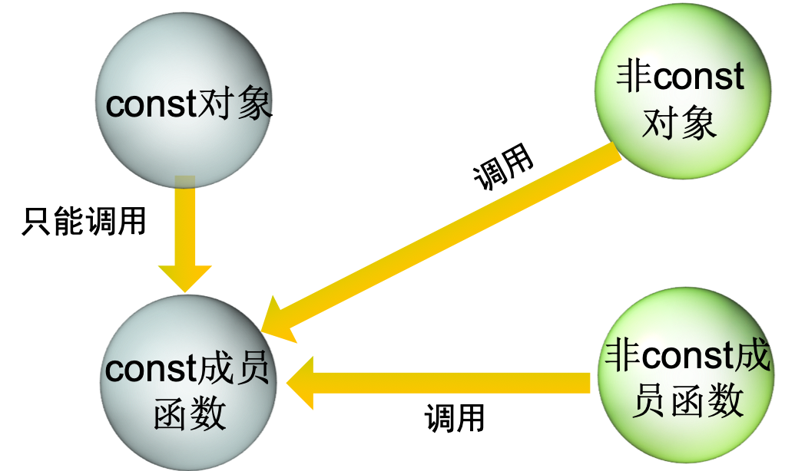

## 3.1 const对象和const成员函数

### const对象

const对象就不是不能改变值的类对象。它的初值在定义时由类的构造函数给定。常量对象建立之后，就不能在对它进行修改，否则会产生编译错误

定义方式为：`const 类名 对象名(初始化参数);`

### const成员函数：

const成员函数就是在函数定义中只读取类的数据成员，而不会去改变类数据成员的一种类成员函数。

在const成员函数中对类的数据成员进行修改或者调用非const的成员函数会产生编译错误。

定义方式为：`成员函数原型 const;`

> 这里const也算是函数类型的一部分。因此在函数原型说明和函数定义时都需要指定const。若甘薯原型中有const，二函数实现时没有实现const,则编译器会认为定义的是另一个函数。

- const成员函数和非const成员函数即使类型相同，也可以重载
- 编译时根据对象的性质决定调用的是哪一个成员函数。


### const对象和成员函数之间的关系

- const对象只能调用const成员函数，不能调用非const成员函数。
- const成员函数能被非const对象调用，也能被非const成员函数所调用。




### 错误使用const对象的例子

- time5.h是说明的头文件
- time5.cpp是类的实现源程序
- testTime5.cpp是类使用的源程序

### 程序例子

```c++
// time5.h         类Time的声明

#ifndef TIME5_H
#define TIME5_H
class Time {  
public:
   Time(int=0,int=0,int=0);     // 缺省构造函数
   
   // “set”函数
   void setTime(int,int,int);   // 设置时间
   void setHour(int);           // 设置hour的值
   void setMinute(int);         // 设置minute的值
   void setSecond(int);         // 设置second的值

 // “get”函数
   int getHour() const;         // 返回hour的值
   int getMinute() const;       // 返回minute的值
   int getSecond() const;       // 返回second的值
 // 输出函数（通常被声明为const成员函数
   void printMilitary() const;  // 输出军用格式时间
   void printStandard() const;  // 输出标准格式时间
private:
    int hour;     // 0 - 23
    int minute;   // 0 - 59
    int second;   // 0 - 59
};
#endif

// time5.cpp       定义类Time的成员函数

#include <iostream>
using namespace std;
#include "time5.h"
// 初始化私有数据的构造函数
// 缺省值为0（参看类的定义）
Time::Time(int hr,int min,int sec)
{ 
    hour = ( hr >= 0 && hr < 24 ) ? hr : 0;
    minute = ( min >= 0 && min < 60 ) ? min : 0;
    second = ( sec >= 0 && sec < 60 ) ? sec : 0;
}

// 读取hour的值
int Time::getHour() const  {   return hour; }
// 读取minute的值
int Time::getMinute() const {  return minute; }
// 读取second的值
int Time::getSecond() const {  return second; }
// 按军用格式 HH:MM:SS 输出时间
void Time::printMilitary() const
{   cout << ( hour < 10 ? "0" : "" ) << hour << ":"
         << ( minute < 10 ? "0" : "" ) << minute<< ":"
         << ( second < 10 ? "0" : "" ) << second;
}

// 按标准格式 HH:MM:SS AM(或PM) 输出时间
void Time::printStandard() const
{   cout << ( ( hour == 0 || hour == 12 ) 
              ? 12 : hour % 12 )
         << ":" << ( minute < 10 ? "0" : "" ) 
         << minute
         << ":" << ( second < 10 ? "0" : "" ) 
         << second
         << ( hour < 12 ? " AM" : " PM" );
}
……

// testTime5.cpp   试图用非const成员函数访问const对象

#include <iostream>
using namespace std;
#include "time5.h"
int main()
{   const Time t( 19, 33, 52 ); // const对象
    t.setHour( 12 );   // 错误：非const函数
    t.setMinute( 20 ); // 错误：非const函数
    t.setSecond( 39 ); // 错误：非const函数

    return 0;
}
```

**如果某些类的数据成员是常量，则如何对这种const的数据成员赋初值呢？**

- 类的常量数据成员的初值必须在类的构造函数中使用初始化的特殊语法予以指定。
- 语法形式为在构造函数定义时使用：
  - **构造函数（形参）：数据成员1（初值1），数据成员2（初值2）...**
- 该格式也可用于非const成员的初值指定。

### const数据成员初始化的例子

```c++
// example.cpp  用成员初始化值初始化内部数据类型的常量

#include <iostream>
using namespace std;
class Increment {
public:
    Increment( int c = 0, int i = 1 );
    void addIncrement() { count += increment; }
    void print() const;
private:
    int count;
    const int increment; // const数据成员
};

// 类Increment的构造函数
Increment::Increment( int c, int i )
  : increment( i ) // const成员的初始化值
{   count = c;   }

// 输出数据
void Increment::print() const
{
   cout << "count = " << count
        << ", increment = " << increment 
        << endl;
}

int main()
{   Increment value( 10, 5 );
    cout << "Before incrementing: ";
    value.print();
    for ( int j = 0; j < 3; j++ ) 
    {
        value.addIncrement();
        cout << "After increment " << j + 1 << ": ";
        value.print();
   }
   return 0;
}
```

### 错误初始化类的例子

```c++
// err.cpp  试图用赋值语句初始化内部数据类型的常量

#include <iostream>
using namespace std;
class Increment {
public:
    Increment( int c = 0, int i = 1 );
    void addIncrement() { count += increment; }
    void print() const;
private:
    int count;
    const int increment; 
};

// 类Increment的构造函数
Increment::Increment( int c, int i )
{                // 没有初始化const成员increment
   count = c;
   increment = i ; // 错误：不能修改const成员
}
// 输出数据
void Increment::print() const
{  cout << "count = " << count
        << ", increment = " << increment << endl;
}

int main()
{   Increment value( 10, 5 );
    cout << "Before incrementing: ";
    value.print();
    for ( int j = 0; j < 3; j++ ) 
    {   value.addIncrement();
        cout << "After increment " << j + 1 << ": ";
        value.print();
   }
   return 0;
}
```

## 3.2 复合：把类作为其它类的成员

## 3.3 友元函数和友元类

## 3.4 使用this指针

## 3.5 运算符new和delete

## 3.6 类的静态成员

## 3.7 数据抽象和信息隐藏

## 3.8 包容器类和递取类


