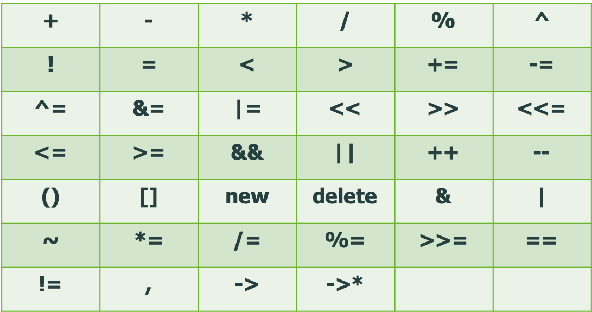
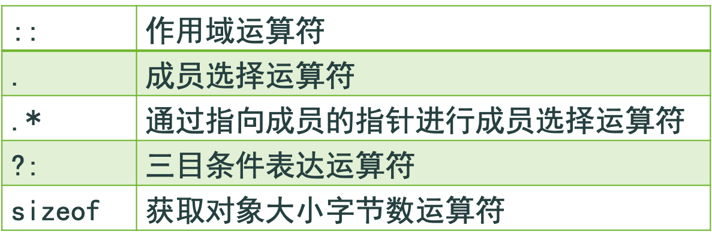

## 4.1 引言

对基本数据类型的数据操作可以使用函数来进行操作，也可以使用运算符在进行操作。如1+2表示执行加法运算的子程序，其中+相当于函数名称，1和2相当于函数的两个参数。

对用户定义类型的对象，如果也能用运算符表示某些函数名的话，则操作的表达往事会比较简洁。

将运算符用于类对象，需要对函数名的命名采用特殊愈发表示，这就是**运算符重载**（operator voerloading）,即赋予一个运算符新的含义。如运算符+即可以表示整数加法运算、浮点数加法运算，也可以表示两个字符串的连接（concatenation）等。

虽然重载运算符所实现的功能也能用函数调用的语法形式完成，但使用重载运算符使程序代码易于阅读，表达简洁。

## 4.2 运算符重载的基本知识

类对象所使用的的运算符必须是基本数据类型原有的运算符，不能建立新的运算符，所以把类对象使用的运算符成为基本数据类型原有运算符的重载版本函数。这使得一个运算符除了原油喊一之外，又赋予了各种各样新的含义，这可以认为运算符的功能得到了扩充。

若运算符表达一个操作比较简洁、明确，则尽量用运算符代替函数名。但不要过度和不合理地使用运算符，否则有可能会使程序代码语义不清和难以阅读。

如：用+运算符表示一个减法操作，这种用法编译器不会有什么意见，但会使程序令人迷惑不解。

运算符重载通过编写函数定义实现。其函数名表示为：`operator运算符`

若运算符是一个符号，则关键字operator和运算符之间可以不用空格分隔，但运算符是一个单词时，operator和运算符之间要用空格分隔。

如：operator+表示重载+运算符时重载函数的函数名。表达式a+b实际表示的就是 a.operator+(b) 或operator+(a,b) 调用。 

可以不重载就能被类对象使用的运算符（缺省使用的运算符）有两个：

- `operator=` : 表示逐个复制类的数据成员。 
- `operator&`: 表示获取对象的地址，这是一个单目运算符。     

重载运算符的目的是为用户定义类型提供简洁表达式这种操作表示方式，在语意和效率上无任何影响。 

## 4.3 运算符重载的限制

### 能被重载的运算符包括



### 不能被重载的运算符



### 运算符重载的限制

1. 重载运算符不能改变运算符本身的优先级。
2. 重载运算符不能改变运算符本身的结合性（左结合或右结合）。
3. 重载运算符不能改变运算符的目数（操作数个数，1或2）。重载运算符不能定义缺省参数。如果运算符既是单目的，又是双目的（如&表示单目的地址，也可以表示双目的位与），则运算符既可以重载为单目的，也可重载为双目的。
4. 不能定义一个本来不存在的运算符（如**）。
5. 不能改变作用于基本数据类型的运算符的含义。重载运算符只能操作用户定义类型的对象，或者是用户定义类型的对象和内部类型对象混合使用。
6. 即单目运算符的一个操作数必须为类对象或为类对象的引用（若是指向类对象的指针，则不允许）；双目运算符的至少一个操作数必须为类对象或者为类对象的引用。
7. 这种规定阻止了对内部数据类型运算符的修改。但new和delete运算符是例外，对于基本数据类，他们也可以被重载。
8. 重载运算符中operator=(赋值)、operator[](下标)、operator()(函数调用)、operator->(通过指针访问成员)，必须是非静态的成员数据，这可保证左边操作数一定是一个左值。其他运算符可以定义为成员函数，友元函数或其他函数。
9. 定义了operator+和operator=，并不意味着可以自动使用operator+=，若要使用operator+=，则必须重载operator+=。

## 4.4 用作类成员和友元函数的运算符函数

运算符函数如果是类的成员函数，则它具有一个隐含的this指针，this所指对象就成为第一个操作数。即用成员函数表示一个双目运算符，该成员函数有一个参数，表示第二个操作数；用成员函数表示一个单目运算符，该成员函数有没有参数。 

运算符函数如果是类的非成员函数，则它没有this指针。即用非成员函数表示一个双目运算符，该函数有两个参数；用非成员函数表示一个单目运算符，该函数有一个参数。 

非成员函数总是比成员函数多一个函数参数。

### 有些运算符规定必须是一个成员函数，这些运算符是：

- operator=(赋值)
- operator[](下标)
- operator()(函数调用)
- operator->(通过指针访问成员)

### 运算符函数的选择

选择一个运算符采用成员函数还是非成员函数的一般原则是：使用成员函数时的左操作数必须是一个类对象，它不能是需要经过类型转换后才为类对象的那种操作数，否则就要采用非成员函数来表示运算符函数。

例如，运算符operator<<和operator>>表示输出/输入时，由于左操作数不是我们正在定义类的对象（如cout为ostream的对象，cin为istream的对象），因此运算符operator<<和operator>>应定义为非成员函数。

### 运算符函数的选择：

采用非成员函数定义运算符函数，还能使运算符满足交换律。而采用成员函数就不一定能满足交换律。

### 运算符函数的选择：

例如，一个复数类Complex，有一个对象 Complex a，表达式 a+1 用成员函数时实际调用形式为a.operator(1)，用非成员函数时实际调用形式为operator(a,1) 。复数的加法运算显然是应该满足交换律的，因此 1+a 应等同于 a+1 。但是1+a无法用成员函数来实现（1.operator(a)是不正确的函数调用，成员选择运算符 . 左边必须是一个类对象），但用非成员函数就能实现，实际调用形式为operator(1,a) 。

因此，类Complex中的+运算符采用非成员函数就比较合适，它能使加法具备交换律。

### 运算符函数的选择

通常还有一个作为选择的标准是：若运算符函数要改变类对象状态，一般采用成员函数；反之，运算符函数只是读取类对象的状态而不会去改变它，则采用非成员函数。

如：Complex的+运算符可采用非成员函数，而+=运算符则采用成员函数。

## 4.5 重载流插入和流提取运算符

### 输入运算符

**输入（流输入）运算符**采用非成员函数。一般形式为：

`istream& operator>>(istream&,T&); `

输入运算符函数的第一个参数为istream&(istream在头文件iostream中定义），第二个参数未正在定义的类，参数必须采用引用参数传递方式。返回类型是istream&，一遍输入运算符能进行连锁调用。

### 输出运算符

**输出（流提取）运算符**采用非成员函数。期一般形式为：

`ostream& operator<<(ostream&,T); `

输出运算符函数的第一个参数为ostream&（ostream在头文件iostream中定义），第二个参数为正在定义的类，参数传递方式可以是传值方式或传递引用方式（为了提高参数传递效率，可用T&；为防止函数中修改实际参数，还可以写成const T&），返回类型是ostream&，以便输出运算符能进行级联调用。

### 重载输入/输出运算符的意义：

重载输入/输出运算符无需修改类ostream和istream，但能使用户定义类型具备输入/输出的能力，这提高了C++语言的可扩展性。

### 程序例子

```c++
// inout.cpp      重载流插入和流提取运算符

#include <iostream>
using namespace std;
class PhoneNumber {
    friend ostream& operator<<(ostream&, 
                               const PhoneNumber&);
    friend istream& operator>>(istream&,
                               PhoneNumber&);
private:
	char areaCode[4];  // 三位数字的区号或为空
	char exchange[4];  // 三位数字的电话局号或为空
	char line[5];      // 四位数字的线路号或为空 
};

// 重载流插入运算符（不能是成员函数）
ostream& operator<<(ostream& output, 
                    const PhoneNumber& num)
{
	output << "(" << num.areaCode << ") "
		    << num.exchange << "-" << num.line;

	return output;  
  // 使得能连续执行 cout << a << b << c
}

// 重载流提取运算符
istream& operator>>(istream& input, PhoneNumber& num)
{
	input.ignore();                 // 跳过(
	input.getline(num.areaCode,4);  // 输入区号
	input.ignore(2);                // 跳过)和空格
	input.getline(num.exchange,4);  // 输入电话局号
	input.ignore();                 // 跳过-
	input.getline(num.line,5);      // 输入线路号
	
	return input;  
      // 使得能连续执行 cin >> a >> b >> c
}

int main()
{	PhoneNumber phone;  // 建立对象phone
	cout << "Enter a phone number in the "
		 << "form (123) 456-7890:\n";
  // cin >> phone 发出函数调用operator>>(cin,phone)
	cin >> phone;
	// cout << phone发出函数调用operator<<(cout,phone)
	cout << "The phone number entered was: \n"
		 << phone << endl;
	return 0;
}
```

## 4.6 重载单目运算符

单目运算符可以定义为没有参数的类成员函数；或者定义为带一个参数的非成员函数，参数必须为类对象或引用。

```c++
// 例： 
class T        
{ 
    public: int operator!( ); 
        // 成员函数没有参数               
        ……         
}；       
T o;        
!o; //实际调用o.operator!( ) 
```

一个运算符函数要么定义为成员函数，要么定义为非成员函数，但是不要同时定义。

```c++
// 例：
class T     
    friend int operator!(T); 
        // 非成员函数带一个参数     
         ……  
    }；  
    T o;   
    !o; //实际调用operator!(o) 。 
```

## 4.7 重载双目运算符

双目运算符可以定义为带一个参数的类成员函数；或者定义为带两个参数的非成员函数，至少有一个参数为类对象或引用。

```c++
// 例：
class T       
    { public:          
    T operator+(T); // 成员函数有一个参数          
        ……       
    }；       
    T o1,o2;       
    o1+o2;   //实际调用o1.operator+(o2 ) 
```

一个运算符函数要么定义为成员函数，要么定义为非成员函数，但是不要同时定义。

```c++
// 例：
class T  	
    {        friend T 
    operator+(T,T); 
    // 非成员函数带两个参数        
    ……    	
    }；    	
    T o1,o2;    	
    o1+o2 ; //实际调用operator+(o1,o2) // 
```

## 4.8 实例研究：数组类Array

## 4.9 类型之间的转换

## 4.10 实例研究：字符串类String

## 4.11 重载++和--

## 4.12 实例研究：类Date

