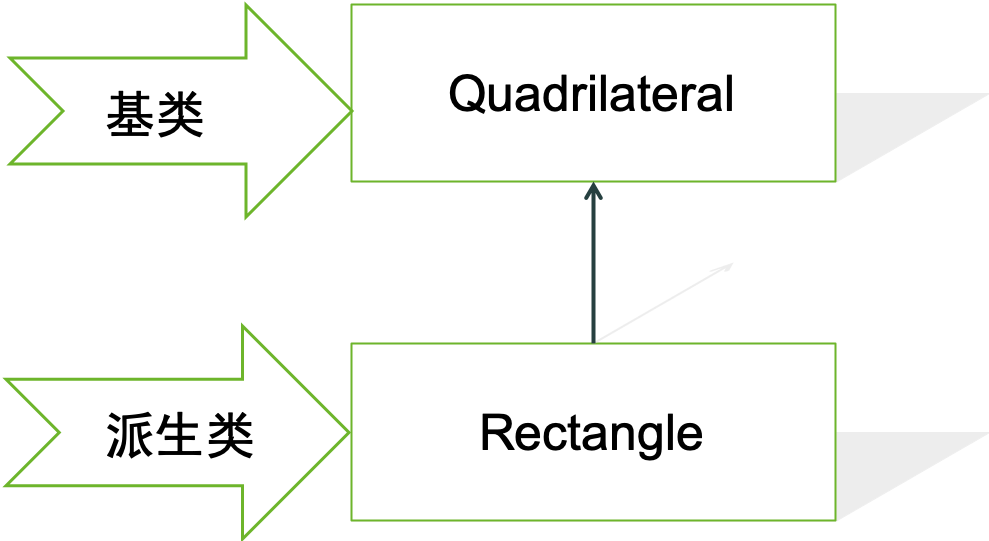
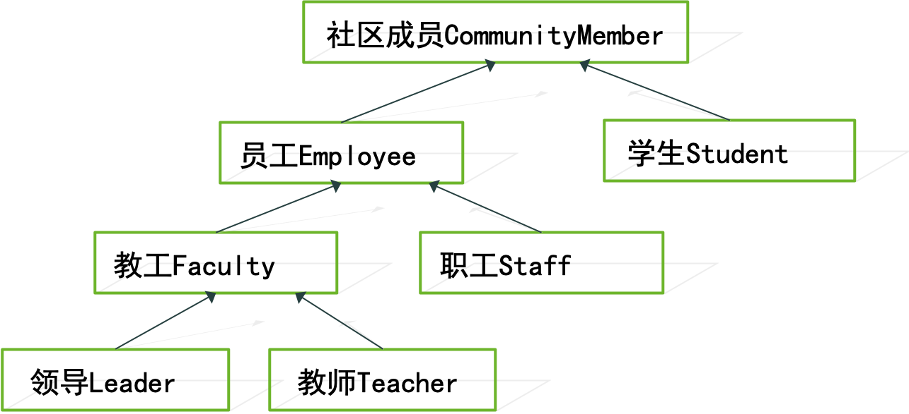
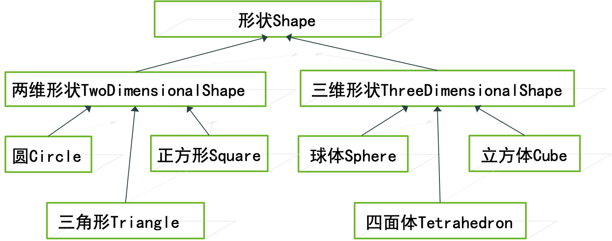
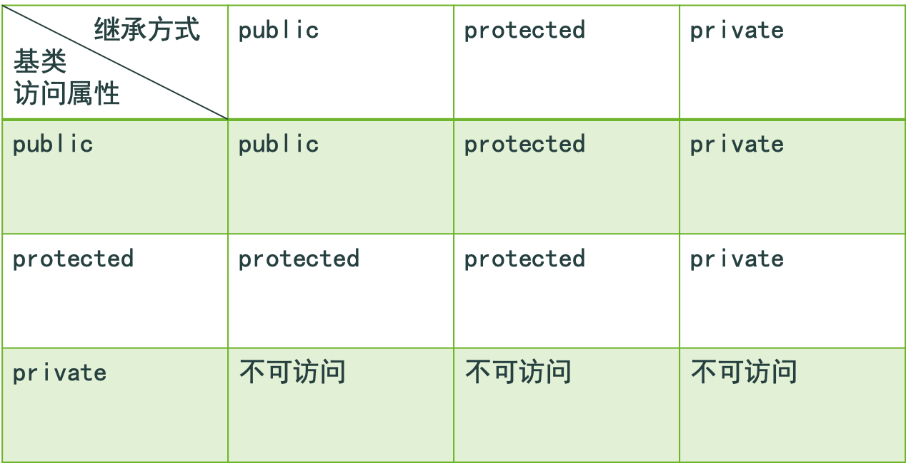
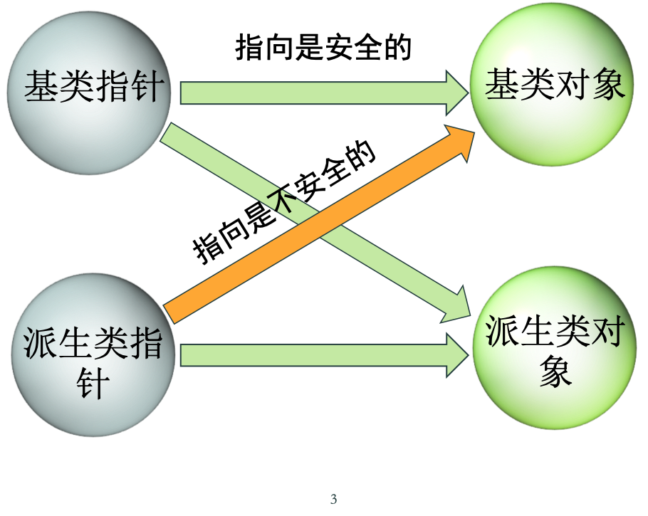
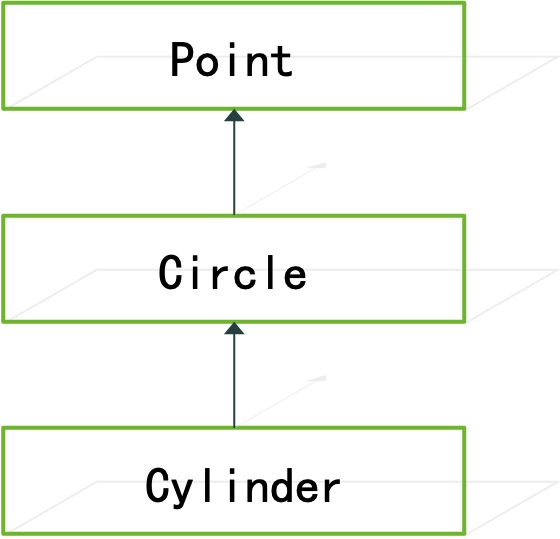

## 5.1 引言

本章讨论面向对象程序设计的一个重要功能——**继承**（inheritance）。

继承是软件重用的一种形式，实现集成的方法是从现有的类建立新类。新类继承现有类的数据和函数，并且为使新类具有自己所特别需要的功能，还要对这些数据和函数进行补充、修饰。

在C++中，被继承的现有类成为**基类**（base class）,继承而产生的新类称为**派生类**（derived class）,也称导出类。

对于**单一继承**（single inheritance）,派生类只有一个直接基类；而对于**多重继承**（multiple inheritance）,派生类有多个直接积累，它继承所有基类的数据和函数。

派生类通常添加了它自己的数据和函数，因此，通常派生类的大小要比基类的大小大，且派生类相对于基类来说，它表示的概念更具体。

集成使程序员能添加基类所不具备的特点以及渠道和改进从基类集成的数据和函数，对它无需拥有或不应该拥有的基类public成员函数重新加以定义，而数据成员无法重新定义，只能提那家。

派生类对象可以当做一个基类对象使用，但返货来，基类对象就不能当做派生类对象使用了。

派生类的成员函数可以访问它自己的基类的protected和public成员，但不能访问基类的private成员。

在C++中研究的对象之间的主要关系有两种：IS A和HAS A。IS A 使用继承来实现，而HAS A用符合（composition）实现。有关复合的实现，见3.3节。

## 5.2 基类的派生类 

例如，我们已经建立了一个表示四边形的类Quadrilateral，要建立一个矩形类Rectangle，我们就不需要从头开始设计和实现Rectangle，而是可以从Quadrilateral出发，通过继承派生出Rectangle。



为什么Rectangle可以从Quadrilateral派生呢？原因是矩形是一个特殊的四边形，它具有四边形的全部特征。当然，矩形还有自己的特点（如四个角全部为90度）。因此，可以说矩形是一个四边形，而四边形就不一定是矩形了。

### 继承层次

通过继承派生出的类也可以成为另一个类的基类，如矩形派生出正方形。这样不同类之间的继承形成了树状的层次结构(class hierarchy)，通常用一个有向无循环图(Directed Acyclic Graphs , DAG)来表示。有向表示类之间的继承和被继承的关系，无循环表示一个类不能直接或间接地成为自己的基类。 

### 继承层次的例子：

#### 由表示各种大学社区成员的类组成的类层次:



#### 由各种形状类组成的类层次:



单一继承的派生类定义语法：
```
  class 派生类 : 继承方式 基类 
  {  // 派生类中新增成员的定义  }; 
```

其中：继承方式为public、protected和private三种。这三种方式名与类的访问属性名写法一样，但表示的是不同的概念。 public继承方式是最常用的，其它两种很少被使用。 当使用public继承方式时，基类的public和protected成员成为派生类的public和protected成员。

使用单一继承建立派生类的例子：
```
  class CommisionWorker : public Employee 
  {      /*…… */     }; 
```

其中：CommisionWorker为派生类，Employee为基类，而public为继承方式。 CommisionWorker继承了Employee的所有数据成员和成员函数，但是在CommisionWorker的成员函数中只能访问Employee中的public成员和protected成员，不能访问Employee的private成员。因此，在一个派生类的对象中虽然包含了基类的private数据成员，但是它不能通过派生类的成员函数来访问，而只能通过基类的成员函数进行访问。

## 5.3 受保护的成员

类的public成员时类的使用接口，private成员时类的内部实现，只能被本类的成员函数或类的友元函数访问。

受保护的成员用protected访问属性来表示，他的含义是：类的派生类成员可以访问自己基类中的protected成员，但是对于其他函数来说，它与private一样，是不允许访问的。

在派生类成员函数中使用基类protected成员或public成员时，可以不使用基类类名作用域约束符。

## 5.4 基类指针强制转换为派生类指针

1. 派生类对象可以当做一个基类对象使用，但反过来，基类对象就不能当做派生类对象使用。
2. 当使用public继承方式时，基类指针既可指向基类对象，也可指向派生类对象。
3. 当使用public继承方式时，基类引用既可引用基类对象，也可饮用派生类对象。
4. 当使用public继承方式时，派生类指针可以隐式转换为基类指针。但是，基类指针不会自动转换为派生类的指针。

要将基类指针转换为派生类的指针，必须使用强制类型转换，但这种转换有时是不正确的。若基类指针确实所指的是派生类对象，强制转换应无问题。但是，当基类指针所指的实际对象是基类对象时，强制转换就会产生很严重的问题。 

### 程序例子

```c++
// point.h

#ifndef POINT_H
#define POINT_H
#include <iostream>
using namespace std;
class Point {  
   friend ostream& operator<<(ostream&, const Point&);
public:
   Point( float = 0, float = 0 );   // 缺省构造函数
   void setPoint( float, float );   // 设置坐标值
   float getX() const { return x; } // 取x坐标值
   float getY() const { return y; } // 取y坐标值

protected: // 允许导出类访问
   float x, y;   // Point的x坐标和y坐标
};
#endif

// point.cpp

#include <iostream>
using namespace std;
#include "point.h"
Point::Point( float a, float b ) 
{   x = a ;    y = b ; }
void Point::setPoint( float a, float b )
{  x = a ;   y = b ; }
ostream& operator<<(ostream& output,const Point& p)
{   output << '[' << p.x << " , " << p.y << ']';
    return output;  // 使得能连续调用
}

// circle.h

#ifndef CIRCLE_H
#define CIRCLE_H
#include <iostream>
using namespace std;
#include "point.h"
class Circle : public Point { // 类Circle由Point导出
   friend ostream &operator<<(ostream&,const Circle&);
public:
  Circle ( float r = 0.0, float x = 0, float y = 0 );
  void setRadius( float );   // 设置半径值
  float getRadius() const;   // 返回半径值
  float area() const;        // 计算面积

protected:
  float radius;
};
#endif

// circle.cpp

#include "circle.h"
Circle::Circle( float r, float a, float b )
  : Point( a, b ) {   radius =  r ;  }
void Circle::setRadius( float r )
{   radius =  r ;  }
float Circle::getRadius() const {   return radius;  }
float Circle::area() const
{   return 3.14159 * radius * radius;   }

ostream &operator<<(ostream &output,const Circle& c)
{  output << "Center = [" << c.x << " , " << c.y
          << "]; Radius = " 
	    << setiosflags( ios::fixed | ios::showpoint )
           << setprecision( 2 ) << c.radius;
    return output;
}

// 把基类指针强制转换为导出类指针
#include <iostream>
#include <iomanip>
using anmespace std;
#include "point.h"
#include "circle.h"
int main()
{   Point  *pointPtr ,  p( 3.5f, 5.3f ); 
    Circle *circlePtr , c( 2.7f, 1.2f, 8.9f );
    cout<<"Point p: "<<p<<"\nCircle c: "<<c<<endl;
// Circle的对象还是作为Circle对象处理，但是用了一些类型转换
    pointPtr=&c; // 把Circle对象的地址赋给pointPtr
    circlePtr=(Circle*)pointPtr;// 把基类指针转换为导出类指针

 cout<<"\nArea of c (via circlePtr): "
        << circlePtr->area() << endl;

   // 危险：把Point对象作为Circle对象处理
   pointPtr = &p; // 把Point对象的地址赋给pointPtr
   circlePtr=(Circle*)pointPtr; // 把基类指针转换为导出类指针
    cout<<"\nRadius of object circlePtr points to: " 
        << circlePtr->getRadius() << endl;

   return 0;
}
```

## 5.5 使用成员函数

派生类的成员函数和友元函数可直接访问基类public成员和protected成员，但不能直接访问基类的构造函数与析构函数。

派生类的成员函数不可直接访问基类的private成员。

在派生类的成员函数中使用基类成员时，如果允许其访问的话，就不需要在成员前面加基类类名作用域约束，可以认为基类成员就是它自己的成员。

## 5.6 在派生类中重定义基类成员

在派生类中可以重新定义基类中已定义的成员函数，扩展器功能，使用相同的函数名称。使用派生类时，自动选择使用派生类中重定义这个成员函数版本，若要使用积累中的同名成员函数版本，就必须在成员函数名前加上基类类名作用域约束。

在定义派生类的成员函数是，也可以使用基类中已定义的且可访问的同名成员函数，只不过使用时移动要加基类类名作用于约束，否则派生类成员函数会变成调用它自己，发生函数递归现象而导致运行失败。

派生类中无需使用的基类中的成员函数可通过重新定义同名成员函数予以屏蔽。即在派生类中定义的同名成员函数定义体为空就行。 

### 程序例子

```c++
// employ.h

#ifndef EMPLOY_H
#define EMPLOY_H
class Employee {  
public:
   Employee( const char*, const char* ); // 构造函数
   void print() const;                   // 输出姓和名
   ~Employee();                          // 析构函数
private:
    char *firstName,*lastName;   // 动态分配的字符串
    static int count; // 实例化对象的数目
};
#endif

// employ.cpp

#include <iostream>
#include <cstring>
#include <cassert>
using namespace std;
#include "employ.h"
Employee::Employee(const char *first, const char *last )
{   firstName = new char[ strlen( first ) + 1 ];
    assert( firstName != 0 ); // 确认内存分配成功
    strcpy( firstName, first );
    lastName = new char[ strlen( last ) + 1 ];
    assert( lastName != 0 ); // 确认内存分配成功
    strcpy( lastName, last );
}

void Employee::print() const
{    cout << firstName << ' ' << lastName;  }
Employee::~Employee()
{   delete [] firstName; delete [] lastName;}

// hourly.h

#ifndef HOURLY_H
#define HOURLY_H
#include "employ.h"
class HourlyWorker : public Employee {  
public:
   HourlyWorker(const char*,const char*,float,float); 
   float getPay() const;   // 计算并返回报酬
   void print() const;     // 重新定义基类的print函数
private:
   float wage;    // 每小时报酬
   float hours;   // 每周工作的小时数
};
#endif

// hourly.cpp

#include <iostream>
#include <iomanip>
using namespace std;
#include "hourly.h"
HourlyWorker::HourlyWorker(const char *first, 
const char *last ,float initHours , float initWage )
  : Employee(first,last)  // 调用基类的构造函数
{  hours = initHours; wage = initWage; }
float HourlyWorker::getPay() const{return wage*hours;}

void HourlyWorker::print() const
{  cout << "HourlyWorker::print() \n\n";
   Employee::print();  // 调用基类的print函数
   cout << " is an hourly worker with pay of "
        << "$" << setiosflags(ios::showpoint|ios::fixed)
        << setprecision( 2 ) << getPay() << endl;
}

// 导出类中重新定义基类的成员函数
#include <iostream>
using namespace std;
#include "hourly.h"
int main()
{  HourlyWorker h( "Bob" , "Smith" , 40.0 , 7.50 );

   h.print();
   
   return 0;
}
```

## 5.7 公有的、受保护的和私有的基类

- 继承方式有public、protected和private三种。对于派生类来说，不同继承方式对于其对基类的成员的可访问性是不同的。 
- 下表列出了对于不同继承方式，基类的每类成员相当于是派生类中的什么成员，从而确定派生类的成员函数、友元函数，或派生类的派生类中的函数对于基类成员的可访问情况。



## 5.8 直接基类和间接基类

**直接基类**：（direct base class）是建立在派生类时卸载继承方式后面的类。如Employee类是HourlyWorker类的直接基类。

**间接基类**：(indirect base class)不是在建立派生类时卸载继承方式后面的类，而是沿着类的继承层次向上继承所有类。例如：通过HourlyWorker类继承建立一个MaleHourlyWorker，则MaleHourlyWorker的直接基类是HourlyWorker，间接基类是Employee类。

## 5.9 在派生类中使用构造函数和析构函数

每个类都具有构造函数，派生类也不例外。由于派生类对象中的一部分数据成员是从基类继承而来的，那如何对这部分数据进行初始化呢？

直接在派生类的构造函数中对基类的数据成员进行初始化，违反了每个类的数据尽量由本来的成员函数进行操作的原则，并且当基类数据成员时private成员会，根本就不可能在派生类的构造函数中访问它们。

因此，在派生类构造函数对其自己的数据成员初始化之前，必须首先让基类的构造函数为基类的部分的数据成员赋初值。但派生类构造函数要为基类的构造函数提供其初始化所需的初始值。

基类的构造函数不会被派生类集成。还有赋值运算符也不会被派生类继承。

### 派生类的构造函数:

在派生类的构造函数定义时，使用以下语法为基类构造函数提供所需参数： 
```
派生类的构造函数(参数列1): 直接基类构造函数(参数列2)    
{       
   …… // 派生类构造函数定义   
} 
```
其中：参数列2中的参数通常来自参数列1，或是由参数列1中的参数经过计算而得到的。 

```c++
// 表示语法:
// 例如： 
Circle::Circle(float r,float a,float b):Point(a,b)   
{      
	radius = r ;    
} 
```

这种形式的构造函数，我们已经看到过两次：const成员的初始化；复合数据成员的初始化。若这几种情况同时存在，则相互之间使用逗号分隔。 

### 使用缺省的基类构造函数：

若派生类构造函数希望基类的构造函数使用其自己的缺省构造函数，则在以上语法中可省略为基类构造函数提供参数这一部分。 例如:    

```c++
Circle::Circle(float r,float a,float b)    
{  
   radius = r ;    
} 
```

则基类部分数据成员初始化时采用基类Point的缺省构造函数。

若没有定义派生类的构造函数，则基类部分数据成员的初
始化也采用基类的缺省构造函数。

### 派生类和基类构造函数执行的次序：

先执行基类构造函数对基类部分数据成员初始化，然后执行复合成员的构造函数，然后是const数据成员的初始化，最后才执行派生类本身的构造函数。

### 派生类的析构函数：

当派生类对象被销毁时，需要自动调用派生类的析构函数。在派生类析构函数执行完之后，要自动调用复合数据成员对应的析构函数，最后，还要自动调用基类的析构函数，对基类部分数据成员进行清理。 

### 程序例子

```c++
// point2.h
#ifndef POINT2_H
#define POINT2_H
#include <iostream>
using namespace std;
class Point {  
    friend ostream& operator<<(ostream&, const Point&);
public:
   Point( float = 0, float = 0 );   // 缺省构造函数
   void setPoint( float, float );   // 设置坐标值
   float getX() const { return x; } // 取x坐标值
   float getY() const { return y; } // 取y坐标值

protected: // 允许导出类访问
   float x, y;   // 点的x坐标和y坐标
};
#endif

// point2.cpp
#include <iostream.h>
#include "point2.h"
Point::Point( float a, float b ) 
{    x = a ;    y = b ; }
void Point::setPoint( float a, float b )
{    x = a ;    y = b ; }
ostream& operator<<(ostream& output,const Point& p)
{  output<<'['<<p.x<<" , "<<p.y<<']';
   return output;  // 使得能连续输出
}

// circle2.h
#ifndef CIRCLE2_H
#define CIRCLE2_H
#include <iostream>
using namespace std;
#include "point2.h"
class Circle : public Point { 
   friend ostream &operator<<(ostream&,const Circle&);
public:
   Circle ( float r = 0.0, float x = 0, float y = 0 );
   void setRadius( float );   // 设置半径值
   float getRadius() const;   // 返回半径值
   float area() const;        // 计算面积

protected:  // 可被导出类访问
    float radius;   // 圆的半径
};
#endif

// circle2.cpp
#include <iostream>
#include <iomanip>
Using namespace std;
#include "circle2.h"
Circle::Circle( float r, float a, float b )
  : Point( a, b ) {   radius =  r ;  }
void Circle::setRadius( float r ){  radius =  r ;  }
float Circle::getRadius() const {  return radius;  }
float Circle::area() const
{   return 3.14159 * radius * radius;   }

ostream& operator<<(ostream& output,const Circle& c)
{  output << "Center = [" << c.x << " , " << c.y
          << "]; Radius = " 
	    << setiosflags( ios::fixed | ios::showpoint )
           << setprecision( 2 ) << c.radius;
    return output; 
}

// 演示何时调用基类和导出类的构造函数和析构函数
#include <iostream>
using namespace std;
#include "point2.h"
#include "circle2.h"
int main()
{  { Point  p( 1.1f, 2.2f ); }   cout << endl;
   Circle circle1( 4.5f , 7.2f , 2.9f );
   cout << endl;
   Circle circle2( 10 , 5 , 5 );
   cout << endl;
   return 0;
}
```

## 5.10 把派生类对象隐式转换为基类对象

派生类对象可隐式当做基类对象使用，反之则不行。

指向派生类对象的指针可以隐式转换为指向基类的指针，反之也不行。

### 基类指针和派生类指针与基类对象和派生类对象的混合和匹配存在四种组合：



1. 基类指针指向基类对象。这种方法没什么问题。
2. 派生类指针指向派生类对象。这种方法也没什么问题。
3. 基类指针指向派生类兑现。这种方法也是安全的，也是非常有用的（详见**第6章**）。
4. 派生类指针指向基类对象。这种方法是不安全的，因而需要避免。因为通过派生类指针使用派生类自己添加的成员时可以的，但它所指的基本对象中并不存在这种成员。

## 5.11 关于继承的软件工程

通过继承这种机制。可以帮助我们进行数据抽象。作为继承基础的基类，只要给你基类的定义，无需给你基类的实现，你就能使用基类的各种特性了。派生一个类不会影响其基类的源代码和目标代码，保护了基类的完整性。

继承提高了软件的**重用性**（reusability）,新建类可以充分利用现有类作为基类，这缩短了开发进度，也节省了开发费用。

继承还使一些商品化的类库（class library）具有使用的灵活性。如果程序员需要特制的一些功能，就能从类库集成建立适合自己需要的各种累。

在面向对象的系统中在一些类中提炼出它们具有相同属性和行为，并把他们放在一个基类中，然后再使用继承机制生成各种具体的派生类。这使得我们再进行软件设计时能使用自下而上的方法，由具体进行抽象，再变成具体。这是一种合乎逻辑的开发过程。

## 5.12 复合与继承的比较

**对象之间存在的主要关系有两种：**

1. IS A:一个对象可以认为是另一类对象中的一个。
2. HAS A:一个对象中包含了另一个类的对象。

IS A关系用继承实现；HAS A关系用复合实现。

### 例如：

1. 一个正方形是一个矩形，这是一个IS A关系。这里矩形是一个普遍的概念，而正方形是一个特殊概念，正方形是一种特殊的矩形。 
2. 一个人有一个生日日期，这是一个HAS A关系。这里人是一个类的对象，在这个类中包含了生日这个日期类的对象。 

## 5.13 对象的"使用"关系和"知道"关系

对象之间的关系除了IS A和HAS A以外，还有两种常见的关系： 

1. KNOWS A 一个对象包含指向另一个对象的指针或引用，从而知道另一个对象的存在。
2. USES A 一个对象使用另一个对象。一个函数可以向一个对象发出函数调用来使用这个对象。

## 5.14 实例研究

类Point、Circle和Cylinder



```c++
// point2.h
#ifndef POINT2_H
#define POINT2_H
#include <iostream>
using namespace std;
class Point {  
    friend ostream& operator<<(ostream&, const Point&);
public:
   Point( float = 0, float = 0 );   // 缺省构造函数
   void setPoint( float, float );   // 设置坐标值
   float getX() const { return x; } // 取x坐标值
   float getY() const { return y; } // 取y坐标值

protected: // 允许导出类访问
   float x, y;   // 点的x坐标和y坐标
};
#endif

// point2.cpp
#include <iostream>
using namespace std;
#include "point2.h"
Point::Point( float a, float b ) 
{    x = a ;    y = b ; }
void Point::setPoint( float a, float b )
{    x = a ;    y = b ; }
ostream& operator<<(ostream& output,const Point& p)
{  output<<'['<<p.x<<" , "<<p.y<<']';
   return output;  // 使得能连续输出
}

// 类Point的测试程序
#include <iostream>
using namespace std;
#include "point2.h"
int main()
{  Point p( 7.2f, 11.5f ); // 建立Point的实例变量p
   // main函数不能访问类Point的proctected数据成员
   cout << "X coordinate is " << p.getX()
        << "\nY coordinate is " << p.getY();
   p.setPoint( 10, 10 );
   cout<<"\n\nThe new location of p is "<<p<<endl;
   return 0;
}

// circle2.h
#ifndef CIRCLE2_H
#define CIRCLE2_H
#include <iostream>
using namespace std;
#include "point2.h"
class Circle : public Point { 
   friend ostream &operator<<(ostream&,const Circle&);
public:
   Circle ( float r = 0.0, float x = 0, float y = 0 );
   void setRadius( float );   // 设置半径值
   float getRadius() const;   // 返回半径值
   float area() const;        // 计算面积

protected:  // 可被导出类访问
    float radius;   // 圆的半径
};
#endif

// circle2.cpp
#include <iostream>
#include <iomanip>
using namespace std;
#include "circle2.h"
Circle::Circle( float r, float a, float b )
  : Point( a, b ) {   radius =  r ;  }
void Circle::setRadius( float r ){  radius =  r ;  }
float Circle::getRadius() const {  return radius;  }
float Circle::area() const
{   return 3.14159 * radius * radius;   }

ostream& operator<<(ostream& output,const Circle& c)
{  output << "Center = [" << c.x << " , " << c.y
          << "]; Radius = " 
	    << setiosflags( ios::fixed | ios::showpoint )
           << setprecision( 2 ) << c.radius;
    return output; 
}

// 类Circle的测试程序
#include <iostream>
using namespace std;
#include "point2.h"
#include "circle2.h"
int main()
{  Circle c( 2.5f, 3.7f, 4.3f );
   cout << "X coordinate is " << c.getX()
        << "\nY coordinate is " << c.getY()
        << "\nRadius is " << c.getRadius();
   c.setRadius( 4.25f );   c.setPoint( 2, 2 );
   cout<<"\n\nThe new location and radius of c are\n"
       << c << "\nArea " << c.area() << endl;

Point &pRef = c;
   cout << "\nCircle printed as a Point is: " 
        << pRef << endl;
   return 0;
}

// cylinder2.h
#ifndef CYLINDER2_H
#define CYLINDER2_H
#include <iostream>
using namespace std;
#include "circle2.h"
class Cylinder : public Circle { 
  friend ostream&operator<<(ostream&,const Cylinder&);
public:
  Cylinder( float h = 0.0, float r = 0.0,
            float x = 0.0, float y = 0.0 );

void setHeight( float );   // 设置圆柱体的高度
  float getHeight() const;   // 返回圆柱体的高度
  float area() const;        // 计算并返回表面积
  float volume() const;      // 计算并返回圆柱体的体积
protected:
    float height; // 圆柱体的高度
};
#endif

// cylinder2.cpp
#include <iostream>
#include <iomanip>
using namespace std;
#include "cylinder2.h"
Cylinder::Cylinder(float h,float r,float x,float y )
  : Circle( r, x, y ) { height =  h; }
void Cylinder::setHeight( float h ) { height = h; }
float Cylinder::getHeight() const { return height; }
float Cylinder::area() const
{ return 2*Circle::area()+2*3.14159*radius*height; }

float Cylinder::volume() const
{   return Circle::area() * height;  }
ostream& operator<<(ostream& output,const Cylinder& c )
{   output << "Center = [" << c.x << " , " << c.y
          << "]; Radius = " 
	    << setiosflags( ios::fixed | ios::showpoint ) 
	    << setprecision( 2 ) << c.radius
          << "; Height = " << c.height;
    return output; // 使得能够连续调用
}

// 类Cylinder的测试程序
#include <iostream>
#include <iomanip>
using namespace std;
#include "point2.h"
#include "circle2.h"
#include "cylinder2.h"
int main()
{  Cylinder cyl( 5.7f, 2.5f, 1.2f, 2.3f );
   cout << "X coordinate is " << cyl.getX()
        << "\nY coordinate is " << cyl.getY()
        << "\nRadius is " << cyl.getRadius()
        << "\nHeight is " << cyl.getHeight()<<"\n\n";

 cyl.setHeight( 10 );  cyl.setRadius( 4.25f );
   cyl.setPoint( 2, 2 );
   cout<<"The new location, radius, "
      <<"and height of cyl are:\n"<<cyl<<endl<<"Area: "
      <<cyl.area()<<" Volume: "<<cyl.volume()<<"\n\n";

    // 把圆柱体当作点对象显示
    Point &pRef = cyl;  // pRef "以为" 它是一个点
    cout << "Cylinder printed as a Point is: " 
         << pRef << "\n\n";

 // 把圆柱体当作圆对象显示
    Circle &cRef = cyl; // cRef "以为" 它是一个圆
    cout << "Cylinder printed as a Circle is:\n" 
         << cRef
         << "\nArea: " << cRef.area() << endl;

   return 0;
}
```