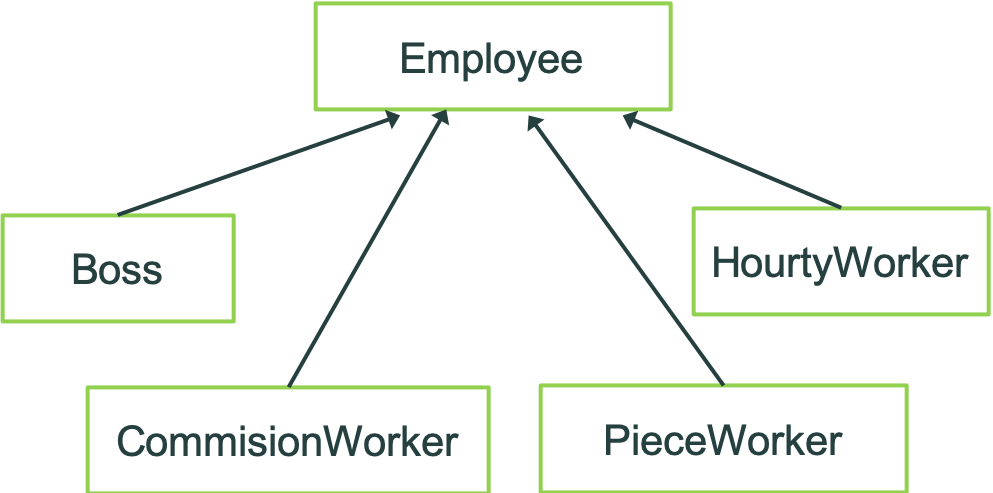
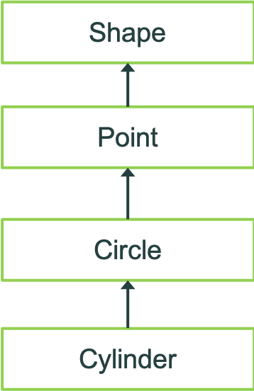

## 6.1 引言

**虚函数**（virtual function）和**多态性**（polymorphism）使得设计和实现易于扩展（extensible）的软件系统成为可能。

应用系统开发可以以“应用系统框架”（application framework）为基础。应用系统框架处理通用类对象，应用开发者从框架触发，逐步细化，定义各种具体的类，由派生类对框架进行加工。

在开发过程中，不论类是否已经建立，程序员都可利用虚函数和多态性先编写处理这些对象的程序代码。这可加快整个软件产品的开发进度。

## 6.2 类型域和switch语句

通过基类指针访问对象，如果对于不同类的对象要采取不同的动作，则switch语句可用于处理各种不同类型的对象。只要我们在每个对象中设置一个类型域(type tag)就能使用switch语句。 

### 使用switch语句的缺陷:

1. 程序员可能会忘记对每个对象的类型测试
2. 在swith局与众可能会忘记测试所有可能的对象类型
3. 增加新的派生类时，没有再switch遇见中增加测试新类的代码
4. 增加新的派生类是，在switch遇见中增加测试新类的代码，既费时，又容易出错

采用虚函数方法处理不同对象的动作，可避免使用switch语句所造成的缺陷，可以简化编程，有助于测试、调试与维护。

## 6.3 虚函数

虚函数是C++语言实现动态多态性的手段。系统自动根据对象类型（而不是专门设一个类型域）在程序运行时确定它应调用的函数版本，在编译时不会确定一个虚函数的调用对应于哪个函数版本。

### 使用虚函数的例子：

从形状类Shape可以派生出圆Circle、三角形Triangle、矩形Rectangle、正方形Square等等。每个类都有一个成员函数Draw，表示在屏幕上画出自己的形状。使用者使用Shape*调用Draw，那么要使画出的形状都正确，必须根据对象类型来确定使用哪个Draw来画。将Draw在Shape中定义为虚函数，并在每个派生类中重新定义该函数，那么当程序运行时，系统自动调用合适的Draw函数版本。

### 虚函数的定义方法

在类定义过程中，在成员函数的原型说明前加一个关键字virtual。     
例如 ：        

```c++
class Shape          
{    
    virtual void Draw( );   
}; 
```

中Draw函数被定义为是一个虚函数。 

在类层次中，一个函数被定义成虚函数后，它在所有派生类中一直为虚函数。在派生类的虚函数原型说明前可以不加virtual说明，但它仍然为一个虚函数。 虚函数也能被继承。当派生类中没有重新定义虚函数的新版本时，派生类也能使用基类中的虚函数版本。

### 动态联编：

定义虚函数之后，当利用基类指针（或对基类的引用）调用虚函数时，系统自动在程序运行时（不是在编译时）确定应使用哪个虚函数的版本来执行。这一确定过程就称为动态联编(dynamic binding)，也称延迟绑定(late binding)。 

### 静态联编：

当利用基类指针（或对基类的引用）调用非虚函数时，系统在编译期间（不是在运行时）就能确定应使用哪个函数的版本。这一确定过程就称为静态联编(static binding)，也称早期绑定(early binding)。 通过基类对象名调用虚函数时，编译器也把函数调用确定为是基类的虚函数，这时实行的也是静态联编。 

### 虚函数的重定义:

在派生类中重新定义的虚函数必须与基类中的虚函数具有完全相同的函数名、参数类型和返回类型。即函数原型要完全一致，否则会将派生类中的函数认为不是基类虚函数的重定义版本，而是一个新增的成员函数。

## 6.4 抽象基类和具体类

- 抽象基类(abstract class) ：不能用于定义对象的类。它可作为其它类的基类使用，或者用于定义指向该类的指针或对该类的引用。 
- 具体类(concrete class)：能用于建立一个对象的类。 

### 抽象基类和具体类的例子:

从形状类Shape可以派生出圆Circle、三角形Triangle、矩形Rectangle、正方形Square等等。形状类Shape因为含义太广泛而定义不出具体的对象，所以是抽象基类。但它可以作为其他类的基类，而圆Circle、三角形Triangle、矩形Rectangle、正方形Square等具有足以建立对象的明确含义，因此是具体类。 

### 纯虚函数:

如果在基类中一个虚函数没有具体的定义，如Shape中的Draw，这是可将Shape中的Draw定义为纯虚函数（pure virtual funciton）。

抽象类包含一个或几个纯虚函数，具体类中不能出现任何纯虚函数，因此在具体类中必须将基类的纯虚函数全部重新定义。

### 纯虚函数指定方法：

由于纯虚函数没有具体的定义，因此使用以下语法来指定它：    

`virtual 函数原型 = 0;`

```c++
// 例：

class Shape         
{                
    virtual void Draw( ) = 0;
};
```           

其中，Draw函数被定义为是一个纯虚函数。

## 6.5 多态性

通过继承而相关的不同类，它们的对象能对同一函数调用作出不同的响应，这就是**多态性**(polymorphism)。

例如，从形状类Shape可以派生出圆Circle、三角形Triangle、矩形Rectangle、正方形Square等等。这些类都有Draw函数，当对不同对象调用Draw函数时就会画出不同的图形，这就是多态性的体现。

### 多态性的实现

在C++语言中，多态性可分为**静态多态性**和**动态多态性**两种。静态多态性使用函数名重载和运算符虫子啊实现，动态多态性通过虚函数实现。

非虚函数不能实现动态多态性。若通过基类指针指向一个派生类对象，通过基类指针访问非虚函数，则在编译时就确定这一函数调用的基类中的成员函数（就算在派生类中对这一函数已经重新定义也是如此）。

### 多态性的意义

利用多态性，使成员函数根据收到该调用的对象的类型产生不同的动作，这些类的使用者可以处理普遍性而让执行环境处理特殊性。这提高了系统的可扩展性(extensibility)，处理多态性行为的软件可以用与接收消息对象无关的方式编写，因此不用修改使用代码就能响应该消息的新对象。

### 使用多态性的软件开发

抽象类为类层次结构中的各个成员定义使用界面。抽象类中包含了要在派生类中定义的纯虚函数，该层次结构中的所有函数都可以通过多态性使用相同的使用界面。尽管不能定义抽象基类的对象，但却可以说明指向抽象基类的指针。当定义了具体派生类的对象后，可以用这种指针使派生类对象具有多态操作的能力。

## 6.6 实例研究:利用多态性的工资单系统

这里要利用虚函数和多态性根据职员的类型完成每个职工工资的计算。不同种类的职工计算工资的方法是不同的。



### 工资计算方法:

在基类Employee中设一个纯虚函数earning，并在每个派生类中重新定义该虚函数，每个派生类根据自身的方法计算工资。 

```c++
// 抽象基类Employee
#ifndef EMPLOY2_H
#define EMPLOY2_H
class Employee {  
public:
   Employee( const char*, const char* ); 
   ~Employee(); 
   const char* getFirstName() const; 
   const char* getLastName() const; 
   virtual float earnings() const = 0 ; // 纯虚函数
   virtual void print() const = 0 ;     // 纯虚函数


private:
    char* firstName;
    char* lastName;
};
#endif

// employ2.cpp
#include <iostream>
#include <cstring>
#include <cassert>
using anmespace std;
#include "employ2.h"
Employee::Employee(const char* first,const char* last )
{   firstName = new char[ strlen( first ) + 1 ];
    assert( firstName != 0 ); // 确认内存分配成功
    strcpy( firstName, first );
    lastName = new char[ strlen( last ) + 1 ];
    assert( lastName != 0 ); // 确认内存分配成功
    strcpy( lastName, last );
}

Employee::~Employee()
{   delete [] firstName; 
    delete [] lastName;  
}

// employ2.cpp
const char* Employee::getFirstName() const
{  // const限定符防止调用者修改私有数据。为
   // 防止引用没有定义的指针，调用者应该在
   // 析构释放动态内存之前拷贝返回的字符串
   return firstName;  // 调用者必须释放内存
}
const char* Employee::getLastName() const
{   return lastName;  // 调用者必须释放内存
}

// boss1.h
#ifndef BOSS1_H
#define BOSS1_H
#include "employ2.h"
class Boss : public Employee {  
public:
   Boss( const char*, const char* , float = 0.0 ); 
    void setWeeklySalary( float );
   virtual float earnings() const;
   virtual void print() const;
 
private:
    float weeklySalary;
};

#endif

// boss1.cpp

#include <iostream>
using namespace std;
#include "boss1.h"
Boss::Boss(const char* first,const char* last,float s)
  : Employee( first , last ) //调用基类的构造函数
{  weeklySalary = s >0 ? s : 0 ;  }

void Boss::setWeeklySalary( float s )
{  weeklySalary = s >0 ? s : 0 ;  }
float Boss::earnings() const { return weeklySalary;  }
void Boss::print() const
{  cout << "\nBoss: " << getFirstName()
        << ' ' << getLastName();
}

// commis1.h
#ifndef COMMIS1_H
#define COMMIS1_H
#include "employ2.h"
class CommissionWorker : public Employee {  
public:
   CommissionWorker(const char*, const char* , 
                    float=0.0, float=0.0, int = 0 ); 
   void setSalary(float); void setCommission(float);
   void setQuantity( int );
   virtual float earnings() const;
   virtual void print() const;

private:
   float salary;      // 每周的基本工资
   float commission;  // 每件产品的回扣额
   int quantity;      // 一周销售量
};
#endif

// commis1.cpp
#include <iostream>
using namespace std;
#include "commis1.h"
CommissionWorker::CommissionWorker( const char* first, 
  const char* last ,float s , float c , int q )
  : Employee( first , last ) //调用基类的构造函数
{  salary = s >0 ? s : 0 ;
   commission = c >0 ? c : 0 ;
   quantity = q >0 ? q : 0 ;
}


void CommissionWorker::setSalary( float s )
{  salary = s >0 ? s : 0 ;  }
void CommissionWorker::setCommission( float c )
{  commission = c >0 ? c : 0 ;  }
void CommissionWorker::setQuantity( int q )
{  quantity = q >0 ? q : 0 ;  }

float CommissionWorker::earnings() const
{  return salary + commission * quantity;  }

// 打印销售员的名字
void CommissionWorker::print() const
{  
   cout << "\nCommission Worker: " << getFirstName()
        << ' ' << getLastName();
}

// piece1.h
#ifndef PIECE1_H
#define PIECE1_H
#include "employ2.h"
class PieceWorker : public Employee {  
public:
   PieceWorker( const char* , const char* , 
                float = 0.0 , int = 0); 
   void setWage( float );
   void setQuantity( int );
   virtual float earnings() const;
   virtual void print() const;

private:
    float wagePerPiece;  // 每件产品的报酬
    int quantity;        // 一周生产的产品数量
};
#endif


// piece1.cpp

#include <iostream>
using namespace std;
#include "piece1.h"
PieceWorker::PieceWorker( const char* first, 
     const char* last ,float w , int q )
  : Employee( first , last ) //调用基类的构造函数
{  wagePerPiece = w >0 ? w : 0 ;  
   quantity = q >0 ? q : 0 ;    }

void PieceWorker::setWage( float w )
{  wagePerPiece = w >0 ? w : 0 ;   }
void PieceWorker::setQuantity( int q )
{  quantity = q >0 ? q : 0 ;    }
float PieceWorker::earnings() const
{  return quantity * wagePerPiece;  }
void PieceWorker::print() const
{  cout << "\nPiece Worker: " << getFirstName()
        << ' ' << getLastName();
}

// hourly1.h
#ifndef HOURLY1_H
#define HOURLY1_H
#include "employ2.h"
class HourlyWorker : public Employee {  
public:
   HourlyWorker( const char* , const char* , 
                 float = 0.0 , float = 0.0 ); 
   void setWage( float );
   void setHours( float );
   virtual float earnings() const;
   virtual void print() const;

private:
    float wage;          // 小时报酬
    float hours;         // 一周工作时数
};
#endif

// hourly1.cpp

#include <iostream.h>
#include "hourly1.h"
HourlyWorker::HourlyWorker( const char* first, 
  const char* last , float w , float h )
  : Employee( first , last ) //调用基类的构造函数
{  wage = w >0 ? w : 0 ;  
   hours = h >= 0  && h < 168 ? h : 0 ;  }

void HourlyWorker::setWage(float w){wage=w>0?w:0; }
void HourlyWorker::setHours( float h )
{  hours = h >= 0  && h < 168 ? h : 0 ;    }
float HourlyWorker::earnings() const
{  return wage * hours;  }
void HourlyWorker::print() const
{  cout << "\nHourly Worker: " << getFirstName()
        << ' ' << getLastName();
}

// 类Employee层次结构的测试程序
#include <iostream>
#include <iomanip>
using namespace std;
#include "employ2.h"
#include "boss1.h"
#include "commis1.h"
#include "piece1.h"
#include "hourly1.h"

int main()
{ cout<<setiosflags(ios::showpoint|ios::fixed)
      <<setprecision(2);
  Employee* ptr;  // 基类指针
  Boss b("John","Simith",800.00f);
  ptr = &b;             // 指向导出类对象的基类指针
  ptr->print();         // 动态联编
  cout << " earned $" << ptr ->earnings();// 动态联编
  b.print();          // 静态联编
  cout << " earned $" << b.earnings(); // 静态联编

 CommissionWorker c("Sue","Jones",200.00f,3.0f,150);
  ptr = &c;            // 指向导出类对象的基类指针
  ptr->print();       // 动态联编
  cout << " earned $" << ptr ->earnings();// 动态联编
  c.print();        // 静态联编
  cout << " earned $" << c.earnings();  // 静态联编
  PieceWorker p("Bob","Lewis",2.5f, 200);
  ptr = &p;            // 指向导出类对象的基类指针
  ptr->print();             // 动态联编
  cout << " earned $" << ptr ->earnings();// 动态联编
  p.print();                // 静态联编
  cout << " earned $" << p.earnings(); // 静态联编

 
   HourlyWorker h("Karen","Price",13.75f, 40);
   ptr = &h;            // 指向导出类对象的基类指针
   ptr->print();       // 动态联编
   cout << " earned $" << ptr ->earnings(); // 动态联编
   h.print();          // 静态联编
   cout << " earned $" << h.earnings(); // 静态联编
   
   cout << endl;
   
   return 0;
}
```

## 6.7 新类和动态联编

当向类层次中增加新的派生类后，通过类层次中的基类访问的虚函数所体现出的多态性也能很好地工作。 

对于要被编译的虚函数调用来说，编译时可以不知道对象的类型（甚至派生类可能还没有建立）。在程序运行时，虚函数调用和被调用对象的虚函数版本匹配。

虚函数的实现机制是：每个包含虚函数的类建立一张虚函数表(vtable)，它是一个包含各个虚函数指针的数组，虚函数指针指向类的对象所要使用的虚函数版本。带有虚函数的类对象都包含一个指向该类vtable的指针。系统在运行时获取并使用正确的函数指针完成函数调用。

## 6.8 虚析构函数

用多态性处理动态分配的类层次结构中的对象时，如果delete的操作数是实际指向派生类对象的基类指针，那么因为每个类的析构函数名都不相同，因此虚函数机制不能发挥作用，系统就只能调用基类的析构函数，这会造成动态存贮单元的释放不充分而导致**内存泄漏** (memory leak)。

未解决内存泄露问题，C++语言允许将基类的析构函数定义为一个虚函数，而派生类中的析构函数就成为基类虚析构函数的重定义版本，即使这些析构函数的名称是不相同的。这就是**虚析构函数**的概念。

一般都要将析构函数定义为虚函数，而构造函数不能为虚函数。

## 6.9 实例研究:继承接口和实现

这里要利用虚函数和多态性完成每个形状类的定义。



### 接口的继承和实现:

在基类Shape中设一个纯虚数printShapeName,并在每个派生类中重新定义该成员函数，每个派生类跟进自身的名称输出相应的形状名称。

在基类Shape中还定义了两个虚函数area和volume,并且都将函数实现了。这两个虚函数都被派生类Point集成，并且实现也被利用了（Point不需要重新定义这两个虚函数，可以直接使用基类Shape中的虚函数版本）类Point还将集成得到volume实现版本再次集成给了它的派生类Circle。

### 程序例子

```c++
// 抽象基类Shape的定义
#ifndef SHAPE_H
#define SHAPE_H

class Shape {  
public:
   virtual float area() const { return 0.0;  }
   virtual float volume() const { return 0.0;  }
   virtual void printShapeName() const = 0 ;// 纯虚函数
};

#endif

// point1.h
#ifndef POINT_H
#define POINT_H
#include <iostream>
using namespace std;
#include "shape.h"
class Point : public Shape {  
   friend ostream& operator<<(ostream&, const Point&);
public:
   Point( float = 0, float = 0 );   // 缺省构造函数
   void setPoint( float, float );
   float getX() const { return x; } 
   float getY() const { return y; } 
   virtual void printShapeName()const{cout<<"Point: ";}


private:
    float x, y;   // 点的x坐标和y坐标
};
#endif

// 定义类Point的成员函数
#include <iostream>
using namespace std;
#include "point1.h"
Point::Point( float a, float b ) 
{   x = a ;   y = b ; }
void Point::setPoint( float a, float b )
{   x = a ;    y = b ; }
ostream& operator<<(ostream& output,const Point& p)
{   output << '[' << p.x << " , " << p.y << ']';
    return output;  
}

// 类Circle的定义
#ifndef CIRCLE1_H
#define CIRCLE1_H
#include <iostream>
using namespace std;
#include "point1.h"
class Circle : public Point { // 类Circle由Point导出
  friend ostream &operator<<(ostream&,const Circle&);
public:
  Circle (float r=0.0,float x=0.0,float y=0.0 );
  void setRadius( float ); float getRadius() const;   
  virtual float area() const;        
  virtual void printShapeName()const{cout<<"Circle: ";}
private:    float radius; // 圆的半径
};
#endif

// 定义类Circle的成员函数
#include <iostream>
#include <iomanip>
using namespace std;
#include "circle1.h"
Circle::Circle( float r, float a, float b )
  : Point( a, b ) {   radius =  r > 0 ? r : 0 ;  }
void Circle::setRadius(float r){radius=r>0?r:0;  }
float Circle::getRadius() const {  return radius;   }
float Circle::area()const
{ return 3.14159*radius*radius; }

ostream &operator<<(ostream &output, const Circle& c )
{ output << '[' << c.getX() << " , " << c.getY()
         << "]; Radius = " 
         << setiosflags( ios::fixed | ios::showpoint )
         << setprecision( 2 ) << c.radius;
  return output; // 使得能够连续调用
}

// 类Cylinder的定义
#ifndef CYLINDER1_H
#define CYLINDER1_H
#include <iostream>
using namespace std;
#include "circle1.h"
class Cylinder : public Circle { 
  friend ostream& operator<<(ostream&,const Cylinder&);
public:
    Cylinder( float h = 0.0, float r = 0.0,
              float x = 0.0, float y = 0.0 );
    void setHeight( float );   
    virtual float area() const;       
    virtual float volume() const;     
virtual void printShapeName()const{cout<<"Cylinder: ";}

private:
    float height; // 圆柱体的高度
};
#endif

// 定义类Cylinder的成员函数
#include <iostream>
#include <iomanip>
using namespace std;
#include "cylinder1.h"
Cylinder::Cylinder(float h,float r,float x,float y )
  : Circle( r, x, y ) {  height = h > 0 ? h : 0; }
void Cylinder::setHeight( float h ) 
{  height = h > 0 ? h : 0; }

float Cylinder::area() const
{  return 2 * Circle::area() +
       2 * 3.14159 * Circle::getRadius() * height; }
float Cylinder::volume() const
{   float r = Circle::getRadius();
   return 3.14159 * r * r * height;  
}

// 定义类Cylinder的成员函数
ostream& operator<<(ostream& output,const Cylinder& c)
{
   output << '[' << c.getX() << " , " << c.getY()
          << "]; Radius = " 
          << setiosflags( ios::fixed | ios::showpoint )
          << setprecision( 2 ) << c.getRadius()
          << "; Height = " << c.height;

    return output; 
}

// 点、圆、圆柱体层次结构的测试程序
#include <iostream>
#include <iomanip>
using namespace std;
#include "shape.h"
#include "point1.h"
#include "circle1.h"
#include "cylinder1.h"

int main()
{  Point point( 7, 11 ); 
   Circle circle( 3.5f, 22, 8 ); 
   Cylinder cylinder( 10, 3.3f, 10, 10 ); 
   point.printShapeName(); // 静态联编
   cout << point << endl;
   circle.printShapeName(); // 静态联编
   cout << circle << endl;
   cylinder.printShapeName(); // 静态联编
   cout << cylinder << "\n\n";
 // 点、圆、圆柱体层次结构的测试程序
   cout << setiosflags(ios::showpoint|ios::fixed) 
        << setprecision(2);

 Shape *ptr; // 建立基类指针
  // 把基类指针指向导出类Point的对象
  ptr = &point;
  ptr->printShapeName(); // 动态联编
  cout<<"x = "<<point.getX()<<"; y = "<<point.getY()
       << "\nArea = " << ptr->area()
       << "\nVolume = " << ptr->volume() << "\n\n";
  // 把基类指针指向导出类Circle的对象
   ptr = &circle;
   ptr->printShapeName(); // 动态联编
   cout<<"x = "<<circle.getX()<<"; y = "<<circle.getY()
       << "\nArea = " << ptr->area()
       << "\nVolume = " << ptr->volume() << "\n\n";

   // 把基类指针指向导出类Cylinder的对象
    ptr = &cylinder;
    ptr->printShapeName(); // 动态联编
    cout << "x = " << cylinder.getX() 
        << "; y = " << cylinder.getY()
        << "\nArea = " << ptr->area()
        << "\nVolume = " << ptr->volume() << endl;

   return 0;
}
```