## 1.1 操作系统的相关概念

### 一、计算机系统的层次结构

- 硬件系统：CPU、存储器（主存/辅存）、I/O、I/O控制系统。
- 软件系统：系统软件、应用软件。
- 系统软件：管理计算机的操作。如操作系统…。
- 应用软件：提供给不同用户需要使用。如计算分析、事物管理。

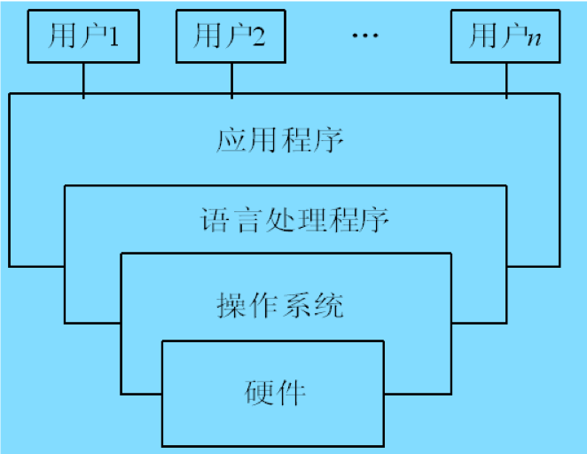

### 二、操作系统的定义

操作系统（Operating System）是管理硬件资源、控制程序执行，改善人机界面，合理组织计算机工作流程和为用户使用计算机提供良好运行环境的一种系统软件。它被看作是用户和计算机硬件之间的一种接口，是现代计算机系统不可分割的重要组成部分。

### 三、操作系统的地位

- 计算机系统由硬件和软件组成。
- 操作系统在硬件基础上的第一层软件。
- 是其他软件和硬件的接口。
- 计算机系统管理中心。

### 四、操作系统的作用 

- OS是用户与硬件的接口
- OS是计算机系统资源的管理者
- OS作为虚拟计算机

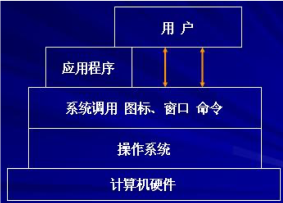

### 五、促进操作系统发展的动力

- 不断提高计算机资源利用率的需要：如批处理系统的出现
- 方便用户：如分时交互式系统的出现
- 器件的不断更新换代：8位-16-32-64
- 计算机体系结构的不断发展：单机OS-多机OS-网络OS

### 六、操作系统的设计原则

- 可维护性：容易修改与否。
- 可靠性
  - 正确性：正确实现所要求的功能和性能；
  - 稳健性：对意外（故障和误操作）做出适当的处理；
- 可理解性：易于理解、以便测试、维护和交流。
- 性能：有效地使用系统资源；尽可能快地响应用户请求。

## 1.2 操作系统的形成和发展

### 操作系统主要发展历程

操作系统是随着计算机硬件技术的不断发展而发展的。

**目标**：充分利用现有硬件条件，提供更好的服务。

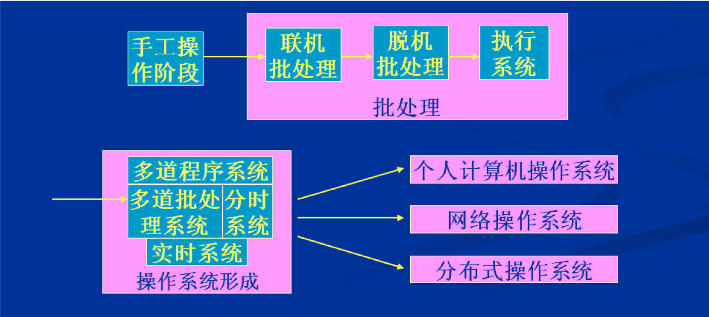

#### Windows操作系统发展历程

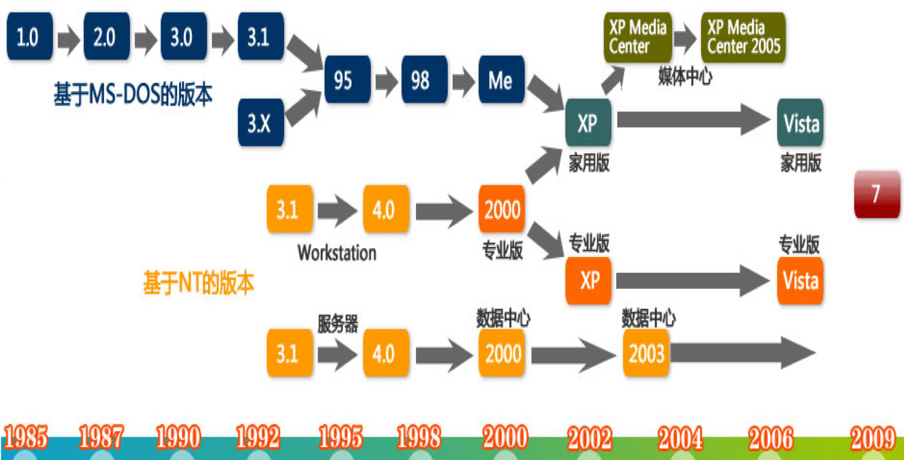

#### UNIX发展简图 

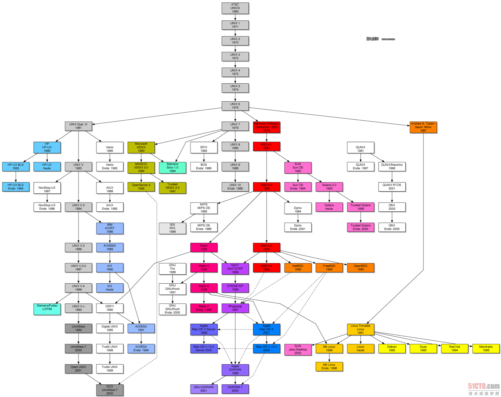

#### 苹果产品发展历程 

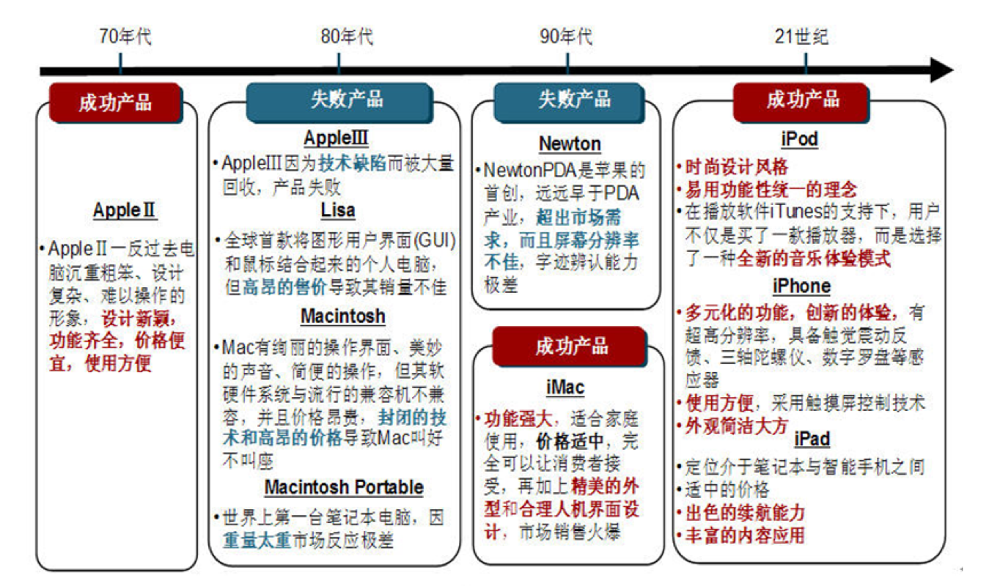

### 第1阶段：手工操作阶段

以计算过程为例子

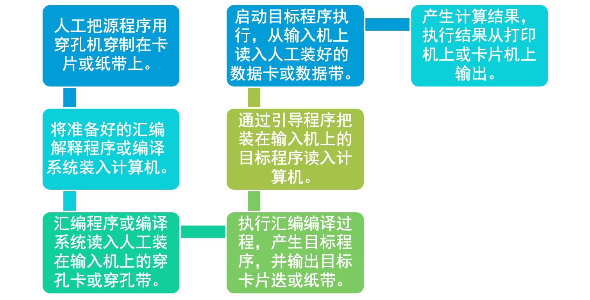

#### 手工操作阶段的特点

- 独占性，串行性。
- 工作量大，难度高，易出错。
- 工作效率低：手工操作慢与机器处理快。
- 每个用户要自行编写涉及到硬件的源代码。

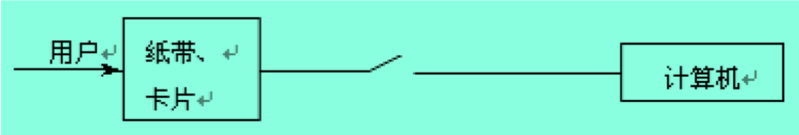

#### 手工操作阶段的问题

- **问题1**：人机矛盾
- **问题2**： CPU与I/O设备速度不匹配的矛盾

机器速度|计算时间|人工操作时间|操作时间 : 机器运行时间
---|---|---|---
1万次/秒|1小时|3分钟|1 : 20
60万次/秒|1分钟|3分钟|3 : 1

### 第2阶段：单道批处理阶段 

简单批处理：

1. 装入程序、运行、打印结果、撤出、再重复
2. 用户吧作业（卡片或磁带）交给负责调度的操作员（系统管理员），由操作员按作业类型分类编成一个作业序列，送到输入设备上。
3. 常驻监督程序自动地装入程序、运行、撤出作业。
4. 
   1. 连接批处理；
   2. 脱机批处理；
   3. 执行系统；

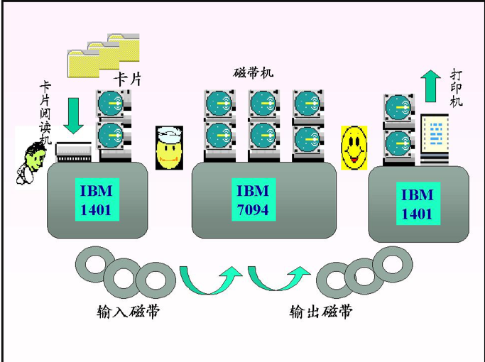

#### 批处理技术的出现

**硬件基础：60年代计算机硬件获得两个重大的进展**

- I/O中断：由I/O部件操作完成后通知处理机运行相应的处理程序。
- 通道：能够自主控制外设，与处理机并行工作与交换数据的I/O装置(控制器)。

##### 批处理

1. 联机批处理

- 特点：有监督程序，作业自动过渡
- 问题：CPU高速与I/O慢速的矛盾
- 解决：由卫星机负责I/O

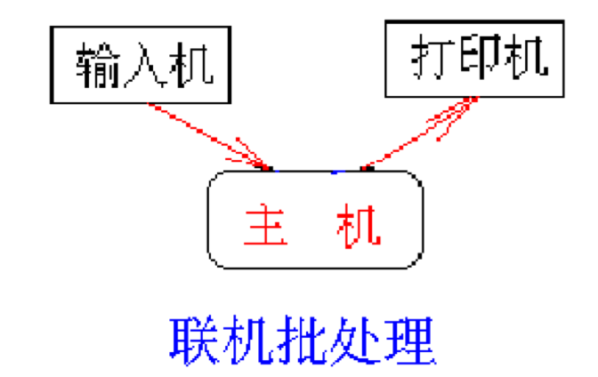

2. 脱机批处理

- 特点：主机与卫星机并行操作
- 问题：调度不灵活，保护问题
- 解决：硬件技术的发展——通道技术、中断技术

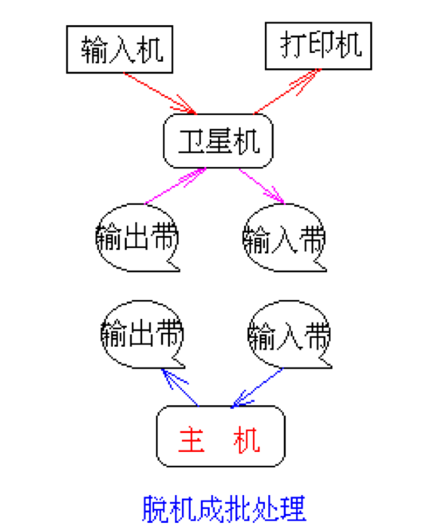

3. 执行系统

- 定义：借助于通道与中断技术，由主机控制I/O工作。原有的监督程序不仅要负
- 调度作业自动的运行，而且还要提供I/O控制功能。它常驻内存，称为执行系统。
- 特点：主机、外设并行操作；增加了保护能力。
- 问题：处理机仍有空闲等待现象。

### 第3阶段：多道批处理阶段

#### 处理过程

- 在内存中同时存放几道相互独立的程序。
- 在管理程序控制之下，相互穿插地运行，处理机和外设尽量处于忙碌状态。

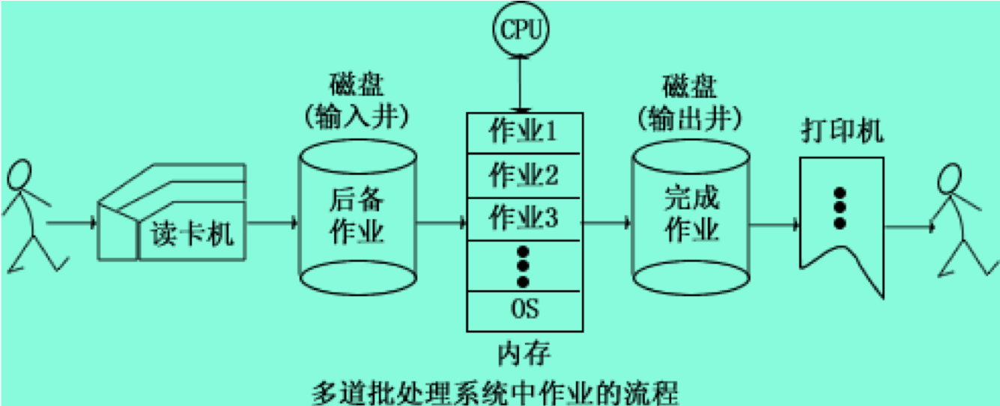

- 特征：
  - 调度性
  - 无序性
  - 多道性
- 优点
  - 资源的利用率
  - 系统吞吐量大
- 缺点
  - 平均周转周期长
  - 无交互能力

#### 交互式分时处理

- 一台计算机，多个终端
- 所有用户可与系统立即交互。
- 调试比较方便。

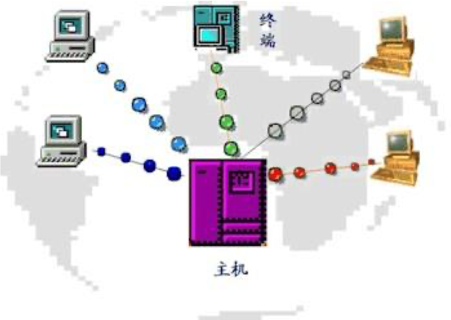

#### 多道程序设计技术

多道程序设计技术是指在内存同时放若干道程序，使它们在系统中并发执行，共享系统中的各种资源。当一道程序暂停执行时，CPU立即转去执行另一道程序。

多道程序设计主要是使OS能更好地对计算机进行管理 。使计算机的硬件资源得到更充分的利用。

#### 多道运行的特征

1. 多道
2. 宏观上并行
3. 微观上串行

#### 多道程序设计技术效果

- 提高效率：增长了单位时间的算题量，但对每道程序来说，却演唱了计算时间。
- 提高资源利用率和系统吞吐率：以牺牲用户的响应时间为代价。

#### 主要多道程序设计技术分类

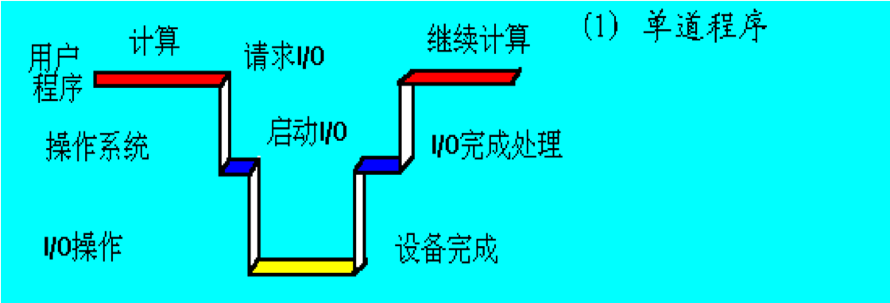

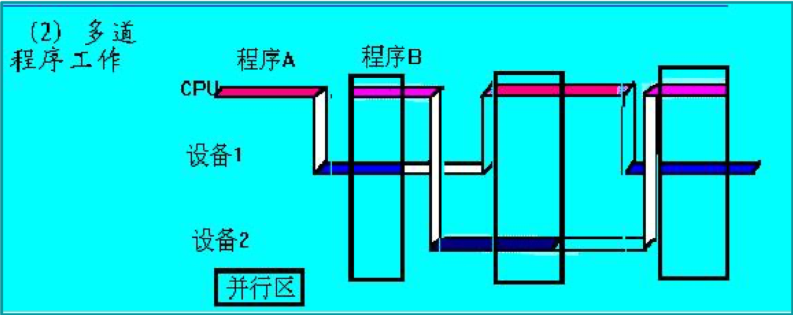

#### 分时技术与分时处理

##### 分时技术

把处理机的响应时间分成若干个大小相等（或不相等）的时间单位，称为时间片，每个终端用户获得CPU，就等于获得了一个时间片，该用户程序开始运行，当时间片到（用完），用户程序暂停运行，等待下一次运行。

##### 分时计算机系统

中断技术的使用，使一台计算机能连接多个用户终端，用户可通过各自的终端使用和控制计算机，一台计算机连接多个终端的计算机系统称为分时计算机系统或分时系统。

#### 分时系统的思想

思想：采用时间片轮的方法，同时为许多终端用户服务，对每个用户能保证足够快的响应时间，并提供交互会话功能。

1. 时间片：将CPU的时间划分成若干个片段，称为时间片，操作系统以时间片为单位，轮流为每个终端用户服务。
2. 设计目标：对用户的请求及时响应，并在可能条件下尽量提高系统资源的利用率。
3. 适合办公自动化、教学及事务处理等要求人机会话的场合。

##### 分时系统的结构示意图

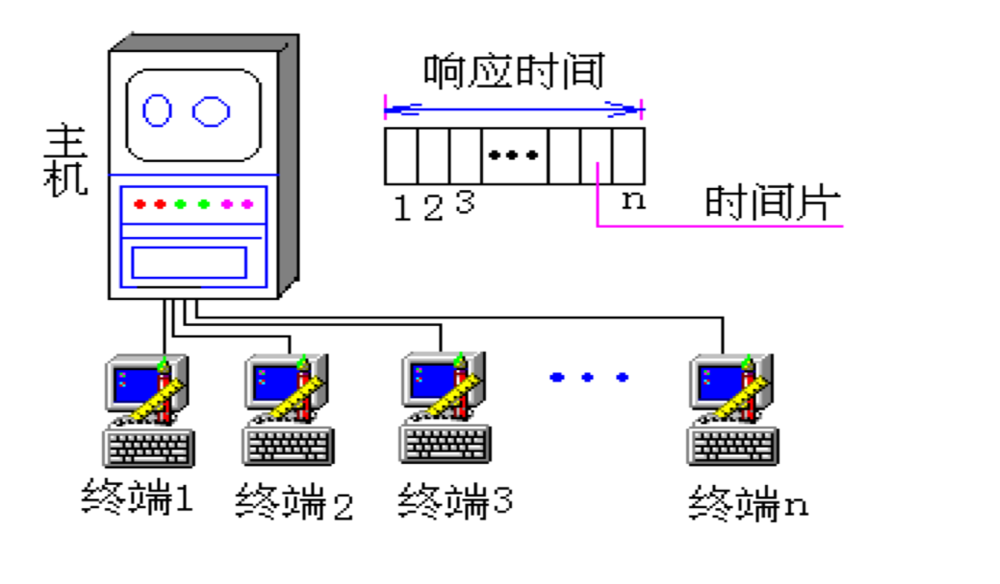

### 第4阶段:现代操作系统的发展

- 嵌入式操作系统
- 实时操作系统
- 网络操作系统
- 分布式操作系统

#### 操作系统快速发展的主要原因

1. 器件快速更新换代
2. 计算体系结构不断发展
3. 满足不断出现的用户新要求，提供新服务
4. 提高计算机系统的资源利用率需要
5. 让用户方便使用计算机的需要

#### 嵌入式操作系统

什么是嵌入式系统？

- 在各种设备、装置或系统中，完成特定功能的软硬件系统。
- 它们是一个大设备、装置或系统中的一部分。
- 通常工作在反应式或对处理时间有较严格要求环境中
- 因为它们被嵌入在各种设备、装置或系统中，所以称为**嵌入式系统**。

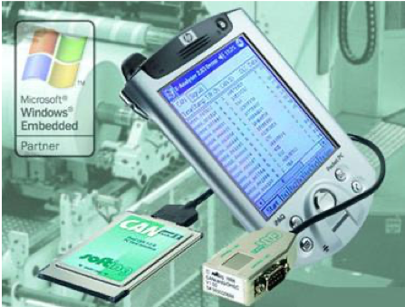

**软件**：用于提供系统所需的功能和灵活性 
**硬件**：（处理器、ASIC、存储器…） 
用于提供所需的性能以及部分安全机制

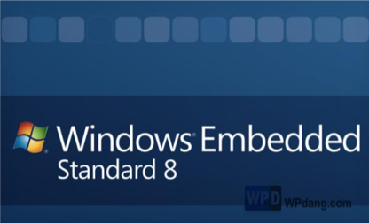

##### 典型嵌入式操作系统的特性

- 完成某一项或有限项功能；不是通用型。
- 占有资源少、易于连接。
- 成本、能源和可靠性通常是影响设计的重要因素。
- 系统功能可针对需求进行裁剪、调整和生成以便满足最终产品的设计要求。
- 在性能和实时性方面有严格的限制。

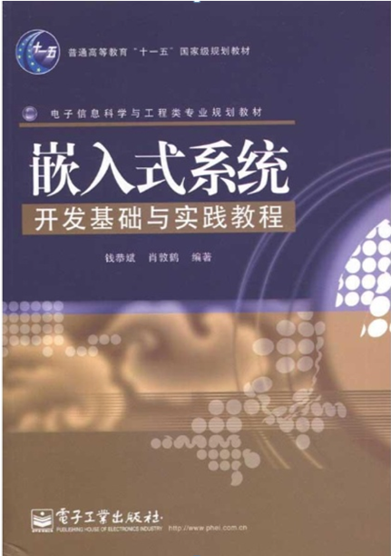

##### 嵌入式设备与嵌入式系统

- 嵌入式设备：指具有计算机功能，但又不称为计算机的设备或器材。如：PDA（个人数字助理）、手机、自动售货机、医疗仪器、立体音响、自动取款机等。
- 嵌入式系统：针对具体应用专用系统，他的硬件和软件都必须高效率地设计，力争在同样的硅片面积上实现更高的性能。

### 分时操作系统工作方式

一台主机连接了若干个终端

- 每个终端有一个用户在使用。
- 交互式的向系统提出命令请求。
- 系统接受每个用户的命令。
- 采用时间片轮转方式处理服务请求。
- 并通过交互方式在终端上向用户显示结果。
- 用户根据上步结果发出下道指令。

### 实时操作系统

实时系统（RTOS）是指当外界事件或数据产生时，能够接受并以足够快的速度予以处理，其处理的结果又能在规定的时间之内来控制生产过程或对处理系统作出快速响应，并控制所有实时任务协调一致运行的操作系统。

实时系统:能满足要求快速响应作业运行的多道程序设计系统。

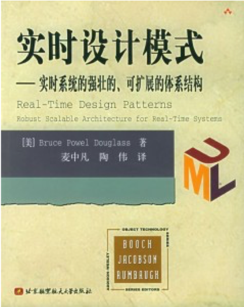

#### 实时系统主要性能指标和功能:

- 时钟分辨度:有更高的时钟中断频度,可更精确计时,更快进行调度。
- 多级中断机制。保证要求快速响应中断的及时处理。
- 支持实时作业调度,保证实时作业无条件剥夺非实时作业运行。

**特点：及时性要求高，系统可靠性高。**

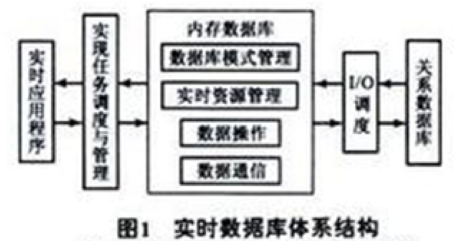

#### 实时操作系统的分类

1. 实时控制系统：通常是指以计算机为中心的生产过程控制系统，又称计算机控制系统。
   - 如：钢铁冶炼和钢板轧制的自动控制，军事控制等。
2. 实时信息处理系统：计算机及时接收从远程终端发来的服务请求，根据用户提出的问题对信息进行检索和处理，并在很短时间内对用户做出正确回答。
   - 如：火车票订购系统、股市行情实时信息处理系统等。

#### 实时系统与分时系统的比较

1. 多路性
2. 独立性
3. 及时性
4. 交互性
5. 可靠性

### 网络操作系统

网络操作系统是用于管理网络通信和共享资源，协调各主机上任务地运行，并向用户提供统一的、有效的网络接口的软件集合。

按网络所覆盖的地理范围和互连计算机之间的距离的不同，可把计算机网络分为两种： 

- 广域网WAN(Wide Area Network) 
- 局域网LAN(Local Area Network) 

#### 网络操作系统的基本功能

- 网络的通信 
- 资源的管理
- 提供网络接口
- 提供多种网络服务

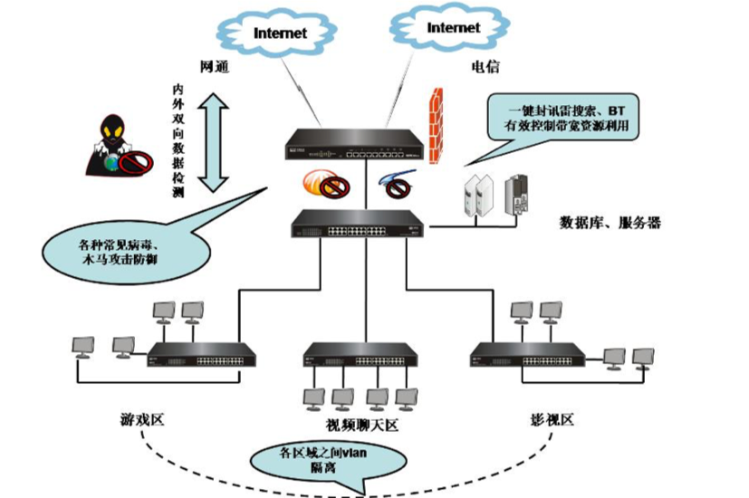
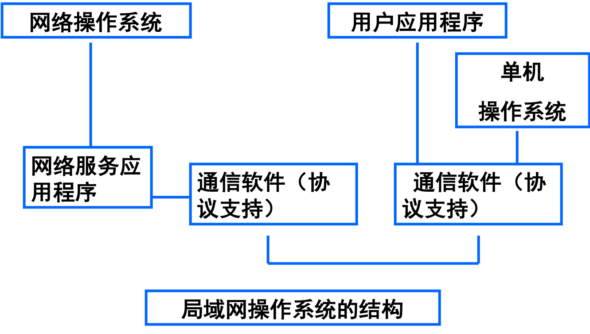
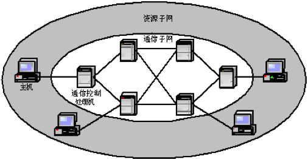

### 分布式操作系统

**功能**

- 资源管理
- 任务分配
- 分布式进程同步和通信
- 管理程序浮动

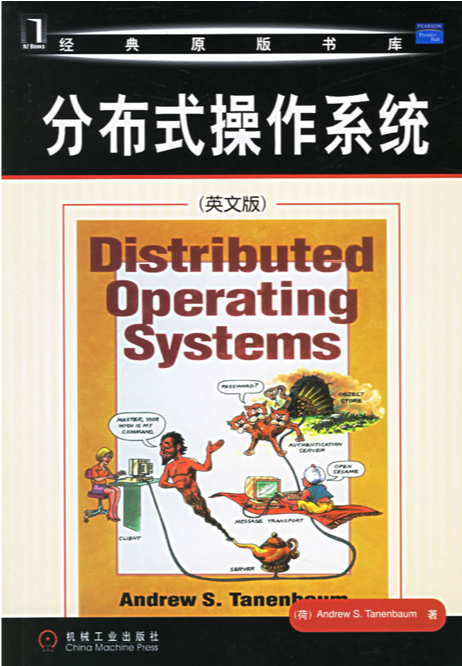

#### 分布式操作系统要解决的关键问题

**分布式OS设计过程中的核心环节**

1. 通讯原语的设计
2. 资源管理
3. 系统容错

#### 分布式操作系统特征

1. 系统内只有一个全局操作系统，采用分布式控制的办法，负责全系统的资源管理和运行控制。
2. **资源进一步共享**：系统内包含有多个物力资源和逻辑资源，他们可以动态地分配给各个人物。
3. **透明性**：资源共享，分布。系统对用户提供一个透明的、一体化的用户界面。
4. **自治性**：处于分布式系统的多个主机处于平等地位，无主从关系。所有资源都必须高度自治而相互配合地工作，他们之间不存在层次控制或主从控制的关系。
5. 处理能力增强、速度更快、可靠性增强。

#### 网络和分布式的区别

1. 分部具有各个计算机间香菇通讯，无主从关系；网络有主从关系。
2. 分布式系统资源为所有用户共享，网络则是有限制地共享
3. 分布式系统中若干个计算机相互协作共同完成一项任务。

#### 操作系统追求的主要目标

1. 方便性：计算机智能识别0、1；用户熟悉的是各种语言。
2. 有效性：使计算机的各类资源在系统的管理下得到更有效的利用，提高系统吞吐量。
3. 可扩充性：便于修改和增加功能（如何设计？）。
4. 开放性：系统支持世界标准规范

## 1.3 操作系统的基本特性 

操作系统是控制和管理计算机硬件和软件资源的一个系统软件，是一些程序模块的集合。

**主要特征**

1. 并发性
2. 共享性
3. 虚拟性
4. 异步性

### (一) 并发性

**并行性是指在计算机系统中同时存在多个程序。**

- 从宏观上看这些程序是同时在执行的。
- 从微观上讲任何时刻只有一个程序在执行，
- 微观上说这些程序在CPU上轮流执行。
- 并行：(与并发相同，但多指硬件支持）

程序的并发执行，有效地改善了系统资源的利用率和提高了系统的吞吐量，但它使系统复杂化，操作系统必须具有控制和管理各种并发活动的能力。

### （二）共享性

**操作系统与多个用户的程序共同使用计算机系统中的资源。**

- 资源共享是指系统中的硬件和软件资源不再为某个程序所独占，而是供多个用户共同使用。
- **并发**和**共享**是操作系统两个最基本特征，这两者之间又是互为存在条件的。 

资源共享是以程序的并发为条件的，若系统不允许程序并发执行，自然不存在资源共享问题。 

若系统不能对资源共享实施有效的管理，也必将影响到程序的并发执行，甚至根本无法并发执行。 

### （三）虚拟性

所谓虚拟，是指把一个物理上的实体，变为若干个逻辑上的对应物。物理实体是实的， 而后者是虚的，相应地，用于实现虚拟的技术，称为**虚拟技术**。在OS中利用了多种虚拟技术，分别用来实现**虚拟处理机、虚拟内存、虚拟外部设备和虚拟信道**等。

### （四）异步性

在多道程序环境下，允许多个进程并发执行， 但由于竞争资源等因素的限制，使进程的执行不是“一气呵成，而是以“走走停停”的方式运行。

多道程序环境下程序的执行，是以**异步方式**进行的；每个程序在何时执行，多个程序间的执行顺序以及完成每道程序所需的时间都是不确定和不可预知的。进程是以人们不可预知的速度向前推进，此即进程的异步性。

### 目前流行的主要操作系统

- DOS
- WINDOWS
- OS/2
- UNIX
- Macintosh
- MINIX
- LINUX
- MACH

## 1.4 操作系统的主要功能 

### 操作系统的主要功能

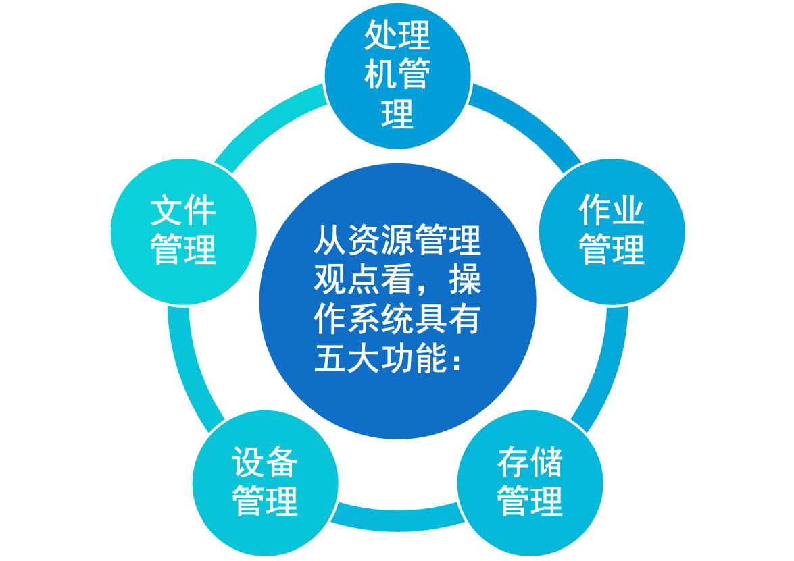