## 2.1 进程的概念

### 相关基本概念

- 程序：一个在时间上按严格次序、顺序执行的操作序列。
- 程序的顺序执行：一个具有独立功能的程序独占机，直至得到最终结果的过程。
- 操作：数据处理的一种规则，一经启动就需要在有限时间内完成。如打印、计算等。
- 计算：若干操作过程按严格顺序执行的集合。

### 程序的顺序执行

程序的顺序执行指程序执行有比较固定的时序。即只有当一个操作结束后，才能开始后继操作。以一个简单计算过程为例：

**I:输入操作　C:计算操作 P:打印操作**

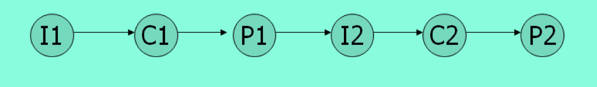

#### 前趋图的引入

- 为了描述一个程序的各部分（程序段或语句）间的依赖关系，或者是一个大的计算的各个子任务间的因果关系，常采用前趋图方式。
- 有向无循环图表示方式：	
  1. p1--->p2
  2. --->={(p1,p2)| p1 必须在p2开始前完成}
- 节点表示：一条语句，一个程序段，一进程。 

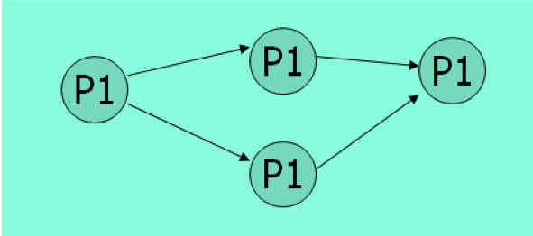

### 程序顺序执行的特征

- 顺序性：处理机的操作严格按照程序所规定的的顺序执行，即每一个操作必须在下一个操作开始之前结束。
- 可再现性：只要执行时的环境和出事条件一样，当程序重复执行时，不管它是不停顿地执行，还是“断断续续”地执行，都将获得同样的结果。
- 封闭性：程序在封闭的环境下运行，即程序运行时独占全部系统资源。

### 并发程序

- 并发环境：在一定时间内物理机器上有两个或两个以上的程序同处于开始运行但尚未结束的状态，且次序不是事先确定的。
- 在对一批程序进行处理时，可以并发执行。例如，输入、计算、打印三个程序对一批作业进行处理时，存在以下的前趋关系  Ii->Ci，Ii->Ii+1，Ci->Pi，Ci->Ci+1，Pi->Pi+1 

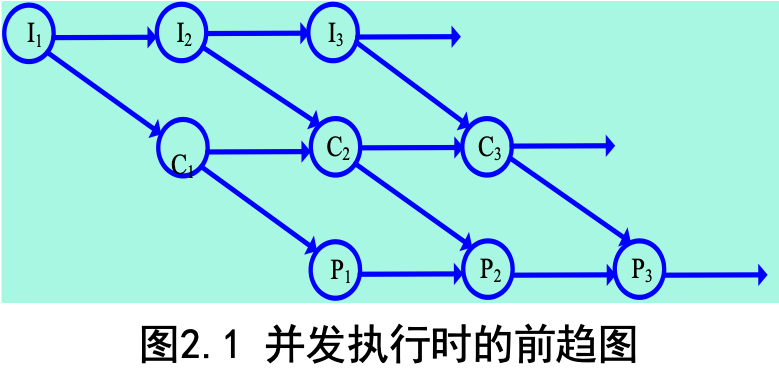

#### 并发程序

- 并发环境：在一定时间内物理机器上有两个或两个以上的程序同处于开始运行但尚未结束的状态，且次序不是事先确定的。
- 在对一批程序进行处理时，可以并发执行。例如，输入、计算、打印三个程序对一批作业进行处理时，存在以下的前趋关系  Ii→Ci，Ii→Ii+1，Ci→Pi，Ci→Ci+1，Pi→Pi+1 


#### 程序并发执行的特征 

- 间断性：在并发环境下程序的执行时间断性的。执行——停——执行。
- 通讯行：对于相互合作的程序，为了更有效地协调运行，相互之间进行通讯。
- 独立性：并发程序在运行过程中，既然是作为一个独立的运行实体，它也必然具有作为一个单位去获得资源的独立性。
- 不可再现性：并发程序执行的结果与其执行的相对速度有关，是不确定的。

### 进程的定义

- 进程是1960年在麻省理工学院的MULTICS系统和IBM公司的TSS/360系统中首先提出的，能反映进程实质的定义包括：
  - 是程序的一次执行。
  - 计算机中正在运行的程序的一个实例。
  - 可分配给处理机并由处理机执行的一个实体。
  - 是一个具有一定独立功能的程序关于某个数据集合的一次可以并发执行的运行活动。

#### 进程的基本状态

**进程的三种基本状态**

1. 就绪状态
2. 执行状态
3. 阻塞状态

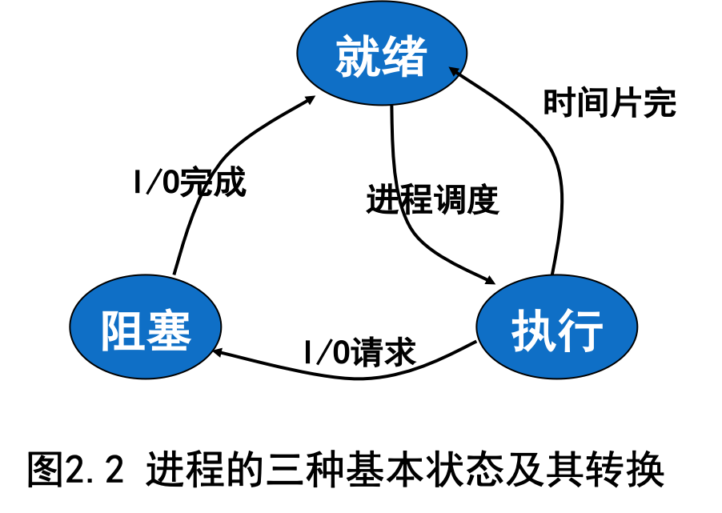

#### 进程的特征

- 动态性：进程的实质是程序的一次执行过程，进程是动态产生，动态消亡的，进程在其生命周期内，在三种基本状态之间转换。
- 并发性：任何进程都可以同其他的进程一起同时推进。
- 异步性：由于进程间的相互制约，使进程具有执行的间断性，即进程按各自独立的、不可预知的速度向前推进。
- 独立性：进程是一个能独立运行的基本单位，也是系统进行资源分配的调度（单线程进程）的基本单位。

#### 进程与程序的关系

- 进程是暂时的，程序是永久的。
- 进程是动态的，程序是静态的。 
- 进程与程序的组成元素不同。
- 一个程序可以对应多个进程（一对多），但一个进程只能对应一个程序段（一对一）。

## 2.2 进程控制

### 进程创建与中止

- 进程创建的时机
  - 提交一个批处理作业
  - 用户登录
  - 由OS创建，用以向一用户提供服务（如：打印文件）
  - 由已存在的一进程创建，一个用户程序可创建多个进程
- 进程中断的时机
  - 批处理作业发出暂停指令
  - 用户退出登录
  - 进程执行——终止服务请求
  - 出错及失败因素

### 进程状态

在进程的运行过程中，由于系统中多个进程的并发运行及相互制约的结果，使得进程的状态不断发生变化。

通常，一个进程至少可划分为三种基本状态：

- 就绪态：进程已获得了除处理机以外的所有资源，一旦获得处理机就可以立即执行，此时所处的状态为就绪态。
- 运行太：当一个进程获得必要的资源并正在处理机上运行时，该进程所处的状态为运行态。
- 阻塞态：正在运行的进程，由于发生某事件而无法运行下去，该进程所处的状态为阻塞态。当进程处于阻塞状态时，即使把处理机分配给该进程，它也无法运行。

### 进程状态转换条件

进程的状态是在不断变换的。这三种基本状态可以依据一定的条件相互转换：

- 就绪 --> 运行
  - 处于就绪态的进程，当进程调度程序为之分配了处理机后，进程便由就绪态转变为运行太。
- 运行 --> 就绪
  - 运行进程用完了时间片。
  - 运行进程被终端，因为——高优先级进程处于就绪状态。
- 运行 --> 等待
  - 当一进程必须等待时
  - OS尚未完成服务
  - 队以资源的访问不尚不能进行
  - 初始化I/O，且必须等待结果
  - 等待某一进程提供输入（IPC）
- 等待 --> 就绪
  - 当所等待的时间发生时

### 进程的描述

进程的静态描述由三部分组成：**进程控制块、有关程序段**和**与该程序段相关的数据结构集合**。

- 进程的程序部分描述进程所要完成的功能。是进程运行所对应的执行代码，一个
- 程可以对应一个完整的程序，也可只对应一个程序中的一部分。
- 数据结构集合是程序在执行时必不可少的工作区和操作对象。
- 进程控制块是记录进程存在、保持进程所需数据集合、完成进程控制的重要结构。

### 进程控制块PCB

- PCB称为进程控制块(Process Descriptor Block)，是系统为了管理进程设置的一个专门的数据结构，存放了用于描述该进程情况和控制进程运行所需的全部信息。
- —个进程只有一个PCB，PCB是进程存在的唯一标记，一个进程的PCB结构都是全部或部分常驻内存。
  - 基本内容：标识、处理机状态，进程调度信息，进程控制信息

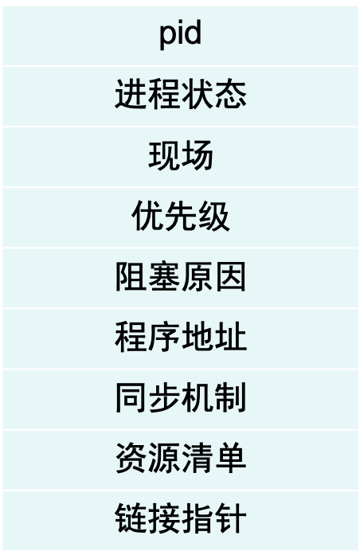

### PCB的主要作用

- 标识进程的存在。系统创建进程时，就为之创建一个PCB；进程结束时，系统又回收其PCB，进程便随之消亡。
- 为系统控制和管理进程提供所需的一切信息。 

### PCB的组织方式-顺序表

- 在一个系统中，通常可拥有数十个、数百个甚至上千个PCB。为了有效地进行进程管理，系统必须对进程进行合理的组织。       
- 顺序表 
- 定义一个PCB结构数组。这种方式不区分进程状态，将所有PCB连续地存放在内存区中。

### PCB的组织方式-索引表

系统根据进程的状态，分别为具有相同状态的PCB建立一张索引表。将同一状态的进程组织在一个索引表中，索引表的表项指向相应的进程控制块，不同状态对应不同的索引表，如就绪索引表和阻塞索引表等。

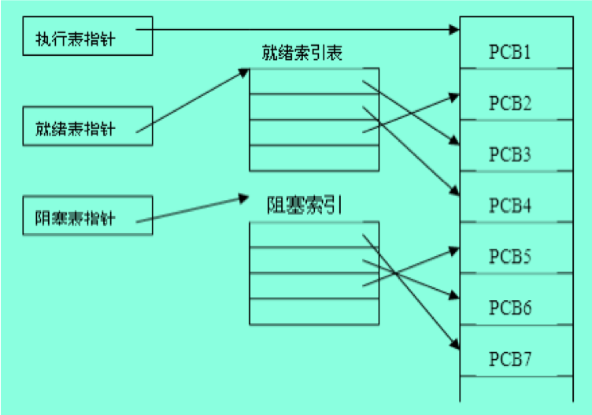

### PCB的组织方式-链表

系统根据PCB的状态，把相同状态的PCB链接成一个PCB链表队列，这样，可形成就绪进程队列、阻塞进程队列等。对就绪进程队列，可根据其优先级的不同，将优先级高的PCB排在前面。此外，系统也可根据阻塞原因的不同，形成等待各种外设I/O操作完成的队列、等待各种事件发生的队列。

### 进程空间

每一个进程都有自己的地址空间，该空间称为进程空间或虚空间，进程空间又划分为用户空间和系统空间两部分。用户程序在用户空间执行，操作系统内核程序则在进程的系统空间内执行。

### 进程控制

- 进程控制是指系统使用一些具有特定功能的程序段来创建进程、撤消进程以及完成进程各状态间的转换。
- 进程控制的功能是对系统中全部进程实施有效的管理，它是处理机管理的部分，当系统允许多进程并发执行时，为了实现共享、协调并发进程的关系，处理机管理必须提供对进程实行有效的管理。
- 这些程序段是机器指令的延伸，由若干条机器指令构成，用以完成特定功能，且在管态下执行，执行过程中不可分割，不允许被中断，并且它是顺序执行的，这样的程序段叫作原语。

### 用于进程控制的原语

- 创建原语
- 撤销原语
- 阻塞原语
- 唤醒原语
- 挂起原语和激活原语

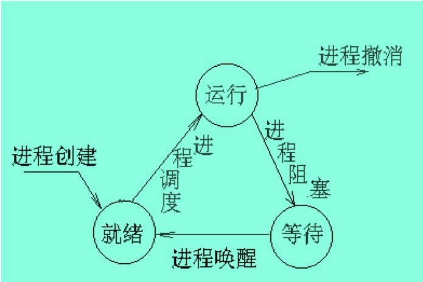

### 进程的控制：进程创建

一个进程可以调用创建进程原语来创建一个子进程。该原语的主要工作是为被建立进程建立起一个进程控制块PCB，并填入相应的初始值。其主要操作过程是：

- 先向系统申请一个空闲的PCB。
- 为新进程分配必要的资源。如内存空间。
- 初始化进程控制块。
- 将新进程插入就绪队列。
- 如果进程就绪队列能够接纳新进程，便将新进程插入就绪队列。

### 进程的控制：进程切换

- 保存被中断进程的处理器现场信息。
- 修改被中断进程的进程控制块的有关信息，如进程状态等。
- 把被中断进程的PCB加入有关队列。
- 选择下一个占有处理器运行的进程。
- 修改被选中进程的PCB的有关信息。
- 根据被选中进程设置操作系统用到的地址转换和存储保护信息。
- 根据被选中进程恢复处理器现场。

### 进程的控制：进程阻塞和唤醒

- 修改进程控制块的有关信息，如进程状态等。
- 把修改后进程控制块加入有关等待进程队列。
- 从相应的等待进程队列中取出进程控制块。
- 修改进程控制块的有关信息，如进程状态等。
- 把修改后进程控制块加入有关就绪进程队列。

### 进程的控制：进程撤销

- 根据撤销进程标识号，从相应队列中找到它的PCB。
- 将该进程拥有的资源归还给父进程或操作系统。
- 若该进程拥有子进程，应先撤销元的所有子进程，以防它们脱离控制。
- 被撤销进程出队，将它的PCB归还到PCB池。

## 2.3 线程的概念

### 线程的引入

- 对进程系统必须完成的操作：
  - 创建进程
  - 撤消进程
  - 进程切换
- 缺点：时间空间开销大，限制并发度的提高。
- 线程：轻量级进程，进程中的一个运行实体，是一个CPU调度单位，资源的拥有者还是进程或称任务。
- 进程的引入提高了资源的利用效率。但在进一步提高进程并发性的时候，发现进程切换开销占的比重越来越大，同时进程间通信的效率也受到限制。
- 线程的引入简化了进程间的通信，以小的开销来提高进程内的并发程度。

**线程**

1. 有执行状态（状态转换）
2. 不运行时保存上下文
3. 有一个执行栈
4. 有一些局部变量的静态存储
5. 可存储所在进程的内存和其他资源
6. 可以创建、撤销另一个线程

### 线程引入的优点

- 系统开销小、切换快。
- 是进程的一个实体，可作为系统独立调度和分派的基本单位。 
- 不拥有系统资源（只拥有从属进程的全部资源，资源是分配给进程）。 
- 一个进程中的多个线程可并发执行。
- 适合多处理机系统。

### 线程与进程的关系

- 单进程、单线程
- 单进程、多线程
- 多进程、一个进程一个线程
- 多进程、一个进程多个线程

### 线程与进程的比较

- 调度：线程作为调度的基本单位，同进程中切换不引起进程，当不同进程的线程切换才引起进程切换；进程作为拥有资源的基本单位。
- 并发性：一个进程间的多个线程可并发。
- 拥有资源：线程仅拥有隶属进程的资源；进程是拥有资源的独立单位。
- 系统开销进程大；线程小。

## 2.4 进程同步与互斥

### 基本概念

- 进程同步：指多个相关进程在执行次序上的协调
- 进程互斥：指在多到程序环境下，每次只允许一个进程对临界资源进行访问。
- 临界资源：一次仅供一个进程使用的资源。
- 在进程中涉及到临界资源的程序段叫临界区。
- 多个进程的临界区成为相关临界区。

### 进程的同步与互斥

- 多道程序系统的特征:并行性，制约性，动态性
- 进程间的相互制约关系:
  - **同步关系**:多个进程共同完成一个任务，它们之间必须协同动作，互相配合，相互交换信息--进程通信。
  - **互斥关系**:多个进程共享资源，互斥资源的使用具有排它性，进程间往往需要互相竞争…，一种特殊的同步关系!

### 同步与互斥比较

同步|互斥
---|---
进程-进程|进程-资源-进程
时间次序上受到某种限制|竞争到某一物理资源时不允许进程工作
相互清楚对方的存在及作用，交换信息|不一定清楚其进程情况
往往指有几个进程共同完成一个任务|往往指多个任务多个进程间通讯制约
例：生产与消费之间，发送与接受之间，作者与读者之间，供者与用者之间|例：交通十字路口，单轨火车的拨道岔

### 临界区

并发进程可以共享系统中的各种资源，但是系统中某些资源具有一次只允许一个进程所使用的属性，这样的资源为临界资源。

- 临界区：每个进程中访问临界资源的那段代码称为临界区。
- 进入区：检查是否可以进入临界区并对临界区“加锁”的代码。
- 退出区：释放临界区访问权的代码。


### 同步机制应满足的基本要求

- 描述能力
- 可以实现
- 效率高
- 使用方便

### 同步机制应遵循的准则

控制临界资源访问权的控制算法在设计上应遵循的原则：

- 空闲让进
- 忙则等待
- 有限等待
- 让权等待

### 进程的同步机制─信号量及P.V操作

同步机制

- 信号量及P、V操作；管程；条件临界域；路径表达式等（用于集中式系统中）
- 回合；通信顺序进程；分布进程；远程过程调用（适用于分布式系统中）

### 信号量机制

信号量机制是荷兰科学家E. W. Dijkstra在1965年提出的一种同步机制，也称为P、V操作。由最初的整型信号量发展为记录型信号量，进而发展为信号量集。

- 整型信号量
- 记录型信号量
- 信号量集（AND信号量集、一般信号量集）

#### 软件方法

```
Repeat
  flag[i]:=true;turn:=j;
  while(flag[i] and turn=j) 
     do no_op;
  critical section
  flag[i]:=false;
  remainder section
Until false
```

遵循“忙则等待”；“有空让进”，但难度和局限性较大。

#### 硬件方法

用硬件方法来解决临界区问题，即定义一些特殊指令，如TEST、SET、SWAP等指令，有效地实现了进程互斥，但不满足“让权等待”。

**有效解决同步问题的方法——信号机制**

为临界资源加锁的方法

### 使用互斥区的原则

- 前提：
  - 任何进程无权停止其他进程的运行
  - 进程之间相对运行速度无硬性规定
- 进程互斥的解决有两种做法
  - 由竞争各方平等协商
  - 引入进程管理者，由管理者来协调竞争各方对互斥资源的使用
- 具体方法
  - 硬件（当一个进程进入临界区，就屏蔽所有终端，但成本高）
  - 软件（用编程解决，但常常忙等待）

### 解决互斥的锁机制

- 解决进程互斥的最简单的办法是加锁。在系统中为每个临界资源设置一个锁位，
  - **0 表示资源可用，1 表示资源已被占用（不可用）。**
- 这样当一个进程使用某个临界资源之前必须完成下列操作：
    1. 考察锁位的值；
    2. 若原来的值是为“0”，将锁位置为“1”（占用该资源）；
    3. 若原来值是为“1”，（该资源已被别人占用），则转到1。当进程使用完资源后，将锁位置为“0 ”，称为开锁操作。

### P.V操作的概念

PV操作是典型的同步机制之一。用一个信号量与一个消息联系起来，当信号量的值为0时，表示期望的消息尚未产生；当信号量的值非0时，表示期望的消息已经存在。用PV操作实现进程同步时，调用P操作测试消息是否到达，调用V操作发送消息。


### P.V操作的实现

- 依进程等待方式不同，P操作的执行方式也不同。
  - 忙等待：当进程必须等待时，如果预计等待时间不长，则在多机系统中，为了减少进程转换所引起的开销，可采用忙等待方式
  - 阻塞等待：当进程必须在信号量S上等待时，将进程变为等待状态（活动阻塞），插入与信号量S有关的等待队列，让出CPU。（普遍采用，尤其在单机系统）

信号量定义扩充为记录：					

```
type Semaphore= record
    value:integer ;		
    L : pointer to PCB;
    end									
```

### 互斥例子

三个进程共用两个I/O缓冲区。

**解：设用信号量S表示共享资源，S初始值为2**

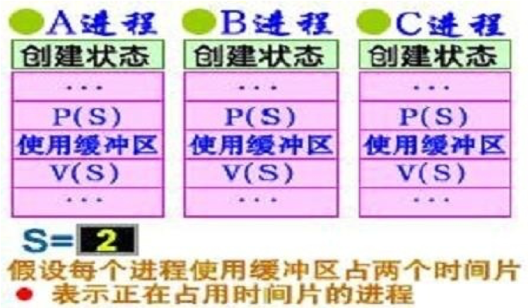

### 同步例子

有A、B两进程，A进程从卡片机读信息入缓冲区，B进程负责加工读进缓冲区的卡片

解：设信号量S1：缓冲区中有否可供加工的信息，初始值为0；信号量S2：缓冲区是否为空，初始值为1。

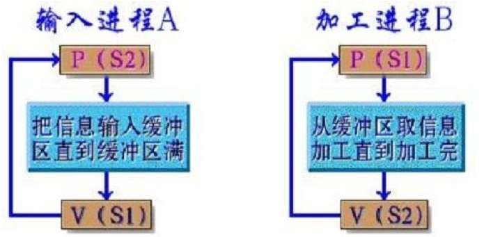

在输入进程A中，可以把P(S2)调到V(S1)后面，而把信号量S2的初始值设为0。

### P.V操作的优缺点

- 优点：简单，而且表达能力强（用P.V操作可解决任何同步互斥问题）
- 缺点
  - 不够安全；P.V操作使用不当会出现死锁；
  - 遇到复杂同步互斥问题时实现复杂。

### P.V操作的物理意义

- S>0时，信号量值表示该类资源的可用资源数
- S<=0时，表示已无此类资源可供分配，请求资源的进程将被阻塞在相应的信号量S的等待队列中。S的绝对值=该信号量上等待的进程数。
- S>0时，每执行一次P操作，意味着请求分配一个单位的该类资源给执行P操作的进程，即 S:=S-1；
- S<=0时，每执行一次V操作，意味着进程释放一个单位的该类可用资源，即S:=S+1.而此时S等待队列中有因该资源而被封锁的进程，故把队列中的一个进程唤醒，转入就绪队列。

### 经典进程的同步问题

在多道程序环境下，进程同步问题十分重要，出现一系列经典的进程同步问题，其中代表性包括：

- 生产者—消费者问题
- 读者—写者问题
- 哲学家就餐问题

#### “生产者—消费者”问题

【问题描述】“生产者—消费者”问题描述了一组生产者向一组消费者提供产品，它们共享一个有界缓冲区，生产者向其中投放产品，消费者从中取得产品。

设有界缓冲区的长度为n（n>0），一群生产者进程p1,p2,…，pm，一群消费者进程c1,c2,…，cm，如图所示。假定生产者和消费者是相互等效，只要缓冲区未满，生产者就可以把产品送入缓冲区，类似地，只要缓冲区未空，消费者便可以从缓冲区取走产品并消耗它。生产者和消费者的同步关系将禁止生产者向满的缓冲区输送产品，也禁止消费者从空的缓冲区提取产品。

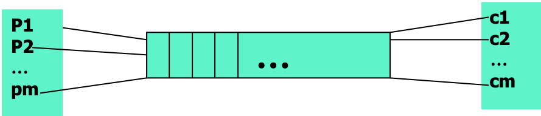

#### “生产者—消费者”问题的解决

##### 设置两个同步信号量及一互斥信号量

- **empty**：说明空缓冲单元的数目，其初值为有界缓冲区的大小n。
- **Full**：说明满缓冲单元的数目（即产品数目），其初值为0。
- **Mutex**：说明该有界缓冲区是一临界资源，必须互斥使用，其初值为1。

##### “生产者—消费者”问题的同步算法描述

```
 semaphore  full=0;  /*表示满缓冲区的数目*/
 semaphore  empty=n;  /*表示空缓冲区的数目*/
 semaphore  mutex=1;  /*表示对缓冲区进程操作的互斥信号量*/
Main()
{
  cobegin
     producer();
     consumer();
  coend
 }

// Producer()
{
  while(true)
   {
        生产一个产品; 
    p(empty); 
    P(mutex); 
    将一个产品送入缓冲区； 
    V(mutex);
    V(full);
}
}

// Consumer()
{
  while(true)
   {
     p(full); 
     P(mutex); 
    从缓冲区取走一个产品;  
 V(mutex);
 V(empty);    
 消费一个产品；
}
}
```

#### 读者—写者问题

- 有两组并发进程: 读者和写者,共享一组数据区,
- 要求：允许多个读者同时执行读操作；不允许读者、写者同时操作；不允许多个写者同时操作。

##### 第一类：读者优先

- 如果读者来：
  1. 无读者、写者，新读者可以读。
  2. 有写者等，但有其它读者正在读，则新读者也可以读
  3. 有写者写，新读者等
- 如果写者来：
  1. 无读者，新写者可以写。
  2. 有读者，新写者等待。
  3. 有其它写者，新写者等待。

##### 读者与写者问题

```
// 读者：Repeat
P(mutex);
readcount:=readcount+1;
if readcount=1
then P (w);
V(mutex);
读
P(mutex);
readcount:=readcount-1;
if readcount=0
then V(w);
(mutex)ntil false

// 写者：
Repeat

P(w);

写
V(w);

Until false
```

##### 哲学家就餐问题

有五个哲学家围坐在一圆桌旁，桌中央有一盘大盘鸡，每人面前有一只空盘子，每两人之间放一只筷子。

每个哲学家的行为是思考，感到饥饿，然后吃大盘鸡。

为了吃大盘鸡，每个哲学家必须拿到两只筷子，并且每个人只能直接从自己的左边或右边去取筷子。

```c
#define  N  5
 void philosopher (int i)  {
    while (true)  {
    思考；
    取fork[i]; 取fork[(i+1) % 5]；
    进食；
    放fork[i]; 放fork[(i+1) % 5]；
    }
}
```

##### 为防止发生死锁可采取的措施

- 最多允许4个哲学家同时坐在桌子周围
- 仅当一个哲学家左右两边的筷子都可用时，才允许他拿筷子（）
- 给所有哲学家编号，奇数号的哲学家必须首先拿左边的筷子，偶数号的哲学家则反之
- 为了避免死锁，把哲学家分为三种状态，思考，饥饿，进食，并且一次拿到两只筷子，否则不拿

##### 管程的引入

采用P-V同步机制来编写并发程序，对于共享变量及信号量变量的操作将被分散于各个进程中。缺点：

1. 易读性差，因为要了解对于一组共享变量及信号量的操作是否正确，则必须通读整个系统或者并发程序。
2. 不利于修改和维护，因为程序的局部性很差，所以任一组变量或一段代码的修改都可能影响全局。
3. 正确性难以保证，因为操作系统或并发程序通常很大，要保证这样一个复杂的系统没有逻辑错误是很难的。

##### 管程概念

- 概念：指关于共享资源的数据及在其上操作的一组过程或共享数据结构及其规定的所有操作。
- 管程：一种同步机制
- 系统按资源管理的观点分解成若干模块，用数据表示抽象系统资源，同时分析了共享资源和专用资源在管理上的差别，按不同的管理方式定义模块的类型和结构，使同步操作相对集中，从而增加了模块的相对独立性。

##### 管程的组成

- 管程的四个组成部分
  1. 名称
  2. 数据结构说明
  3. 对该数据结构进行操作的一组过程/函数
  4. 初始化局域
- 局部于管程的数据结构，仅被局部于管程的过程访问。局部于管程的过程，也仅能访问管程内的数据结构。
- 管程把共享变量和对它进行操作的若干过程围起来。 

##### 管程的三个主要特性

- 模块化:一个管程是一个基本程序单位，可以单独编译。
- 抽象数据类型:管程是一种特殊的数据类型，其中不仅有数据，而且有对数据进行操作的代码。
- 信息掩蔽:管程是半透明的，管程中的外部过程（函数）实现了某些功能，管程中的外部过程实现了某些功能，至于这些功能是怎样实现的，在其外部则是不可见的。

##### 管程的实现

由于管程通常是用于管理资源的，因而在管程内部，应当存在某种等待机制。当进入管程的进程因资源被占用等原因不能继续运行时使其等待。为此在管程内部可以说明和使用一种特殊类型的变量，称作条件变量：**VAR C:condition;**

- 对于条件型变量，可以执行wait和signal操作：
- Wait（c）：如果紧急等待队列非空，则唤醒第一个等待者；否则释放管程的互斥权，执行此操作的进程的PCB入c链尾部。
- Signal（c）：如果c链为空，则相当于空操作，执行此操作的进程继续；否则唤醒第一个等待者，执行此操作进程的PCB入紧急等待队列的尾部。

##### 管程的实现

两个主要途径：

- 直接构造(效率高)
- 间接构造，即用某种已经实现的同步机制去构造

**例子：用P-V操作构造管程**

##### 利用管程解决生产者- 消费者问题 

```bash
Producer :
Begin
   repeat
produce an item in nextp
PC.enter(item);
until false
end

Consumer:
Begin
repeat
 PC.remove(item);
consume the item in nextc;
Until false;
end

monitor  P(roducer-)C(onsumer)
condition full,empty;
integer count;     
      procedure  enter(item)
  begin
     if count=N then wait(full);        
      enter –item;
       count:=count+1;
    signal(empty) 
   end

procedure  remove(item)
begin
   if  count=0  then  wait(empty);        
   remove-item;
   count:=count-1;
    signal(full) end
   count:=0;
end  monitor; 
```

##### 管程和进程的异同点

1. 设置进程和管程的目的不同。
2. 系统管理数据结构。
   1. 进程：PCB
   2. 管程：等待队列
3. 管程被进程调用。
4. 管程是操作系统的固有成分，无创建和撤消。

## 2.5 进程通信

### 进程通信概述

- 进程通信方式：
  - 低级通信原语：交换信息量较少。如互斥，同步机构。
  - 高级通信原语：交换信息量较多。如直接通信，间接通信。
- 高级通信原语：
  - 直接通信：一个进程直接发送消息给接受者进程；Send(P,Msg); Receive(P,Msg);
  - 间接通信：进程通过一个“信箱”来传递消息。Send(A,Msg); Receive(A,Msg);

### 实现进程通信的方式

- 共享存储器方式：相互通信的进程通过共享某些数据结构或存储区来进行通信，可分为共享数据结构方式、共享存储区方式；
- 消息通信方式：进程间的消息交换以消息或报文为单位，程序员利用一组通信命令(原语)来实现通信，可分为直接、间接通信方式；
- 共享文件方式：利用共享文件来实现进程间的通信。 

### 直接方式

直接通信方式通过消息缓冲区实现通信，企图发送或接收消息的每个进程必须指出消息发给谁或从谁那里接收消息，用send原语和receive原语来实现进程之间的直接通信。 

- 共享文件模式：管道通信发送进程发消息时要指定接收进程的名字，接收时也要指明发送进程的名字。
  - Send(receiver, message) 
  - Receiver(sender, message)
  - 对称形式：一对一
  - 非对称形式：多对一 （学生/教师）
  - 有缓冲（有界，无界），无缓冲

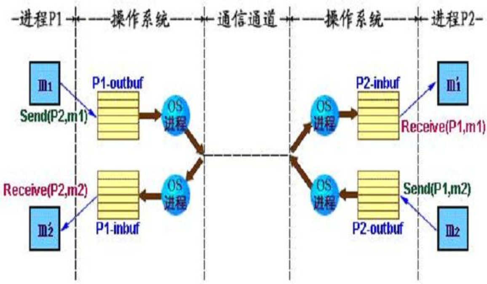

### 间接通信

通过信箱（mailbox）实现通信，信箱是一种公共的存储区，作为通信的一种中间实体。在逻辑上信箱由信箱头和信箱体组成，每个信箱有自己唯一的标识符。其中信箱头指出信箱容量、信箱格式、存放信件位置的指针等；信箱体用来存放信件，包含若干个信格，每个格可容纳一封信。

1. send（发送消息）原语
   - send（A，信件）发送原语是把一封信件（消息）传送到信箱A。如果指定的信箱未满，则将信件送入信箱中，并唤醒等待该信箱中信件的进程；否则，发送信件者被置成等待信箱的阻塞状态。
2. receive（接收消息）原语
   - receive（A，信件）接收原语用来从信箱A接收一封信件（消息）。如果指定信箱中有信，则取出一封信，并唤醒等待信箱的进程；否则，接收信件者被置成等待信箱中信件的阻塞状态。

### 管道通信方式

管道通信方式，也称共享文件方式，基于文件系统，利用一个打开的共享文件连接两个相互通信的进程，文件作为缓冲传输介质。

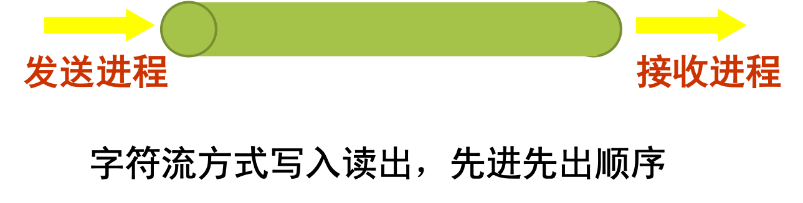

### 消息传递实现的几个问题

- 信箱容量
- 信箱的所有权
- 通信进程的同步
- 信件的格式问题及其它相关问题
- 关于多进程与信箱相连的信件接收