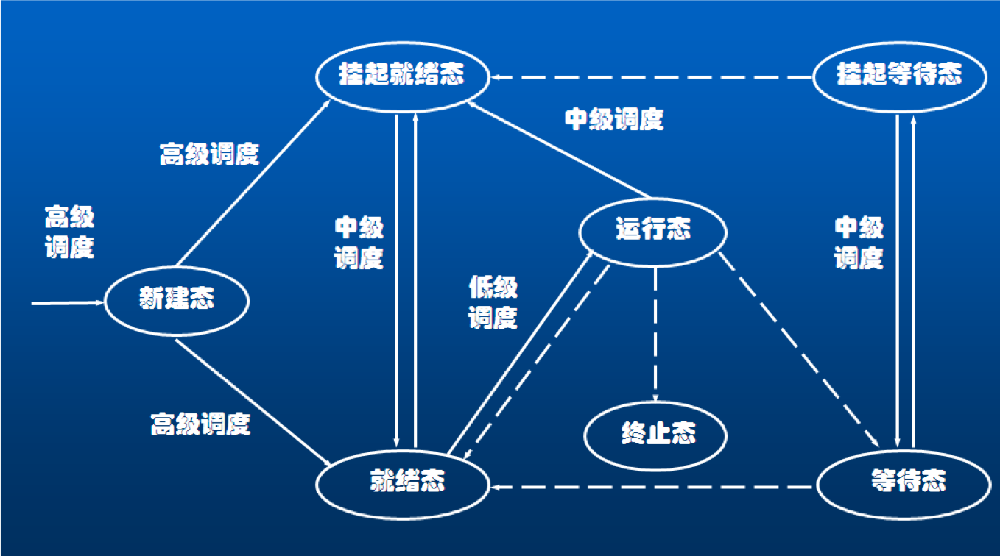
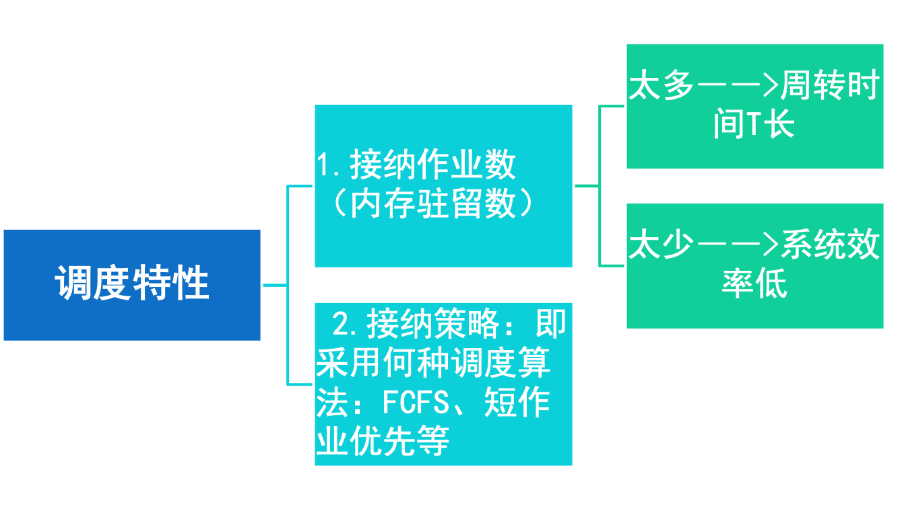

## 3.1 概述

### 处理机调度概述

处理机调度是指CPU资源在可运行实体间的分配。在多道程序系统中，通常会有多个进程或线程同时竞争CPU。如果只有一个CPU可用，就必须选择下一个可用的进程或线程。在操作系统中，完成选择工作的这一部分称为调度程序，该程序使用的算法称为调度算法。 

### 处理器调度与进程状态转换

### 处理机调度的类型

处理器调度的层次

- 高级调度
- 中级调度
- 低级调度

### 高级调度

多道批处理OS中，高级调度又称为作业调度，功能是按照某种原则从后备作业队列中选取作业进入主存，并为作业做好运行前的准备工作和完成后的善后工作。

### 中级调度

- 为提高系统吞吐量和内存利用率而引入的一内---外存对换功能（换出时，进程为挂起或就绪驻外状态）。 
- 决定那些进程被允许参与竞争处理器资源，起到短期调整系统负荷的作用。
- 所用的方法是把一些进程换出主存，从而使之进入“挂起”状态，不参与进程调度，以平顺系统的操作。

### 低级调度

- 又称进程调度或短程调度，它的主要功能是按照某种原则把处理其分配给就绪进程。
- 进程调度程序是操作系统最为核心的部分，进程调度策略的优劣直接影响到整个系统的性能。
- 主要是由分派程序（Dispatcher）分派处理机。

1. 非抢占方式：简单，时效性差
2. 抢占方式
   1. 时间片原则
   2. 优先权全责
   3. 短作业优先原则

### 选择调度算法的原则

为比较CPU调度算法，人们提出了很多调度准则，用来进行比较特征对确定最佳算法时产生的影响。常用的准则如

1. 吞吐量
2. CPU利用率
3. 周转时间
4. 响应时间
5. 就需等待时间

### 调度算法计算的几个指标

#### 评价周转时间

$$T = \frac{1}{n}[ \sum_{i=1}^n T_i]$$

#### 平均带权

$$W = \frac{1}{n}[ \sum_{i=1}^n \frac{T_i}{T_s}]$$

可见带权w越小越好，$T_s$为实际服务时间。

#### 平均等待时间

进程i从进入就绪队列的那一刻$t_{ir}到获得CPU的那一刻$t_{ip}$所经历的时间成为它的等待时间$W_i$，即$W_i=t_{ip}-t_{ir}$,那么n个进程的评价等待时间W为：

$$W = \frac{1}{n}[ \sum_{i=1}^n W_i]$$

#### 选择调度方式和算法的几个原则(续)

- 面向用户的原则
  - 响应时间快：键盘提交请求到首次响应时间
    1. 输入传送时间
    2. 处理时间
    3. 响应传送时间
  - 截止时间的保证（特别适用于实时系统）各类资源的平衡利用。
  - 优先权准则：（即需要抢占调度）
- 面向系统的原则
  - 吞吐量高：单位时间完成作业数
  - 处理机利用率好：（CPU相对贵，特别适用于大中型多用户系统）
  - 各类资源的平衡利用

## 3.2 作业调度

### 作业

作业（Job）是用户提交给操作系统计算的一个独立任务。在批处理系统中，作业进入系统后先驻留在外存上，因此，需要由作业调度来将它们分批地装入内存。因此作业调度是适用于批处理系统的一种调度方式。

### 作业控制块(JCB)

- 在多道批处理系统中通常有上百个作业被放在输入井（外存）中。为了管理和调度作业，系统为每个作业设置了一个作业控制块。
- JCB记录该作业的有关信息。不同系统的JCB的组成内容有所区别，主要包括作业名、资源要求、资源使用情况、类型级别、状态等。
- JCB是作业在系统中存在的唯一标志。作业进入系统时由spooling系统为每个作业建立一个JCB；当作业退出系统时，其JCB也一起被撤销。

### 作业调度的主要功能

作业调度：按照某种算法从作业后备队列中挑选作业进入主存中运行。

**具体功能**

1. 按照某种原酸从昨夜后备队列中挑选作业；
2. 为选中的作业分配主存和外设资源；
3. 为选中的作业建立相应的进程；
4. 构造和填写作业运行时所需的表格，如作业表；
5. 作业结束时完成作业的善后处理工作，如回收资源，输出结果，撤销全部进程（PCB）和JCB。

### 调度一个作业的时机

- 作业完成后
- 有新作业提交
- 处理机利用率较低

### 常用的作业调度算法

以单道批处理系统为例，常用的作业调度算法有：

- 先来先服务（FCFS）算法
- 最短作业优先（SJF）算法
- 最高响应比优先（HRF）算法   响应比 ＝1+已等待时间/估计运行时间
- 均衡调度算法 

## 3.3 进程调度

## 3.4 死锁

