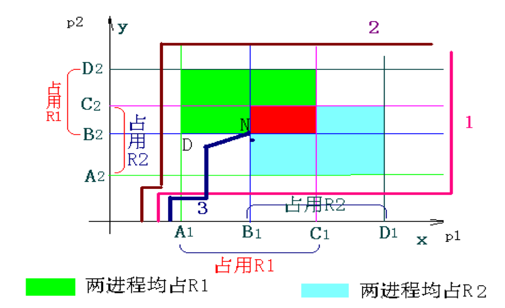
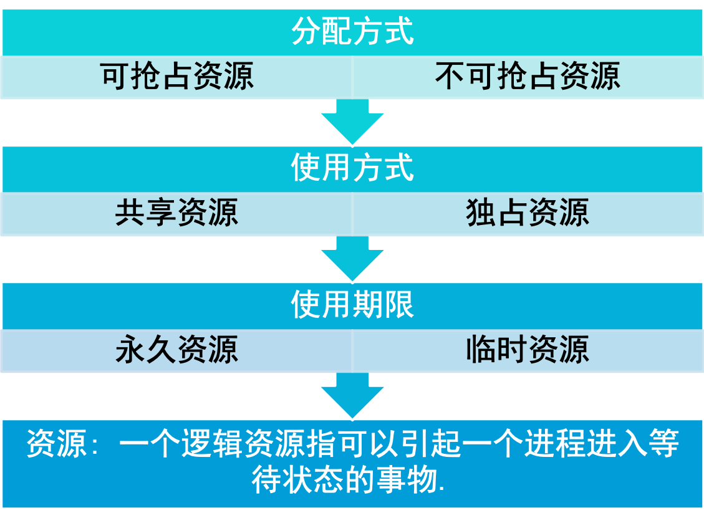
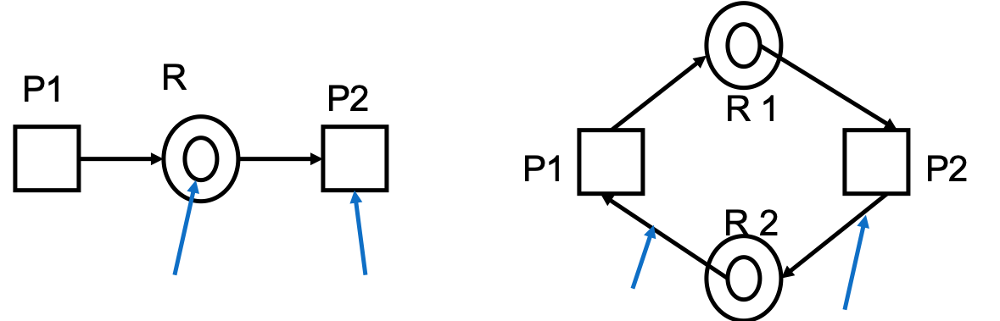

## 3.1 概述

### 处理机调度概述

处理机调度是指CPU资源在可运行实体间的分配。在多道程序系统中，通常会有多个进程或线程同时竞争CPU。如果只有一个CPU可用，就必须选择下一个可用的进程或线程。在操作系统中，完成选择工作的这一部分称为调度程序，该程序使用的算法称为调度算法。 

### 处理器调度与进程状态转换

### 处理机调度的类型

处理器调度的层次

- 高级调度
- 中级调度
- 低级调度

### 高级调度

多道批处理OS中，高级调度又称为作业调度，功能是按照某种原则从后备作业队列中选取作业进入主存，并为作业做好运行前的准备工作和完成后的善后工作。

### 中级调度

- 为提高系统吞吐量和内存利用率而引入的一内---外存对换功能（换出时，进程为挂起或就绪驻外状态）。 
- 决定那些进程被允许参与竞争处理器资源，起到短期调整系统负荷的作用。
- 所用的方法是把一些进程换出主存，从而使之进入“挂起”状态，不参与进程调度，以平顺系统的操作。

### 低级调度

- 又称进程调度或短程调度，它的主要功能是按照某种原则把处理其分配给就绪进程。
- 进程调度程序是操作系统最为核心的部分，进程调度策略的优劣直接影响到整个系统的性能。
- 主要是由分派程序（Dispatcher）分派处理机。

1. 非抢占方式：简单，时效性差
2. 抢占方式
   1. 时间片原则
   2. 优先权全责
   3. 短作业优先原则

### 选择调度算法的原则

为比较CPU调度算法，人们提出了很多调度准则，用来进行比较特征对确定最佳算法时产生的影响。常用的准则如

1. 吞吐量
2. CPU利用率
3. 周转时间
4. 响应时间
5. 就需等待时间

### 调度算法计算的几个指标

#### 评价周转时间

$$T = \frac{1}{n}[ \sum_{i=1}^n T_i]$$

#### 平均带权

$$W = \frac{1}{n}[ \sum_{i=1}^n \frac{T_i}{T_s}]$$

可见带权w越小越好，$T_s$为实际服务时间。

#### 平均等待时间

进程i从进入就绪队列的那一刻$t_{ir}到获得CPU的那一刻$t_{ip}$所经历的时间成为它的等待时间$W_i$，即$W_i=t_{ip}-t_{ir}$,那么n个进程的评价等待时间W为：

$$W = \frac{1}{n}[ \sum_{i=1}^n W_i]$$

#### 选择调度方式和算法的几个原则(续)

- 面向用户的原则
  - 响应时间快：键盘提交请求到首次响应时间
    1. 输入传送时间
    2. 处理时间
    3. 响应传送时间
  - 截止时间的保证（特别适用于实时系统）各类资源的平衡利用。
  - 优先权准则：（即需要抢占调度）
- 面向系统的原则
  - 吞吐量高：单位时间完成作业数
  - 处理机利用率好：（CPU相对贵，特别适用于大中型多用户系统）
  - 各类资源的平衡利用

## 3.2 作业调度

### 作业

作业（Job）是用户提交给操作系统计算的一个独立任务。在批处理系统中，作业进入系统后先驻留在外存上，因此，需要由作业调度来将它们分批地装入内存。因此作业调度是适用于批处理系统的一种调度方式。

### 作业控制块(JCB)

- 在多道批处理系统中通常有上百个作业被放在输入井（外存）中。为了管理和调度作业，系统为每个作业设置了一个作业控制块。
- JCB记录该作业的有关信息。不同系统的JCB的组成内容有所区别，主要包括作业名、资源要求、资源使用情况、类型级别、状态等。
- JCB是作业在系统中存在的唯一标志。作业进入系统时由spooling系统为每个作业建立一个JCB；当作业退出系统时，其JCB也一起被撤销。

### 作业调度的主要功能

作业调度：按照某种算法从作业后备队列中挑选作业进入主存中运行。

**具体功能**

1. 按照某种原酸从昨夜后备队列中挑选作业；
2. 为选中的作业分配主存和外设资源；
3. 为选中的作业建立相应的进程；
4. 构造和填写作业运行时所需的表格，如作业表；
5. 作业结束时完成作业的善后处理工作，如回收资源，输出结果，撤销全部进程（PCB）和JCB。

### 调度一个作业的时机

- 作业完成后
- 有新作业提交
- 处理机利用率较低

### 常用的作业调度算法

以单道批处理系统为例，常用的作业调度算法有：

- 先来先服务（FCFS）算法
- 最短作业优先（SJF）算法
- 最高响应比优先（HRF）算法  响应比 ＝1+已等待时间/估计运行时间
- 均衡调度算法 

## 3.3 进程调度

## 3.4 死锁

### 死锁的基本概念

死锁就是两个或两个以上的进程等候着一个永远不会发生的事件时所取的一种系统状态。

### 死锁问题的提出

产生死锁的原因：

1. 竞争共享资源  
2. 进程推进顺序不当

### 资源的概念

### 死锁的必要条件

### 死锁的预防

#### 预先静置分配法：破坏部分分配条件

- 策略
  - 作业调度时，仅当系统满足作业运行时所需的全部资源时，才把该作业调入内存运行。
  - 在作业运行前一次性将其所需的全部资源分配给它，于是在作业运行过程中不再会提出新的资源请求。
- 缺点：资源浪费！
- 改进：程序->程序步；资源分配以程序步为单位。
- 有点：减少资源浪费，利用率提高。
- 不足
  - 增加了应用系统的设计和执行开销。
  - 作业所需资源不能一次性满足->可能无限延迟。
  - 作业所需资源逐步累计->占而不用->浪费资源。

#### 有序资源适用法：破坏循环等待条件

- 策略：把系统中的全部资源分别分给一个特定的序号，并且要求每个进程均应严格地按照序号递增的次序请求资源。
- 有点：基于动态分配方法，资源利用率较前法提高。
- 关键：小心安排资源序号。
- 问题
  1. 各类资源序号一经安排，不宜经常地随意改动；
  2. 资源序号尽可能反应多数作业的实际使用资源的顺序，但总有不合适的作业而造成资源浪费。

### 死锁的避免和银行家算法

- 预防：破坏死锁必要条件之一，保证死锁不发生（限制调价较强，实现简单，但严重损害了系统性能）
- 避免：不严格限制必要条件（限制条件较弱，可能获得满意结果）
- 安全状态：指系统按照某种进程顺序（如P1,P2，...Pn）来为每个进程分配其所需资源，直到最大需求，使每个进程都可以顺利完成，此时系统所处状态为安全状态。
- 不安全状态
  - 若系统没有这样一个安全序列，则系统处于不安全装填。
  - 如果不按照安全序列分配资源，则系统可能由安全状态进入不安全状态。

### 银行家算法

- 避免死锁算法中最有代表性的算法是Dijkstra E.W于1968年提出的银行家算法。
- 该算法需要检查申请者对资源的最大需求量，如果系统现存的各类资源可以满足申请者的请求，就满足申请者的请求。
- 这样申请者就可很快完成其计算，然后释放它占用的资源，从而保证了系统中的所有进程都能完成，所以可避免死锁的发生。

### 死锁检测

- 条件：允许死锁必要条件存在，也未采用避免死锁的算法（提高资源利用率）——故死锁可能发生，需检测。
- 定义：实际地检查系统中是存在死锁，并标出那些进程和资源被牵扯在死锁中。
- 应用：允许前三个死锁的必要条件存在的系统中，检查系统中是否存在循环等待条件。
- 方法
  - 资源分配图
  - 如果资源分配图中不存在环路，则系统不存在死锁；繁殖如果资源分配图中存在环路，则系统可能存在死锁，也可能不存在死锁。

### 资源分配图

#### 简化资源分配图

##### 化简

一个进程的所有资源要求均能被满足，则该进程得到其所需全部资源从而不断去的进展，直至完成全部任务并释放出全部资源。->移走所有从资源触发指向该进程的有向边，和从该进程触发指向资源的诸有向边->该进程成为孤立的节点。

##### 死锁定理

当且仅当资源某状态S所对应的资源分配图是不可化简的，则S是死锁状态。而不可被化简的进程既是死锁的进程。反之，若状态S所对应的资源分配图是可化简的，则S是安全状态。

**资源分配图的化简结果与化简顺序无关，最终结果是相同的。**

### 死锁恢复

- 强制性地从系统中撤消进程并剥夺它们的资源给剩下的进程使用。
  - 撤消进程的原则：
    - 进程的优先数；
    - 重新启动它并运行到当前撤消点所需的代价；
    - 作业的外部代价：即与此进程相关的作业类型都可以有其相应的固定撤消代价。
- 挂起和解挂机构：
  - 从被挂起进程那里强占资源以解除死锁。

--- 

