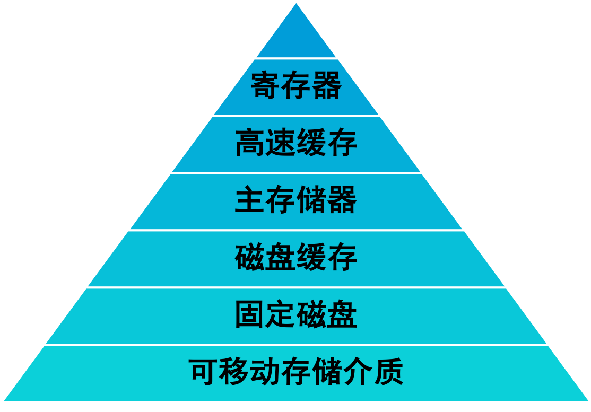
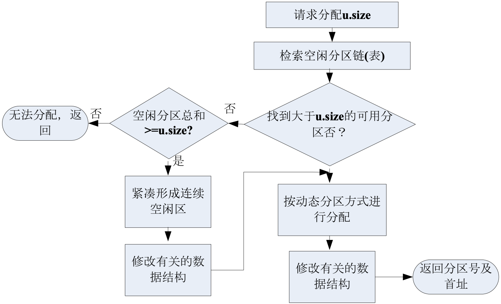
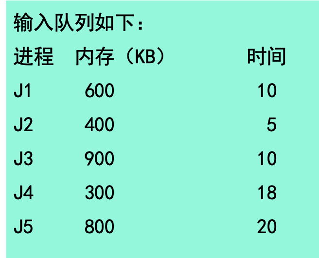

## 4.1 概述

### 几种存储介质的区别

- 高速缓存Cache:少量、快速、昂贵、易变
- 内存RAM：若干兆字节、中等速度、中等价格、易变
- 磁盘：数百着或数千兆字节、低俗、价廉、不易变

**由操作系统协调这些存储器的使用**

### 存储管理的主要功能

- 主存储空间的分配和去配
- 地址转换
  - 逻辑地址和物理地址
  - 地址转换、静态重定位、动态重定位
- 主存储空间的保护
  - 保护操作系统占有的主存区
  - 保护各程序的私有主存区
  - 保护可供多个程序访问的主存共享区
- 主存储空间的共享
  - 主存储器资源的共享
  - 某一主存区域的共享
- 主存储空间的扩充

#### 逻辑地址与物理地址

- 逻辑地址：通常用户程序是用高级语言编写的，并以二进制的形式保存在计算机的辅存中，称为源程序，源程序经过编译得到计算机能理解的目标程序，目标程序中的地址称为逻辑地址（相对地址）。
- 物理地址：计算机主存中每个存储单元都有一个编号与之对应，这些编号称为物理地址（绝对地址）。

#### 地址转换

- 原因：当程序装入内存时，操作系统要为该程序分配一个合适的内存空间，由于程序的逻辑地址与分配到内存物理地址不一致，而CPU进行指令时，是按物理地址进行的，所以要进行地址转换。
- 地址转换有两种方法
  - 静态重定位
  - 动态重定位

#### 静态地址重定位

即在程序装入内存的过程中完成，是指在程序开始运行前，程序中的各个地址有关的项均已完成重定位，地址变换通常是在装入时一次完成的，以后不再改变。

#### 动态重定位

- 在程序运行过程中要访问数据时再进行地址变换（即在逐条指令执行时完成地址映射。一般为了提高效率，此工作由硬件地址映射机制来完成。硬件支持，软硬件结合完成）。
- 硬件上需要一对寄存器的支持。

#### 用户程序的处理过程

程序在运行期间，被分为不同的生命期，每一步地址都有不同形式：

- 编译阶段 
- 链接阶段
- 装入阶段 
- 执行阶段

### 各种存储管理方案

- 单用户存储管理
- 固定分区存储管理
- 可变分区存储管理
- 交换

#### 单用户存储管理

- 单用户存储管理是最简单的一种存储管理方法，用于早期单用户系统中。
- 特点：内存分配方式简单，整个内存空间被分割成系统区和用户区两部分，系统区用来存放操作系统驻留代码和数据，剩余空间则全部作为用户区，分配给一个用户作业使用。 

##### 单用户存储管理内存分配

##### 单用户存储管理的存储保护

#### 固定分区存储管理

- 固定分区存储管理是满足多道程序环境的最简单的存储管理方案。 
- “固定”是指分区的大小和个数是在开机时由系统管理员指定，直到关机都不会再重新划分。每个分区只能存储一个进程，进程也只能在它所驻留的分区中运行。 
- 一个计算机系统中可以运行的进程数依赖于内存中的分区数量。 

在多道程序环境下，可能出现申请分配存储空间的进程数大于内存的分区数，这就需要先将这些进程排队，当出现空闲分区时再从队列中取出，为其分配分区。 

##### 固定分区存储管理的地址映射和存储保护

#### 可变分区存储管理

- 基本原理：系统初启后，在内存中除常驻操作系统，其余空间为一个完整的大空闲区。当有进程申请分配内存空间时，系统从该空闲区中划分出一块与进程大小相同的区域进行分配。 
- 可变分区存储管理中可以采用两种数据结构来完成存储空间的分配和回收。
  1. 空闲分区表 
  2. 空闲分区链

#### 动态分区分配算法

例：假设一个计算机系统的内存为2560KB，采用可变分区存储管理，操作系统占用内存低地址的400KB，则用户区的内存为2160KB。

#### 交换

- 交换（Swapping）又称对换，指在内存空间不够时，先把内存中暂时不用的程序和数据换出到辅存，将已具备运行条件的进程调入到内存。
- 利用交换技术可有效缓解内存紧张的问题。 
- 交换一般是以进程为单位的，称为“进程交换”，因此进程的大小必须小于内存的大小，大于内存的进程无法运行。

## 4.2 段式存储管理

### 段式存储管理

**逻辑段与物理段**

- 分段存储管理中，地址的分割由用户进行的，用户根据程序需要来划分各个段。 
- 进程空间按逻辑被划分为一些长度不同的区域，每个区域称为一个逻辑段。一个逻辑段对应一个进程单元，例如一个子程序/模块/数据段等。 
- 一个进程是有若干逻辑段组成的，将这些段依次编号，称作段号。 

### 逻辑地址

- 内存划分
  - 内存空间被动态的划分为若干个长度不相同的区域，这些区域被称为物理段，每个物理段由起始地址和长度确定。
- 内存分配
  - 以段为单位分配内存，每一个段在内存中占据连续空间（内存随机分割，需要多少分配多少），但各段之间可以不连续存放。

段号|段内地址
---|---

### 管理

段号|段首指|段长度
---|---|---
0|58k|120k
1|100k|110k
2|260k|220k

**段表**

- 它记录了段号，段的首（地）址和长度之间的关系。
- 每一个程序设一个段表。

### 空闲块管理

- 空闲块管理记录了空闲区起始地址和长度。
- 内存的分配算法：
  - **&首先适配算法**:当接到内存申请时，查空闲块表，找到第一个不小于请求的空块，将其分割并分配特点：简单、快速分配
  - **&最佳适配算法**:接到内存申请时，在空闲块表中找到一个不小于请求的最小空块进行分配特点：用最小空间满足要求
  - **&最坏适配算法**:接到内存申请时，在空闲块表中找到一个不小于请求的最大空块进行分配特点：当分割后空闲块仍为较大空块

### 三种分配算法比较

- 最佳分配适用于请求分配的内存范围较广的系统。因为按照最佳分配的原来进行分配时，总是找大小最接近请求的空间，因此系统中可能产生存储量很小而每次都无法利用的小空间，同时也保留那些空间很大的片段，这样，不同的空闲片段将差别巨大，大片区域非常大，小片区域非常小而无法利用。
- 最差适配则与之相反，将会使整个区域的空闲片段的大小趋于均匀，因此其适用于请求内存大小差别不是很大的系统。
- 首次适配是随机的，因此介于两者之间。

### 可变式分区管理

#### 数据结构

1. 空闲分区表
2. 空闲分区链

#### 分配算法

1. 首次适应算法FF
   1. 要求：分区按低址——高址链接
   2. 特点：找到第一个大小满足的分区，划分。有外零头，低址内存使用频繁。
2. 循环首次适应算法。
   1. 从1中上次找到的空闲分区下一个开始查找。
   2. 特点：空闲分许分布均匀，提高了查找速度；缺乏大的空间分区。
3. 最佳适应算法：分区按大小递增排序；分区释放时需要插入到适当位置。

有点：

- 便于动态申请内存
- 管理和使用统一化
- 便于共享
- 便于动态链接

缺点：产生大量碎片

与可变分区存储管理方案区别

### 段的共享与保护

段的共享：在分段存储管理中，每一个段都是一个逻辑上独立的单元，因此更容易实现段的共享。两个进程要共享内存中的某一段程序时，只要在各字段表中的相应位置，填入该共享段的起始地址和长度即可。

段的保护：通常是在段表中增加一个权限为。这个权限位将指明该段是制度（例如共享数据段）、只执行（例如共享程序段）或可读/写。每次读取段表信息前，先比较所要执行的操作是否符合权限位要求。

## 4.3 页式存储管理

## 4.4 段页式存储管理

## 4.5 虚拟存储

