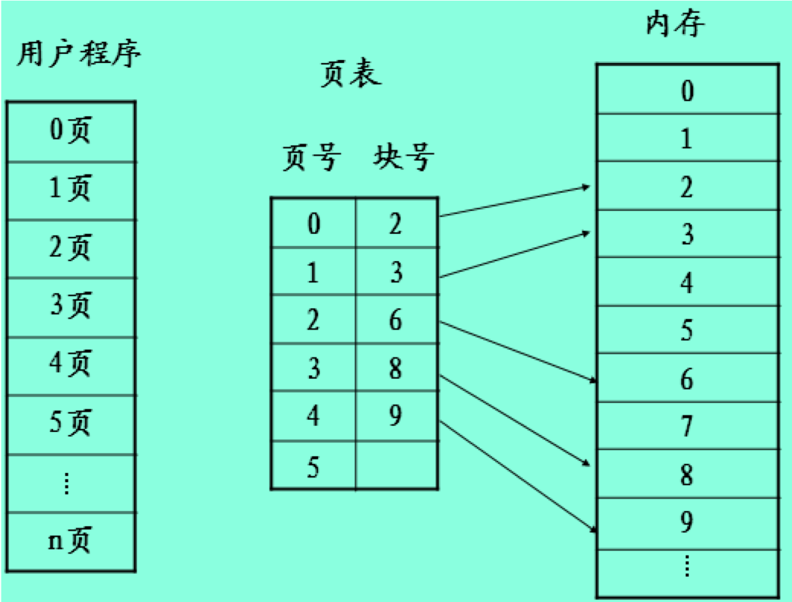

## 4.1 概述

### 几种存储介质的区别

- 高速缓存Cache:少量、快速、昂贵、易变
- 内存RAM：若干兆字节、中等速度、中等价格、易变
- 磁盘：数百着或数千兆字节、低俗、价廉、不易变

**由操作系统协调这些存储器的使用**

### 存储管理的主要功能

- 主存储空间的分配和去配
- 地址转换
  - 逻辑地址和物理地址
  - 地址转换、静态重定位、动态重定位
- 主存储空间的保护
  - 保护操作系统占有的主存区
  - 保护各程序的私有主存区
  - 保护可供多个程序访问的主存共享区
- 主存储空间的共享
  - 主存储器资源的共享
  - 某一主存区域的共享
- 主存储空间的扩充

#### 逻辑地址与物理地址

- 逻辑地址：通常用户程序是用高级语言编写的，并以二进制的形式保存在计算机的辅存中，称为源程序，源程序经过编译得到计算机能理解的目标程序，目标程序中的地址称为逻辑地址（相对地址）。
- 物理地址：计算机主存中每个存储单元都有一个编号与之对应，这些编号称为物理地址（绝对地址）。

#### 地址转换

- 原因：当程序装入内存时，操作系统要为该程序分配一个合适的内存空间，由于程序的逻辑地址与分配到内存物理地址不一致，而CPU进行指令时，是按物理地址进行的，所以要进行地址转换。
- 地址转换有两种方法
  - 静态重定位
  - 动态重定位

#### 静态地址重定位

即在程序装入内存的过程中完成，是指在程序开始运行前，程序中的各个地址有关的项均已完成重定位，地址变换通常是在装入时一次完成的，以后不再改变。

#### 动态重定位

- 在程序运行过程中要访问数据时再进行地址变换（即在逐条指令执行时完成地址映射。一般为了提高效率，此工作由硬件地址映射机制来完成。硬件支持，软硬件结合完成）。
- 硬件上需要一对寄存器的支持。

#### 用户程序的处理过程

程序在运行期间，被分为不同的生命期，每一步地址都有不同形式：

- 编译阶段 
- 链接阶段
- 装入阶段 
- 执行阶段

### 各种存储管理方案

- 单用户存储管理
- 固定分区存储管理
- 可变分区存储管理
- 交换

#### 单用户存储管理

- 单用户存储管理是最简单的一种存储管理方法，用于早期单用户系统中。
- 特点：内存分配方式简单，整个内存空间被分割成系统区和用户区两部分，系统区用来存放操作系统驻留代码和数据，剩余空间则全部作为用户区，分配给一个用户作业使用。 

##### 单用户存储管理内存分配

##### 单用户存储管理的存储保护

#### 固定分区存储管理

- 固定分区存储管理是满足多道程序环境的最简单的存储管理方案。 
- “固定”是指分区的大小和个数是在开机时由系统管理员指定，直到关机都不会再重新划分。每个分区只能存储一个进程，进程也只能在它所驻留的分区中运行。 
- 一个计算机系统中可以运行的进程数依赖于内存中的分区数量。 

在多道程序环境下，可能出现申请分配存储空间的进程数大于内存的分区数，这就需要先将这些进程排队，当出现空闲分区时再从队列中取出，为其分配分区。 

##### 固定分区存储管理的地址映射和存储保护

#### 可变分区存储管理

- 基本原理：系统初启后，在内存中除常驻操作系统，其余空间为一个完整的大空闲区。当有进程申请分配内存空间时，系统从该空闲区中划分出一块与进程大小相同的区域进行分配。 
- 可变分区存储管理中可以采用两种数据结构来完成存储空间的分配和回收。
  1. 空闲分区表 
  2. 空闲分区链

#### 动态分区分配算法

例：假设一个计算机系统的内存为2560KB，采用可变分区存储管理，操作系统占用内存低地址的400KB，则用户区的内存为2160KB。

#### 交换

- 交换（Swapping）又称对换，指在内存空间不够时，先把内存中暂时不用的程序和数据换出到辅存，将已具备运行条件的进程调入到内存。
- 利用交换技术可有效缓解内存紧张的问题。 
- 交换一般是以进程为单位的，称为“进程交换”，因此进程的大小必须小于内存的大小，大于内存的进程无法运行。

## 4.2 段式存储管理

### 段式存储管理

**逻辑段与物理段**

- 分段存储管理中，地址的分割由用户进行的，用户根据程序需要来划分各个段。 
- 进程空间按逻辑被划分为一些长度不同的区域，每个区域称为一个逻辑段。一个逻辑段对应一个进程单元，例如一个子程序/模块/数据段等。 
- 一个进程是有若干逻辑段组成的，将这些段依次编号，称作段号。 

### 逻辑地址

- 内存划分
  - 内存空间被动态的划分为若干个长度不相同的区域，这些区域被称为物理段，每个物理段由起始地址和长度确定。
- 内存分配
  - 以段为单位分配内存，每一个段在内存中占据连续空间（内存随机分割，需要多少分配多少），但各段之间可以不连续存放。

段号|段内地址
---|---

### 管理

段号|段首指|段长度
---|---|---
0|58k|120k
1|100k|110k
2|260k|220k

**段表**

- 它记录了段号，段的首（地）址和长度之间的关系。
- 每一个程序设一个段表。

### 空闲块管理

- 空闲块管理记录了空闲区起始地址和长度。
- 内存的分配算法：
  - **&首先适配算法**:当接到内存申请时，查空闲块表，找到第一个不小于请求的空块，将其分割并分配特点：简单、快速分配
  - **&最佳适配算法**:接到内存申请时，在空闲块表中找到一个不小于请求的最小空块进行分配特点：用最小空间满足要求
  - **&最坏适配算法**:接到内存申请时，在空闲块表中找到一个不小于请求的最大空块进行分配特点：当分割后空闲块仍为较大空块

### 三种分配算法比较

- 最佳分配适用于请求分配的内存范围较广的系统。因为按照最佳分配的原来进行分配时，总是找大小最接近请求的空间，因此系统中可能产生存储量很小而每次都无法利用的小空间，同时也保留那些空间很大的片段，这样，不同的空闲片段将差别巨大，大片区域非常大，小片区域非常小而无法利用。
- 最差适配则与之相反，将会使整个区域的空闲片段的大小趋于均匀，因此其适用于请求内存大小差别不是很大的系统。
- 首次适配是随机的，因此介于两者之间。

### 可变式分区管理

#### 数据结构

1. 空闲分区表
2. 空闲分区链

#### 分配算法

1. 首次适应算法FF
   1. 要求：分区按低址——高址链接
   2. 特点：找到第一个大小满足的分区，划分。有外零头，低址内存使用频繁。
2. 循环首次适应算法。
   1. 从1中上次找到的空闲分区下一个开始查找。
   2. 特点：空闲分许分布均匀，提高了查找速度；缺乏大的空间分区。
3. 最佳适应算法：分区按大小递增排序；分区释放时需要插入到适当位置。

有点：

- 便于动态申请内存
- 管理和使用统一化
- 便于共享
- 便于动态链接

缺点：产生大量碎片

与可变分区存储管理方案区别

### 段的共享与保护

段的共享：在分段存储管理中，每一个段都是一个逻辑上独立的单元，因此更容易实现段的共享。两个进程要共享内存中的某一段程序时，只要在各字段表中的相应位置，填入该共享段的起始地址和长度即可。

段的保护：通常是在段表中增加一个权限为。这个权限位将指明该段是制度（例如共享数据段）、只执行（例如共享程序段）或可读/写。每次读取段表信息前，先比较所要执行的操作是否符合权限位要求。

## 4.3 页式存储管理

### 基本思想

将各进程的虚拟空间划分成若干个长度相等的页(page)，页式管理把内存空间按页的大小划分成片或者页面(page frame) ，然后把页式虚拟地址与内存地址建立一一对应页表，并用相应的硬件地址变换机构，来解决离散地址变换问题。页式管理采用请求调页或预调页技术实现了内外存存储器的统一管理。

### 逻辑地址

页号|夜内地址
---|---

- 用户进程的逻辑空间也被划分为若干等长的区域，每个区域称为**页**。 
- 页的长度与页框长度相同，即共有2i个存储单元。与页框类似，也从0开始依次编号，称为**页号**。
- 每个页内单元从0开始依次编址，到$2^i－1$结束，称为**页内地址**。 

### 内存空间与内存分配

- 内存空间：按页的大小划分为大小相等的区域，称为内存块（又叫物理页面）。
- 内存分配：以页为单位进行分配，并按作业的页数多少来分配。逻辑上相邻的页，物理上不一定相邻。

### 页表

### 管理

1. 页表：系统为每个进程都建立了一个页表，页表给出逻辑地址号和具体内存块号相应的关系。
2. 空块管理——总页表
3. 内存的分配与回收

- 计算一个作业所需要的总块数。
- 查总页表，看看是否还有N个空闲块。
- 如果有相应空闲块，则页表长度为该为N，可填入PCB中。（申请页表区，把页表始址填入PCB）。
- 分配N个空闲块，将块号和页号填入页表（页表号实际不用填）。
- 修改总页表。

### 优缺点

- 优点
  1. 便于管理
  2. 解决了随便问题
- 缺点
  1. 不便于动态连接
  2. 不易实现共享

### 页的共享与保护

- 实现数据共享时，可允许不同的进程对共享数据页使用不同的页号，只要让各自页表中的相关项指向共享的页框就可以了。 
- 程序共享实现时要复杂些，由于分页存储管理要求逻辑地址空间是连续的，所以程序运行前它们的页号就是确定的。 
- 页的保护：保护权限位 、保护键

### 例子：调度算法的计算

例：某虚存拟存储器的用户编程空间共32个页面，每页为1KB，内存为16KB。假定某时刻一用户页表中已调入内存的页面的页号和物理块号的对照表如下表：则逻辑地址0A5CH对应的物理地址?  

答:按分页存储管理的思想，逻辑空间分页，内存空间分块，块的大小与页面的大小相同，为1KB（400H）。由于0A5CH=400H*2+25CH,所以逻辑地址0A5CH对应的页号为2,页内位移为25CH。

根据页表可知页号2对应的物理块号为4，物理块号为4的块首地址为400*4=1000(H)，因此块首地址+块内位移=1000H+25CH=125CH，为逻辑地址0A5CH所对应的物理地址。

页号|物理块号
---|---
0|5
1|10
2|4
3|7

## 4.4 段页式存储管理

### 段页式存储管理

段页式系统的基本原理，是基本分段存储管理方式和基本分页存储管理方式原理的结合，即先将用户程序分成若干个段，再把每个段分成若干个页，并为每一个段赋予一个段名。下图示出了一个作业的地址空间和地址结构。

## 4.5 虚拟存储

### 虚拟存储的思想

- 问题的提出：1.程序大于内存，2.程序暂时不执行或运行完是否还要占用内存。
- 基本思想是：程序、数据、堆栈的大小可以超过内存的大小，操作系统把程序当前使用的部分保留在内存，而把其它部分保存在磁盘上，并在需要时在内存和磁盘之间动态交换。
- 虚拟存储器支持多道程序设计技术。

### 虚拟存储技术

- 虚存：把内存与外存有机的结合起来使用，从而得到一个容量很大的“内存”，这就是虚存。也就是以CPU时间和外存空间换取昂贵内存空间，这是操作系统的资源转换技术。
- 实现思想：当进程运行时，先将一部分程序装入内存，另一部分暂时留在外存，当要执行的指令不在内存时，由系统自动完成将它们从外存调入内存工作。
- 从虚拟化存储的拓扑结构来讲虚拟存储主要有两种方式：即对称式与非对称式。

+ 连续性；离散性
+ 驻留性；交换性
+ 一次性；多次性；

### 虚拟存储器的实现方式

需要动态重定位

- 请求分页系统
  - 以页为单位转换
  - 需硬件
    1. 请求分页的页表机制；
    2. 缺页终端；
    3. 地址变换机构
  - 需事先请求分页机制的软件（置换软件等）
- 请求分段系统
  - 以段为单位转换
    1. 请求分段的段表结构；
    2. 缺段中断；
    3. 地址变换机构
- 需事先请求分段机制的软件（置换软件等）

### 虚拟页式存储管理

#### 基本原理

在进程开始运行之前，不是装入全部页面，而是装入一个或零个页面，之后根据进程运行的需要，动态装入其它页面；当内存空间已满，而又需要装入新的页面时，则根据某种算法淘汰某个页面，以便装入新的页面。

### 页表表项

页号、驻留位、内存块号、外存地址、访问位、修改位

- 驻留位（中断位）：表示该页是在内存还是在外存
- 访问位：根据访问位来决定淘汰哪页（由不同的算法决定）
- 修改位：查看此页是否在内存中被修改过

### 缺页中断

- 在地址映射过程中，在页表中发现所要访问的页不在内存，则产生缺页中断。操作系统接到此中断信号后，就调出缺页中断处理程序，根据页表中给出的外存地址，将该页调入内存，使作业继续运行下去。
- 如果内存中有空闲块，则分配一页，将新调入页装入内存，并修改页表中相应页表项目的驻留位及相应的内存块号。
- 若此时内存中没有空闲块，则要淘汰某页，若该页在内存期间被修改过，则要将其写回外存。

发生缺页中断时，操作系统检查R，M：

- 第0类：无访问，无修改
- 第1类：无访问，有修改
- 第2类：有访问，无修改
- 第3类：有访问，有修改

操作系统随机从编号最小的非空类中选择一页淘汰

- LRU的软件解决方案：最不经常使用（NFU），选择访问呢次数最少的页面淘汰制。
- 实现：软件计数器，一页一个，初值为0.每次时钟中断时，计数器加R。发生缺页终端时，选择计数器值最小的一页淘汰。
- 改进：计数器在加R前先右移以为，R位加到计数器的最左端。
- 老化算法：按照先进先出算法选择某一页面，检查其访问为，如果为0，则淘汰该页，如果为1，则给第二次机会，并将访问位置0。

### 页面调度

- 页面调度：页式虚拟存储管理中，选择淘汰页面的工作
- 抖动（颠簸）
- 缺页中断频率
  - 不成功访问次数F、成功访问次数S
  - 总访问次数A=F+S
  - 缺页中断率f=F/A
- 影响缺页中断率的因素
  - 可以使用的内存块数
  - 页面的大小
  - 程序编制方式
  - 页面调度算法

### 页面调度算法

- 最佳算法（OPT算法）
  - 淘汰页面因该是
    1. 以后不再访问的页面
    2. 距今最长时间后再访问的页面
- 随机调度算法：跟进计算机产生的随机数来决定淘汰页面
- 先进先出调度算法（FIFO调度算法）：跟进进入内存的先后次序来决定淘汰页面
- 最近最少用调度算法（LRU调度算法）
  - 淘汰距今最长时间未使用的页面
  - 严格实现算法
  - 页面淘汰序列
- 近似实现算法1：一个引用标志位，定期清零
- 近似实现算法2——老化算法：多维寄存器，定时右移位

### 性能问题

1. 颠簸（抖动）
   - 在虚存中，页面在内存与外存之间频繁调度，以至于调度页面所需时间比进程实际运行的时间还多，此时系统效率急剧下降，甚至导致系统崩溃。这种现象为颠簸。
   - 原因：
      1. 页面淘汰算法不合理。
      2. 分配给进程的物理页面数太少。

### 虚拟段式存储管理

1. 段表内容：
   - 增加：特征为（在/不在内存，是否可共享），存取权限位（读、写、执行），标志位（是否修改过，能否移动），扩充位（固定长/可扩充）
2. 越界终端处理：在进程执行过程中，有时需要扩大分段，如数据段。由于要访问的地址超出原有的段长，所以发越界中断。操作系统处理中断时，首先判断该段的”扩充为“，如何扩充，则增加段的长度；否则按出错处理。
3. 缺段中断处理
   - 检查内存中是否有足够的空闲空间
   - 1. 若有，则装入该段，修改有关数据结构，中断返回
   - 2. 若没有，检查内存中空闲区的总和是否满足要求，是则应采用紧缩技术，转1；否则，淘汰一些段，转1。

### 段的静态链接

- 静态链接：为了程序正确执行，必须由连接装配程序把它们连接成一个可运行的目标程序，并在程序运行前都装入内存。
- 问题：花费时间，浪费空间

### 段的动态链接

**大型程序：若干程序段，若干数据段**

- 进程的某些程序段在进程运行期间可能根本不用。
- 互斥执行的程序段没有必要同时驻留内存。
- 有些程序段执行一次后不再用到。在程序开始运行时，只将主程序段装配好并调入内存，其它各段的装配是在主程序段的运行过程中逐步完成。每当需要调用一个新段时，再将这个新段装配好，并与主程序段链接。