## 5.1 概述

### 本章学习目标 

- 数据传送的4种方式：程序直接控制方式、中断控制方式、DMA方式及通道控制方式。
- 缓冲技术的概念及4种常见的缓冲技术：单缓冲、双缓冲、环形缓冲及缓冲池。
- 设备分配的概念及3种设备分配技术：独享分配、共享分配及虚拟分配。
- I/O进程控制。

### I/O系统的概念与结构

输入输出系统(I/O)是计算机系统中的主机与外部进行通信的系统。它由外围设备和输入输出控制系统两部分组成，是计算机系统的重要组成部分。I/O系统的特点:异步性、实时性和设备无关性。

### I/O系统的组成

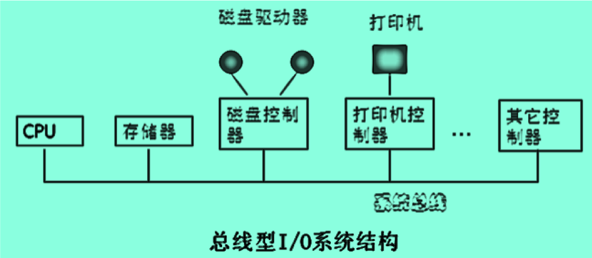
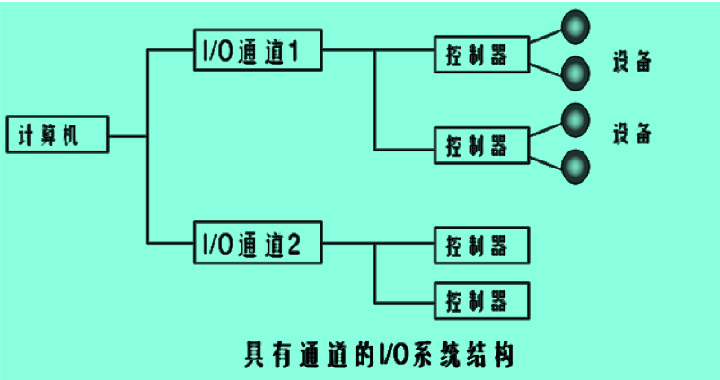

### I/O软件的层次

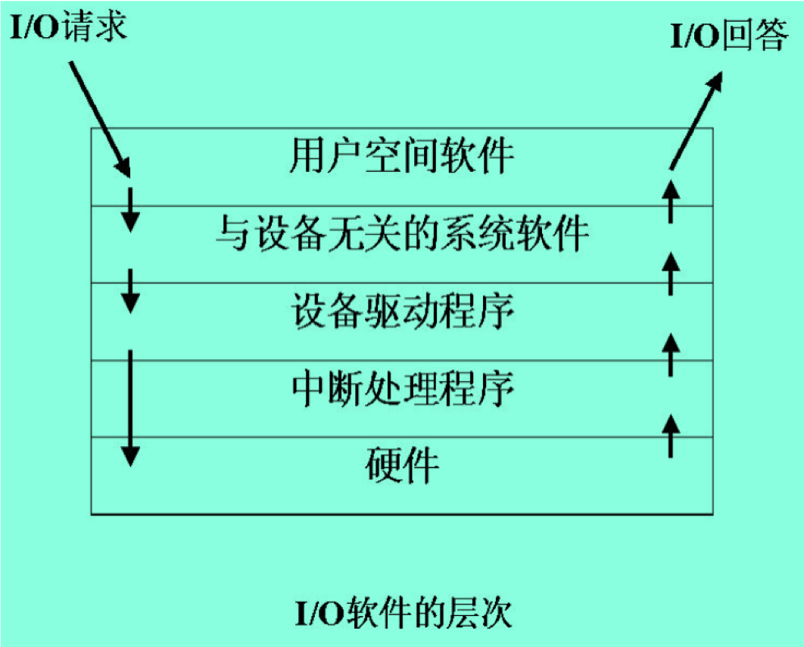

### 设备类型 

设备的种类和数量越来越多，结构也越来越复杂，为了管理上的方便，通常按不同的观点，从不同的角度对设备进行分类。

### 设备管理的功能

- 外围设备中断处理
- 缓冲区管理
- 外围设备的分配
- 外围设备驱动调度
- 虚拟设备及其实现

### 设备管理的任务

- 提高设备的利用率
- 设备独立性
- 字符编码的独立性
- 设备处理的一致性

### 设备控制块（DCB）的结构 

1. 设备名—设备的系统名即设备的物理名。
2. 设备属性—描述设备的特性和类型。
3. 设备状态—描述设备现行的状态。
4. 设备的I/O总线地址—反映现行设备在I/O总线上的具体地址。
5. 等待列指针—存放要求使用该设备队列的首指针。

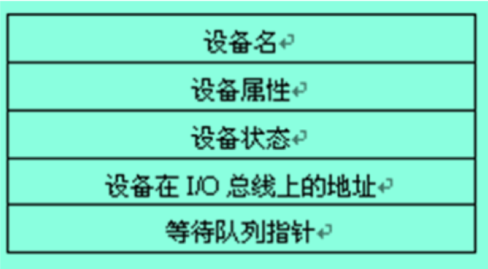

### 设备独立性

- 设备独立性：指用户在编程序时所使用的设备与实际设备无关。
- 两类设备独立性：
  - 一个程序应独立于分配给它的某类设备的具体设备。即在用户程序中只指明I/O使用的设备类型即可。
  - 程序要尽可能地与它使用的设备类型无关。
- 优点：
  - 方便用户编程
  - 便于程序移植
  - 不受具体的机器环境的限制

## 5.2 数据传送控制方式 

### 数据传送控制方式 

- 程序直接控制方式
- 终端控制方式
- DMA方式
- 通道控制方式
  
### 程序直接控制方式

- 程序直接控制方式是指由程序直接控制内存或CPU和外围设备之间进行信息传送的方式。通常又称为“忙—等”方式或循环测试方式。
- 在数据传送过程中，必不可少的一个硬件设备是I/O控制器，它是操作系统软件和硬件设备之间的接口，它接收CPU的命令，并控制I/O设备进行实际的操作。

### 程序直接控制方式的流程

由于数据传送过程中输入和输出的情况比较类似，下面只给出输出数据时的工作过程。

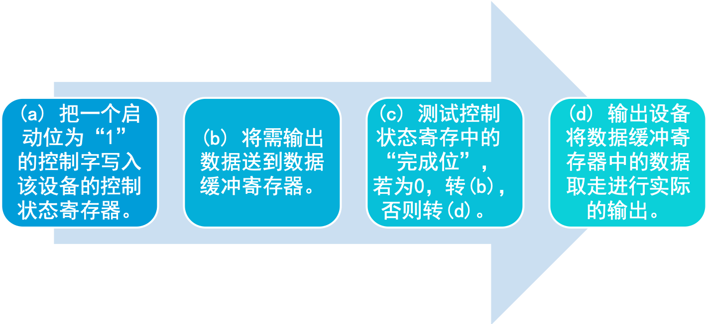

###  中断控制方式

1. 进程需要数据时，将允许启动和允许终端的控制字写入设备的控制状态寄存器中，启动台设备进行输入操作。
2. 该进程放弃处理机，等待输入的完成。操作系统进程调度程序调度其他就绪进程占用处理机。
3. 当输入完成时，输入设备通过中断请求线向CPU发出中断信号。CPU在接收到中断信号之后，转向中断处理程序。
4. 中断处理程序首先保护现场，把输入缓冲寄存器中的数据传送到某一特定单元中去，同事将等待输入完成的那个进程唤醒，进入就绪状态，最后恢复现场，并返回到被中断的进程继续执行。
5. 在以后的某一时刻，进程调度程序选中提出的请求并得到获取数据的进程，该进程从约定的内存特定单元中取出数据继续工作。

### DMA方式：用于块设备中

- DMA方式称直接存储器访问（Direct Memory Access）方式。其基本思想是在外设和主存之间开辟直接的数据交换通路。
- DMA方式的特点：
  1. 数据传送的基本单位是数据块。
  2. 所传送的数据是从设备送内存，或者相反。 
  3. 仅在传送一个或多个数据块的开始和结束时，才需中断CPU，请求干预，整块数据的传送是在DMA控制器控制下完成。

### DMA工作原理

- 存放输入数据的内存起始地址、要传送的字节数送入DMA控制器的内存地址寄存器和传送字节计数器，中断允许位和启动位置成1，启动设备
- 发出传输要求的进程进入等待状态
- 输入设备不断窃取CPU工作周期，数据不断写入内存
- 传送完毕，发出中断信号
- CPU接到中断信号转入中断处理程序处理
- 中断处理结束，CPU返回原进程或切换到新的进程

### DMA控制器与其它部件的关系

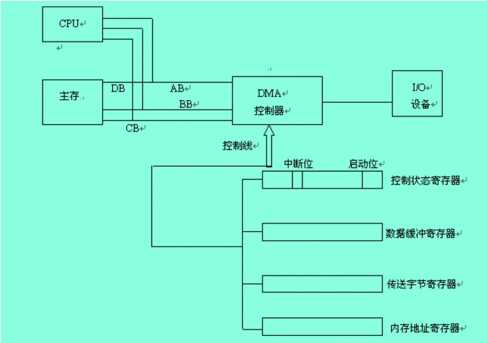

### I/O通道控制方式 

- DMA方式：对需多离散块的读取仍需要多次中断.
- 通道方式：CPU只需给出 **\(a)通道程序首址;(b)要访问I/O设备**，然后，通道程序就可完成一组块操作。

操作|P|Record|计数|内存地址
:---:|:---:|:---:|:---:|:---:
Write|0|0|80|813
Write|0|0|140|1034
Write|0|1|60|5830
Write|0|1|300|2000
Write|0|0|250|1850
Write|1|1|250|720

### 通道控制方式 

- 通道控制方式与DMA方式相类似，也是一种内存和设备直接进行数据交换的方式。引入通道目的是使CPU从I/O事务中解脱出来，同时为提高CPU与设备，设备与设备之间的并行工作能力。
- 与DMA的区别在于：
  1. 在通道控制方式中，数据传送方向存放数据的内存始址及传送的数据块长度都由一个专门负责输入/输出的硬件——通道来控制。
  2. DMA方式每台设备至少需要一个DMA控制器，而通道控制方式中，一个通道可控制多台设备与内存进行数据交换。 

### 通道类型

- 字节多路通道:通常按字节交叉的方式工作，适用于低速I/O设备。
- 数据选择通道:按成组方式进行数据传输，适用于高速I/O设备。
- 数组多路通道:综合前二个优点（数据传送率和通道利用率都较高）。

### 每条通道指令包含的内容

1. 操作码：它规定指令所执行的操作，如读、写等。
2. 内存地址：标明数据传送时内存的首址。
3. 计数：表示传送数据的字节数。
4. 通道程序结束位$R_0$，表示通道程序是否结束。 
5. 记录结束标志$R_1$，表示所处理的记录是否结束 

### 通道方式的数据传送结构

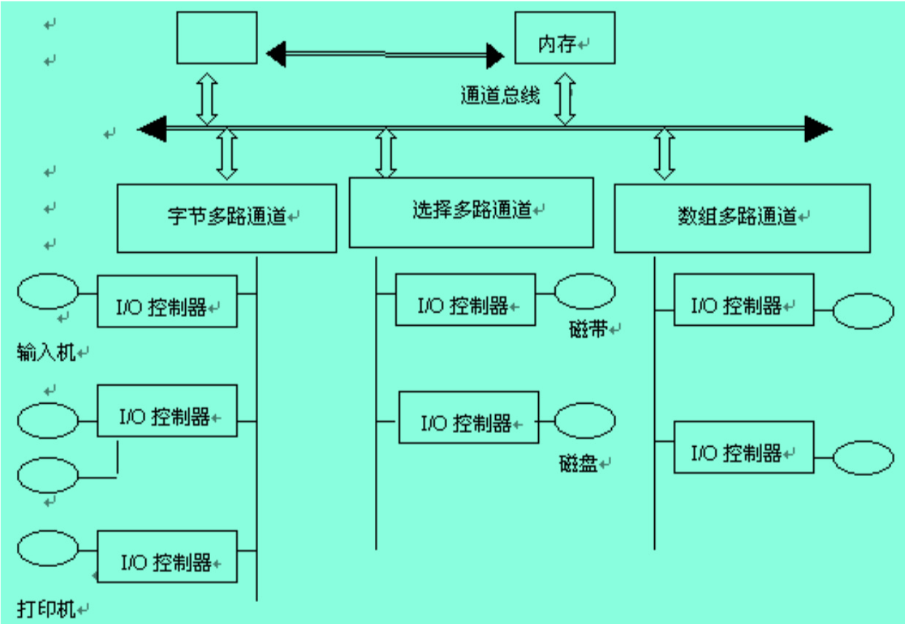

### 通道控制方式的数据过程 

1. 当进程要求设备输入时，CPU发指令指明I/O操作、设备号和对应通道。
2. 对应通道收到CPU发来的启动指令后，读出内存中的通道指令程序、设置对应设备的控制状态寄存器的初值。
3. 设备按通道指令的要求，把数据送往内存指定区域。
4. 若传送结束，I/O控制器通过中断请求线发中断信号请求CPU做中断处理。
5. 中断处理结束后，CPU返回到被中断进程处继续执行。
6. 当进程调度程序选中这个已得到数据的进程后，才能进行加工处理。

## 5.3 缓冲技术 

### 缓冲的引入

**引入缓冲的主要目的**

1. 缓和处理机和I/O设备间速度不匹配的矛盾
2. 减少CPU的中断次数
3. 提高CPU和I/O设备之间的并行性

### 缓冲技术分类

1. 单缓冲
2. 双缓冲
3. 环形缓冲
4. 缓冲池

#### 单缓冲 

单缓冲是操作系统提供的最简单的一种缓冲形式。每当一个进程发出一个I/O请求时，操作系统便在主存中为之分配一缓冲区，该缓冲区用来临时存放输入/输出数据。

#### 双缓冲 

- 设置双缓冲是解决外设之间并行工作的最简单方法。该做法是为输入或输出操作设置两个缓冲区buffer1和buffer2。用于低频度活动号I/O。
- 双效率有所提高，且进一步平滑了传输峰值。
- 系统处理一块数据的时间约为：MAX(C,T)
- 收发可双向同时传送。

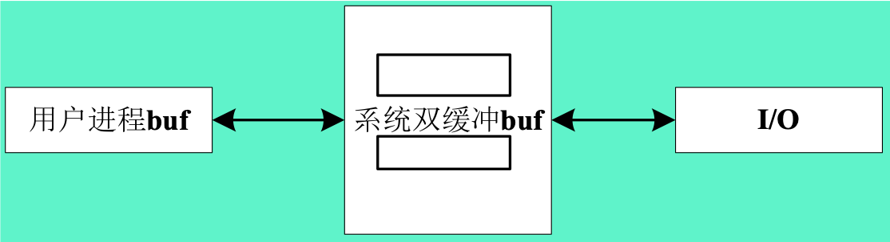

#### 环形缓冲

环形缓冲技术是在主存中分配一组大小相等的存储区作为缓冲区，并将这些缓冲区链接起来，每个缓冲区中有一个指向下一个缓冲的指针，最后一个缓冲区的指针指向第一个缓冲区，这样n个缓冲区就成了一个环形。环形缓冲区结构如图5.3所示。

##### 环形缓冲区结构

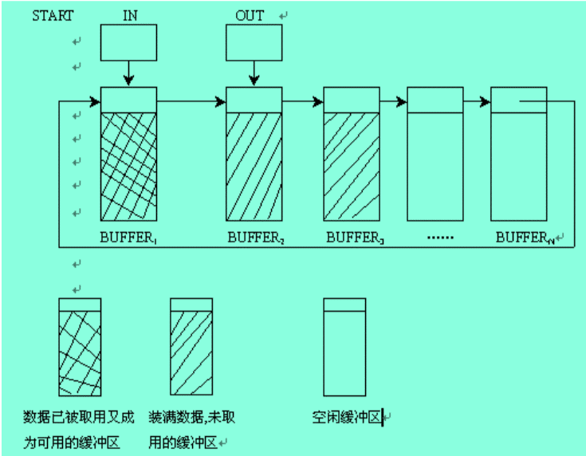
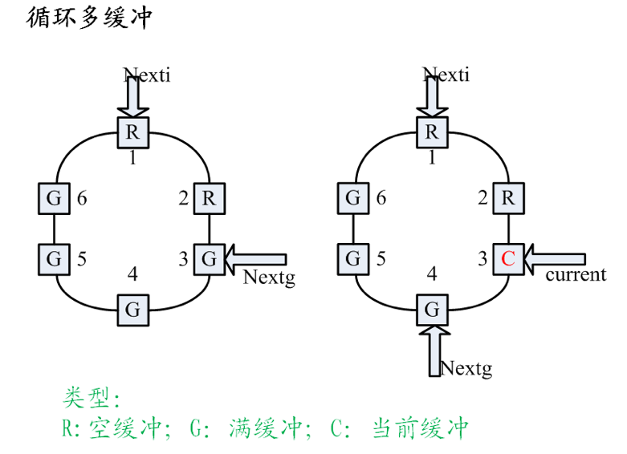

#### 缓冲池

- 从自由主存中分配一组缓冲区即可构成**缓冲池**。
- 缓冲池的组成:缓冲池中的缓冲区一般有以下三种类型：**空闲缓冲区、装输入数据的缓冲区**和**装输出数据的缓冲区**。 
- 缓冲池的工作方式:缓冲区可以在**收容输入、提取输入、收容输出**和**提取输出**四种方式下工作。 

##### 缓冲区队列缓冲区

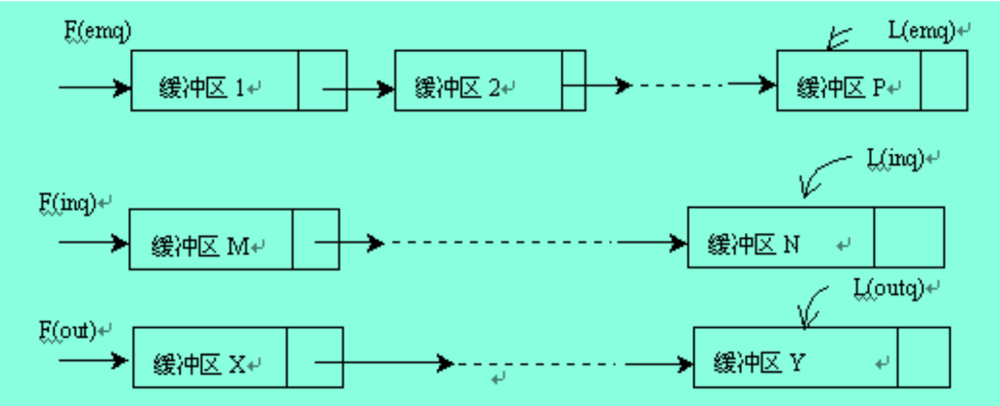
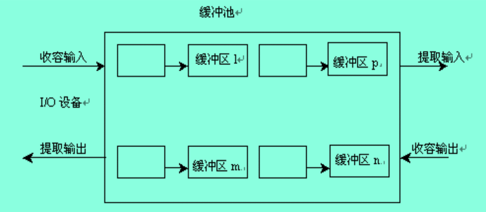

## 5.4 设备分配技术 

### 设备分配

- 包括：对设备、设备控制器、通道的分配
- 数据结构
  1. 设备控制表DCT：
  2. 控制器控制表（COCT），通道表（CHCT），系统设备表（SDT）.

**SDT:记录了系统中全部设备及其驱动程序地址。**

### 设备控制表DCT

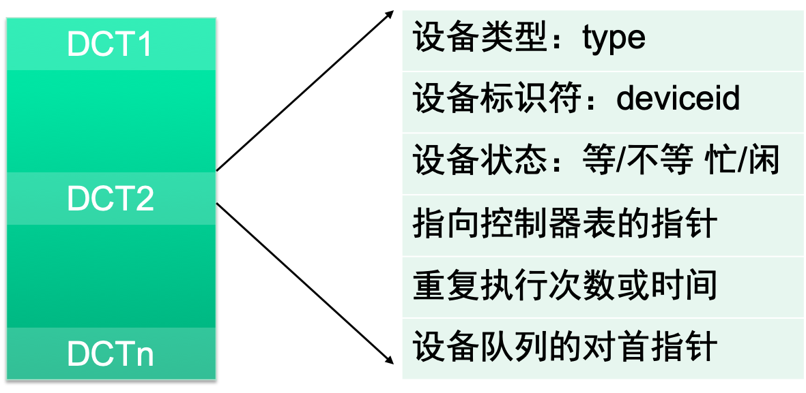

### 设备分配原则

- 静态分配
  - 当一个作业或进程运行时，根据作业要求的设备，系统如果能满足，则将其要求的设备全部分配给它，然后开始运行，运行完成释放其占用的所有设备。
  - 优点是系统绝不会出现死锁，缺点是设备利用率太低。
- 动态分配
  - 这种分配方法是在作业（或进程）运行的过程中，需要使用设备时，就向系统申请，系统根据某种分配原则进行分配。
  - 优点是设备的利用率高，缺点是系统有出现死锁的可能。

### 设备分配技术分类 

- 独享设备的分配
- 共享设备的分配
- 虚拟设备的分配与假脱机技术

#### 独享设备的分配 

- 独享设备是指这类设备被分配给一个作业后，被这个作业所独占使用，其它任何作业不能使用，直到该作业释放该设备为止。
- 常见的独享设备有行打印机、光电输入机等。针对独享设备，系统一般采用静态分配方式。即在一个作业执行前，将它所需要使用的这类设备分配给它，当作业结束撤离时，才将分配给它的独享设备收回。 

#### 共享设备的分配 

- 共享设备是指允许多个用户共同使用的设备。如磁盘、磁鼓等设备，由多个进程同时进行访问。
- 设备共享有两层含义：一是指对设备介质的共享，如磁盘上的各扇区。二是指对磁盘等驱动器的共享，多个用户访问这些设备上的信息是通过驱动器来实现的。
- 对共享设备的分配一般采用动态分配这一方式。 

#### 虚拟设备的分配与假脱机技术 

1. 虚拟设备的分配
2. 假脱机技术
3. 假脱机系统的组成
4. 假脱机系统的特点

##### 虚拟设备的分配

- 虚拟设备是指代替独享设备的那部分存储空间及有关的控制结构。
- 分配过程：当进程中请求独享设备时，系统将共享设备的一部分存储空间分配给它。进程与设备交换信息时，系统把要交换的信息存放在这部分存储空间，在适当的时候对信息作相应的处理。如打印时，把要打印的信息送到某个存储空间中，在打印机空闲时将存储空间上的信息送到打印机上打印。

##### SPOOLing技术

SPOOLing是Simultaneous Peripheral Operation On-Line（即外部设备联机并行操作）的缩写，它是关于慢速字符设备如何与计算机主机交换信息的一种技术，通常称为“假脱机技术”。该技术是为解决独立设备数量少，速度慢，不能满足众多进程的要求，而且在进程独占设备期间，设备利用率比较低而提出的一种设备管理技术。

##### 假脱机系统的组成

通过共享设备来模拟独享设备所采用的操作是假脱机操作，即在联机情况下外部设备设备同时操作。所使用的假脱机技术称之为假脱机技术。

- 输入井和输出井
- 输入缓冲区和输出缓冲区   
- 输入进程和输出进程 

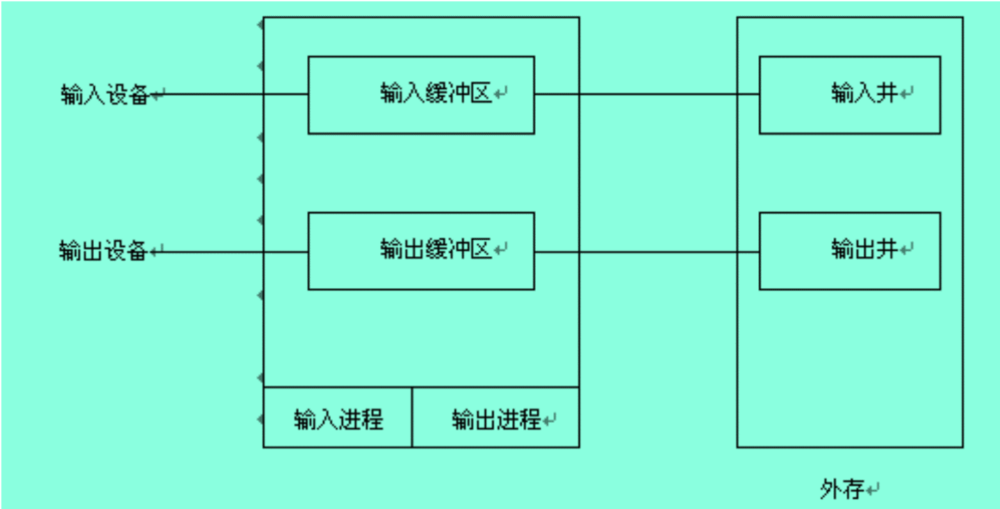

##### 假脱机系统的特点

1. 提高了I/O速度。从对低速I/O设备进行的I/O操作变为对输入井或输出井的操作，如同脱机操作一样，提高了I/O速度，缓和了CPU与低俗I/O设备速度不匹配的矛盾。
2. 实现了虚拟设备功能。多个进程同时使用一独享设备，而对每一个进程而言，都认为自己独占这一设备，不过该设备是逻辑上的设备。
3. 设备并没有分配给任何进程。在输入井或输出井中，分配给进程的是一存储区和建立一张I/O请求表。

## 5.5 I/O进程控制 

- 用户进程的输入输出请求
- 设备驱动程序
- 中断处理程序的处理过程

### 用户进程的I/O请求 

用户进程的I/O请求包括：申请进行I/O操作的逻辑设备名要求的操作、传送数据的长度和起始地址等。典型的用户进程的I/O请求可通过下述通用的系统调用命令来实现：

**doio(dev, mode, bmount, bddr)**

其中：dev表示执行I/O的逻辑设备名；mode表示操作的类型，如读、写等；bmount表示传输的数目；bddr表示数据传送的地址。

### 设备驱动程序

- 设备驱动程序是一种可以使计算机和设备通信的特殊程序，相当于硬件的接口，操作系统只有通过这个接口，才能控制硬件设备的工作。
- 与设备密切相关的代码放在设备驱动程序中，每个设备驱动程序处理一种设备类型。
- 每一个控制器都设有一个或多个设备寄存器，用来存放向设备发送的命令和参数。设备驱动程序负责释放这些命令，并监督它们正确执行。
- 设备驱动程序的任务是接收来自与设备无关的上层软件的抽象请求，并执行这个请求。

- 设备驱动程序的功能 
  1. 实现逻辑设备到物理设备的转换。
  2. 发出I/O命令，启动相应的I/O设备，完成相应的I/O操作。
- 设备驱动程序的处理过程
  1. 启动过程
  2. 中断处理过程

#### 设备驱动程序的启动过程

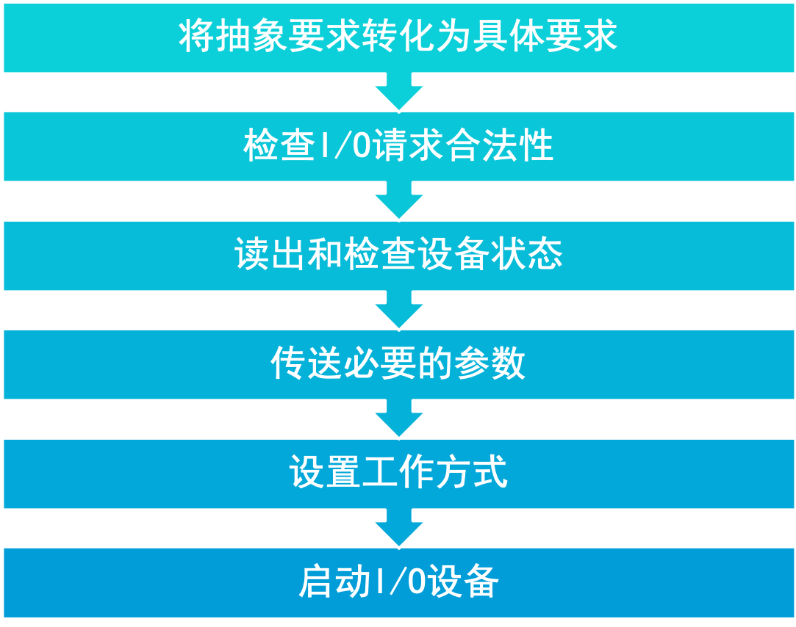

#### 中断处理程序的处理过程

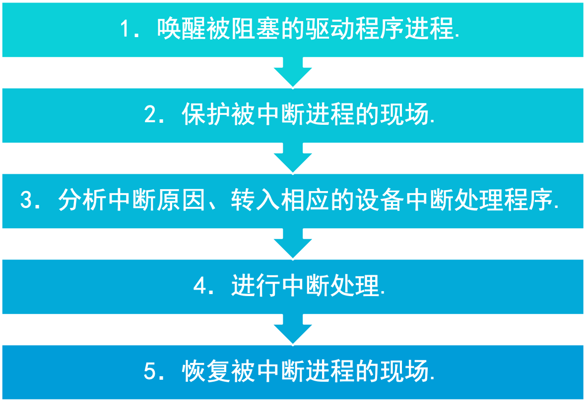