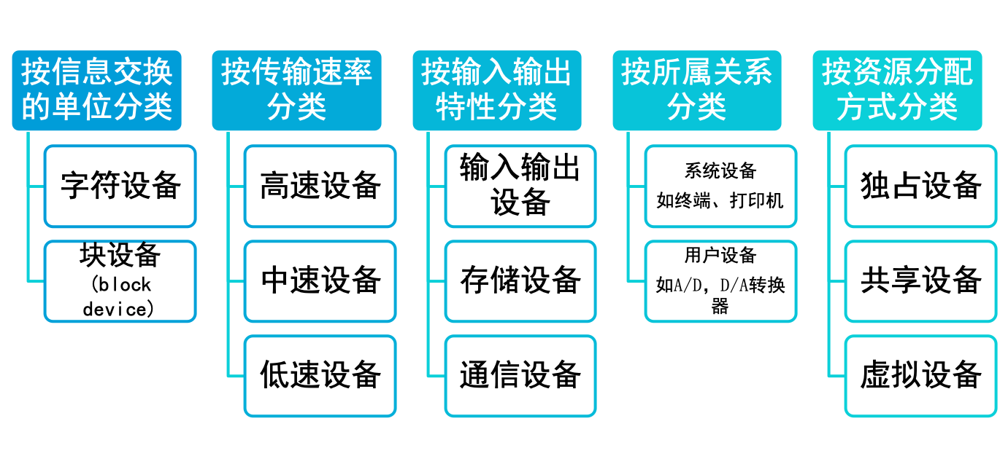

## 5.1 概述

### 本章学习目标 

- 数据传送的4种方式：程序直接控制方式、中断控制方式、DMA方式及通道控制方式。
- 缓冲技术的概念及4种常见的缓冲技术：单缓冲、双缓冲、环形缓冲及缓冲池。
- 设备分配的概念及3种设备分配技术：独享分配、共享分配及虚拟分配。
- I/O进程控制。

### I/O系统的概念与结构

输入输出系统(I/O)是计算机系统中的主机与外部进行通信的系统。它由外围设备和输入输出控制系统两部分组成，是计算机系统的重要组成部分。I/O系统的特点:异步性、实时性和设备无关性。

### I/O系统的组成

### I/O软件的层次

### 设备类型 

设备的种类和数量越来越多，结构也越来越复杂，为了管理上的方便，通常按不同的观点，从不同的角度对设备进行分类。

### 设备管理的功能

- 外围设备中断处理
- 缓冲区管理
- 外围设备的分配
- 外围设备驱动调度
- 虚拟设备及其实现

### 设备管理的任务

- 提高设备的利用率
- 设备独立性
- 字符编码的独立性
- 设备处理的一致性

### 设备控制块（DCB）的结构 

1. 设备名—设备的系统名即设备的物理名。
2. 设备属性—描述设备的特性和类型。
3. 设备状态—描述设备现行的状态。
4. 设备的I/O总线地址—反映现行设备在I/O总线上的具体地址。
5. 等待列指针—存放要求使用该设备队列的首指针。

### 设备独立性

- 设备独立性：指用户在编程序时所使用的设备与实际设备无关。
- 两类设备独立性：
  - 一个程序应独立于分配给它的某类设备的具体设备。即在用户程序中只指明I/O使用的设备类型即可。
  - 程序要尽可能地与它使用的设备类型无关。
- 优点：
  - 方便用户编程
  - 便于程序移植
  - 不受具体的机器环境的限制

## 5.2 数据传送控制方式 

## 5.3 缓冲技术 

## 5.4 设备分配技术 

## 5.5 I/O进程控制 

