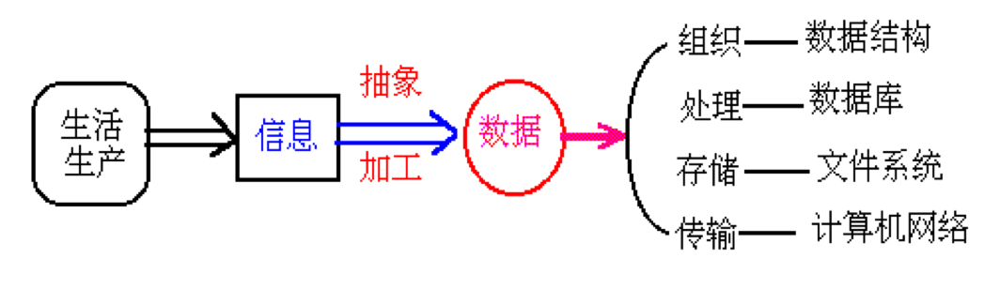
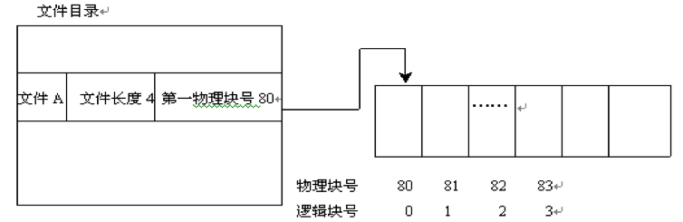
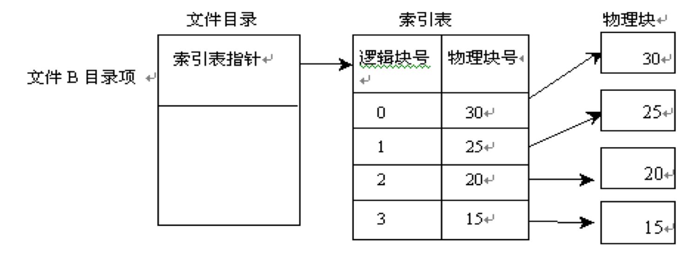
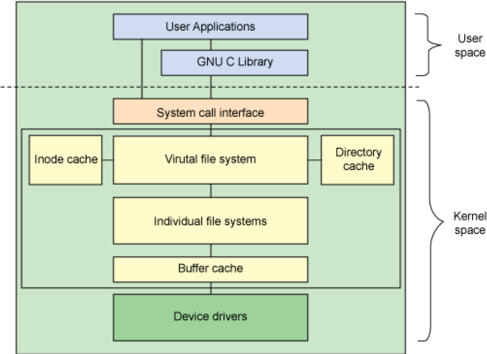
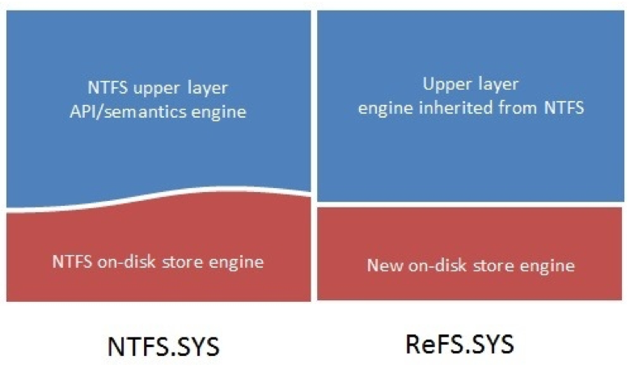
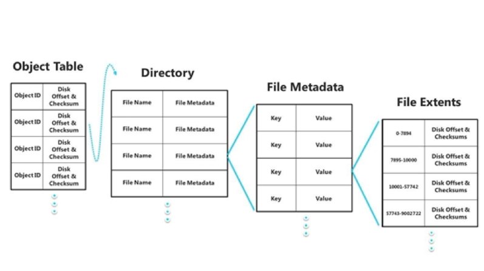
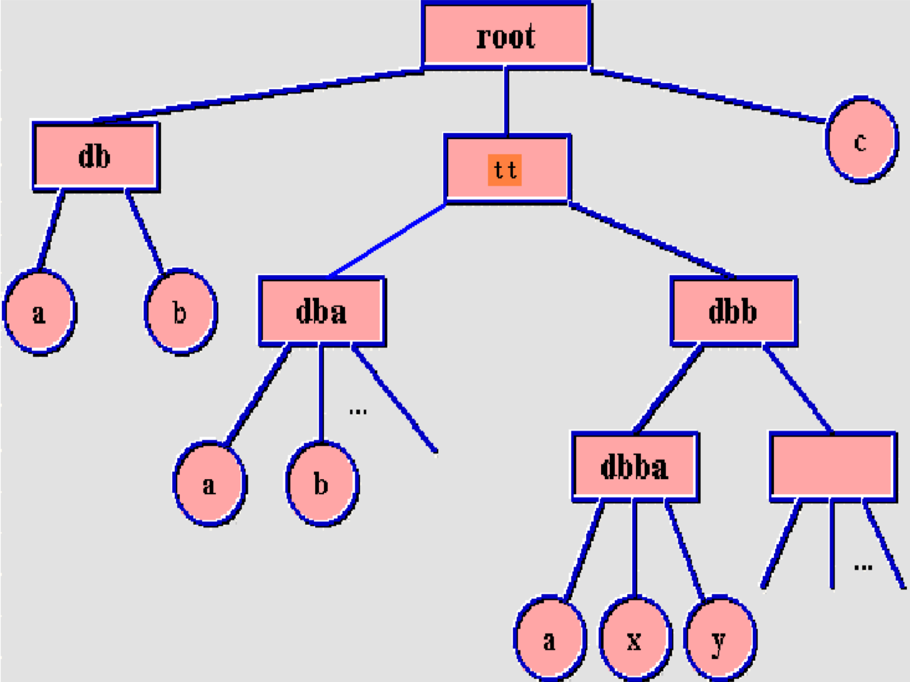
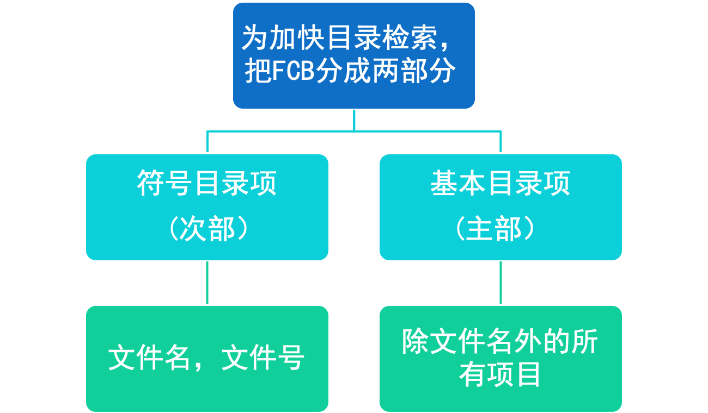

## 6.1 文件系统概述

### 文件的概念

- 文件是软件资源的管理方式。文件是赋名有关联的信息单位 (记录)的集合。说明文件是由记录组成。而记录则是由一组相关信息项组成。例如每个大学生的登记表可视为一个记录，它包括学生姓名，名族，出生年月，性别，籍贯等信息项。所有学生登记表组成一个学生文件。
- 文件具体操作包括：文件的结构、命名、存取、使用、保护和实现方法。

### 文件管理的任务与功能

- 任务：把存储、检索、共享和保护文件的手段，提供给本身和用户，以方便用户及资源利用。
- 功能：
  - 文件的按名存取
  - 建立文件目录
  - 实现从逻辑文件到物理文件的转换
  - 分配文件的存储空间
  - 提供合适的文件存取方法
  - 实现文件的共享, 保护和保密
  - 提供一组可供用户使用的文件操作

### 文件系统

- 对用户来说，实际上关心的是存取方法的方便、可靠。不是信息的物理结构而是信息的逻辑结构。因此，引入**文件系统**的概念，它是操作系统的重要组成部分。 
- 文件系统包含文件管理程序（文件与目录的集合）和所管理的全部文件。是用户与外存的接口。
- 系统软件为用户提供统一方法（以数据记录的逻辑单位），访问存储在物理介质上的信息。
- 文件系统负责文件的创立、撤消、读写、修改、复制和存取控制等，并管理存放文件的各种资源。 

### 文件系统特点

- 使用方便，灵活，用户按名存取
- 安全可靠，保护系统和用户
- 提供保密与共享

### 理想文件系统的主要特点

- 有效地实现各种文件操作的命令
- 尽可能达到文件存储装置的独立性
- 存储在文件中的信息的安全
- 有效地分配文件存储器的存储空间
- 文件结构和存取的灵活性和多样性
- 具有对用户来说尽可能是透明的机制

### 按设备类型分类

- 磁盘文件
- 磁带文件
- 磁鼓文件

### 按所有者分类

- 系统文件：指用操作系统的执行程序和数据组成的文件，这种文件不对用户开放，仅供系统使用。
- 库文件：是指系统为用户提供的各种标准函数，标准过程和实用程序等。用户只能使用这些文件，而无权对其进行修改。
- 用户文件：由用户的信息组成的文件，如源程序文件，数据文件等。这种文件的使用和修改权均属于用户。

### 按保存期限分类

- 临时文件：用于系统在工作过程中产生的中间文件，一般有暂存的目录，正常工作情况下，工作完毕会自动删除，一旦有异常情况往往会残留不少临时文件。
- 永久文件：值一般受系统管理的各种系统和用户文件，经过安装和编辑、编译生成的文件，存放在软盘、硬盘或光盘等外存上。

### 按用途分类

- 普通文件
  - 常规文件
  - 值系统中最一般组织格式的文件，一般是字符流组成的无结构文件。
- 目录文件：由文件的目录信息构成的特殊文件，操作系统将目录也做成文件，便于统一管理。
- 特殊文件
  - 设备驱动程序
  - 将输入输出外部设备看做特殊文件便于统一管理。

**UNIX操作系统把文件分成普通文件、目录文件和特别文件。**

### 按访问方式分类

- 只读文件：允许授权用户读，但不允许写。
- 只写文件：允许授权用户写，而不允许其他操作。
- 可读可写文件：允许用户授权读写。
- 可执行文件：允许授权用户执行，但不能读写

### 按文件数据的形式分类

- 程序文件
  - 源文件
  - 目标文件
  - 可执行文件
  - 头文件
  - 库文件
- 数据文件

### 按存取的物理结构分类

- 顺序文件：文件中的记录，顺序地存储到连续的物理盘块中，顺序文件中所记录的次序，与他们存储在物理介质上存放的次序是一致的。
- 链接文件：文件中的记录在可存储的并不相邻接的各个物理块中，通过物理块中的链接指针组成一个链表管理，形成一个完整的文件，又称指针串连文件或直接存取文件。
- 索引文件：文件中的记录可存储在并不相邻接的各个物理块中，记录和物理块之间通过索引表项按关键字存取文件，通过物理块中的索引表管理，形成一个完整的文件。

#### 顺序结构

一个文件的全部信息存放在外存的一片连续编号的物理块中，这种结构称为连续结构或称连续文件。

- 存放在磁带上的文件一般采用连续结构，即序号为i+1的物理块一定在i物理块之后。而存放在磁盘上的文件则可采用连续结构，也可采用别的结构。
- 建立连续文件时要求用户给出文件的最大长度，以便系统为文件分配足够的存储空间，并在相应表格中登记文件的起始位置和长度。

#### 链接结构

- 非连续的结构，存放文件信息的每一物理块中有一个指针，指向下一个物理块，这个指针的长度由物理设备的容量决定，通常放在该物理块的开头或结尾。
- 链接结构的文件适用于顺序存取。因为要获得某一块的块号，必须读取上一物理块，因此要随机地存取信息就较为困难。

##### 链接结构优缺点

- 优点
  - 有利于文件插入和删除
  - 有利于文件动态扩充
  - 提高了磁盘空间利用率
- 缺点
  - 链接指针占用一定空间
  - 可靠性问题，如指针出错
  - 存取速度慢，不适于随机存取

#### 索引结构

- 一个文件的信息存放在若干不连续物理块中，系统为每个文件建立一个专用数据结构--**索引表**，并将这些块的块号存放在索引表中。
- 一个索引表就是磁盘块地址数组,其中第i个条目指向文件的第i块。

##### 索引结构优缺点

- 优点
  - 保持了链接结构的优点
  - 既能顺序存储，又能随机存储
  - 满足了文件动态增长、插入删除的要求
  - 能充分利用外存空间
- 缺点
  - 索引表本身带来了系统开销，如：内外存空间，存取时间

### 按文件的逻辑存储结构分类

- 流式/无结构文件：这是直接由字符串序列所构成的文件，又称为流式文件。
- 纪录式/有结构文件：由若干个记录所构成的文件，又称为纪录式文件。

### Windows系统的文件分类

- FAT12，用在软件盘上。
- FAT16是早期的DOS下的。它支持的文件最大2G。
- FAT32是在Windows 98出现时的文件系统，它降低了簇的大小，节约了磁盘空间。扩大了单个分区最大容量。
- NTFS在NT系统的基础上升级的文件系统，它有强大的文件索引功能和自定义簇大小。最主要的特点是它支持活动目录。
- 分布式文件(DFS)：用于Windows 2000服务器上的一个网络服务器组件。
- Windows8新文件系统ReFS。

### UNIX系统的文件分类

UNIX将文件分为普通文件、目录文件、特殊文件（设备文件）三类。

- 普通文件：包含的是用户信息，一般为ASCII或二进制文件。
- 目录文件：管理文件系统的系统文件
- 特殊文件
  1. 字符设备文件：和输入输出有关，用于模仿串行I/O设备，例如终端，打印机，网络等。
  2. 块设备文件：模仿磁盘

分类的目的：对不同文件进行管理,提高系统效率；提高用户界面友好性。

### 文件的访问方式-顺序访问

- 文件存取最简单的方法是顺序存取，即严格按文件信息单位排列的顺序依次存取。
- 当打开文件时，文件的存取指针指向第一个信息单位，如第一个字节或第一个记录，每存取一个信息单位存取指针加1指向下一个信息单位，如此类推。

#### 顺序访问优缺点

- 优点
  - 简单
  - 支持顺序存取和随机存取
  - 顺序存取速度快
  - 所需的磁盘寻道次数和寻道时间最少
- 缺点
  - 文件不易动态增长
  - 预留空间：浪费
  - 重新分配和移动
  - 不利于文件插入和删除
  - 存储压缩技术

### 文件的访问方式-随机访问

- 直接存取，每次存取操作时必须先确定存取的位置。
- 对流式文件或定长记录的文件比较容易确定存取位置。
- 对不定长的记录式文件比较麻烦。当然可从第一个记录开始顺序查询，直到找到要存取的记录为止，这样做是低效的。
- 解决的方法是建立索引。文件的索引可以作为文件的一部分，也可以单独建立索引文件。 

### 文件的物理结构

文件的物理结构是指文件在物理存储介质上的结构。

1. 连续结构
2. 链接结构
3. 索引结构
4. 倒排结构
5. HASH结构

### 文件的组织

- 文件的逻辑组织
  - 流式文件
  - 纪录式文件
- 文件的物理组织
  - 顺序结构
  - 链接结构
  - 索引结构
  - HASH结构
  - 倒排结构

### 流式文件与记录式文件

- 流式文件
  - 非结构式的
  - 具有符号名的字节序列
  - OS对外部结构无解释，结构式的
- 纪录式文件
  - 具有富豪命的记录序列
  - OS对外部结构有解释
  
**流式文件是记录式文件的特例。**

### Linux文件系统组件的体系结构

用户空间和内核中与文件系统相关的主要组件间的关系

### Windows 8新文件系统ReFS

ReFS底层示意图

ReFS整体结构示意图

## 6.2 文件目录

- 文件目录是文件系统中主要数据结构之一，文件存储后用户通过用户文件逻辑结构的索引链接找到对应的物理结构。
- 文件目录由目录项构成，目录项又称为文件控制块FCB。
- 文件控制块FCB是文件存在的标志，记录着系统对文件进行管理所需要的全部信息。

### 文件目录分类

- 单级目录
  - 一个磁盘一个目录，一个文件一个说明表目。
  - 优点是简单，缺点是无法防止重名或被删，安全保密性差，目前已淘汰。
- 二级目录结构
  - 二级文件目录结构吧目录分成系统目录和用户目录两级。
  - 系统目录由用户名和用户文件目录首地址组成，用户文件目录中等级响应的用户文件的目录项。
  - 在二级目录结构中，区别不同的文件除文件名外还有文件的用户名，因此不同的用户可以使用相同的文件名。

### 二级目录结构的优缺点

- 优点：二级目录结构较为简单，也比较好地解决了重名的问题
- 缺点：缺乏灵活性，特别是不能反映现实世界中多层次的关系
- 为此人们提出了多级目录结构，其中MULTICS及UNIX系统均采用了多级目录结构，它们是当前文件系统的典型代表。 

### 多级目录结构

- 多级目录结构由根目录和各级目录组成，为管理上的方便，除根目录外，其它各级目录均以文件的形式组成目录文件。
- 根目录中的每个目录项可以对应一个目录文件，也可以对应一个数据文件，同样目录文件中的每个目录项可以对应一个目录文件。也可以对应一个数据文件。如此类推，就形成多级目录结构或树形目录结构。
- 在此结构中，根目录称为根结点，各级目录文件称中间结点，用方框表示。数据文件称为叶结点，用圆圈表示。

### 路径名

- 在多级目录结构中一个文件的唯一标识不再是文件名，而是从根结点开始，经过一个或多个中间结点，到达某个叶结点的一条路径。称这条路径为文件的路径名，它是文件的唯一标识。
- 路径名由根目录和所经过的目录名和文件名以及分隔符组成，通常使用分隔符 /。例如/e7/h9，  /d5/g9/h6， /f12

### 工作目录

- 在多级目录结构中，文件路径名一般较长，而用户总是局部地使用文件，为了方便起见，可把经常使用的文件所在的目录指定为工作目录(或称当前目录)。
- 查询时，若路径名以/开头；则从根目录开始查找，否则从当前目录开始查找。

### 文件目录改进

### UNIX的文件目录

- 根目录/
  - 操作系统文件vmunix
  - 实用命令子目录bin, 设备子目录dev, 系统维护实用命令子目录etc, 库文件子目录lib, 临时文件子目录tmp
  - 通用子目录usr(包括系统文件, 工具软件, 用户文件)
  - 用户文件子目录home
- 绝对路径名
- 相对路径名

## 6.3 文件的共享

## 6.4 文件系统的保护与安全

