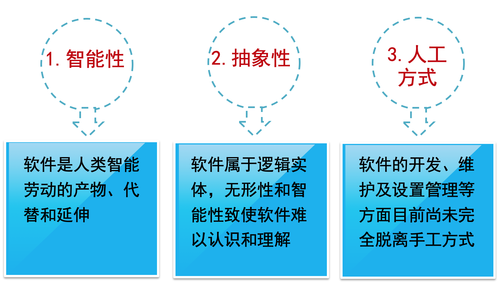
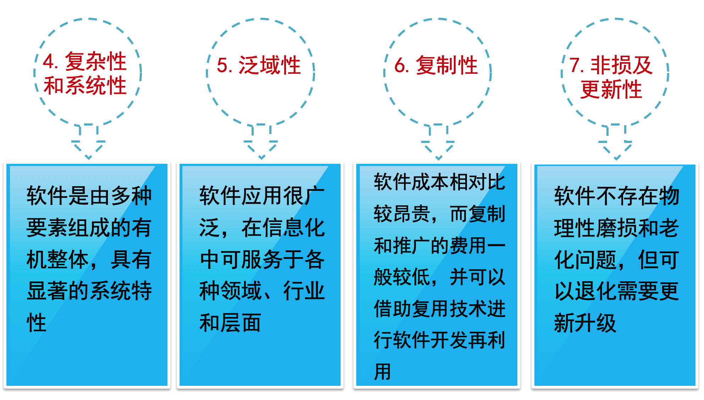
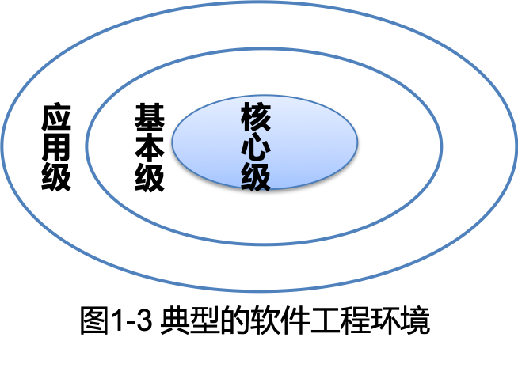
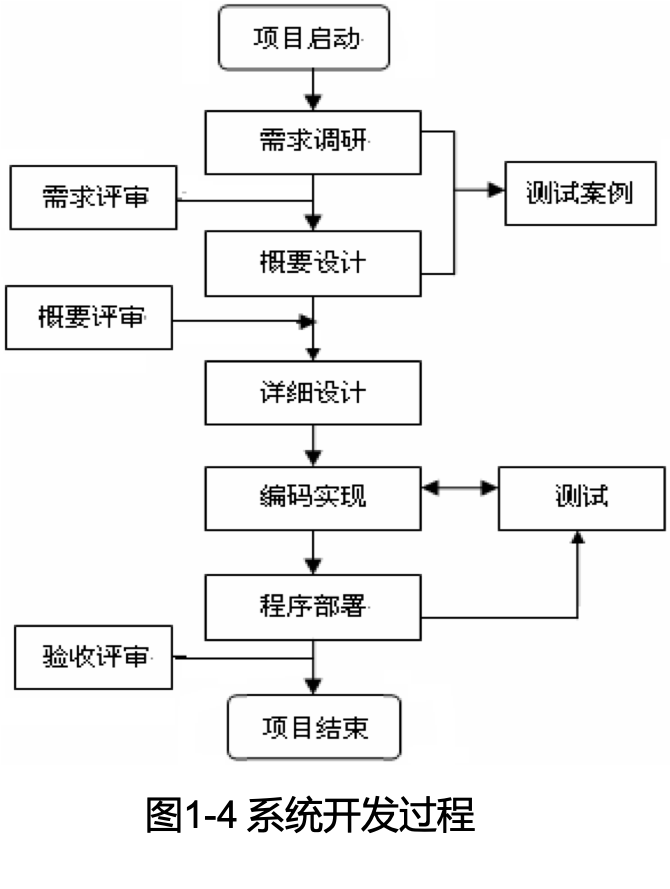

# 导读

IBM 公司研发初期的OS/360，共约100万条指令，花费了5000个人年；经费达数亿美元，而结果却令人沮丧，错误多达2000 个以上，系统根本无法正常运行。

OS/360系统的负责人Brooks这样描述开发过程的困难和混乱：“像巨兽在泥潭中垂死挣扎，挣扎得越猛，泥浆沾得越多陷入更深，最后没有一个野兽能够逃脱淹没在泥潭中的命运” 。

# 软件工程的发展

## 软件危机

### 概述

软件危机（Software crisis）是指在计算机软件开发、运行、维护和管理过程中所遇到的一系列严重问题。

### 软件危机主要包含两方面的问题

1. 开发的软件如何满足社会对软件日益增长的各种需求。
2. 是怎样维护和管不断快速增长的已有软件。

### 软件危机产生的原因

1. 软件开发规模逐渐变大、复杂度和软件的需求量不断增加。
2. 没有按照工程化方式运作，开发过程没有统一的标准和准则、规范的指导方法。
3. 软件需求分析与设计考虑不周，软件开发、维护和管理不到位。
4. 开发人员与用户或开发人员之间互相的交流沟通不够，文档资料不完备。
5. 软件测试调试不规范不细致，提交的软件质量不达标。
6. 忽视软件运行过程中的正常维护和管理。

### 软件危机主要表现

1. 已完成的软件系统时常出现功能、性能不满意或出现故障等现象。
2. 软件产品的可靠性和质量安全等方面时常达不到标准。软件产品质量难以保证，甚至在开发过程中就被迫中断。
3. 软件开发管理差，对成本和进度的估计时常不准确。
4. 系统时常出现无法维护、升级或更新现象。
5. 软件开发没有标准、完整、统一规范的文档资料。计算机软件不仅只是程序，还应当有一整套规范的文档资料和售后服务。
6. 软件开发效率低，无法满足计算机应用迅速发展与提高的实际需要。
7. 软件研发成本在计算机系统总成本中所占的比例逐年上升。

### 解决软件危机的措施

1. 技术方法。运用软件工程的技术、方法和标准规范。
2. 开发工具。选用先进高效的软件工具，同时采取切实可行的实施策略。
3. 组织管理。研发机构需要组织高效、管理制度和标准严格规范、职责明确、质量保证、团结互助、齐心协力，注重文档及服务。

## 软件工程的发展过程

计算机软件从数值计算到广泛应用于各行各业，软件技术的发展经历了程序设计阶段、程序系统阶段、软件工程阶段和创新完善软件工程4个阶段，如下表所示。

|阶段|程序设计阶段|程序系统阶段|软件工程阶段|创新完善软件工程阶段|
|---|---|---|---|---|---|
|软件典型技术|面向批处理有限的分布自定义软件|多用户实时处理数据库软件产品|分布式系统嵌入“智能”低成本硬件消费者的影响|强大桌面系统面向对象技术专家系统、神经网络、并行计算、网格计算等高新技术|

## “软件工程”的发展经历了4个重要阶段

1. 传统软件工程:传统软件工程是指软件工程产生的初期，也称为第一代软件工程。
2. 对象工程:对象工程也称为第二代软件工程。20世纪80年代中到90年代，以Smalltalk为代表的面向对象的程序设计语言相继推出，使面向对象的方法与技术得到快速发展。
3. 过程工程:过程工程也称为第三代软件工程。随着计算机网络等高新技术的出现及信息技术的广泛应用，软件规模和复杂度不断增大，开发时间相应持续增长，开发人员的增加，致使软件工程开发和管理的难度不断增强。
4. 构件工程:构件工程也称为第四代软件工程。90起年代，基于构件(Component）的开发方法取得重要进展，软件系统的开发可利用已有的可复用构件组装完成，而无需从头开始构建，从而达到提高效率和质量、降低成本的目的。

## 计算机辅助软件工程

计算机辅助软件工程简称CASE（Computer Aided Software engineering）：

- 将工具和代码生成器进行集成，为很多软件系统提供了可靠的解决方案；
- 专家系统和人工智能软件的应用更加广泛；
- 人工神经网络软件开阔了信息处理的新途径；
- 并行计算、网络技术、虚拟技术、多媒体技术和现代通信技术等新技术新方法改变了人们原有的工作方式。

# 软件及软件工程的概念

## 一、软件的概念及特点

### 1.软件的概念

**软件（Software）** 是计算机系统运行的指令、数据和资料的集合，包括指令程序、数据、相关文档和完善的售后服务的完整集合。即：

- **程序**是按事先按照预定功能性能等要求设计和编写的指令序列；
- **数据**是使程序正常处理信息的数据结构及信息表示；
- **文档**是与程序开发、维护和使用有关的技术数据和图文资料。

**信息系统（Information System)** 有时也称为软件，是指由一系列相互联系的部件（程序模块）组成的，为实现某个目标对信息进行输入、处理、存储、输出、反馈和控制的集合。

1. 分为操作系统、应用系统等。
2. 通常实例提到的信息系统主要是指应用系统，即应用软件。

### 2.软件的特点

在软件的实际研发、运行、维护、管理和使用过程 中，需要掌握其特点：

### 3. 软件的分类

1. 按照软件功能划分
   1. 系统软件：操作系统OS、设备驱动程序
   1. 支撑软件：协助用户开发的软件
   2. 应用软件：信息管理系统等
2. 按照软件规模划分：微型、小型、中型、大型、超大型
3. 按照软件工作方式划分：实时处理软件、分式软件、交互式软件批处理软件
4. 按照软件服务对象的范围划分
   1. 项目软件：客户委托并提出要求开发的软件（订制）
   2. 产品软件：软件开发机构/公司开发提供给市场（通用）

## 二、软件工程的概念

### 1. 软件工程的定义

- IEEE给出的**定义**是：对软件开发、运行、维护的系统化的、有规范的、可定量的方法之应用，即是对软件的工程化应用。
- 按照中国国家标准GB/T 11457—1995《软件工程术语》的定义：**软件工程**（Software Engineering）是软件开发、运行、维护和引退的系统方法
- 对**软件工程**可以理解为：采用工程的概念、原理、技术和方法，在计划、开发、运行、维护与管理软件的过程中，将科学的管理和最佳的技术方法紧密结合，以比较经济的手段获得满足用户需求的可靠软件的一系列方法，即：

### 2. 软件工程的特点

- 软件工程学是软件工程化的思想、规范、过程、技术、环境和工具的集成，是将具体的技术和方法结合形成的一个完整体系。
- 软件工程学科的**主要特点**是实践性和发展性，软件工程的问题来源并应用于实践，最终目的是有效地生产软件产品。
- 其特点体现为“3多”：
  - 一是多学科；
  - 二是多目标；
  - 三是多阶段。

## 三、软件工程学的主要内容

### 1. 软件工程方法

- 通常将在软件研发计划、开发、运行和维护过程中所使用的一整套技术方法称为方法学或范型。
- 软件工程学的主要内容包括**软件开发技术**和**软件工程管理**两个方面。

**软件开发技术包括：软件工程方法、软件工具和软件开发环境** 
**软件工程管理学包括：软件工程经济学和软件管理学**

### 软件工程三要素

软件工程方法学是研发软件的系统方法，确定软件开发阶段，规定每一阶段的目标、任务、技术、方法、产品、验收等步骤和完成准则。软件工程三要素包括：

1. 软件工程方法：包括软件开发“如何做”的技术和管理准则及文档等技术方法。
2. 软件工具：为方法的运用提供自动或半自动的软件支撑工具的集成环境。
3. 软件工程过程：主要完成任务的工作阶段、工作内容、产品、验收的步骤和完成准则。也有将这一要素确定为“组织管理”，实际上改为“过程与管理”更合适。

### 软件工程方法分类

目前，常用的软件工程方法主要分为以下7种类型：

1. 面向功能方法：面向功能的软件开发方法也称为结构化方法，主要采用结构化技术，包括结构化分析、结构化设计和结构化实现，按照软件的开发过程、结构和顺序完成开发任务。
2. 面向数据方法：从目标系统输入、输出数据的结构，导出程序框架结构，再补充其他细节，得到完整的程序结构图。此方法也可与其他方法结合，用于模块的详细设计和数据处理等。对输入输出数据结构明确的中小型系统很有效，如商用文件表格处理等。
3. 面向对象方法（OOM）：面向对象方法是一种将面向对象的思想应用于软件开发过程中，指导开发活动的系统方法。将对象作为数据和对数据的操作相结合的软件构件，用对象分解取代了传统方法的功能分解。
可概括为：
  

4. 面向问题方法：面向问题方法也称问题分析法（Problem Analysis Method, PAM），是80年代末由日立公司提出的，是在Yourdon方法、Jackson方法和自底向上的软件开发方法基础上扬长避短改进的。其基本思想是：**以输入输出数据结构指导系统的问题分解，经过系统分析逐步综合**。
5. 面向方面的开发方法：面向方面的程序设计(Aspect-Oriented Programming, AOP)是面向对象系统的扩展，在现有的AOP实现技术中，可通过创建Aspect库或专用Aspect语言实现面向方面的编程。
6. 基于构件的开发方法：基于构件的开发（Component-Based Development, CBD）或基于构件的软件工程（Component-Based Software Engineering, CBSE）方法是软件开发新范型。
    > **软件复用（Software Reuse）** 或软件重用是指将已有的软件构件用于构造新的软件系统的过程。软件复用方法采用的复用方式包括： 
    > 复用分析：利用原有的需求分析结果，进一步深入分析比对查找异同及特性等。 
    > 复用结构：主要复用系统模块的功能结构或数据结构等，并进行改进提高。 
    > 复用设计：由于复用受环境影响小，设计结果比源程序的抽象级别高，因此可通过从现有系统中提取全部或不同粒度的设计构件，或独立于具体应用开发设计构件。 
    > 服用程序：包括目标代码和源代码的复用，可通过连接(Link)、绑定(Binding) 、包含(include)等功能，支持对象链接及嵌入(OLE)技术实现。
7. 可视化方法

### 2. 软件工具

**软件工具**（Software tools）是指支持软件的开发、维护、管理而专门研发的计算机程序系统。目的是提高软件开发的质量和效率，降低软件开发、维护和管理的成本, 支持特定的软件工程方法，减少手工方式管理的负担。

软件工具通常由**工具、工具接口**和**工具用户**接口三部分构成。工具通过工具接口与其他工具、操作系统以及通信接口、环境信息库接口等进行相连交互。

软件工具种类繁多、涉及面广，可组成“工具箱”或“集成工具”，如编辑、编译、正文格式处理，静态分析、动态跟踪、需求分析、设计分析、测试、模拟和图形交互等。

#### 软件工具的分类

- 按照应用阶段分为：计划工具、分析工具、设计工具、测试工具等。
- 按照功能分为：分析设计、Web开发、界面开发、项目管理、软件配置、质量保证、软件维护等。

### 3. 软件开发环境

- 软件开发环境是相关的一组软件工具集合，它支持一定的软件开发方法或按照一定的软件开发模型组织而成。也称为软件工程环境（Software Engineering Environment），是包括方法、工具和管理等多种技术的综合系统。

- 其设计目标是简化软件开发过程，提高软件开发质量和效率。

#### 软件开发环境应具备以下特点

1. 适应性：适应用户要求，环境中的工具可修改、增加、减少和更新。
2. 坚定性：环境可自我保护，不受用户和系统影响，可进行非预见性的环境恢复。
3. 紧密性：各种软件工具可以密切配合工作，提高效率。
4. 可移植性：指软件工具可以根据需要进行移植。

#### 软件工程环境的三级结构

1. 核心级。主要包括核心工具组、数据库、通讯工具、运行支持、功能和与硬件无关的移植接口等。
2. 基本级。一般包括环境的用户工具、编译、编辑程序和作业控制语言的解释程序等。
3. 应用级。通常指应用软件的开发工具。                

### 4. 软件工程管理

1. 软件工程管理学包括软件管理学、软件经济学和软件度量学。
2. 其目的是按项目申报时确定的时间、费用和其他指标，通过有效管理提高软件研发的质量和效率。
3. 软件工程管理的任务是有效地组织人员，按照适当的技术、方法，利用好的软件工具“又好又快”地完成预定的软件项目。
4. 软件工程管理的主要内容包括软件人员组织、计划管理、费用管理、软件配置管理等。 

## 四、软件过程及开发过程

- ISO9000将软件过程（software process）定义为：“将输入转化为输出的一组彼此相关的资源和活动”。
- **软件过程**是软件开发过程的简称，是为了获得高质高效软件所需要完成的一系列任务的框架，规定了完成各项任务的具体步骤。定义了运用方法的顺序、交付的文档、开发软件的管理措施和各阶段任务完成的标志。

### 软件过程通常包括4类基本过程

1. 软件规格说明：规定软件的功能、性能、可靠性及其运行环境等。
2. 软件开发：研发满足规格说明的具体软件。
3. 软件确认:确认软件能够完成客户提出的需求。
4. 软件演进：为满足用户的变更要求，软件必须在使用过程中引进新技术新方法并根据新业务及时升级更新。

**软件工程最注重软件过程中的开发过程**

|步 骤|任务及说明|参与者|生成文档或程序|
|---|:---|---|---|
|可行性分析|对项目的技术，功能需求和市场进行调研和初步分析，确定是否需要启动项目|部门主管 核心技术人员|可行性分析报告 技术调研报告|
|启动项目|正式启动项目，有部门主管制定项目经理，项目经理制定初步计划，初步计划包括设计和开发时间的初步估计|部门主管 核心技术人|项目计划书 项目合同|
|需求分析|对项目详细需求分析，编写需求文档，对B/S 结构的系统应制作静态演示页面。需求分析文档和静态演示页面需要通过部门主管审批才能进行到下一步骤|项目经理 项目小组核心成员|需求分析说明书 静态演示页面 项目计划修订版本|
|概要设计|根据需求分析进行概要设计。编写目的是说明对系统的设计考虑，包括程序系统流程、组织结构、模块划分、功能分配、接口设计。运行设计、数据结构设计和出错处理设计等，为详细设计提供基础。概要设计经过评审后，项目经理通过部门主管一起指定项目小组成员。|项目经理 项目小组核心成员|概要设计说明书|
|详细设计|详细设计编制目的是说明一个软件各个层次中的每一个程序（每个模块或子程序）的设计考虑，如果一个软件系统比较简单，层次很少，可以不单独编写，有关内容合并入概要设计说明书。|项目经理 项目小组成员|详细设计文档 |项目计划确定版本|
|编码实现|根据设计开发项目，同时有美工对操作界面进行美化|项目经理 程序设计员 美工|项目计划修订版本|
|测试|项目经理提交测试申请，由测试部门对项目进行测试，项目小组配合测试部门修改软件中的错误|项目经理 程序开发人员 测试部门|测试申请 测试计划 |测试报告|
|项目验收|项目验收归档|部门主管 项目经理|项目所有文档和程序|

## 五、软件工程基本原理及原则

### 1.软件工程基本原理

1. 用分阶段的生存周期计划进行严格的管理。
2. 坚持进行阶段评审。
3. 实行严格的产品控制。
4. 采用现代程序设计技术。
5. 软件工程结果应能清楚地审查。
6. 开发小组的人员应该少而精。
7. 承认不断改进软件工程实践的必要性。

### 2. 软件工程的基本原则

1. 选取适宜的开发模型。
2. 采用合适的设计方法。
3. 提供高质量的工程支撑。 
4. 重视软件工程的管理。

# 软件生存周期

# 软件开发模型

# 实验一软件开发准备及MS Visio概述

