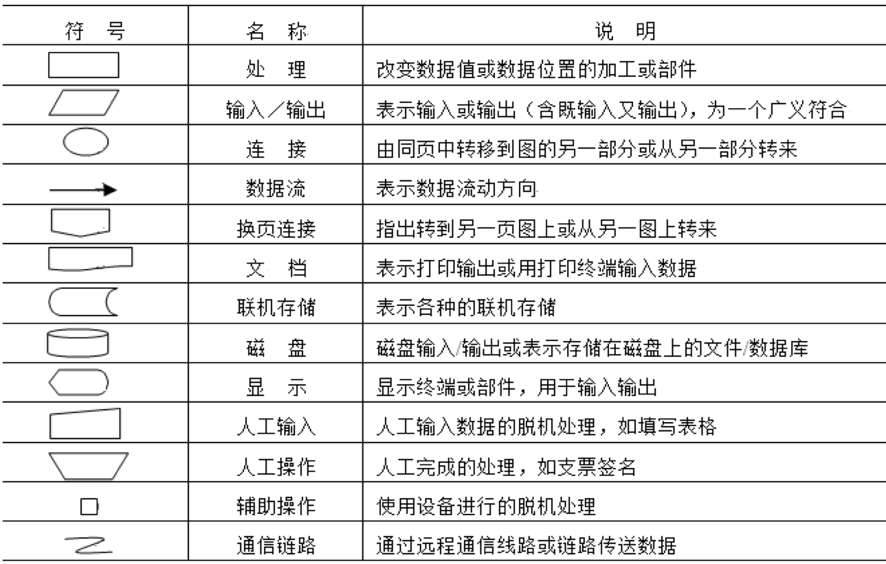
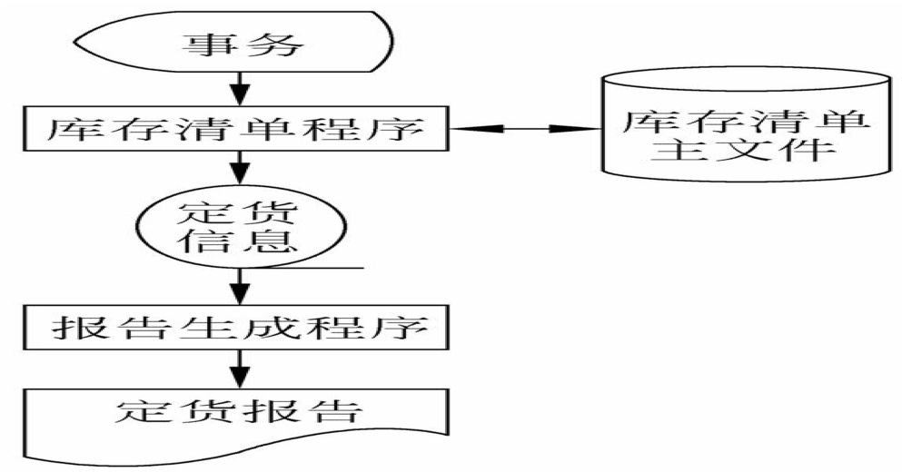
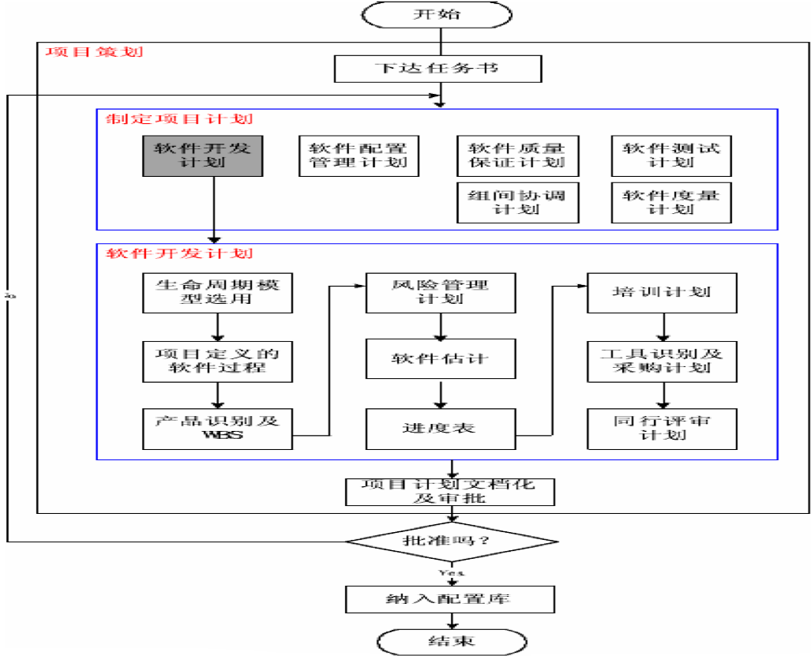

# 软件问题定义

软件问题定义至关重要，主要任务包括提出问题、初步调研、定义问题、形成“问题定义报告”等。

## 一、开发问题的提出

- 对拟研发软件的可行性分析，先要搞清软件的需求问题。 一般由企事业用户根据业务的实际需求提出，或由软件开发人员在深入用户调研时提出。
- 开始，用户通根据实际需要粗略地描述其基本意向，而对软件的具体目标、问题范围、功能性能、规模和环境等方面表述不一定很准确，因此，对用户提出的开发问题，还需要从专业技术方面进行更深层次的细致调研、分析和定义。

## 二、软件问题初步调研

初步调研需要确定和澄清的问题包括：软件开发提出的原因、背景、问题、目标、行业属性、社会环境、应用基础、技术条件、时限要求、投资能力等问题。

### 1. 调研的范围

一般调研的范围划分为7类，在实际中可视具体情况进行调整：

1. 应用系统组织机构和业务功能。
2. 现行系统及业务流程与工作形式。
3. 管理方式和具体业务的管理方法。
4. 数据与数据流程，包括各种计划、单据和报表的调研。
5. 管理人员决策的方式和决策过程。
6. 各种可用资源和要求（限制）条件。
7. 目前业务处理过程中需要改进的环节及具体问题。

### 2. 调研策略及原则

1. 自顶向下逐步展开的策略
2. 实事求是的原则
3. 工程化的工作方式
4. 全面与重点结合的方法
5. 主动沟通与友善的态度

## 3.调研报告的内容

系统调研结束后应确定“系统调研报告”，报告的内容包括：

1. 企事业用户的发展目标及规划（总体目标及具体目标、规划及计划）。
2. 组织机构层次（组织结构图）和业务功能。
3. 主要系统流程（系统流程图）及对信息的需求，包括各种计划、单据和报表样品。
4. 现有系统的管理方式、具体业务环节、管理方法、管理人员决策的方式和决策过程。
5. 现有系统软硬件的配置、使用效率和存在问题。
6. 现有系统存在的主要具体问题和薄弱环节。

## 三、问题定义的主要内容

问题定义是指在初步调研的基础上，逐步搞清拟研发软件开发的具体问题，并以书面形式对所有问题作出确定性描述的过程。不同的软件具有不同的问题定义内容。

1. 软件名称
2. 项目提出的背景
3. 软件目标及任务
4. 软件类型及性质
   - 不同类型的软件，采用的开发方法、技术和管理手段不同。
   - 项目性质用于描述软件的主要特性，为此还要确定软件的应用特性。最后，需要确定软件的角色性质。
5. 软件服务范围
6. 基本需求
7. 软件环境
8. 主要技术
9. 基础条件

- 对问题定义的结果应该形成“问题定义报告”，主要由软件策划小组起草，需要经过用户认可，反映软件策划小组和用户对问题的一致认识。
- 目前并没有规范统一的问题定义报告格式，“问题定义报告”主要包括：软件（项目）名称、项目提出的背景、软件目标、项目性质、软件服务范围、基本需求、软件环境、主要技术、基础条件等。

# 可行性分析及立项

可行性分析主要确定拟研发软件项目的可行性，通过调研分析，评价拟研发软件项目是否可行，并预测可能取得的经济效益和社会效益。

## 一、可行性分析的目的和意义

### 可行性分析的目的

- 可行性分析也称可行性研究，其目的是围绕影响软件项目研发的各种因素的可行性进行全面、系统的分析论证。

### 可行性分析的结论

1. 可行：“可行”结论表明可以按初步方案和计划进行立项并开发。
2. 基本可行：对软件项目内容或方案进行必要修改后，可以进行开发。
3. 不可行：软件项目不能进行立项或确定项目终止。

### 可行性分析的意义

可行性分析工作是软件项目开发前非常必要的一个关键环节，对于整个软件项目的开发成败，具有非常重要的经济意义和现实意义。 

## 二、可行性分析的任务及内容

可行性分析主要由系统分析员或软件分析员负责，其主要任务包括：决定软件项目“做还是不做”及可行项目的“初步方案”。对每个拟研发项目需要从5个方面进行分析：

1. 技术可行性分析
2. 经济可行性分析
3. 社会可行性分析
4. 开发方案可行性分析
5. 运行可行性分析

可行性分析的主要内容是对问题的定义，主要初步确定软件项目的规模和目标，问题定义后，要导出软件系统的逻辑模型。然后从此模型出发，确定若干可供选择的主要系统方案。   

首先需要进行初步的概要分析，确定软件项目的规模和目标，明确项目的约束和限制。 

### 1. 技术可行性分析

- 技术可行性（Technical Feasibility）是可行性分析中最关键和最难决断的问题。主要分析在特定条件下，技术资源、能力、方法等的可用性及其用于解决软件问题的可能性和现实性。
- 由于系统需求分析和问题定义过程与系统技术可行性评估过程同时进行，因此，软件系统目标、功能和性能的不确定性给技术可行性分析与论证增加很多困难。

#### 技术可行性分析的内容包括

- 对新软件功能的具体指标、运行环境及条件、响应时间、存储速度及容量、安全性和可靠性等要求；
- 对网络通信功能的要求等；
- 确定在现有资源条件下，技术风险及项目能否实现等。

其中的资源包括已有的或可以取得的硬件、软件和其他资源，现有技术人员的技术水平和已有的工作基础。

### 2. 经济可行性分析

- 经济可行性分析（Economic Feasibility）也称成本效益分析或投资／效益分析，主要从资源配置的角度衡量软件项目的实际价值，分析研发软件项目所需成本费用和项目开发成功后所带来的经济效益。
- 经济可行性分析包括两方面：一方面是经济及竞争实力分析；另一方面是经济效益分析。
- 经济可行性分析主要是进行成本效益分析，需要估算出新开发软件的总成本和总收益，然后对成本和效益进行具体比较，当项目的效益（即收益）大于成本一定值时才值得开发。

#### 通常，研发计算机系统的成本费用，包括以下４个组成部分：

1. 购置并安装软硬件及有关网络等设备的费用。
2. 软件系统开发费用。
3. 软件系统安装、运行和维护等费用。
4. 推广及用户使用与人员培训等费用。

#### 软件开发费用

软件项目开发费用，可以用任务分解方法进行估算。
估计每个任务的成本时，通常先估计完成该项任务需要用的人力费用，以“人·月”为单位，再乘以每人每月的平均工资得出每项任务的成本。

**开发阶段在生存周期中所占的比重**

|任务|所占比重（%）|
|---|---|
|可行性分析|5-8|需求分析|
|10-15|软件设计|20-25|
|编码及单元测试|20-30|
|综合测试|25-35|
|总计|100|

成本效益分析，首先是估算将要开发的软件项目的开发成本，然后与可能取得的效益进行比较和权衡。

进行投入产出分析时，未来的收益和现在已经消耗的成本，不宜进行比较，必须在考虑货币的时间价值后，才能进行准确的投入产出分析。

#### 1.货币的时间价值

由于利率的变化等因素，货币的时间价值能较准确地估算。假设年利率为i，若项目开发所需经费即投资为P元，则n年后可得资金数为F元：

  F = P﹒(1+ⅰ) n

反之，若n年后可得效益为F元，则这些资金现在的价值为：

  P = F ∕ (1+ⅰ) n

#### 【案例2-1】

假设开发一套企业应用系统需要投资20万元，5年内每年可产生直接经济效益9.6万元，设年利率为5 %，试计算投入产出比。

考虑到货币的时间价值，5年的总体收入应当逐年按照上式估算，其每年的收人折算到当前的数据如表2-3所示。

|时间(年)|将来收益(万)|(1+ i)n|当前收益(万)|累计当前收益(万)|
|---|---|---|---|---|
|1|9.6|1.05|9.1429|9.1429|
|2|9.6|1.1025|8.7075|17.8513|
|3|9.6|1.1576|8.2928|26.1432|
|4|9.6|1.2155|7.8979|34.0411|
|5|9.6|1.2763|7.5219|41.5630

**表2-3 货币的时间价值**

新软件项目的投入产出比（效益成本比）为：41.5630/20 = 2.0782。

#### 2. 投资回收期

指使累计的经济效益等于最初的投资费用所需的时间。投资回收期越短，利润获得越大越快，项目越值得开发。

两年后收人17.8513万元，尚缺2. 15万元没有收回成本，还需要时间：2. 15 / 8.2928=0.259（年），即投资回收期（时间）为2. 259年。

#### 3. 纯利润

是在整个生存周期内的累计经济效益（折合成现在值）与投资之差。5年的纯利润收人为：

41.5630﹣20 = 21.5630（万元）。

### 3. 社会可行性分析

- 社会可行性所涉及的范围较广，包括法律及道德的可行性、安全因素、对经济政策和市场发展趋势的分析、用户组织的管理模式、业务规范、应用操作可行性及产生的后果与隐患等。
- 在软件开发过程中可能涉及到各种合同、侵权、责任以及与法律法规相抵触的各种问题、双方有关规章制度责任等问题，软件的应用操作方式是否可行，是否违背现有的管理制度，对研发人员素质要求等。以免在研发过程中，出现不必要的纠纷和其他限制问题。

### 4. 开发方案可行性分析

开发方案可行性分析，包括资源和时间等可行性分析，主要有4个方面：

1. 以正常的运作方式，开发软件项目并投入市场的可行性。
2. 需要人力资源、财力资源的预算情况。
3. 软件硬件及研发设备等物品资源的预算情况。
4. 组织保障及时间进度保障分析等。

可行性分析最根本的任务是对以后的研发技术路线提出建议，对于不可行的开发方案，应建议重审或暂停，对可行的方案，提出修改完善建议并制定一个初步计划。 

### 5. 运行可行性分析

分析和测定软件在确定环境中可有效从事业务处理并被用户方便使用的程度和能力。

### 软件运行可行性分析包括5个方面

1. 原业务与新系统流程的相近程度和差异。
2. 业务处理的专业化程度，功能、性能、安全性、可靠性及接口等。
3. 对用户操作方式及具体使用要求。
4. 新软件界面的友好程度以及操作的便捷程度。
5. 用户的具体实际应用能力及存在的问题等。

## 三、可行性分析的过程

在实际工作中，可行性分析的主要过程有以下6个方面：

1. 明确系统规模和目标
2. 认真研究现行系统
3. 确定系统逻辑模型
4. 制定并推荐技术方案
5. 编写可行性分析报告
6. 审查论证

## 四、软件立项及合同

软件研发项目的立项、投标、合同和任务书是软件研发前的4项重要工作。

### 1.立项方法

- 立项与合同时软件项目来源的两个基本途径。立项需要在调研和可行性分析的基础上，确定研发项目的必要性和可能性，填写立项申报书，并完成立项及审批手续。
- 软件项目特别是重大项目对IT企业关系到存亡与发展，其立项至关重要，也是对软件开发项目的重大决策，应按照科学和民主决策的程序进行。

### 2.立项文档 

软件项目的立项文档是“立项申报表（建议书）”，其“编写格式”不尽一致，可以查阅相关文献及网络资料。

### 3.签订合同的方法与文档

- 正规的软件开发企业，都具有本企业规定的规范“项目合同”文本格式。
- 对于大中型软件项目，在签订合同之前，一般由软件项目用户责成的发标单位进行公开招标。
- “项目合同”与“立项申报表（建议书）”一样，是该项目的第一份管理文档。

### 4. 下达任务的方法与文档 

- 下达软件开发任务，需要至少满足下列条件之一： 
  1. 软件企业已签订了“项目合同”；
  2. “立项申报表（建议书）”已通过项目评审和审批； 
  3. 经过审批的指令性软件研发项目计划或合作性项目。 
- 一般下达任务的方式包括： 
  1. “任务书”的正文。
  2. “任务书”的附件

# 系统流程图

系统流程图是可行性研究阶段的传统图形描述工具。

## 一、系统流程图基本符号

- 系统流程图是描述实际物理系统的传统工具，用于与用户交流确认软件项目的大概流程、范围和功能等。
- 其基本思想是用图形符号描绘系统中的各部件（程序、文件、数据库、表格、人工过程等）的信息流向，而不是对信息处理的控制过程及细节，系统流程图的基本符号如表2-5所示。

## 二、系统流程图的主要用途：

1. 全面了解系统业务处理过程和进一步分析系统结构的依据。
2. 系统分析员、管理人员、业务操作人员相互交流确认的工具。
3. 系统分析员可直接在系统流程图上，拟出可实现计算机处理的主要部分。
4. 可利用系统流程图分析业务流程的合理性。

### 【案例2-2】

某装配厂有一存放零件的仓库，库中现有零件数量和每种零件的库存量临界值等数据记录在库存清单文件中。当仓库中零件数量变化时，修改库存清单文件，当某种零件库存量少于库存量临界值，则报告给采购部门定货,每天向采购部门送一次定货报告。零件库存量的每次变化称为一个事务，由放在仓库中的终端输入到计算机中；系统中的库存清单程序对事务进行处理，更新存储的库存清单文件，并存入必要的定货信息。每天生成并打印出定货报告。

# 软件开发计划

## 一、软件开发计划的用途

- 软件开发计划也称软件项目计划（Software Project Planning）是指在正式进行软件开发之前，制定的具体指导软件开发的实施计划，是指导软件开发工作的纲领。软件开发计划制定的依据是问题定义报告。
- “软件开发计划” 是用于指导组织、实施、协调和控制软件研发与建设的重要文件，也是软件工程中的一种管理性文档。
- 软件项目计划分类包括：进度计划、质量保证计划、费用计划、风险管理计划、人力计划等。对于大型项目分别制订以上计划，小型项目可将以上内容合并为一个计划。

## 二、软件开发计划的内容

1. 软件开发计划主要内容项目开发计划是一个管理性文档，主要内容包括： 
   1. 项目概述
   2. 实施计划
   3. 交付期限
   4. 人员组织及分工
2. 方案选择依据：选择最佳方案的主要依据包括：技术、工作量、时间、进度、人员组织、费用、软硬件开发及运行环境等方面综合达到最佳。
3. 项目开发计划的制定:制定科学的开发计划应着重考虑项目规模、类型、特定、复杂度、熟悉程度等。

通常，在上述主要内容中，着重考虑以下基本内容：

- 软件项目主要问题
- 软件开发的主要问题
- 工作阶段及任务
- 资源需求（主要包括软件开发所需要的人力和设备环境等方面的资源需求情况）
- 进度计划

软件项目计划是一个软件项目进入系统实施的启动阶段,主要进行的工作包括:

- 确定详细的项目实施范围
- 定义递交的工作成果
- 评估实施过程中主要的风险
- 制定项目实施的时间计划
- 成本和预算计划
- 人力资源计划等

- 制定项目计划是软件项目管理过程中一个关键活动，是软件开发工作的第一步。 项目计划的目标是为项目负责人提供一个框架，使之能合理地估算软件项目开发所需的资源 、经费和开发进度，并控制软件项目开发过程按此计划进行。
- 软件项目计划包括二个方面：研究和估算
- 即通过研究确定该软件项目的主要功能、性能和系统界面。

## 三、软件开发计划书

1. 引言（Introduction）
2. 项目概述（Project Summary）
3. 项目组织（Project Organization）
4. 软件生存周期（Software Life Cycle）
5. 规范、方法和标准（Criterion，Means，Standard）
6. 任务与工作产品（Task and Work Products）
7. 工作产品、任务规模、工作量估计（Estimates of Work Product，Task Size and Workload）
8. 成本估计（Estimates of Costs）
9. 关键计算机资源计划（Critical Computer Resource Plan）
10. 软件项目进度计划（Software Project Schedule）
11. 配置管理计划（可单独做一个计划）（Configuration Management Planning
12. 质量保证计划（可单独做一个计划）（Software Quality Assurance Planning）
13. 风险分析（Risks Analysis）
14. 设备工具计划（Equipment and Tools Planning）
15. 培训计划（Training Planning）
16. 项目评审（Project Reviews）
17. 度量（Measurement）