# 需求分析概述

## 一、需求分析的概念及特点

### 1. 需求分析的概念

- 需求分析（Requirement Analysis）也称为软件需求、软件需求分析、系统需求分析或需求分析工程等。
- 是开发人员经过深入细致的调研和分析，准确理解用户和项目的功能、性能、可靠性等具体要求，将用户非形式的需求表述转化为完整的需求定义，从而确定系统“必须做什么”的过程。
- Boehm对软件需求的定义：研究一种无二义性的表达工具，它能为用户和软件人员双方都接受并将“需求”严格地、形式地表达出来。

### 2. 需求分析的特点

需求分析的特点及难点，主要体现5个方面：

1. 需求动态性
2. 完备一致性
3. 问题确定性
4. 交流共识难
5. 深入完善难

## 二、需求分析的目的和原则

### 1. 需求分析的目的

需求分析主要用于获取用户的具体需求，通过对实际需求的获取、分析、文档化和验证等需求分析过程，为进一步的设计和实现提供依据：

1. 需求分类。将软件功能、性能、可靠性等相关需求进行分类、逐一细化。
2. 面向用户获取并分析需求。
3. 检查和解决不同需求间的矛盾，尽量达到均衡和优化。
4. 确定软件的边界，以及软件与环境的相互作用方式等。
5. 对需求文档化并进行最后的验证与确认。

- 需求分析的重点：通过分析业务流程和数据流程的手段，达到与客户共同确定业务模型、功能模型、性能模型、接口模型的目标。
- 需求分析的关键：在系统的流程、功能、性能和接口等方面，与客户达成完全一致，并且要求客户签字认。也是需求分析在商务等方面的主要目的。    
- 需求分析的变更：需求如有变化，双方必须履行“需求变更管理规程”，对此规程在签订合同时要做出规定，注意合同的法律效用。

### 2. 需求分析的基本原则：

1. 侧重表达理解问题的数据域和功能域。
2. 需求问题应分解细化，建立问题层次结构。
3. 建立模型。

# 需求分析的任务及过程

## 一、需求分析的任务

需求分析的基本任务是准确地分析理解原系统，定义新系统的目标及具体要求，在可行性分析的基础上进一步获取新系统的综合需求，确定系统要完成的工作，为软件设计与实现奠定基础。主要有九项任务：

### 1. 确定总体目标及组织结构

通过调研与分析，确定用户机构的总体目标、组织结构、业务管理方法、处理方式及过程的，确定相应的模型。

#### 【案例3-1】

在对网上图书馆信息系统进行调研和分析的基础上，可以画出新系统的组织结构图，并列出各部门的岗位角色表。


##### 图书馆的岗位角色

|岗位编号|岗位名称|所在部门|岗位职责|相关业务|
|---|---|---|---|---|
|1001|采购员|采编部|采购、合同、签订、选择出版社|进货及合同管理|
|1012|采编员|采编部|图书分类|协助入库|
|......|......|......|......|......|

### 2. 深入领域分析，画出业务流程图

- 一般事务型软件领域分析包括：
  - 组织业务调查、组织目标分析、组织机构分析、组织
  - 职能分析、业务流程分析和组织实体分析。
- 业务模型表示了与系统有关的人、设备、其他子系统之间的业务关系和费用关系，因此，需要在分析的基础上，画出新系统的业务操作流程图，包括物流、资金流、信息流，即业务操作模型，重点是业务操作的流程步骤。

### 3. 分析数据流程，画出数据流图

需要分析各种业务处理的具体数据内容及其流向等属性，并画出目标系统的数据流图，即单据和报表的流程图，掌握业务规则及处理顺序，获得初步数据模型。

### 4. 确定功能需求，完成功能结构图及点列表

1. 确定功能需求。包括新系统必须具备的具体功能。
2. 画出功能结构图。
3. 完成新系统的功能点列表，即功能模型。

### 5. 获取性能需求，列出性能点列表

根据具体系统确定开发软件的性能技术指标，包括软件的效率、可靠性、安全性、适用性、可移植性、可维护性和可扩充性等方面的需求，还应考虑业务发展的扩展及更新维护等。

#### 【案例3-2】网上图书信息系统的部分性能点列表(性能模型)。


### 6. 明确处理关系，列出接口列表

应用软件可能还与机构内部的其他应用软件集成，因此，需要明确与外部应用软件数据交换的内容、格式与接口，以实现数据及功能的有机结合。

#### 【案例3-3】网上图书馆信息系统的部分接口列表。

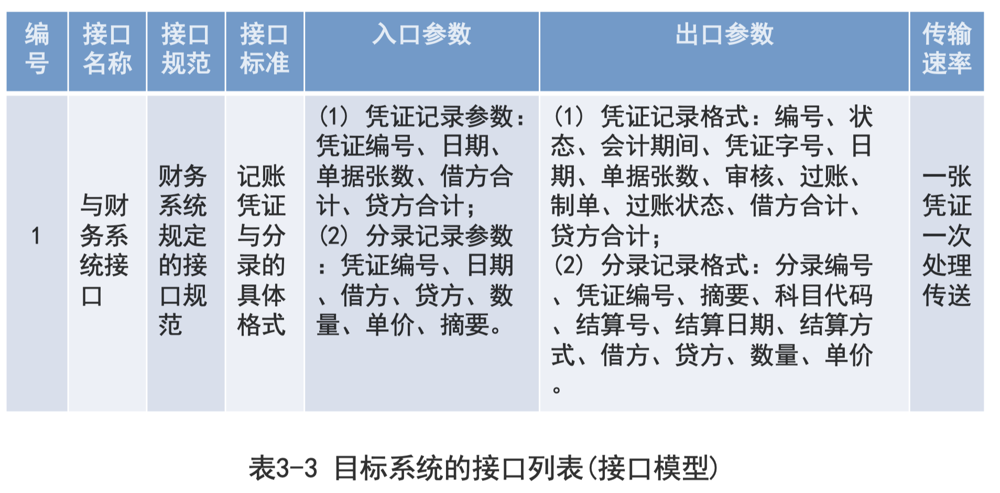

### 7. 确定系统运行环境及界面

### 8. 修正开发计划和新系统方案

### 9. 编写需求文档，验证确认需求 


## 二、需求分析的过程

- 通常从用户获取的初步需求存在不够精确、模糊、片面等问题。通过进一步调研、修改、补充、细化、删减、整合和完善，最后得出全面且可行的软件需求。需求分析应有用户参加，随时进行沟通交流，并最终征得用户认可。
- 需求分析的过程也称为需求开发，可分为需求获取、综合与描述、需求验证和编写文档等步骤，是一个不断深入与完善的迭代过程，如图3-2所示。


# 需求分析描述工具

## 一、需求描述工具概述

- 常用软件需求描述工具包括：
  - 业务流程图、功能结构图、数据流图、用况图、状态模型图、用户交互图、对象模型图、数据模型图和功能需求列表、性能需求列表、接口需求列表、界面需求列表等。
- 主要根据实际需要选择工具，取决于问题域的本质特征。需求描述工具的选择和使用，通常与具体需求分析方法和阶段有关。
- 面向过程和面向数据的分析方法，常用的描述工具为：组织机构图、数据流图、业务流程图、功能结构图、数据字典、实体联系图和U/C矩阵等，如表3-4所示。
- 而面向对象的分析方法，则主要采用UML语言和用例图、活动图等，将在第5章单独进行介绍。 

|分析活动|采用的描述工具|
|---|---|
|业务调查及业务流程分析|业务流程图|
|组织结构及功能分析|组织结构图、功能结构图|
|数据及数据流分析|数据流图、数据字典、E-R图|
|功能/数据分析|U/C矩阵|

**传统分阶段使用的描述工具**

## 二、业务流程图 

业务流程图（Transaction Flow Diagram , TFD）是用尽量少的规定符号及连线的图形表示某个具体业务处理过程。TFD易于阅读和理解，是分析业务流程的重要步骤。

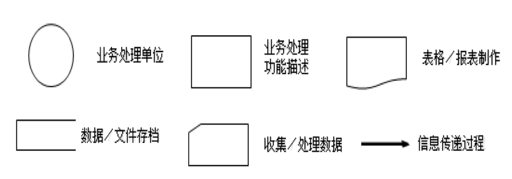

### 【案例3-6】企业投资项目审批业务流程图。

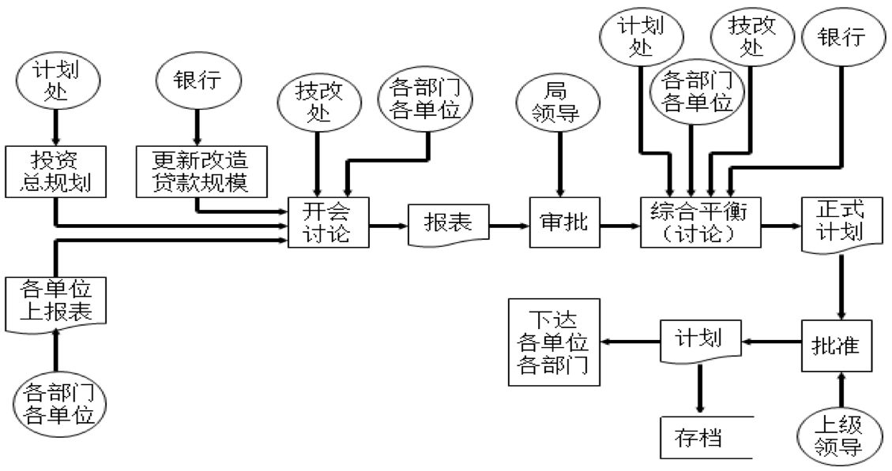

### TFD的绘制图标

TFD的画法可多种多样，可根据国家或行业规定制定一套统一图形规则。TFD的制作工具，可以是桌面办公工具Office等。一种直式TFD的绘制图标如图3-5所示。

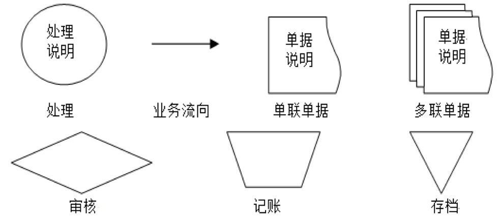

## 三、数据流图及数据字典

### 1. 数据流

数据流由数据元素构成，其定义可列出描述的所有数据元素。数据元素又称数据项，是数据的最小单位。数据流是指数据通过一个系统时的流向及变化方式，如图3-6所示。

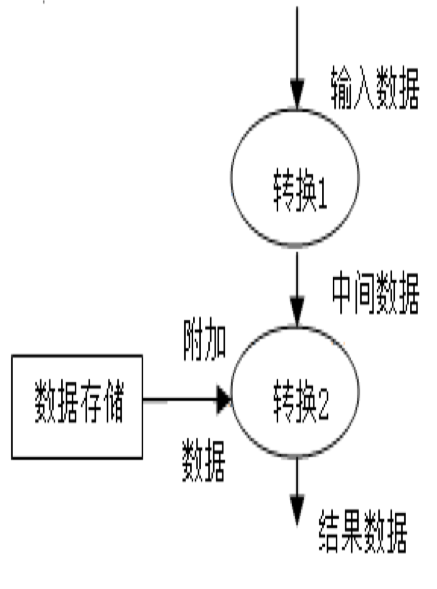

其中，输入数据首先转换成中间数据，然后转换成输出数据。在此期间可从已有的数据存储中引入附加数据。对数据进行转换是程序中应有的功能或子功能。两个转换功能之间的数据传递就确定了功能间的接口。

### 2. 数据流图

#### 2.1 数据流图的概念和作用

- 数据流图（Data Flow Diagram，DFD）是一种图形化的系统模型，在一张图中按照系统的观点，将新系统建模为输人、处理、输出和数据存储。
- 它运用图形方式描述系统内部的数据流程，形象、准确地表达了系统的各处理环节以及各环节之间的数据联系，是结构化分析方法的主要表达工具。

##### 【案例3-7】

网上图书预定系统的FD图，如图3-7所示。对于网上图书预定系统，需要接收来自顾客的订单，并对订单验证，验证过程主要根据图书目录检查订单的正确性，并由顾客档案确定新老顾客及信誉情况。验证正确的订单，暂存放在待处理的订单文件中。集中后对订单进行成批处理，根据出版社档案，将订单按照出版社分类汇总，并保存订单存根，汇总后订单发往各出版社。

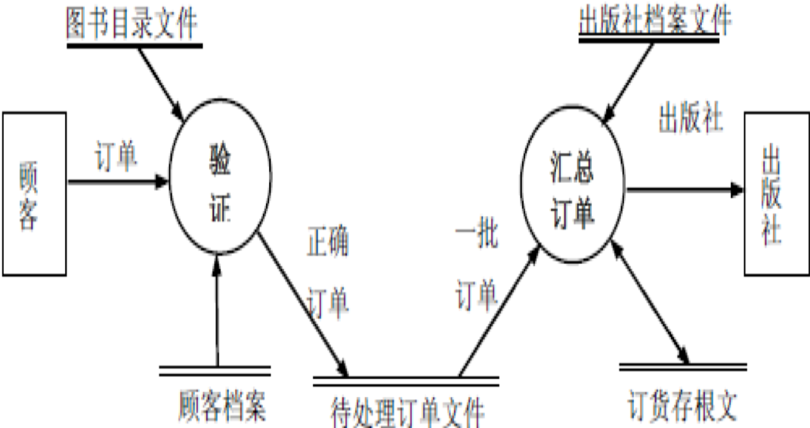

#### 2.2 数据流图的符号元素

有时DFD符号表示不尽相同。另一种较为常见的DFD的4种基本符号元素：外部实体、数据处理、数据流和数据存储。其基本符号如下：

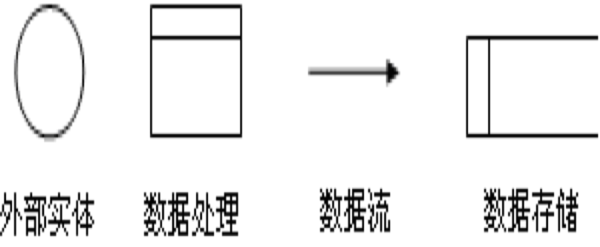

#### 2.3 DFD绘制方法

1. 画顶层DFD（系统的输入/输出）。
2. 画系统内部。DFD主要是用于描述系统内部的处理过  程，即画下层DFD。
3. DFD绘制规则
   1. 自顶向下、由外向内绘制。注意绘制层次和顺序，用父子图描述不同的层次。
   2. 命名编号。从0开始编层号，对数据流命名(含义明显时可略)。   
   3. 调整位置尽量避免数据流的交叉。
    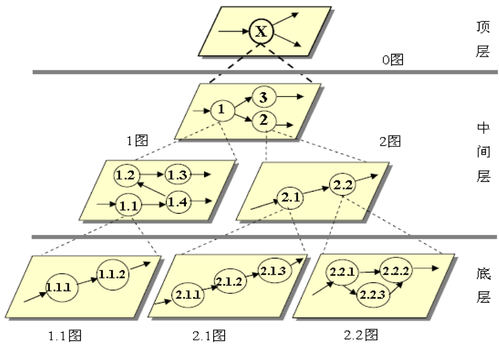
    自顶向下分层描述
   1. 对需要在两个设备上进行的处理，应避免直接相连。可在其之间加一个数据存储。
   2. 如果一个外部实体提供给某一处理的数据流过多，可将其合并成一个综合数据流。
   3. 下层图中的数据流应与上层图中的数据流等价。
   4. 对于大而复杂的系统，其图中的各元素应加以编号。通常在编号前冠以字母，表示不同的元素，用P表示处理、D表示数据流、F表示数据存储、S表示外部实体。
4. 注意事项
5. DFD实际应用示例

##### 【案例3-9】

某公司“装备配件经营处理系统”的DFD，采用了“自顶向下，由外向内”的绘制原则，其3层部分DFD如图3-10至图3-12所示。

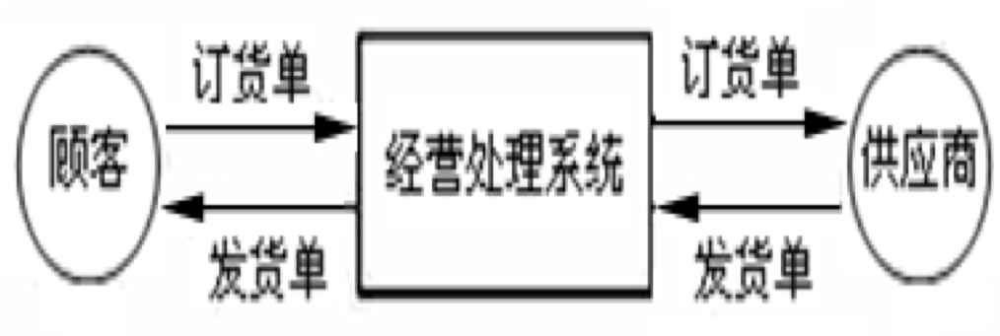
图3-10 顶层数据流

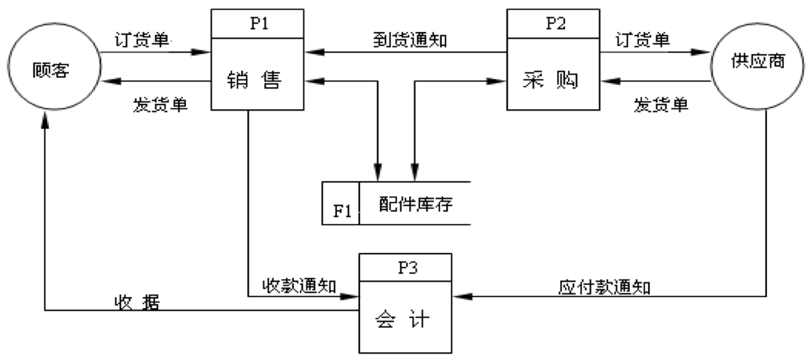
图3-11 第2层数据流

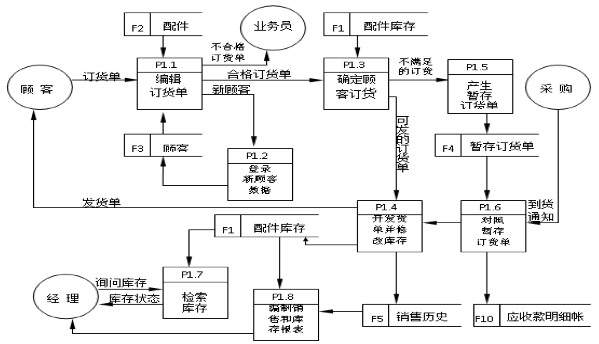
图3-12 第3层DFD之一

### 3. 数据字典

- 数据字典以一种准确无二义性的说明方式为软件分析、设计及维护提供了有关数据元素一致的定义和详细描述。
- 数据字典要求：完整性、一致性和可用性。

#### 3.1 数据流条目

给出了DFD中数据流的定义，通常对数据流的简单描述为列出该数据流的各组成数据项。
主要包括：数据流名称、别名及简述、数据流来源和去处、数据流组成、流通量。

##### 【案例3-10】旅客订购机票的数据流条目示例，数据流量指单位时间内的传输次数。

机票=姓名+日期+航班号+始发地+目的地+费用
姓名={字母}182 
航班号=“CZ9938”··“CZ9948”
目的地=[上海│北京│广州]

数据流条目主要内容及举例如下：
数据流名称：订单。
别名：无。
简述：旅客订票时填写的项目。
来源：旅客。
去向：加工1“检验订单”。
数据流量：2000份/每周。
组成：编号+订票日期+旅客编号+地址+电话+银行账号+预订日期+目地+数量

#### 3.2 文件条目

给出某个文件的定义，文件的定义通常是列出文件记录的组成数据流，还可指出文件的组织方式。

##### 例：某销售系统的订单文件：

订单文件＝订单编号＋顾客名称＋产品名称＋订货数量＋交货日期

#### 3.3 数据项条目

给出某个数据单项的定义，通常是该数据项的值类型、允许值等。

##### 例如：帐号= 00000 ~ 99999 ； 存款期=[1|3|5] （单位：年）


#### 3.4 加工条目

是对DFD的补充，实际是“加工小说明”。由于“加工”是DFD的重要组成部分，一般应单独进行说明。

**因此，数据词典是对DFD中所包含各种元素定义的集合。对4类条目描述：数据流、数据项、文件及基本加工。**

## 四、处理过程描述

描述处理过程的方法又称为“加工（逻辑）小说明”，包括下列几种：

- 结构化语言
- 判定树
- 判定表

### 4.1 结构化语言

结构化语言是一种介于自然语言（英语或汉语）和形式语言之间的半形式化语言，专门用于描述一个功能单元逻辑要求。

一般分为两层结构：

- 外层语法较具体，为控制结构（顺序、选择、循环）；
- 内层较灵活，表达“做什么”。
       
**特点**：简单、易学、少二义性，但不好处理组合条件。

#### 【案例3-14】用结构化英语描述某公司产品销售业务过程中折扣政策。
     
```
IF customer does more than S50,000 business
THEN   IF the customer wasn’t  in debt to us the last three months
  THEN discount is 15％
  ELSE（was in debt to us）
    IF   customer has been with us for more 20 years
    THEN discount is 10％
    ELSE（5 year or less）SO discount is 5％
    ENDIF
  ENDIF
ENDIF（customer does S 50,000 OR less）SO discount is nil．
```
### 4.2 判定树

判定树（Decision Tree）也称为判断树或决策树，用判定树来描述一个功能模块逻辑处理过程，其基本思路与结构化语言完全类似，是结构化语言的另一种更为直观方便的逻辑表现形式。      

**特点**：描述一般组合条件较清晰；不易输入计算机。

用判定树方法描述上述公司销售产品的折扣政策，如下图：

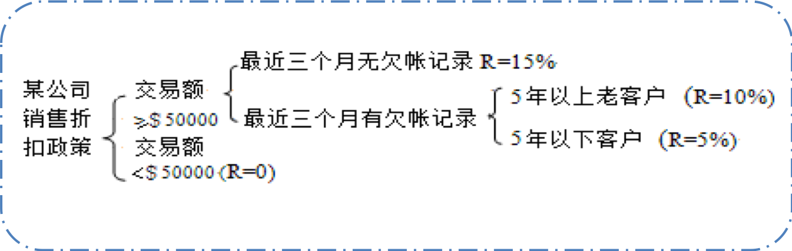
图3-13 计算折扣判定树 

### 4.3 判定表

判定表也称为决策表，与结构化语言和判定树方法相比：

优点：能够将所有的条件组合充分地表达出来。
缺点：判定表的建立过程较为繁杂，且表达方式不如前两者简便。

#### 判定表由四部分组成

1. 条件定义
2. 条件取值及组合
3. 结果（操作定义）
4. 取值组合结果（操作）

##### 【案例3-15】

在产品销售业务中，折扣条件有3个：业务发生额、业务往来的时间和欠账情况。根据4种最终折扣的可能性，可设计出如 下所示的判定表。

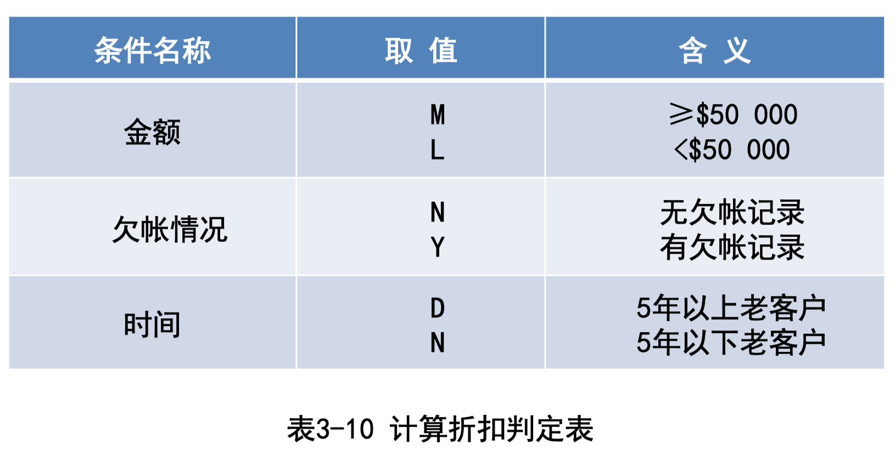

在表3-11条件栏中填入各种可能发生的情况，在结果栏中填入对应上面情况可能产生的结果。

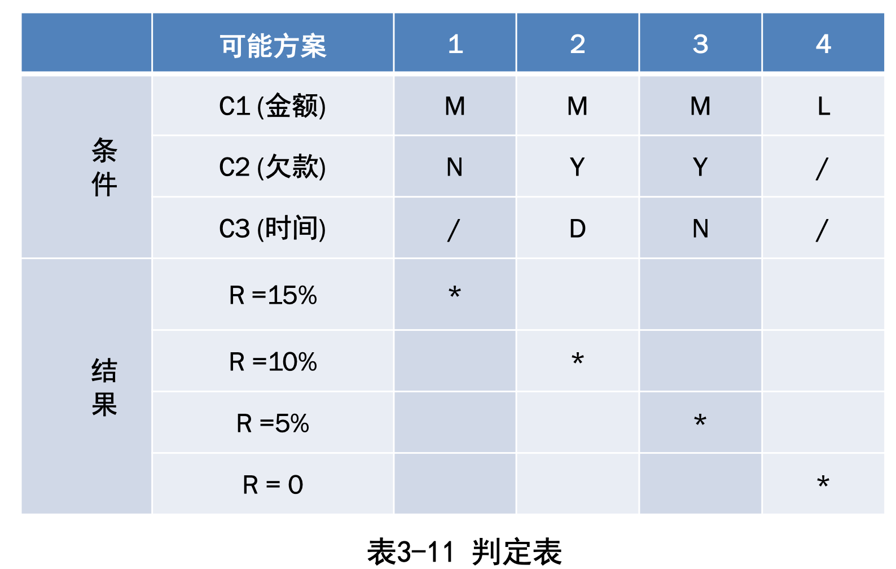

# 需求分析方法


# 需求分析文档


