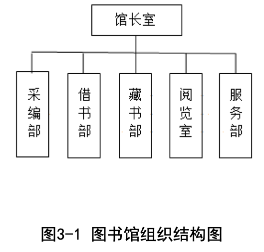
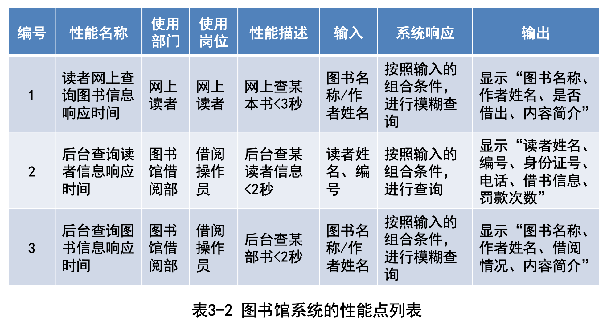
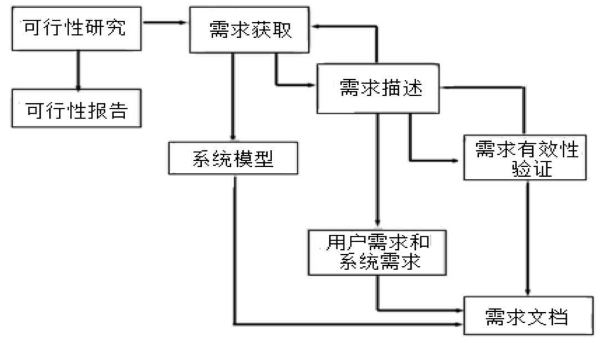

# 需求分析概述

## 一、需求分析的概念及特点

### 1. 需求分析的概念

- 需求分析（Requirement Analysis）也称为软件需求、软件需求分析、系统需求分析或需求分析工程等。
- 是开发人员经过深入细致的调研和分析，准确理解用户和项目的功能、性能、可靠性等具体要求，将用户非形式的需求表述转化为完整的需求定义，从而确定系统“必须做什么”的过程。
- Boehm对软件需求的定义：研究一种无二义性的表达工具，它能为用户和软件人员双方都接受并将“需求”严格地、形式地表达出来。

### 2. 需求分析的特点

需求分析的特点及难点，主要体现5个方面：

1. 需求动态性
2. 完备一致性
3. 问题确定性
4. 交流共识难
5. 深入完善难

## 二、需求分析的目的和原则

### 1. 需求分析的目的

需求分析主要用于获取用户的具体需求，通过对实际需求的获取、分析、文档化和验证等需求分析过程，为进一步的设计和实现提供依据：

1. 需求分类。将软件功能、性能、可靠性等相关需求进行分类、逐一细化。
2. 面向用户获取并分析需求。
3. 检查和解决不同需求间的矛盾，尽量达到均衡和优化。
4. 确定软件的边界，以及软件与环境的相互作用方式等。
5. 对需求文档化并进行最后的验证与确认。

- 需求分析的重点：通过分析业务流程和数据流程的手段，达到与客户共同确定业务模型、功能模型、性能模型、接口模型的目标。
- 需求分析的关键：在系统的流程、功能、性能和接口等方面，与客户达成完全一致，并且要求客户签字认。也是需求分析在商务等方面的主要目的。    
- 需求分析的变更：需求如有变化，双方必须履行“需求变更管理规程”，对此规程在签订合同时要做出规定，注意合同的法律效用。

### 2. 需求分析的基本原则：

1. 侧重表达理解问题的数据域和功能域。
2. 需求问题应分解细化，建立问题层次结构。
3. 建立模型。

# 需求分析的任务及过程

## 一、需求分析的任务

需求分析的基本任务是准确地分析理解原系统，定义新系统的目标及具体要求，在可行性分析的基础上进一步获取新系统的综合需求，确定系统要完成的工作，为软件设计与实现奠定基础。主要有九项任务：

### 1. 确定总体目标及组织结构

通过调研与分析，确定用户机构的总体目标、组织结构、业务管理方法、处理方式及过程的，确定相应的模型。

#### 【案例3-1】

在对网上图书馆信息系统进行调研和分析的基础上，可以画出新系统的组织结构图，并列出各部门的岗位角色表。

##### 图书馆的岗位角色

|岗位编号|岗位名称|所在部门|岗位职责|相关业务|
|---|---|---|---|---|
|1001|采购员|采编部|采购、合同、签订、选择出版社|进货及合同管理|
|1012|采编员|采编部|图书分类|协助入库|
|......|......|......|......|......|

### 2. 深入领域分析，画出业务流程图

- 一般事务型软件领域分析包括：
  - 组织业务调查、组织目标分析、组织机构分析、组织
  - 职能分析、业务流程分析和组织实体分析。
- 业务模型表示了与系统有关的人、设备、其他子系统之间的业务关系和费用关系，因此，需要在分析的基础上，画出新系统的业务操作流程图，包括物流、资金流、信息流，即业务操作模型，重点是业务操作的流程步骤。

### 3. 分析数据流程，画出数据流图

需要分析各种业务处理的具体数据内容及其流向等属性，并画出目标系统的数据流图，即单据和报表的流程图，掌握业务规则及处理顺序，获得初步数据模型。

### 4. 确定功能需求，完成功能结构图及点列表

1. 确定功能需求。包括新系统必须具备的具体功能。
2. 画出功能结构图。
3. 完成新系统的功能点列表，即功能模型。

### 5. 获取性能需求，列出性能点列表

根据具体系统确定开发软件的性能技术指标，包括软件的效率、可靠性、安全性、适用性、可移植性、可维护性和可扩充性等方面的需求，还应考虑业务发展的扩展及更新维护等。

#### 【案例3-2】网上图书信息系统的部分性能点列表(性能模型)。

### 6. 明确处理关系，列出接口列表

应用软件可能还与机构内部的其他应用软件集成，因此，需要明确与外部应用软件数据交换的内容、格式与接口，以实现数据及功能的有机结合。

#### 【案例3-3】网上图书馆信息系统的部分接口列表。

### 7. 确定系统运行环境及界面

### 8. 修正开发计划和新系统方案

### 9. 编写需求文档，验证确认需求 

## 二、需求分析的过程

- 通常从用户获取的初步需求存在不够精确、模糊、片面等问题。通过进一步调研、修改、补充、细化、删减、整合和完善，最后得出全面且可行的软件需求。需求分析应有用户参加，随时进行沟通交流，并最终征得用户认可。
- 需求分析的过程也称为需求开发，可分为需求获取、综合与描述、需求验证和编写文档等步骤，是一个不断深入与完善的迭代过程，如图3-2所示。

---

# 需求分析描述工具

# 需求分析方法

# 需求分析文档

