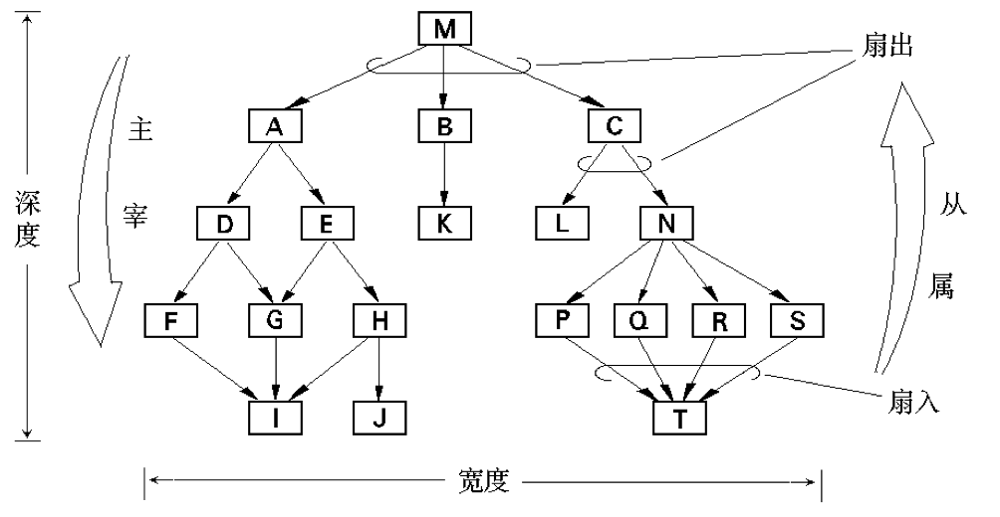

# 软件总体设计

- 软件设计也称系统设计，是应用各种技术和方法，设计新系统的过程。
- 其总体目标是：将需求分析阶段得到的新系统逻辑模型，转换为物理模型，设计结果是“软件设计说明书”，提高软件可用性、可靠性、可维护性、可理解性和效率。
- 主要是根据需求分析获取的需求，采用合适的设计方法进行总体设计和详细设计。

## 一、软件总体设计的任务

软件设计先要进行总体设计也称为概要设计，从总体上进行宏观概要架构设计，将软件需求转化为数据结构和软件的系统结构。

下图描绘了软件设计过程中的信息流：

### 总体设计的任务和内容主要包括：

1. 软件的总体结构和模块外部设计。
2. 软件处理流程设计。
3. 确定软件的功能并分配。
4. 数据结构设计。
5. 网络及接口设计。
6. 运行设计。
7. 出错处理设计。
8. 性能可靠性及安全保密设计。
9. 维护设计。

## 二、总体设计的原则和过程

- 总体设计的总原则及过程是：由宏观到微观、逐步求精的原则，定性定量分析相结合、分解与协调相结合和模型化方法，并要兼顾系统的一般性、关联性、整体性和层次性。
- 根据系统的总体结构、功能、任务和目标的要求分解系统，使各子系统之间互相协调配合，实现系统的整体优化。
- 主要体现在软件工程的模块化、抽象、信息隐藏等基本原则。

### 2.1 模块化

- 模块是构成程序的基本构件，一般软件都由其模块和子模块构成。
- 模块化（Modular）是将复杂软件划分为功能相对独立且易于处理的模块的过程，软件的层次结构正是模块化的具体体现。

### 2.2 抽象和逐步求精

- 抽象是指抓住事物的本质特性而暂时不考虑其细节的方法。
- 逐步求精是指为了集中精力解决主要问题而尽量推迟并逐步考虑细节问题的方法，是人类解决复杂问题时采用的一种基本策略，也是软件工程技术的基础。
- 抽象与求精是一对互补的概念。

### 2.3 信息隐藏

- 信息隐蔽原理认为：模块所包含的“过程及数据”信息对于其他模块应是隐蔽的。
- 即模块规定和设计应遵从以下原则：使包含在模块中的“过程或数据”信息对于其他不需要这些信息的模块，不能访问或“不可见”。

### 2.4 内聚和耦合

#### 内聚

内聚:标志一个模块内各个元素彼此结合的紧密程度，是信息隐蔽和局部化概念的自然扩展。设计时应该力求做到高内聚。

内聚按强度从低到高有以下几种类型：

- 偶然内聚：如果一个模块的各成分之间毫无关系，则称为偶然内聚，也就是说模块完成一组任务，这些任务之间的关系松散，实际上没有什么联系。
- 逻辑内聚：几个逻辑上相关的功能被放在同一模块中，则称为逻辑内聚。如一个模块读取各种不同类型外设的输入。尽管逻辑内聚比偶然内聚合理一些，但逻辑内聚的模块各成分在功能上并无关系，即使局部功能的修改有时也会影响全局，因此这类模块的修改也比较困难。
- 时间内聚：如果一个模块完成的功能必须在同一时间内执行（如系统初始化），但这些功能只是因为时间因素关联在一起，则称为时间内聚。
- 通信内聚：如果一个模块的所有成分都操作同一数据集或生成同一数据集，则称为通信内聚。
- 顺序内聚：如果一个模块的各个成分和同一个功能密切相关，而且一个成分的输出作为另一个成分的输入，则称为顺序内聚。
- 过程内聚：
  - 构件或者操作的组合方式是，允许在调用前面的构件或操作之后，马上调用后面的构件或操作，即使两者之间没有数据进行传递。
  - 模块完成多个需要按一定的步骤一次完成的功能。（过程相关—控制耦合）。例如：在用程序流程图设计模块时，若将程序流程图中的一部分划出各自组成模块，便形成过程内聚。
- 信息内聚：模块完成多个功能，各个功能都在同一数据结构上操作，每一项功能有一个唯一的入口点。这个模块将根据不同的要求，确定该模块执行哪一个功能。由于这个模块的所有功能都是基于同一个数据结构（符号表），因此，它是一个信息内聚的模块。
- 功能内聚：模块的所有成分对于完成单一的功能都是必须的，则称为功能内聚。

#### 耦合 

是对软件结构内不同模块之间互连程度的度量，是影响软件复杂程度的一个重要因素。模块间的耦合程度将影响系统的可理解性、可测试性、可靠性和可维护性。

一般模块之间可能的连接方式有七种，构成耦合性的七种类型。它们之间的关系为（由弱到强）

- 非直接耦合：如果两个模块之间没有直接关系，它们之间的联系完全是通过主模块的控制和调用来实现的，这就是非直接耦合。这种耦合的模块独立性最强。
- 数据耦合：如果一个模块访问另一个模块时，彼此之间是通过数据参数(不是控制参数、公共数据结构或外部变量)来交换输入、输出信息的，则称这种耦合为数据耦合。由于限制了只通过参数表传递数据，按数据耦合开发的程序界面简单、安全可靠。因此，数据耦合是松散的耦合，模块之间的独立性比较强。在软件程序结构中至少必须有这类耦合。
- 标记耦合：如果一组模块通过参数表传递记录信息，就是标记耦合。事实上，这组模块共享了这个记录，它是某一数据结构的子结构，而不是简单变量。这要求这些模块都必须清楚该记录的结构，并按结构要求对此记录进行操作。在设计中应尽量避免这种耦合，它使在数据结构上的操作复杂化了。如果采取“信息隐蔽”的方法，把在数据结构上的操作全部集中在一个模块中，就可以消除这种耦合。
- 控制耦合：如果一个模块通过传送开关、标志、名字等控制信息，明显地控制选择另一模块的功能，就是控制耦合。如图4．13所示。这种耦合的实质是在单一接口上选择多功能模块中的某项功能。因此，对所控制模块的任何修改，都会影响控制模块。另外，控制耦合也意味着控制模块必须知道所控制模块内部的一些逻辑关系，这些都会降低模块的独立性。
- 外部耦合：一组模块都访问同一全局简单变量而不是同一全局数据结构，而且不是通过参数表传递该全局变量的信息，则称之为外部耦合。例如C语言程序中各个模块都访问被说明为extern类型的外部变量。外部耦合引起的问题类似于公共耦合，区别在于在外部耦合中不存在依赖于一个数据结构内部各项的物理安排。
- 公共耦合：若一组模块都访问同一个公共数据环境，则它们之间的耦合就称为公共耦合。公共的数据环境可以是全局数据结构、共享的通信区、内存的公共覆盖区等。
  - 这种耦合会引起下列问题：
  - 所有公共耦合模块都与某一个公共数据环境内部各项的物理安排有关，若修改某个数据的大小，将会影响到所有的模块。
  - 无法控制各个模块对公共数据的存取，严重影响软件模块的可靠性和适应性。
  - 公共数据名的使用，明显降低了程序的可读性。
  - 公共耦合的复杂程度随耦合模块的个数增加而显著增加。如图4．14所示，若只是两个模块之间有公共数据环境，则公共耦合有两种情况。
  - 若一个模块只是往公共数据环境里传送数据，而另一个模块只是从公共数据环境中取数据，则这种公共耦合叫做松散公共耦合。若两个模块都从公共数据环境中取数据，又都向公共数据环境里送数据，则这种公共耦合叫做紧密公共耦合。只有在模块之间共享的数据很多，且通过参数表传递不方便时，才使用公共耦合。否则，还是使用模块独立性比较高的数据耦合好些。
- 内容耦合((70ntent Coupling)

**如果发生下列情形，两个模块之间就发生了内容耦合。**

1. 一个模块直接访问另一个模块的内部数据；
2. 一个模块不通过正常入口转到另一模块内部；
3. 两个模块有一部分程序代码重叠(只可能出现在汇编语言中)；
4. 一个模块有多个入口。

在内容耦合的情形，所访问模块的任何变更，或者用不同的编译器对它再编译，都会造成程序出错。好在大多数高级程序设计语言已经设计成不允许出现内容耦合。它一般出现在汇编语言程序中。这种耦合是模块独立性最弱的耦合。

### 2.5 子系统及模块的划分

- 软件体系结构设计的三要素是程序构件（模块）的层次结构、构件之间交互的方式以及数据的结构。
- 子系统及模块划分还应考虑
   1. 模块大小适当。
   2. 模块的层次结构。
- 结构图（Structure Chart，SC）是精确表达软件结构的图形表示方法，可反映模块之间的层次调用关系和联系。
- 常用特定符号表示模块、模块间调用关系及其信息传递。模块间用单向箭头连结，箭头从调用模块指向被调用模块，如下图所示：

#### 【案例4-1】

打印报告的软件结构图。其调用次序为上层调用下层，同层按照数据传递关系确定，一般从左到右执行。执行过程即按照数据流向进行。

#### 软件层次结构

层次结构图如图所示。有关指标为：
1. 深度。表示了模块间控制的层数，表明软件的复杂程度，深度越深，软件越复杂。
2. 宽度。表示同一层次上模块的总数，宽度越宽，表示软件越复杂。
  
3. 扇出。表示一模块直接控制其他模块的数量。模块划分时，一般扇出平均3-4上限为5-8。
4. 扇入。表示模块直接受到多少其他模块控制，扇入越大表明共享该模块的上级模块数越多，虽有一定好处，但不宜片面追求高扇入。
  

## 三、软件总体设计的方法

软件设计方法可以分为三大类：

1. 面向数据流的设计
2. 面向数据结构设计
3. 面向对象设计

### 3.1 结构化设计方法

#### 3.1.1 结构化设计方法概述

- 结构化设计（Structured Design，SD）方法是一种典型的面向数据流的设计方法，是结构化开发方法的核心和关键，主要完成软件系统的总体结构设计。
- 软件具有层次性和过程性特征：软件的层次性反映了其整体性质，常用结构图表示。而过程性则反映了其局部性质，常用框图等表示。
- SD法分为总体设计和详细设计两个阶段。
  1. 总体设计。总体设计过程要解决系统的模块结构，确定系统模块的层次结构。SD法的总体设计步骤是：
     1. 从DFD图导出初始的模块结构图。
     2. 改进初始的模块结构图。
  2. 详细设计。详细设计阶段的任务是：对模块图中每个模块的过程进行描述。常用的描述的方式有：流程图、N-S图、PAD图等。

### 3.1.2 DFD图

一般将DFD图分为两种典型类型：中心变换型和事务处理型：

1. 中心变换型(transform center)。如图4-8所示，该类图的特点 是：DFD 图可以明显分为“输入—处理—输出”三部分，对这种类型的DFD 图的转换采用变换分析技术。
  
2. 事务处理型(transaction)。事务是指可引发完成作业要求功能处理的数据。对于具有事务型特征的DFD，应采用事务处理（分析）设计方法，其步骤为：
   1. 确定DFD中的事务中心和加工路径
   2. 进行一级分类，设计上层模块。
   3. 进行耳机分类，设计中下层模块

### 【案例4-2】

根据SD法，将修改贷款文件的DFD图转换为模块结构图的转换过程为：
1. 对DFD图，确定对应的主加工及逻辑输入和逻辑输出，如图4-9所示；
2. 画出系统模块图的顶层及第一层模块；
3. 分解中下层模块。对第一层的每个模块继续向下分解，一直分解到不能再分的功能模块。在结构图4-10中,对输入部分进行分解, 不再画出输出和处理部分的分解。

#### 3.2.2 面向数据流方法的设计过程

面向数据流的设计方法的目标是确定设计软件结构的一个系统化的途径。面向数据流方法设计过程，如图所示。          

### 3.2 面向数据结构的设计方法

- 由M.Jackson 提出的Jackson开发(Jackson System Development，JSD)方法是一种典型的面向数据结构的分析与设计方法。
- 其基本设计步骤分为3步：建立数据结构；以数据结构为基础，对应地建立程序结构；列出程序中要用到的各种基本操作,再将这些操作分配到程序结构中适当的模块。
- 分别对应结构化方法的需求分析、总体设计和详细设计。

### 3.3 原型法

- 对规模大、要求复杂、系统服务不清晰的软件，最好先开发一个设计原型。特别是当性能要求较高时，在软件设计原型上先做一些试验也很必要。
- 原型法在整个软件开发策略或设计阶段均可使用，目的是为了不断取得反馈并进行改进。

# 软件详细设计

- 总体设计是详细设计的基础，必须经复查确认后才可以开始详细设计。
- 总体设计重点是确定构成系统的模块及其之间的联系，详细设计则要根据总体设计提供的文档，对各模块给出详细的过程性描述及其他具体设计等。

## 一、详细设计的任务及原则
  
### 1.1 详细设计阶段的主要任务包括：

1. 模块的算法设计
2. 模块内数据结构设计
3. 模块接口设计
4. 其他涉及
5. 模块测试用例设计
6. 编写详细设计说明书
7. 详细设计评审

### 1.2 详细设计的原则

在详细设计过程中，主要根据以下3个原则：

1. 详细设计是为后续具体编程实现做准备
2. 处理过程应简明易懂
3. 选择恰当的描述工具表述模块算法

## 二、详细设计的方法和工具

### 2.1 详细设计方法的选择 

在详细设计中，选择设计方法的原则是：过程描述便于理解、复审和维护，可自然地转换成代码，并保证代码与详细设计完全一致。对选择设计工具要求为：

- 无歧义
- 模块化
- 强制结构化
- 简洁易编辑

- 详细设计常用结构化程序设计方法，只用顺序、选择和循环这三种基本控制结构就能实现任何单入口/出口程序，从而可构成任何模块的流程图，如图4-11所示。
- 结构化程序设计是一种设计程序技术，采用自顶向下、逐步求精的设计方法和单入口单出口的控制结构。

### 2.2 详细设计的工具

1. 图形工具。将过程细节用图形进行表示。
   1. 程序流程图：程序流程图也称为程序框图，是常用的一种算法表达工具。
      - 优点：直观清晰，易学习掌握。
      - 缺点：不支持逐步求精。
   2. 盒图(Nassi-Shneiderman图) 
      - 盒图也称为N-S图，是由Nassi和Slmeiderman以结构化程序设计要求提出的一种图形算法描述工具。其基本符号如图4-12所示。
      - 特点：与程序流程图相比，盒图中控制转移不能任意规定，因此，控制结构较明确，易确定数据的作用域和表现模块的嵌套关系。
      
   3. PAD(ProblemAnalysisDiagram)图
      - PAD图是由日立公司提出的一种支持结构化程序设计的图形工具，由程序流程图演化来的，其基本符号如图所示。
      
2. 表格工具。如判定表等。
3. 语言工具。如结构化语言等。

# 用户界面设计

## 一、界面设计的意义及任务

- 用户界面也称人机界面，是用户与计算机交流的中间媒介。界面设计是计算机科学、心理学、视觉艺术等多门学科的综合，包括：界面对话设计、数据输入界面设计、屏幕显示设计和控制界面设计等。
- 用户界面设计工作应与软件需求分析同步进行。主要任务包括：
  1. 用户特性分析。
  2. 界面的功能任务分析。
  3. 确定用户界面类型，并根据其特点借助工具具体进行分析与设计。

## 二、用户界面设计的原则

### 2.1 用户界面需求

用户界面设计主要是为了满足用户需求，首先要弄清将要使用这个界面的用户类型。用户界面不同于功能需求分析，其需求具有很大的主观性。
建立用户界面的原型是一有效方法，利用界面原型可将界面需求调查的周期尽量缩短，并尽可能满足用户要求。

### 2.2 用户界面应具备的特性

界面设计应考虑以下3个特性：

1. 可使用性
2. 灵活性
3. 界面的复杂性与可靠性

### 2.3 用户界面设计的原则

通常，用户界面设计应遵循以下4项基本原则：

1. 界面的和实行
2. 界面易操作性
3. 便于交互控制
4. 媒体组合恰当

## 三、界面对话设计基本方法

对话以任务顺序为基础，遵循方法准则：

1. 及时提供反馈。
2. 状态位置。
3. 暂时脱离
4. 设置默认值
5. 简化对话步骤
6. 联机帮助
7. 复原

一个资料入库登记的操作界面，如下图所示：

# 软件设计文档

软件设计的输入是《需求规格说明书》，输出是《总体设计说明书》和《详细设计说明书》。总体（概要）设计要覆盖《需求规格说明书》的全部内容，并作为指导详细设计的依据。而详细设计要覆盖《概要设计说明书》全部内容，作为指导程序设计实现的依据。

## 一、总体设计说明书

《总体设计说明书》编写格式参考指南

1. 导言（Introduction）
2. 总体设计（Design of Collective）
3. 模块（部件）功能分配（Functional Distribution of Module）
4. 数据结构设计（Design of Data Structure）
5. 接口设计（Interface Design）
6. 其他设计（Other Design）
7. 设计检查列表（Check-up List of Design）

## 二、详细设计说明书及设计评审

### 2.1 详细设计说明书

详细设计阶段的文档是“详细设计说明书”，是详细设计说明、软件结构设计及程序运行过程的详细描述等，可借助具体软件设计工具MS Office Visio或Power Designer等完成图表（建模）编写。

### 2.2 设计文档的评审

设计评审也称设计复审，是指对设计文档及其内容的集中审查验收的过程。对软件实现的质量保证具有重要意义。

1. 评审的原则
2. 评审的主要内容
3. 评审的方式
