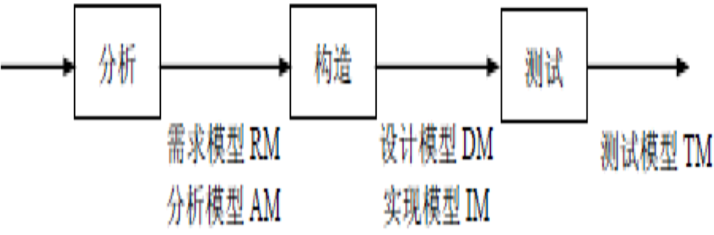
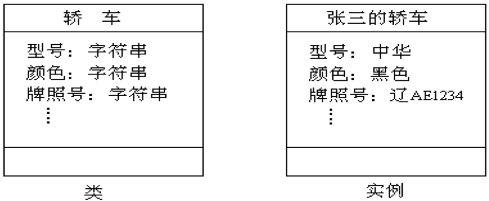
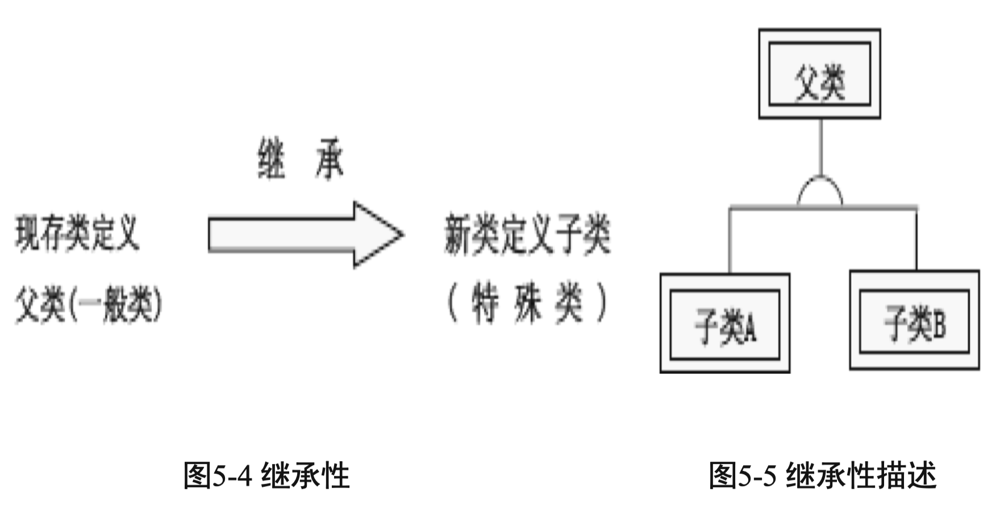

# 面向对象方法概述

面向对象方法（OOM）是面向对象技术在软件工程中的全面运用，包括面向对象分析(OOA）、面向对象设计(OOD)、面向对象编程（OOP)、面向对象测试(OOT)和面向对象维护等方法。

## 一、面向对象方法的概念

- Coad和Yourdon为面向对象(Object Oriented,OO) 给出的定义：
  
- 具有这4个概念的软件开发方法称为面向对象方法(OOM)。
- 只有同时使用对象、类、继承与消息通信，才能体现面向对象的特征和方法。

## 二、面向对象方法的特点

- 面向对象的开发方法(Object Oriented Software Development,OOSD)是一种新的软件工程方法，其基本思想是尽可能按照人类认识世界的方法和思维方式分析和解决问题，可提供更加清晰的需求分析和设计，是指导软件开发的系统方法。
- OOSD贯穿于整个软件生命期，其中面向对象的分析与设计是面向对象开发的关键。

**OOM具有4个主要特点：**

1. 符合人类分析解决问题的习惯思维方式。
2. 各阶段所使用的技术方法具有高度连续性。
3. 开发阶段有机集成有利系统稳定。
4. 重用性好。

## 三、面向对象开发过程及范型

### 3.1 面向对象开发过程

OOM不仅是一些具体的软件开发技术与策略，而且是一整套处理软件系统与现实世界的关系并进行系统构造的软件方法学。其开发过程与其他方法不同，从问题论域开始，历经从问题提出到解决的一系列过程。

下面具体说明在开发过程中的步骤：

1. 分析阶段。
   - 论域分析
   - 应用分析
2. 高层设计。
3. 开发类。
4. 建立实例。
5. 组装测试。
6. 维护。

### 3.2 面向对象的软件开发范型

1. 传统软件开发方法主要是结构化方法。
2. 面向对象的软件开发方法按照同传统软件开发一样的步 骤，同样要经历分析、设计、编码实现和测试的生命周期。
3. 大部分面向对象软件开发模型都包括以下内容：
   1. 分析用户的需求，提炼对象。
   2. 将现实中问题领域的对象抽象成计算机软件中的对象。
   3. 分析并描述对象之间的关系。
   4. 根据用户的需求，不断地修改并完善。 

## 四、面向对象开发方法

### 4.1 OOSE方法

面向对象软件工程（OOSE）方法是1992年I.Jacobson 提出的。OOSE方法采用五类模型建立目标系统，将面向对象的思想应用于软件工程中。这5类模型为：

1. 需求模型（Requirements model, RM）
2. 分析模型（Analysis model, AM）
3. 设计模型（Design model, DM）
4. 实现模型（Implementation model, IM）
5. 测试模型（Testing mode, TM）

OOSE的开发活动主要分为分析、构造和测试三个过程，如图所示。 

### 4.2 常见的面向对象开发方法

开发方法有Coad方法、Booch方法、OMT方法和UML语言等。

1. Booch方法。
2. Coad方法。
3. OMT（Object Modeling Technique）方法。
4. UML（Unified Modeling Language）语言。

# 面向对象的相关概念

## 一、对象与类

### 1.1 对象

- 面向对象的软件系统由对象组成，复杂的对象由简单的对象组合而成。
- 对象具有三要素：对象标识、属性和服务。对象的名字称为对象标识；描述对象的静态特征是属性也称状态或数据；描述对象的动态特征是服务也称操作、行为或方法等。

 ### 1.2 封装（Encapsulation）

- 封装是对象的一个重要特性。
- 在面向对象的系统中，对象是一个封装数据属性和操作行为的实体。
- 封装有两层含义：一是对象是其全部属性和全部服务紧密结合而形成的一个不可分割的整体；二是对象如同一个密封的“黑盒子”，表示对象状态的数据和实现操作的代码都被封装在其中。

### 1.3 类（Class）和实例（Instance）

- 类也称对象类（Object Class）是对具有相同属性和服务的一组对象的抽象定义。
- 类与对象是抽象描述与具体实例的关系，一个具体的对象被称为类的一个实例。

### 【案例5-1 】 

“张三轿车”等具体对象可得到 “轿车”类，而这些具体的对象就是该类的实例。如图5-3所示。

## 二、继承及多态性

### 2.1  继承（Inheritance）

- 继承是父类和子类之间共享数据结构和方法的一种机制，是以现存的定义的内容为基础，建立新定义内容的技术,是类之间的一种关系。
- 继承有两种：单重继承、多重继承。继承性通常表示父类与子类的关系，如图5-4所示。

通过继承关系还可构成层次关系，单重继承构成的类之间的层次关系为一树状，若将所有无子类的类，都看成还有一个公共子类，多重继承构成的类之间的关系为一个网格，而且继承关系可传递。
建立继承结构的优点有3个：

1. 一是易编程、易理解且代码短, 结构清晰；
2. 二是易修改，共同部分只在一处修改即可；
3. 三是易增加新类，只须描述不同部分。

### 2.2 多态性（Polymorphism）和动态绑定（Dynamic-binding）

- 多态性是指多种类型的对象在相同的操作或函数、过程中取得不同结果的特性。多态有多种不同形式，其中参数多态和包含多态统称为通用多态，过载多态和强制多态统则称为特定多态。
- 动态绑定是多态性的基石之一。将函数调用与目标代码块的连接延迟到运行时进行，只有发送消息时才与接收消息实例的一个操作绑定。

## 三、消息与方法

###  3.1 消息与消息通信

- 消息（Message）是向对象发出的服务请求，包含信息为：提供服务的对象标识、消息名、输入信息和回答信息。
- 消息通信（Communication with messages）与对象的封装原则密切相关。

### 3.2 方法

- 方法(Method) 指在对象内的操作。方法是类中操作的实现过程,一个方法包括方法名、参数及方法体。
- 方法描述了类与对象的行为，每个对象都封装了数据和算法两个方面。

# 面向对象分析

# 面向对象设计

# 面向对象分析和设计实例

