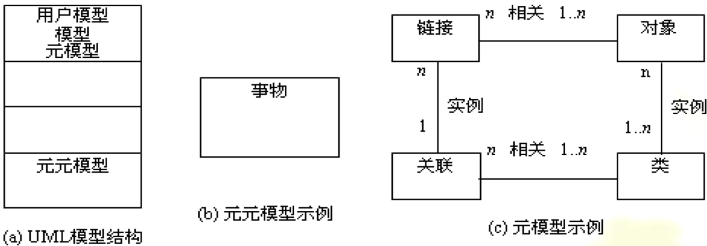

# 面向对象方法概述

面向对象方法（OOM）是面向对象技术在软件工程中的全面运用，包括面向对象分析(OOA）、面向对象设计(OOD)、面向对象编程（OOP)、面向对象测试(OOT)和面向对象维护等方法。

## 一、面向对象方法的概念

- Coad和Yourdon为面向对象(Object Oriented,OO) 给出的定义：
  
- 具有这4个概念的软件开发方法称为面向对象方法(OOM)。
- 只有同时使用对象、类、继承与消息通信，才能体现面向对象的特征和方法。

## 二、面向对象方法的特点

- 面向对象的开发方法(Object Oriented Software Development,OOSD)是一种新的软件工程方法，其基本思想是尽可能按照人类认识世界的方法和思维方式分析和解决问题，可提供更加清晰的需求分析和设计，是指导软件开发的系统方法。
- OOSD贯穿于整个软件生命期，其中面向对象的分析与设计是面向对象开发的关键。

**OOM具有4个主要特点：**

1. 符合人类分析解决问题的习惯思维方式。
2. 各阶段所使用的技术方法具有高度连续性。
3. 开发阶段有机集成有利系统稳定。
4. 重用性好。

## 三、面向对象开发过程及范型

### 3.1 面向对象开发过程

OOM不仅是一些具体的软件开发技术与策略，而且是一整套处理软件系统与现实世界的关系并进行系统构造的软件方法学。其开发过程与其他方法不同，从问题论域开始，历经从问题提出到解决的一系列过程。

下面具体说明在开发过程中的步骤：

1. 分析阶段。
   - 论域分析
   - 应用分析
2. 高层设计。
3. 开发类。
4. 建立实例。
5. 组装测试。
6. 维护。

### 3.2 面向对象的软件开发范型

1. 传统软件开发方法主要是结构化方法。
2. 面向对象的软件开发方法按照同传统软件开发一样的步 骤，同样要经历分析、设计、编码实现和测试的生命周期。
3. 大部分面向对象软件开发模型都包括以下内容：
   1. 分析用户的需求，提炼对象。
   2. 将现实中问题领域的对象抽象成计算机软件中的对象。
   3. 分析并描述对象之间的关系。
   4. 根据用户的需求，不断地修改并完善。 

## 四、面向对象开发方法

### 4.1 OOSE方法

面向对象软件工程（OOSE）方法是1992年I.Jacobson 提出的。OOSE方法采用五类模型建立目标系统，将面向对象的思想应用于软件工程中。这5类模型为：

1. 需求模型（Requirements model, RM）
2. 分析模型（Analysis model, AM）
3. 设计模型（Design model, DM）
4. 实现模型（Implementation model, IM）
5. 测试模型（Testing mode, TM）

OOSE的开发活动主要分为分析、构造和测试三个过程，如图所示。 

### 4.2 常见的面向对象开发方法

开发方法有Coad方法、Booch方法、OMT方法和UML语言等。

1. Booch方法。
2. Coad方法。
3. OMT（Object Modeling Technique）方法。
4. UML（Unified Modeling Language）语言。

# 面向对象的相关概念

## 一、对象与类

### 1.1 对象

- 面向对象的软件系统由对象组成，复杂的对象由简单的对象组合而成。
- 对象具有三要素：对象标识、属性和服务。对象的名字称为对象标识；描述对象的静态特征是属性也称状态或数据；描述对象的动态特征是服务也称操作、行为或方法等。

 ### 1.2 封装（Encapsulation）

- 封装是对象的一个重要特性。
- 在面向对象的系统中，对象是一个封装数据属性和操作行为的实体。
- 封装有两层含义：一是对象是其全部属性和全部服务紧密结合而形成的一个不可分割的整体；二是对象如同一个密封的“黑盒子”，表示对象状态的数据和实现操作的代码都被封装在其中。

### 1.3 类（Class）和实例（Instance）

- 类也称对象类（Object Class）是对具有相同属性和服务的一组对象的抽象定义。
- 类与对象是抽象描述与具体实例的关系，一个具体的对象被称为类的一个实例。

### 【案例5-1 】 

“张三轿车”等具体对象可得到 “轿车”类，而这些具体的对象就是该类的实例。如图5-3所示。

## 二、继承及多态性

### 2.1  继承（Inheritance）

- 继承是父类和子类之间共享数据结构和方法的一种机制，是以现存的定义的内容为基础，建立新定义内容的技术,是类之间的一种关系。
- 继承有两种：单重继承、多重继承。继承性通常表示父类与子类的关系，如图5-4所示。

通过继承关系还可构成层次关系，单重继承构成的类之间的层次关系为一树状，若将所有无子类的类，都看成还有一个公共子类，多重继承构成的类之间的关系为一个网格，而且继承关系可传递。
建立继承结构的优点有3个：

1. 一是易编程、易理解且代码短, 结构清晰；
2. 二是易修改，共同部分只在一处修改即可；
3. 三是易增加新类，只须描述不同部分。

### 2.2 多态性（Polymorphism）和动态绑定（Dynamic-binding）

- 多态性是指多种类型的对象在相同的操作或函数、过程中取得不同结果的特性。多态有多种不同形式，其中参数多态和包含多态统称为通用多态，过载多态和强制多态统则称为特定多态。
- 动态绑定是多态性的基石之一。将函数调用与目标代码块的连接延迟到运行时进行，只有发送消息时才与接收消息实例的一个操作绑定。

## 三、消息与方法

###  3.1 消息与消息通信

- 消息（Message）是向对象发出的服务请求，包含信息为：提供服务的对象标识、消息名、输入信息和回答信息。
- 消息通信（Communication with messages）与对象的封装原则密切相关。

### 3.2 方法

- 方法(Method) 指在对象内的操作。方法是类中操作的实现过程,一个方法包括方法名、参数及方法体。
- 方法描述了类与对象的行为，每个对象都封装了数据和算法两个方面。

# 面向对象分析

面向对象分析（OOA）的目标是获取用户需求并建立一系列问题域的精确模型，描述满足用户需要的软件。OOA所建立的模型应表示出系统的数据、功能和行为3方面的基本特征。

## 一、面向对象分析的任务

### 1.1 面向对象分析的原则

OOA阶段是获取和描述用户需求并建立问题域对象模型的过程。分析系统中所含的所有对象及其相互间的关系，为建立分析模型，应遵照5个基本原则：

1. 建立信息域模型
2. 描述功能
3. 表达行为
4. 划分功能、数据、行为模型，揭示更多的细节
5. 以早期模型描述问题实质，以后期模型给出实现细节，这是OOA的基础。

### 1.2 面向对象分析的任务

OOA的关键是定义所有与待解决问题相关的类，包括类的操作和属性、类与类之间的关系以及它们表现出的行为，主要完成6项任务：

1. 全面深入调研分析，掌握用户业务需求细节及流程
2. 准确标识类，包括定义其属性和操作
3. 认真分析定义类的层次关系
4. 明确表达对象与对象之间的关系(对象的连接)
5. 具体确定模型化对象的行为
6. 建立系统模型

## 二、面向对象分析的过程

- OOA是利用面向对象的概念和方法为软件需求建造模型，使用户需求逐步精确化、一致化、完全化的分析过程，也是提取需求的过程。
- OOA中建造的模型主要有对象模型、动态模型和功能模型3种。

## 三、对象建模技术

对象建模技术(Object Modeling Technique，OMT)用于OOA、系统设计和对象级设计。可将分析时获取的需求信息构建在对象模型、功能模型和动态模型三类模型中。

### 3.1 建立对象模型

- 对象模型是OOA最关键的模型之一，主要描述系统中对象的静态结构、对象之间的关系、对象的属性和操作。通过表示静态的、结构上的、系统的“数据"特征，为动态模型和功能模型提供基本框架，利用包含对象和类的关系图表示。
- 建立对象模型时，首先确定对象和类，然后分析对象的类及其相互之间关系。对象类与对象间的关系可分为3种：一般—特殊（继承或归纳）关系、聚集（组合）关系和关联关系。
- 对象模型描述系统的静态结构包括：类和对象，它们的属性和操作，以及它们之间的关系。构造对象模型的目的是找出与应用程序密切相关的概念。

#### 【案例5-2】

对象模型以包含的对象及其关系图表示。在对象模型中用于表示“类、类的关联关系和链属性”的图形符号，分别如图5-7所示中(a)、(b)和(c)。其中，类的关联关系反映对象之间相互依赖及作用关系，链属性是关联中链（实例对象间的物理或概念上的连接）的性质。

使用OMT建立对象模型的主要步骤为：

1. 确定对象类。通过分析确定所有的对象类。
2. 定义数据词典。主要用于描述类、属性和关系。
3. 组织并简化对象类。通过继承进行组织和简化对象类。
4. 测试访问路径。测试所有的访问路径。
5. 对象分组建立模块。

### 3.2 建立动态模型

- 动态模型主要用于系统的控制逻辑，注重对象及其关系的改变，描述涉及时序和改变的状态。动态模型包括状态图和事件跟踪图。
- 建立动态模型的主要步骤为：
  1. 准备场景：为典型的交互序列准备好场景。
  2. 建立事件跟踪图：确定对象之间的事件，为每个场景建立事件跟踪图。
  3. 绘制出事件流程图：为每个系统准备一个事件流程图。
  4. 建立状态图：为具有重要动态行为的类建立状态图。
  5. 校验：检验不同状态图中共享的事件的一致性和完整性。

#### 【案例5-3】宾馆信息系统中旅客和床位的状态转换图。如下图所示。 

旅客的状态转换图

床位在系统中的状态转换图

### 3.3 建立功能模型

- 功能模型用于系统内部数据的传送和处理。功能模型表明，经过处理从输入数据能得到具体的输出数据，但忽略参加处理的数据以何时序执行。功能模型由多个数据流图组成，指明从外部输入，通过操作和内部存储，直到外部输出的整个数据流情况。
- 功能模型还包括了对象模型内部数据间的限制。
- 功能模型中的数据流图可形成一个层次结构，建立功能模型的主要步骤为：
  1. 确定输出和输出值；
  2. 用数据流图表示功能的依赖性。
  3. 具体描述每个功能；
  4. 确定具体限制。
  5. 对功能确定优化的准则。

## 四、UML概述

UML（Unified Modeling Language）是一种定义良好、易于表达、功能强大且普遍适用的结构化建模语言。

### 4.1 UML组成

UML综合OOM使用的各种图形描述的技术，旨在给出这些图形描述的语法和语义的语言，是一种标准的图形化（即可视化）建模语言。从语法语义上，UML由图和元模型构成，图是UML的语法，而元模型给出图的含义成为UML语义。

#### 4.1.1 UML的体系结构

- UML的体系结构如图5-11所示。从体系结构上，UML由三部分组成：基本构造块、规则和公用机制。
- 其中基本构造块又包括3种类型：事物、关系和图。
- 事物划分为４种类型：
  - 结构事务
  - 行为事务
  - 注释事务
  - 分组事务

#### 4.1.2.UML模型元素

UML是专门设计的一种统一描述面向对象方法的符号系统。

##### 4.1.2.1 UML的语义

语义定义在一个四层（抽象级别）建模概念框架中：UML的基本元模型层、元模型层、模型层、用户模型层。

##### 4.1.2.2 UML模型元素

UML定义了两类模型元素。一类模型元素用于表示模型中的某个概念，如类、对象、用例、结点、构件、包、接口等；另一类模型元素用于表示模型元素之间相互连接的关系，主要有关联、泛化（表示一般与特殊的关系）、依赖、聚集（表示整体与部分的关系）等。模型元素图形表示如图5-12所示。

##### 4.1.2.3 UML模型图及表示法

- 常用的UML模型图有五类图（共9种图形）来定义UML的主要内容：用例图、静态图（类图、对象图）、行为图（状态图、活动图）、交互图（顺序图、协作图）、实现图（构件图、配置图）。
- 类图、对象图、构件图、配置图用于描述系统的静态结构。
- 描述软件系统动态特性使用5种图：用例图、顺序图、协作图、状态图和活动图。

通过下表可见UML的视图及其所包括的图及与每种图有关的主要概念。

**【注意】**容易混淆的是有时也将图称为模型，因为两者都包含一组模型元素的信息。这两个概念的区别是，模型描述的是信息的逻辑结构，而图是模型的特殊物理表示。

#### 4.1.3 UML模型结构

根据UML语义，UML模型结构可分为元元模型、元模型、模型和用户模型四个抽象层次结构，如图5-13所示。层次关系是下一层为上一层的基础，上一层为下一层的实例。

### 4.2 UML模型及建模规则

OOM主要有4种模型：

1. 用例模型
2. 静态模型
3. 实现模型
4. 动态模型

UML建模规则包括对以下内容的描述：

1. 名字：任何一个UML成员都必须包含一个名字。
2. 作用域：UML成员所定义的内容起作用的上下文环境。
3. 可见性：UML成员能被其他成员引用的方式。
4. 完整性：UML成员之间互相连接的合法性和一致性。
5. 运行属性：UML成员在运行时的特性。

### 4.3 UML特点及应用

1. UML的特点，主要包括：
   1. 统一的标准，易使用，可视化，表达力强，易于在不同背景的人员之间进行交流。
   2. UML可运用于任何软件开发过程，各种模型都可采用UML建模。
   3. UML内部有扩展机制，可以对一些概念进行进一步地扩展。
   4. UML的一个最重要的特征是用于建模。 
   5. 模型可视化。
2. 使用准则：使用准则主要包括：选择使用合适的UML图，只对关键事物建立模型，分层次地画模型图，模型应具有协调性，模型和模型的元素大小适中。
3. 应用领域：建立用例模型主要是识别角色和用例，给出系统用例视图（可以分层次的）描述和每个用例的实例脚本（文字）描述。UML中，用例视图由角色、用例、关联和系统边界组成。