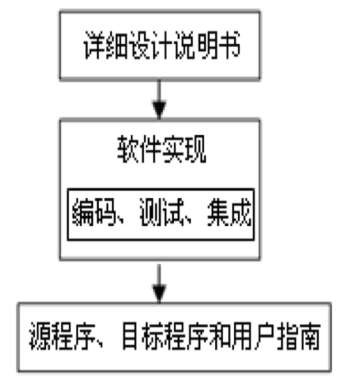
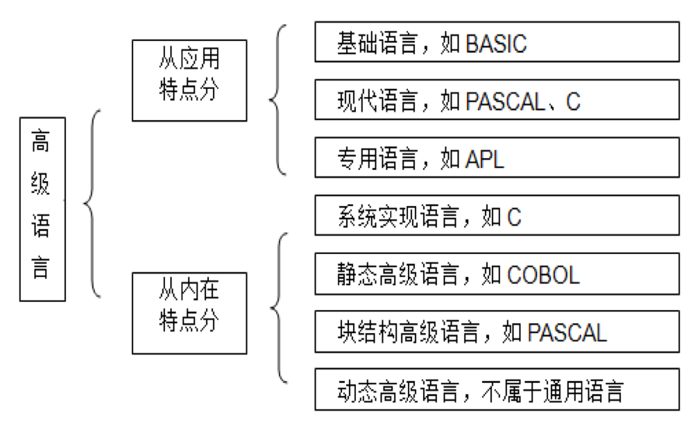
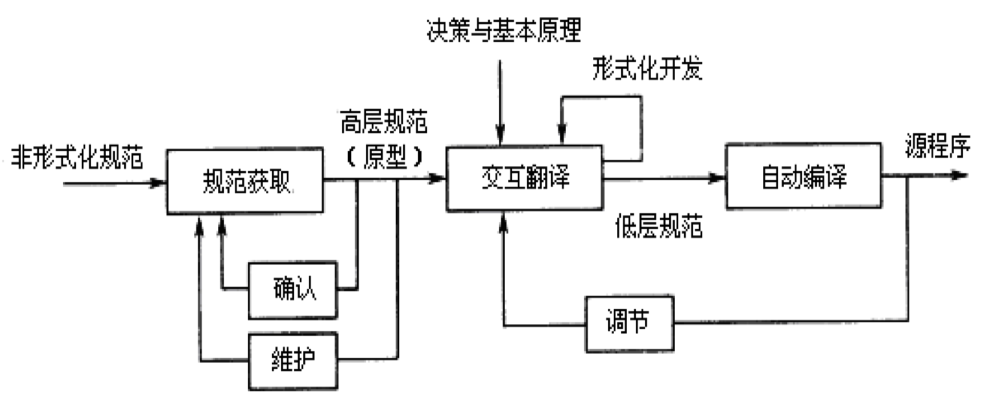

# 软件实现技术概述

软件实现阶段主要任务是将详细设计的结果转换为计算机程序。
解决的主要问题：软件实现的过程、任务、原则及策略，程序设计语言的特性及选择的原则和程序设计风格等。

## 一、软件实现的过程及任务

### 1.1 软件实现的过程

- 在微观上，软件实现是指通过编程、调试、单元与集成测试、系统集成等创建软件产品的过程。
- 软件实现的输入是《详细设计说明书》，输出是源程序、目标程序和用户指南。

### 1.2 软件实现的任务

- 软件编程的任务是对“详细设计”的工作进行具体实现，形成计算机可运行的程序。
- 软件实现工作量根据项目性质及规模不同，在整个软件开发过程中约占30%-50%。

## 二、软件实现的准则

### 2.1 面向对象实现的准则

实现的准则主要包括：

1. 高可重用性
2. 高可扩充性
3. 高可靠性及健壮性

### 2.2 其他软件实现方法的准则

对于其他软件实现方法，主要遵循5个准则：

1. 精简编程。
2. 便于验证。
3. 适合更新扩充。
4. 遵守编程规范。
5. 选择熟悉的语言及工具。

## 三、软件实现策略与管理

1. 软件实现的策略，开发策略主要有3种：
   1. OOP开发策略。
   2. 自顶向下策略。
   3. 自底向上策略。
2. 软件实现的管理
3. 编程框架：编程框架主要是软件的基础构架，为应用程序所包含的业务对象、数据访问和界面逻辑中的基类。编程框架可由建模工具根据设计模型通过正向工程直接生成。
4. 软件实现有关问题
5. 版本控制：软件一般具有中间版本、α版本、β版本、发布版本和维护版本等，以不同标号标识。

# 软件程序设计

## 一、程序设计语言概述

### 1.1 程序设计语言的概念
程序设计语言是人与计算机交流的工具。编写程序的过程也被称为编程或编码，是根据软件分析和设计模型及要求，编写计算机理解的运行程序的过程。

### 1.2 程序设计语言的发展（略）

### 1.3 程序设计语言的分类

程序设计语言种类很多，可从不同角度分类。

1. 从语言层次方面:有面向机器的语言和面向问题的语言两大类。
2. 从语言适用性方面:可分为通用语言和专用语言两类。
3. 从语言面向方面:可分为面向过程语言和OOL两类。
4. 从应用领域:可分为科学计算、数据处理、实时处理和人工智能等 。
5. 从语言级别上:可分为低级语言和高级语言。

- 从应用特点分，高级语言又可分为基础语言、现代语言和专用语言3类。
- 从语言的内在特点分，高级语言还可分为系统实现语言、静态高级语言、块结构高级语言和动态高级语言等4类。

## 二、程序设计语言的选择

1. 选择程序设计语言的准则：选择程序语言主要考虑的因素和准则，包括6个方面：
   1. 适合软件应用领域
   2. 利于软件运行环境
   3. 软件开发人员熟悉
   4. 有助于性能实现
   5. 算法和计算复杂性简便
   6. 数据结构的复杂性低
2. 优先选取高级语言
   1. 在选择与评价时，先查看问题需求，权衡其要求及其重要性，然后有针对性地根据其特性选取程序设计语言。合适的程序设计语言可使编程简便、测试量少、阅读和维护容易。
   2. 通常优先选择高级语言，主要因为高级语言明显优于低级语言。
3. 尽量选取OOL
4. 选取程序设计语言标准，主要有两大方面：
   1. 理想化标准，主要体现在3个“有利于”：
      1. 有利于实现的优质高效。
      2. 有利于实现功能性能及可靠性。
      3. 有利于降低软件开发及维护成本。
   2. 实用性标准：选取程序语言不仅限于理论标准，应兼顾实用要求。
      1. 程序语言自身特性。
      2. 软件的应用领域。
      3. 软件开发环境。
      4. 软件开发方法。根据其特点，应考虑3个方面：
         1. 语言的发展前景。
         2. 类库的可扩展性。
         3. 开发环境。
      5. 编程人员的熟悉情况。 
      6. 算法和数据结构的复杂性。
      7.  软件可移植性要求。

## 三、常用程序设计方法

### 3.1 模块化程序设计

模块化程序设计思想是在进行程序设计时将一个大程序按照功能划分为若干小程序模块，每个小程序模块完成一个确定功能，在这些模块之间建立必要的联系，通过模块的互相协作完成整个功能。

### 3.2 结构化程序设计

结构化程序设计（Structured Programming，SP）是以模块功能和处理过程设计为主的详细设计过程。是软件发展的一个重要里程碑。SP方法是达到这一目标的重要手段。主要具有以下特点：

1. 自顶而下，逐步求精。
2. 结构化的程序由且仅由顺序、选择、循环三种基本控制结构组成，既保证了程序结构清晰，又提高了程序代码的可重用性。

### 3.3 OOP设计

1. OOP设计思想：是为了解决面向过程程序设计中存在的功能与数据分离而引起的程序复杂性问题而设计的。与SP相比，更易于实现对现实世界的描述。通过对象机制来封装处理与数据，以控制程序的复杂度，通过继承提高程序可重用性和软件开发效率。
2. OOL：OOL是以对象作为基本程序结构单位的程序设计语言，用于描述的设计是以对象为核心，对象是程序运行时的基本成分。语言中提供了类、封装、继承、消息等机制。

## 四、编程规范及风格

编程风格是在长期的编程实践中形成的一套独特的习惯做法和方式。优良的编程风格可以减少编程错误，提高可读性和维护效率。

### 4.1 好程序的标准

略

### 4.2 编程规范及风格

规范是“做什么”的形式化描述。程序用于阅读是其主要目的之一，可通过养成良好的编程风格解决阅读性差的问题。主要应该遵循以下规范及风格。

1. 源程序文档化,源程序文档化应注意以下3个方面。
   1. 标识符命名。
   2. 程序注释。
   3. 标准的书写格式。参见【案例6-3】
2. 数据说明
3. 语句构造:构造程序语句是编程阶段的基本任务。其主要原则是简单直接，不应为追求效率而使代码复杂化。
4. 输入和输出:输入输出信息与用户的应用直接相关。对用户输入输出的方式和格式应尽可能操作简捷、界面便利。

# 常用程序设计工具

## 一、常用集成开发环境

- Visual Studio和Visual Studio.Net是Microsoft公司推出的Windows下的集成开发环境，可开发Window DNA和IIS Web Application。包括多种语言及相应的项目工具，如配置管理工具等。
- Delphi是美国Borland公司开发的工作在Windows平台下的一个集成开发环境(IDE)，其前身是DOS下的Borland Pascal。IDE使用的是由传统Pascal语言发展而来的Object Pascal语言。本质上是一个代码编辑器而不是一种语言。
- Visual Age for Java是IBM公司开发的Java IDE开发环境。对于IT开发者和业余的Java编程人员都很有用。

## 二、编码管理系统及编译程序

1. 编码管理系统
   1. 编码管理系统是具有连接程序、管理操作系统，维护源程序、目标程序、文件及数据库等信息的综合管理系统。一个大型软件开发项目通常由多个程序员编程，程序分别放在不同的文件或程序库中，可能既有源程序又有目标程序。
   2. 大型软件系统开发的重要环节是开发软件工具，自动完成上述编码管理工作。利用MAKE程序能保持模块间的协调关系。SCCS的目的是维护目标系统的多个版本，且无编码重复。
2. 编译程序：编译程序是各种高级程序语言特定的，以程序模块为单位，将源程序生成目标编码的系统软件。

## 三、软件生成技术

1. 由需求导出程序设计
2. 复用型程序设计
3. 自动化程序设计模式

基于知识的、扩展的自动化程序设计模式，实现方案如图6-3所示。

# 软件实现的文档

## 一、实现文档的组成及要求

1. 实现文档的组成及要求
   1. 软件实现文档由源程序清单和用户指南组成。
   2. “用户指南”主要包括“用户安装手册”和“用户使用手册”（或称“软件使用说明”）。在特殊情况下，如数据库服务器上的存储管理、数据维护、数据备份、数据传输等问题较复杂时，在用户指南中还要增加“系统管理员手册”的内容。
2. 软件实现管理文档：软件实现管理文档主要包括：用户指南评审报告、模块源程序行统计表（行/模块名）、源程序工作量统计表（行/人天）、评审和鉴定记录等。

## 二、用户指南编写

1. 用户指南编写要求
   1. 以统一确定的标准规范方法和风格，描述软件产品提供的所有功能。
   2. 选用统一编写工具Word等，按照标准模板及格式进行编写。
   3. 规范术语。术语部分包括系统术语和基本概念。
   4. 语言简洁明确，表达准确。
   5. 指南模板及格式应统一规范。
2. 用户指南的排版
3. 用户指南的编写原则
4. 用户使用手册编写模板