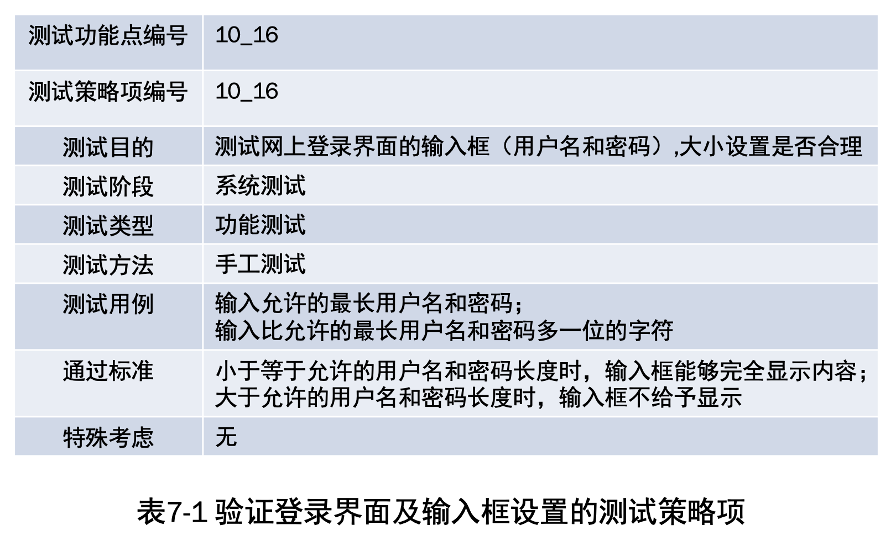
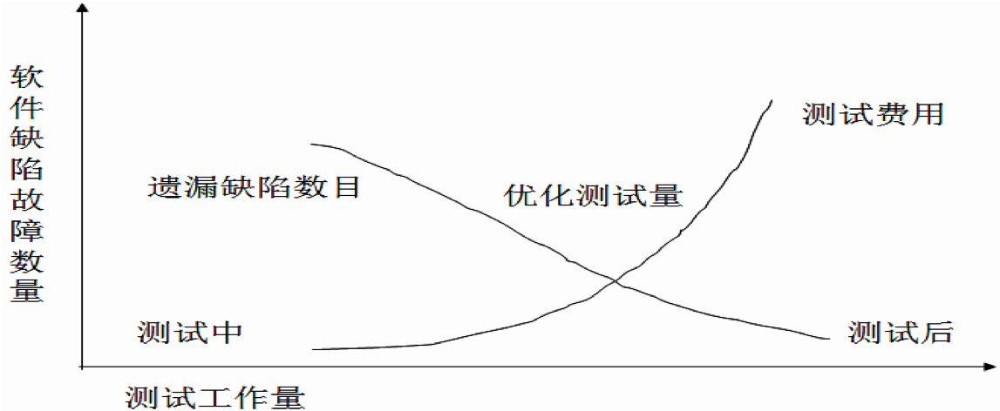

# 软件测试概述

## 一、软件测试的概念及内容

### 1.1 软件测试的定义

软件测试（Software test）的定义是：在规定的条件下对程序进行操作，以发现程序错误，衡量软件质量，并对其是否能满足设计要求进行评估的过程；是利用特定的技术和方法，运行、评价和验证软件满足需求或识别结果的过程；也是一种检测软件的正确性、完整性、安全性和品质的过程。

IEEE对软件测试定义为：使用技术手段运行或检测软件系统的过程，目的在于检验是否满足规定的需求或搞清预期结果与实际结果之间的差别。
软件测试的定义可从5方面进一步理解：

1. 从软件测试目的方面。
2. 从软件开发方面。
3. 从软件工程方面。
4. 从软件测试性质方面。
5. 从软件质量保证方面。

### 1.2 软件测试的主要内容

- 软件测试重点是测试软件的功能、性能和可靠性等是否符合用户需求指标，其中，“功能测试”是软件测试的最主要任务。软件测试分为系统软件测试和应用软件测试。

- 软件测试的主要内容包括：编制测试计划、编写测试用例、准备测试数据、编写测试脚本、实施测试、测试评估等多项内容的正规测试。
- 测试方式则由单纯手工测试发展为手工与自动兼用，并向第三方专业测试公司方向发展。

## 二、软件测试的目的和原则

### 2.1 软件测试的目的

软件测试的目的是：尽可能多的找到软件中的错误，而不是证明软件的正确。Grenford J. Myers在《软件测试技巧》一书中指出软件测试目的：

1. 测试是为了发现程序中的错误而执行程序的过程。
2. 好的测试方案很可能使测试发现尚未发现的错误。
3. 成功的测试是发现了尚未发现的错误的测试。

一般软件测试对象存在的“缺陷/错误”，主要分为如下3种：

## 2.2 软件测试的原则

在软件测试过程中，应坚持8项原则：

1. 认真执行测试计划。
2. “尽早和不断地进行软件测试/评审”。
3. 优选测试工具、技术及方法。
4. 精心设计测试用例。
5. 交叉进行软件检测。
6. 重点测试群集现象。
7. 全面检查并分析测试结果。
8. 妥善保管测试文档。

# 软件测试的特点及过程

## 一、软件测试的特点

1. 软件测试的成本很大。
2. 不可进行“穷举”测试。 
3. 测试具有“破坏性” 
4. 软件测试是整个开发过程的一个独立阶段，并贯穿到开发各阶段。

### 【案例7-1】

程序P有两个整型输入量X、Y，输出量为Z，如图7-1所示。若在32 位机上运行，则所有的测试数
据组(Xi,Yi )的数目为：$2^32 \times  2^32 = 2^64$。假设测试１毫秒执行１次，如果进行完全测试，则一共需要５亿年。   

## 二、软件测试的过程

- 对软件进行测试，总体过程由测试到结果分析，再到排错及可靠性分析，如图7-2所示。
- 在主要测试过程中，需要三类输入：软件配置，测试配置，测试工具。

软件测试工作的流程。其实与软件开发及验收各阶段密切相关，主要对应的软件测试流程，如图7-3所示。

# 软件测试步骤及任务

- 软件测试需要在明确具体测试目标的基础上，具体确定测试原则、测试计划、测试方案、测试技术、测试方法和用例等。
- 通常具体的软件测试分为单元测试、集成测试、有效性（确认）测试和系统测试4个步骤，最后进行验收测试，如图7-4所示。

软件专项测试工作可从概要设计阶段开始，如图7-5所示，整个测试分为两个大的阶段：

预测试和测试。本章只考虑测试阶段的工作，在具体进行实际测试时，有些步骤可以合并，例如功能测试与系统测试。

软件的单元测试也称为模块测试，是对功能独立运行的程序模块的检测。目的是发现各模块内部可能存在的各种问题，保证功能和性能等方面达到用户需求。

## 一、单元测试及任务

### 1.1 单元测试的内容和任务

软件单元测试的主要内容包括：单元模块内和模块之间的功能测试、容错测试、边界测试、约束测试、界面测试、重要的执行路径测试，单元内的业务流程和数据流程等。

### 1.2 单元测试技术要求及准则 

**单元测试主要技术要求应达到：**

1. 在被测试单元中，80%以上可执行的程序模块都被一个测试用例或异常操作所覆盖，即脚本覆盖率至少应当达到80%。 
2. 被测单元中分支语句取真或假时，至少80%的分支应当执行一次，即分支覆盖率应当达到 80%以上。 
3. 80%被测单元中的业务流程和数据流程，至少被一个测试用例、一个异常数据一次异常操作所覆盖，即异常处理能力达到 80%以上。  

**软件的单元测试通过准则，主要达到3项：**

1. 单元的具体功能指标要求与设计及需求一致。
2. 单元的接口指标要求与设计及需求一致。
3. 正确处理、输入和检测发现异常运行中的错误；并在单元发现问题进行修改以后，还需要进行回归测试，之后才能进行下一阶段工作。

### 1.3 单元测试的输入/输出

- 单元测试工作的输入为：“程序源代码”和“软件详细设计报告”；
- 单元测试结束的输出为：“程序单元测试记录”和“软件测试计划”等。 

## 二、集成测试与集成

集成测试是根据软件的体系结构，在单元测试的基础上，将测试过的模块进行集成组合及测试，检查程序结构及功能等方面的正确性和一致性。

### 2.1 集成测试的方式

一般将模块集成为系统的方式主要有两种：

1. 一次性集成及测试：软件的一次性集成也称为集中式或整体式拼装。是一种在对各模 块分别测试后，再将所有各模块集成一起进行测试，最后得到满足要求的软件产品的集成方式。
2. 增殖式集成及测试：增殖式集成也称为渐增式集成，包括以下3种方式。
   1. 自顶向下增殖测试
   2. 字底向上增殖测试
   3. 混合增殖式测试

上述增殖式集成方式各有其优缺点。

### 2.2 集成测试的任务及要求

### 2.2.1 集成测试内容及任务

软件集成测试的主要内容包括：系统集成后的功能测试、业务流程测试、界面测试、重要的执行路径测试、容错测试、边界测试、约束测试及接口测试等。

集成测试的具体任务：

1. 各模块连接时，经过模块接口的数据丢失情况。
2. 某一模块的功能对另一个模块的功能的不利影响。
3. 各模块或子系统功能的组合，达到预期需求的集成子系统/系统功能情况。
4. 全局数据结构是否有问题。
5. 单个模块的误差累积后情况，是否会放大能否可以接受。
6. 单个模块的错误对数据库的影响。 

- 集成测试的职责分工： 由测试人员负责进行该阶段的具体测试工作，并对 测试结果进行详细的记录和分析，完成测试文档。
- 集成测试工作的输入：“集成测试计划”、“概要设计”、“测试大纲”。
- 集成测试结束的输出：“集成测试bug记录”、“集成测试分析报告”。

### 2.2.2 集成测试技术要求及准则

软件集成测试的技术要求，主要包括6个方面： 

1. 验证被测系统满足设计要求情况；
2. 以数据处理测试用例对被测系统的输入、输出、处理进行检  测，以达到设计要求；
3. 利用业务处理测试用例对被测系统的业务处理过程进行测试，以达到设计的要求；
4. 测试软件正确处理的能力和容错能力所达到的标准；
5. 确认模块之间无错误连接；
6. 测试软件对数据、接口错误、数据错误、协议错误的识别及处理符合标准。 

集成测试通过的准则，包括以下5个方面： 

1. 各单元之间无错误连接。
2. 达到软件需求的各项功能、性能、可靠性等方面的指标要求。
3. 对偶发的错误输入有正确的处理能力。
4. 对测试中的异常问题有合理的提示反馈。
5. 人机界面及操作友好便捷。

### 2.2.3 软件集成及内容

- 系统集成是将各软件构件以及子系统组装整合成为完整软件，并与软件平台和其他相关系统进行调配、整合的过程。软件（产品）是由多模块（或对象）组成的软件系统。
- 软件集成的任务是按照软件体系结构设计的要求，将各软件构件和子系统整合为一个完整的软件系统。

## 三、有效性测试及内容

有效性测试也称确认测试。主要经过检测确认已实现的软件是否满足“软件需求规格说明书”各种需求和软件配置的合理性。其任务是验证软件的有效性，即软件的功能和性能及其他特性是否与用户的要求一致，以便于进行系统测试及交付。

### 3.1 有效性测试内容及步骤

- 有效性测试的主要内容包括：系统性的初始化测试、功能测试、用户需求确认、业务处理或数据处理测试、性能测试、安全性测试、安装性测试、恢复测试、压力测试等。
- 有效性测试的职责分工是：由测试人员负责测试工作，对测试过程及结果进行认真详细的记录和分析，并完成测试文档。
- 有效性测试工作的输入为：”软件测试计划”、”用户需求分析报告”、”用户操作手册”和”安装手册”。
- 测试结束的输出为：”软件测试bug记录”和”软件测试分析报告”。

有效性测试阶段主要工作如下图： 

### 3.2 有效性测试的技术要求 

有效性测试的主要技术要求，侧重以下8个方面： 

1. 用户需求确认。
2. 以数据处理测试用例对被测系统的输入、输出、处理进行测试，以达到需求要求。
3. 利用业务处理测试用例对被测系统业务处理过程进行测试，达到用户需求各项要求。
4. 响应时间测试。
5. 安装性测试。
6. 安全性测试
7. 恢复性测试
8. 压力测试

通过有效性测试的准则，体现在以下6个方面： 

1. 满足用户在软件需求中提出的功能、性能等各项指标要求； 
2. 软件安全性满足用户的具体需求标准；
3. 系统的负载能力满足用户的具体指标要求；
4. 与外界支持系统能够正常运行；
5. 稳定性等满足用户的各项需求；
6. 用户操作手册易读、易懂和易操作。

## 四、系统测试及验收

- 系统测试是指将有效性测试后的软件，逐步从模拟运行环境切换到实际运行环境中，与其他系统资源和环境合成进行的实际检测。
- 通常，系统测试任务包括以下4个方面：       
  - 恢复测试
  - 安全测试
  - 强度测试
  - 性能测试
- 系统测试的重点主要检查如下3个方面：
  1. 系统的整体调度功能是否正常。
  2. 系统的功能是否符合软件分析和总体设计的要求。
  3. 系统的数据组织与存储是否符合设计的要求。
- 系统测试主要通过与用户需求指标进行详尽对比，查找软件与指标符合要求情况。其方法一般采取黑盒测试。

# 软件测试策略及面向对象测试

## 一、软件测试策略

### 1.1 软件测试策略的特征

软件测试策略是指软件测试的思路模式，也是采用特定测试用例技术和方法的重要依据。如遵循从单元测试到最终的功能性测试和系统性测试等。 

软件测试策略，具体包含5个特征：

1. 测试从模块层开始，然后扩大延伸到整个系统。
2. 不同的测试技术适用于不同的时间点。
3. 对于大型系统测试，由软件的开发人员和独立的测试组进行管理。
4. 测试和调试是不同的活动，但调试必须能够适应任何的测试策略。
5. 充分考虑以下特性，有利于测试策略更科学合理、优质高效。

### 1.2 软件测试策略的内容

- 测试策略的主要内容包括：测试目的、测试用例、测试方法、测试通过标准和特殊考虑。
- 每个测试功能点都应定义一种测试策略，称为一个测试策略项，测试策略项中包括了详细的测试信息。

#### 【案例7-2】在图书管理信息系统中，需要定义验证登录界面，输入框设置是否合理的测试策略项。如表7-1所示。

### 1.3 估计测试工作量

软件测试的复杂性主要原因是：
     
1. 根本无法对程序进行完全测试。
2. 测试根本无法显示潜在的软件缺陷和故障。
3. 存在与发现的故障数量成正比。
4. 无法修复全部软件问题。 
5. 软件测试的代价。

一个软件测试项目的工作量的计算方法为：$\sum\limits_{j=1}^n\sum\limits_{i=1}^m$测试活动ij所需时间

## 二、面向对象软件测试

1. 面向对象测试的特点
2. 面向对象的单元测试
3. 面向对象的集成测试 
   - 通常，面向对象的集成测试需要进行两级集成：
     1. 将成员函数集成到完整类中。
     2. 集成类与其他类。
   - 对面向对象的集成测试有两种不同的策略：
     1. 基于线程的测试。
     2. 基于使用的测试。
4. 面向对象的有效性测试

# 测试方法、用例及评审

## 一、软件测试方法

### 1.1 黑盒测试

- 黑盒测试也称为功能测试或黑箱测试，其盒是指被测试的软件，“黑盒”则指测试人员只知道被测软件的界面和接口外部情况，不必考虑程序内部逻辑结构和特性，只根据程序的需求分析规格说明，检查其功能是否符合。
- 以黑盒测试发现程序中的错误，应在所有可能的输入条件和输出条件中确定测试数据，检查程序是否都能产生正确输出。
- 黑盒测试主要检测的错误/问题包括：功能不正确/被遗漏、界面错误、数据结构/外部数据库访问错误、性能错误、初始化/终止错误。
- 测试模块之间的接口，适合采用黑盒测试，适当辅以白盒测试，以便能对主要的控制路径进行测试。
- 常用的几种黑盒测试技术方法为：
  1. 等价分类法
     1. 划分等价 
     2. 设计测试用例
  2. 边界值分析法,边界值分析法主要包括6个方面：
     1. 测试数据。
     2. 输出条件。
     3. 输入边界数据。
     4. 有序集测试用例。
     5. 内部数据结构边界值。
     6. 其他边界条件。

**【案例7-3】“考试成绩”模块输入条件规定输入值的范围 (如“数据值”从0到 100 ),则可划分一个合理等价类(1且100的数)和两个不合理等价类(<0, 或>100的数)。**

### 1.2 白盒测试

- 白盒测试主要是对程序内部结构执行路径的测试，也称透明盒测试、开放盒测试、结构化测试、基于代码测试和逻辑驱动测试等。
- 测试人员将测试对象看作一个打开的盒子，搞清软件内部逻辑结构和执行路径后，利用其结构及有关信息设计测试用例，对程序所有逻辑路径进行测试，以检测不同点检查程序的实际状态与预期状态一致性。

#### 1.2.1 白盒测试的原则

通常，白盒测试的原则，主要检测以下4个方面：

1. 模块中每一个独立的路径至少执行一次。
2. 所有判断的每一个分支至少执行一次。
3. 每个循环都在边界条件和一般条件下至少执行一次。
4. 所有内部数据结构的有效性。

#### 1.2.2 白盒测试技术

利用白盒测试技术，主要有以下3种：

1. 逻辑覆盖测试
2. 循环测试
3. 基本路径测试

#### 1.2.3 白盒测试的步骤及优缺点

- 白盒测试的步骤为：根据详细设计/源程序代码导出程序流图、计算环路复杂性、确定线性独立的基本路径集、设计测试用例。
- 白盒测试的优点是：迫使测试人员去仔细思考软件的实现；可以检测代码中的每条分支和路径；揭示隐藏代码中的错误；对代码的测试较彻底。
- 其缺点是：无法检测代码中遗漏的路径和数据敏感性错误，而且难以验证具体规格的正确性。与黑盒测试法优缺点及应用范围比较如表7-2所示。

|项目|黑盒测试法|白盒测试法|
|---|---|---|
|规划方面|功能测试|结构测试|
|优点方面|能确保从用户的角度出发进行测试|能对程序内部的特定部位进行覆盖测试|
|缺点方面|无法测试程序内部特定部位； 当规格说明有误，则不能发现问题|无法检查程序的外部特性；  无法对未实现规格说明的程序内部欠缺部分进行测试|
|应用范围|边界分析法 等价类划分法 决策表测试|语句覆盖，判定覆盖，条件覆盖，判定/条件覆盖，路径覆盖，循环覆盖，模块接口测试

### 1.3 灰盒测试

白盒和黑盒测试方法各有所侧重及特点不可替代。灰盒测试则是介于白盒测试和黑盒测试之间的测试。
 
### 1.4 易用性测试

易用性测试目的明确，标准不易确定。涉及的范围较广，如安装易用性、功能易用性、界面易用性，特别可以含有听力、视觉、运动及认知有缺陷的客户体现的易用性。

### 1.5 负载/压力测试

对于软件运行的最低配置或最低资源需求，可通过减少软件需要的资源（内存、存储空间、网络资源等）进行测试，而且，可正常提供软件需求的资源，并不断加载软件处理的任务，来测试软件在正常配置下的能力指标。   

### 1.6 兼容性测试

兼容性测试主要检测不同软件之间或软件与硬件/数据之间的兼容性。如应用软件与操作系统、数据库、中间件、浏览器和其他支撑软件的兼容性，同一软件不同版本之间或对不同数据格式的兼容性等。

### 1.7 回归测试

回归测试是指软件修改之后，为保证其修改的正确性，重新使用原有测试用例执行的测试方法。

### 1.8 边界值测试

一些专门针对软件需要从外界（客户、接口程序）获取数据的地方，提供数据的边界值，验证程序是否对边界值进行正确或合理的处理。
 
### 1.9 α测试和β测试

α测试由用户在开发者的场所进行，而且在开发者对用户的“指导”下进行测试； β测试由软件的最终用户在客户场所（如网络下载试用）进行，开发者通常不在测试现场。

### 1.10 基于Web的系统测试方法

## 二、软件测试用例设计及方法

### 2.1 测试用例概念及意义

测试用例（Test Case）是为某个特殊目标而编制的一组测试输入数据、执行条件和预期结果，目的是测试某个程序路径或核实是否满足某个特定需求。主要是指对一项特定的软件产品进行测试任务的描述，包括测试方案、方法、技术和策略等。

### 2.2 测试用例设计要点

测试用例包括3种：

1. 基本事件
2. 备选事件
3. 异常事件

设计测试用例要点，主要包括以下5个方面： 

1. 测试需求的测试用例 　　
2. 测试输入/输出的用例
3. 测试用例内容及设置，测试用例内容包括：测试目标、测试环境、测试步骤、预期结果、输入数据、测试脚本等，并形成文档。
4. 测试用例的评审
5. 测试用例的管理 

### 2.3 测试用例设计方法与技巧

设计测试用例方法：

#### 2.3.1 测试用例归类法

主要先将几个项目列为主要模块，然后将不同的测试用例归纳于模块中。如图7-8所示。

《信息技术软件产品评价质量特性及其使用指南》，将软件质量定义为：软件质量是与软件产品满足明确或隐含需求的能力有关的特征和特性的总和。

软件质量主要包括4个方面：

1. 满足软件需要的全部特性。
2. 达到所期望的各种属性的组合的程度。
3. 达到顾客或用户觉得能满足其综合期望的程度。
4. 在使用时，软件的组合特性能够达到满足顾客预期要求的程度。 

- 实际上，软件质量特性可分解为多个子特性。
- 主要包括六个方面：功能性、可靠性、易用性、效率、可维护性和可移植性。

#### 3.1.2 软件测试的主要标准

略

## 四、软件测试文档

软件测试主要文档为：”测试计划文档”、”测试规程文档”、”测试用例文档”、”单元测试过程”、”集成测试过程”、”软件测试报告”和”系统测试过程”等，GB/T 9386-2008《计算机软件测试文档编制规范》规定了一系列基本的计算机软件测试文档的格式和内容要求。

# 软件调试与发布

- 软件调试是在软件测试完成之后所进行的一项重要工作。
- 软件调试的任务是在软件测试的基础上进一步确认和纠正相关错误或问题。

## 一、软件调试的过程

### 1.1 软件调试的概念及特点

软件调试（Software debug）也称软件纠错，是指使用调试工具修改或去除各种软件错误的过程，也是重现软件故障（failure）并定位其根源，并最终解决软件问题的过程。

调试工作由两部分组成：

1. 定位
2. 纠错

软件调试工作的特点是：软件调试是通过现象，查找内原并修改错误的一个分析与解决问题的过程。另外调试可能还会产生“副作用”并带来新问题，必须予以高度重视。

### 1.2 软件调试过程及步骤

1. 重现问题
2. 定位根源
3. 确定解决方案
4. 验证方案

## 二、软件调试的方法

1. 强行排错，主要技术和方法包括：
   1. 内存排错
   2. 特定语句排错
   3. 自动调试工具
2. 回溯法排错
3. 归纳法排错
4. 演绎法排错，用演绎法排错，主要有以下4个步骤：
   1. 列举假设。
   2. 排除不正确假设。
   3. 进一步排查定位。
   4. 证明假设。

## 三、软件调试的原则

软件调试由确定错误和修改错误两部分组成，软件调试的原则也分为两个部分。

### 3.1 确定错误性质及位置的原则

1. 认真研究征兆信息
2. 暂避难题求实效
3. 借助工具辅助手段
4. 不主观乱猜测

### 3.1  修改错误的原则

1. 注重群集现象。
2. 全部彻底修改。
3. 注意错误关联。
4. 回溯程序设计方法。
5. 不改变目标代码。

## 四、软件推广及发布

软件模块集成为完整的软件系统并调试成为正式软件产品之后，便可进行软件的推广（部署）和发布，其目的是推介软件产品及成果并转交给用户投入使用。
软件推广包括：用户培训、软件安装、准备资料，对于产品软件，还需要进行发布，并实施版本控制。

# 软件维护

