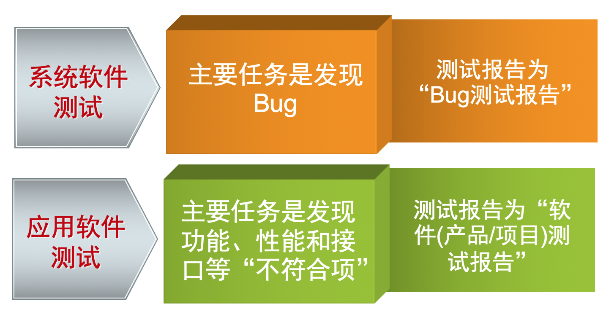
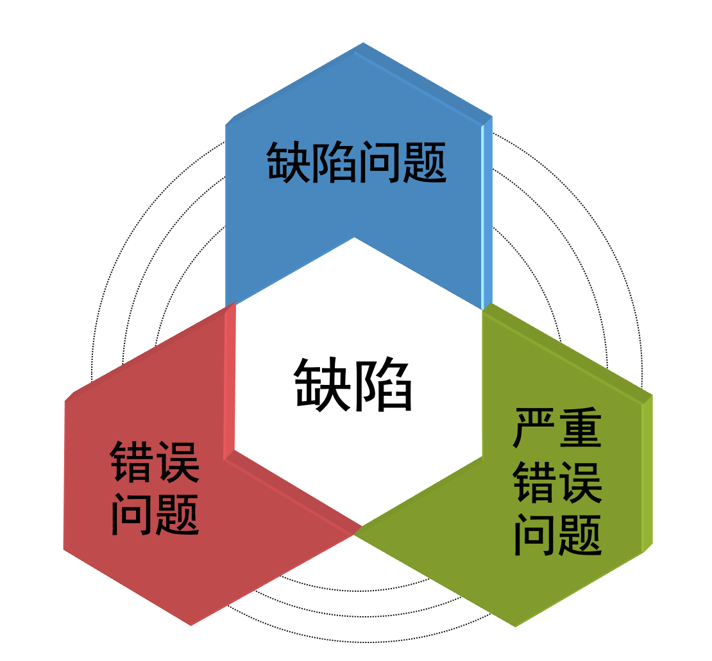
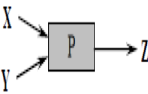
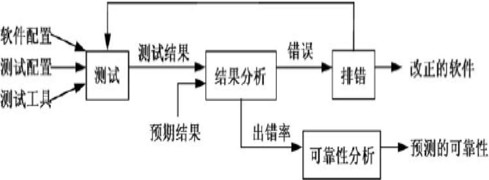
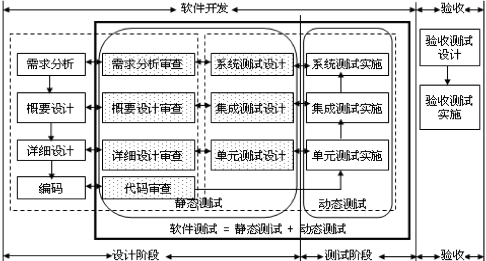
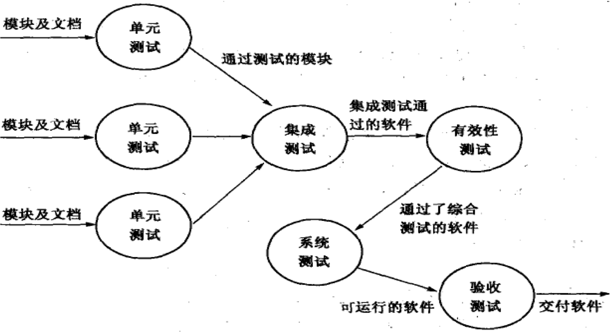
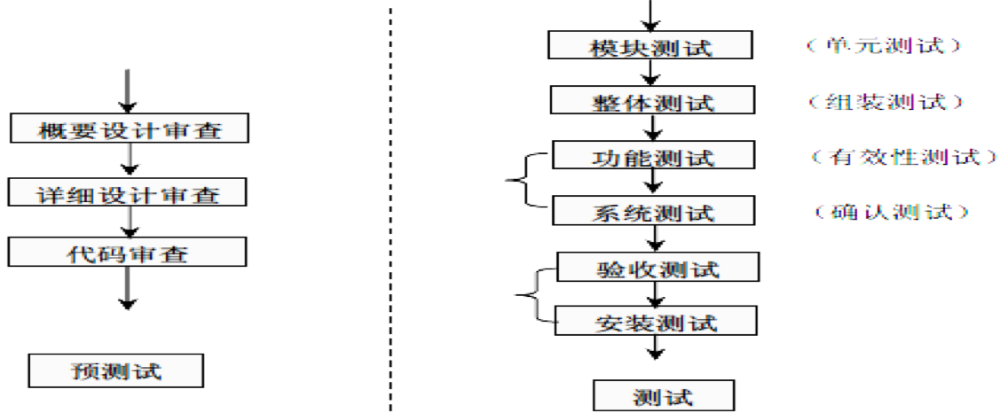
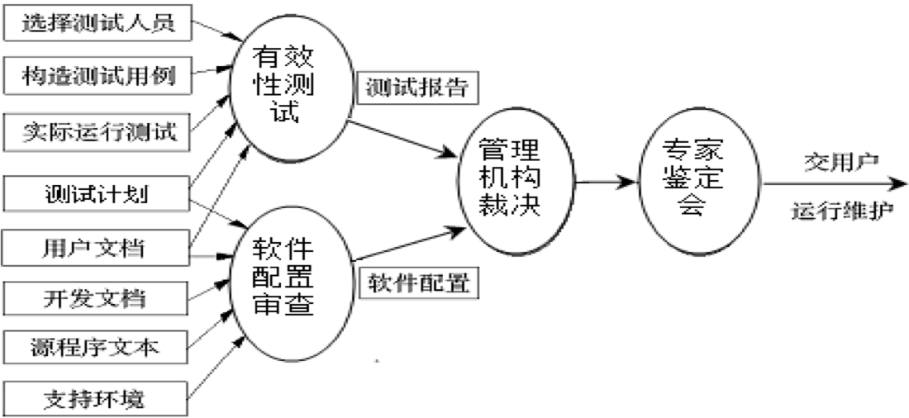

# 软件测试概述

## 一、软件测试的概念及内容

### 1.1 软件测试的定义

软件测试（Software test）的定义是：在规定的条件下对程序进行操作，以发现程序错误，衡量软件质量，并对其是否能满足设计要求进行评估的过程；是利用特定的技术和方法，运行、评价和验证软件满足需求或识别结果的过程；也是一种检测软件的正确性、完整性、安全性和品质的过程。

IEEE对软件测试定义为：使用技术手段运行或检测软件系统的过程，目的在于检验是否满足规定的需求或搞清预期结果与实际结果之间的差别。
软件测试的定义可从5方面进一步理解：

1. 从软件测试目的方面。
2. 从软件开发方面。
3. 从软件工程方面。
4. 从软件测试性质方面。
5. 从软件质量保证方面。

### 1.2 软件测试的主要内容

- 软件测试重点是测试软件的功能、性能和可靠性等是否符合用户需求指标，其中，“功能测试”是软件测试的最主要任务。软件测试分为系统软件测试和应用软件测试。

- 软件测试的主要内容包括：编制测试计划、编写测试用例、准备测试数据、编写测试脚本、实施测试、测试评估等多项内容的正规测试。
- 测试方式则由单纯手工测试发展为手工与自动兼用，并向第三方专业测试公司方向发展。

## 二、软件测试的目的和原则

### 2.1 软件测试的目的

软件测试的目的是：尽可能多的找到软件中的错误，而不是证明软件的正确。Grenford J. Myers在《软件测试技巧》一书中指出软件测试目的：

1. 测试是为了发现程序中的错误而执行程序的过程。
2. 好的测试方案很可能使测试发现尚未发现的错误。
3. 成功的测试是发现了尚未发现的错误的测试。

一般软件测试对象存在的“缺陷/错误”，主要分为如下3种：

## 2.2 软件测试的原则

在软件测试过程中，应坚持8项原则：

1. 认真执行测试计划。
2. “尽早和不断地进行软件测试/评审”。
3. 优选测试工具、技术及方法。
4. 精心设计测试用例。
5. 交叉进行软件检测。
6. 重点测试群集现象。
7. 全面检查并分析测试结果。
8. 妥善保管测试文档。

# 软件测试的特点及过程

## 一、软件测试的特点

1. 软件测试的成本很大。
2. 不可进行“穷举”测试。 
3. 测试具有“破坏性” 
4. 软件测试是整个开发过程的一个独立阶段，并贯穿到开发各阶段。

### 【案例7-1】

程序P有两个整型输入量X、Y，输出量为Z，如图7-1所示。若在32 位机上运行，则所有的测试数
据组(Xi,Yi )的数目为：$2^32 \times  2^32 = 2^64$。假设测试１毫秒执行１次，如果进行完全测试，则一共需要５亿年。   

## 二、软件测试的过程

- 对软件进行测试，总体过程由测试到结果分析，再到排错及可靠性分析，如图7-2所示。
- 在主要测试过程中，需要三类输入：软件配置，测试配置，测试工具。

软件测试工作的流程。其实与软件开发及验收各阶段密切相关，主要对应的软件测试流程，如图7-3所示。

# 软件测试步骤及任务

- 软件测试需要在明确具体测试目标的基础上，具体确定测试原则、测试计划、测试方案、测试技术、测试方法和用例等。
- 通常具体的软件测试分为单元测试、集成测试、有效性（确认）测试和系统测试4个步骤，最后进行验收测试，如图7-4所示。

软件专项测试工作可从概要设计阶段开始，如图7-5所示，整个测试分为两个大的阶段：

预测试和测试。本章只考虑测试阶段的工作，在具体进行实际测试时，有些步骤可以合并，例如功能测试与系统测试。

软件的单元测试也称为模块测试，是对功能独立运行的程序模块的检测。目的是发现各模块内部可能存在的各种问题，保证功能和性能等方面达到用户需求。

## 一、单元测试及任务

### 1.1 单元测试的内容和任务

软件单元测试的主要内容包括：单元模块内和模块之间的功能测试、容错测试、边界测试、约束测试、界面测试、重要的执行路径测试，单元内的业务流程和数据流程等。

### 1.2 单元测试技术要求及准则 

**单元测试主要技术要求应达到：**

1. 在被测试单元中，80%以上可执行的程序模块都被一个测试用例或异常操作所覆盖，即脚本覆盖率至少应当达到80%。 
2. 被测单元中分支语句取真或假时，至少80%的分支应当执行一次，即分支覆盖率应当达到 80%以上。 
3. 80%被测单元中的业务流程和数据流程，至少被一个测试用例、一个异常数据一次异常操作所覆盖，即异常处理能力达到 80%以上。  

**软件的单元测试通过准则，主要达到3项：**

1. 单元的具体功能指标要求与设计及需求一致。
2. 单元的接口指标要求与设计及需求一致。
3. 正确处理、输入和检测发现异常运行中的错误；并在单元发现问题进行修改以后，还需要进行回归测试，之后才能进行下一阶段工作。

### 1.3 单元测试的输入/输出

- 单元测试工作的输入为：“程序源代码”和“软件详细设计报告”；
- 单元测试结束的输出为：“程序单元测试记录”和“软件测试计划”等。 

## 二、集成测试与集成

集成测试是根据软件的体系结构，在单元测试的基础上，将测试过的模块进行集成组合及测试，检查程序结构及功能等方面的正确性和一致性。

### 2.1 集成测试的方式

一般将模块集成为系统的方式主要有两种：

1. 一次性集成及测试：软件的一次性集成也称为集中式或整体式拼装。是一种在对各模 块分别测试后，再将所有各模块集成一起进行测试，最后得到满足要求的软件产品的集成方式。
2. 增殖式集成及测试：增殖式集成也称为渐增式集成，包括以下3种方式。
   1. 自顶向下增殖测试
   2. 字底向上增殖测试
   3. 混合增殖式测试

上述增殖式集成方式各有其优缺点。

### 2.2 集成测试的任务及要求

### 2.2.1 集成测试内容及任务

软件集成测试的主要内容包括：系统集成后的功能测试、业务流程测试、界面测试、重要的执行路径测试、容错测试、边界测试、约束测试及接口测试等。

集成测试的具体任务：

1. 各模块连接时，经过模块接口的数据丢失情况。
2. 某一模块的功能对另一个模块的功能的不利影响。
3. 各模块或子系统功能的组合，达到预期需求的集成子系统/系统功能情况。
4. 全局数据结构是否有问题。
5. 单个模块的误差累积后情况，是否会放大能否可以接受。
6. 单个模块的错误对数据库的影响。 

- 集成测试的职责分工： 由测试人员负责进行该阶段的具体测试工作，并对 测试结果进行详细的记录和分析，完成测试文档。
- 集成测试工作的输入：“集成测试计划”、“概要设计”、“测试大纲”。
- 集成测试结束的输出：“集成测试bug记录”、“集成测试分析报告”。

### 2.2.2 集成测试技术要求及准则

软件集成测试的技术要求，主要包括6个方面： 

1. 验证被测系统满足设计要求情况；
2. 以数据处理测试用例对被测系统的输入、输出、处理进行检  测，以达到设计要求；
3. 利用业务处理测试用例对被测系统的业务处理过程进行测试，以达到设计的要求；
4. 测试软件正确处理的能力和容错能力所达到的标准；
5. 确认模块之间无错误连接；
6. 测试软件对数据、接口错误、数据错误、协议错误的识别及处理符合标准。 

集成测试通过的准则，包括以下5个方面： 

1. 各单元之间无错误连接。
2. 达到软件需求的各项功能、性能、可靠性等方面的指标要求。
3. 对偶发的错误输入有正确的处理能力。
4. 对测试中的异常问题有合理的提示反馈。
5. 人机界面及操作友好便捷。

### 2.2.3 软件集成及内容

- 系统集成是将各软件构件以及子系统组装整合成为完整软件，并与软件平台和其他相关系统进行调配、整合的过程。软件（产品）是由多模块（或对象）组成的软件系统。
- 软件集成的任务是按照软件体系结构设计的要求，将各软件构件和子系统整合为一个完整的软件系统。

## 三、有效性测试及内容

有效性测试也称确认测试。主要经过检测确认已实现的软件是否满足“软件需求规格说明书”各种需求和软件配置的合理性。其任务是验证软件的有效性，即软件的功能和性能及其他特性是否与用户的要求一致，以便于进行系统测试及交付。

### 3.1 有效性测试内容及步骤

- 有效性测试的主要内容包括：系统性的初始化测试、功能测试、用户需求确认、业务处理或数据处理测试、性能测试、安全性测试、安装性测试、恢复测试、压力测试等。
- 有效性测试的职责分工是：由测试人员负责测试工作，对测试过程及结果进行认真详细的记录和分析，并完成测试文档。
- 有效性测试工作的输入为：”软件测试计划”、”用户需求分析报告”、”用户操作手册”和”安装手册”。
- 测试结束的输出为：”软件测试bug记录”和”软件测试分析报告”。

有效性测试阶段主要工作如下图： 

### 3.2 有效性测试的技术要求 

有效性测试的主要技术要求，侧重以下8个方面： 

1. 用户需求确认。
2. 以数据处理测试用例对被测系统的输入、输出、处理进行测试，以达到需求要求。
3. 利用业务处理测试用例对被测系统业务处理过程进行测试，达到用户需求各项要求。
4. 响应时间测试。
5. 安装性测试。
6. 安全性测试
7. 恢复性测试
8. 压力测试

通过有效性测试的准则，体现在以下6个方面： 

1. 满足用户在软件需求中提出的功能、性能等各项指标要求； 
2. 软件安全性满足用户的具体需求标准；
3. 系统的负载能力满足用户的具体指标要求；
4. 与外界支持系统能够正常运行；
5. 稳定性等满足用户的各项需求；
6. 用户操作手册易读、易懂和易操作。

## 四、系统测试及验收

- 系统测试是指将有效性测试后的软件，逐步从模拟运行环境切换到实际运行环境中，与其他系统资源和环境合成进行的实际检测。
- 通常，系统测试任务包括以下4个方面：       
  - 恢复测试
  - 安全测试
  - 强度测试
  - 性能测试
- 系统测试的重点主要检查如下3个方面：
  1. 系统的整体调度功能是否正常。
  2. 系统的功能是否符合软件分析和总体设计的要求。
  3. 系统的数据组织与存储是否符合设计的要求。
- 系统测试主要通过与用户需求指标进行详尽对比，查找软件与指标符合要求情况。其方法一般采取黑盒测试。

# 软件测试策略及面向对象测试

# 测试方法、用例及评审

# 软件调试预发布

# 软件维护

